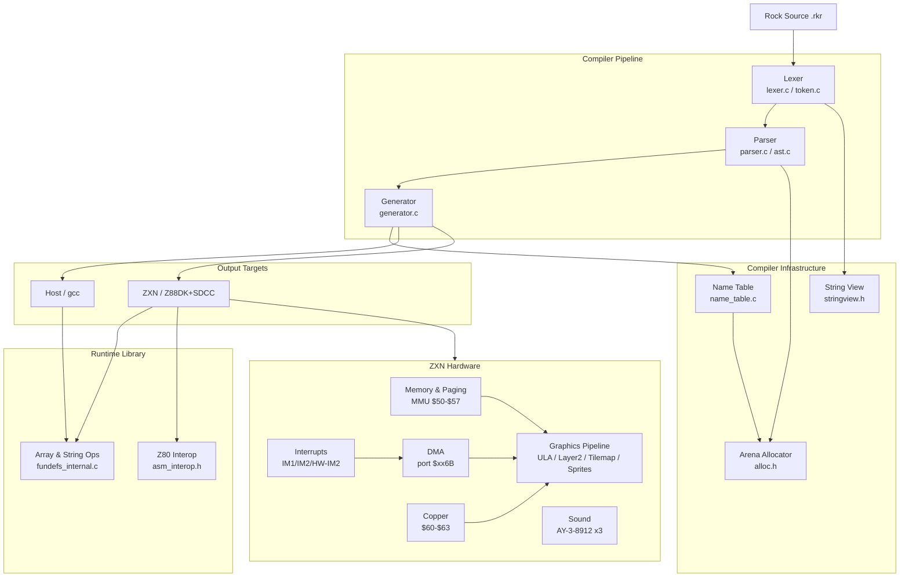

# Domain Model

## Bounded Context Map

---

## Bounded Contexts

### Lexer Context
**Owns:** Token production, lexeme extraction, line/column tracking, embed block capture.  
**Invariant:** Each call to `step_lexer()` consumes characters and returns exactly one token. The lexer never looks back.  
**Exports:** `token_array_t` — a flat, heap-allocated array of `token_t`.  
**Dependencies:** `string_view` (zero-copy lexeme representation), arena allocator.

### Parser Context
**Owns:** Grammar rules, AST construction, include resolution, operator precedence.  
**Invariant:** Consumes tokens strictly left-to-right. Includes are spliced at parse time; after splicing, the token stream appears flat.  
**Exports:** `ast_t` — the root `program` node containing all top-level definitions.  
**Dependencies:** Lexer (token stream), arena allocator.  
**Notable constraint:** No semantic analysis. Type checking is deferred to the generator.

### Generator Context
**Owns:** C code emission, type inference, string temporary management, type-specific array wrapper synthesis, module initialisation deferral.  
**Invariant:** Single-pass AST traversal. Name table reflects current scope. `pre_f` buffer is flushed before each top-level statement.  
**Exports:** A `.c` source file ready for gcc or zcc.  
**Dependencies:** Name table (symbol lookup), AST (parser output), target flag (HOST vs ZXN).

### Name Table Context
**Owns:** Symbol registration, scope lifecycle, name resolution.  
**Invariant:** Entries are never individually deleted. Scope exit truncates the entry list to the depth boundary.  
**Exports:** `get_ref()` returning the AST node registered for a name; `push_nt()` for registration.  
**Dependencies:** Arena allocator.

### Runtime Library Context
**Owns:** Dynamic array implementation, string construction helpers, command-line argument access, Z80 assembly interop stubs.  
**Invariant:** All allocations via arena — no individual frees.  
**Exports:** `__internal_*` functions (generic array ops), type-specific wrappers (`int_push_array`, etc.), `__rock_make_string`, `fill_cmd_args`.  
**Dependencies:** Arena allocator (`alloc.h`).

### ZXN Hardware Context
**Owns:** All ZX Spectrum Next hardware subsystem definitions — ports, registers, graphics layers, DMA, sound, keyboard, interrupts.  
**Invariant:** Hardware state is write-only from the Z80 perspective for most registers; reads are available for status flags and read-back registers.  
**Exports:** Register addresses and bit-field specifications consumed when implementing Rock runtime functions for ZXN.  
**Key subsystems:** Memory/MMU paging, ULA, Layer 2, Tilemap, Sprites, Palette, Copper, DMA, AY sound, Keyboard, Interrupts.  
**Reference:** [[targets/zxn-hardware]] hub → individual subsystem pages in `pages/targets/zxn/`.

### Target Context
**Owns:** Platform-specific include strategy, compiler flags, memory layout (`zpragma_zxn.inc`).  
**Invariant:** Target is fixed at transpile time (set by `--target=zxn` flag).  
**Exports:** Target enum (`TARGET_HOST`, `TARGET_ZXN`) consumed by generator.

---

## Key Integration Points

| From | To | Integration |
|------|----|-------------|
| Lexer → Parser | `token_array_t` passed by value | Flat token array; cursor managed by parser |
| Parser → Generator | `ast_t` (root node) | Single root node with nested child arrays |
| Generator → Name Table | `push_nt()` / `get_ref()` | Called during AST traversal for every definition and lookup |
| Generator → Target | `generator.target` flag | Determines include path style, statement splitting, Z80 pragmas |
| Runtime → Generator | Header contracts | Generator emits calls matching runtime function signatures |

---

## Notable Constraints Across Contexts

- **No separate semantic analysis phase.** Type checking, method resolution, and type inference all happen inside the generator during code emission. Errors surface as C compiler errors or runtime crashes, not as Rock-level error messages.
- **Include resolution at parse time.** This means included files are fully parsed before the parent file's parse continues. Circular includes are detected but only at file-name level.
- **Arena allocator spans all contexts.** Everything allocated during a compile shares the same lifetime. This simplifies lifetime management but means no memory is reclaimed until `kill_compiler_stack()` at exit.

See [[overview]] for the pipeline diagram and [[ubiquitous-language]] for term definitions.
