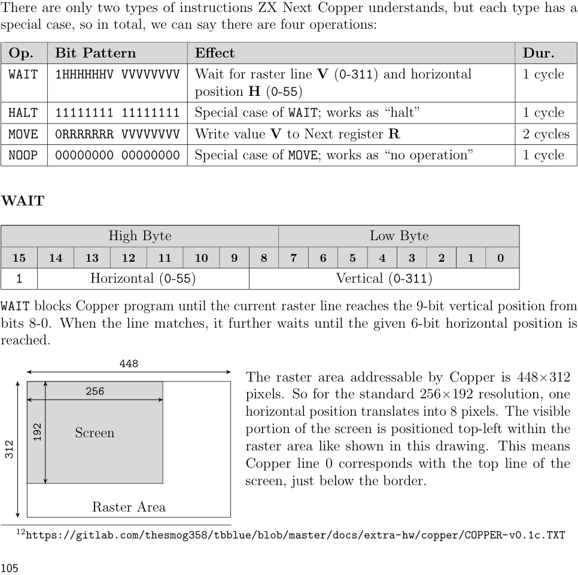
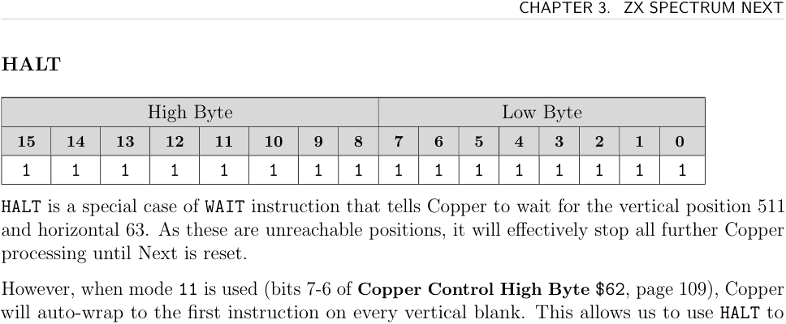
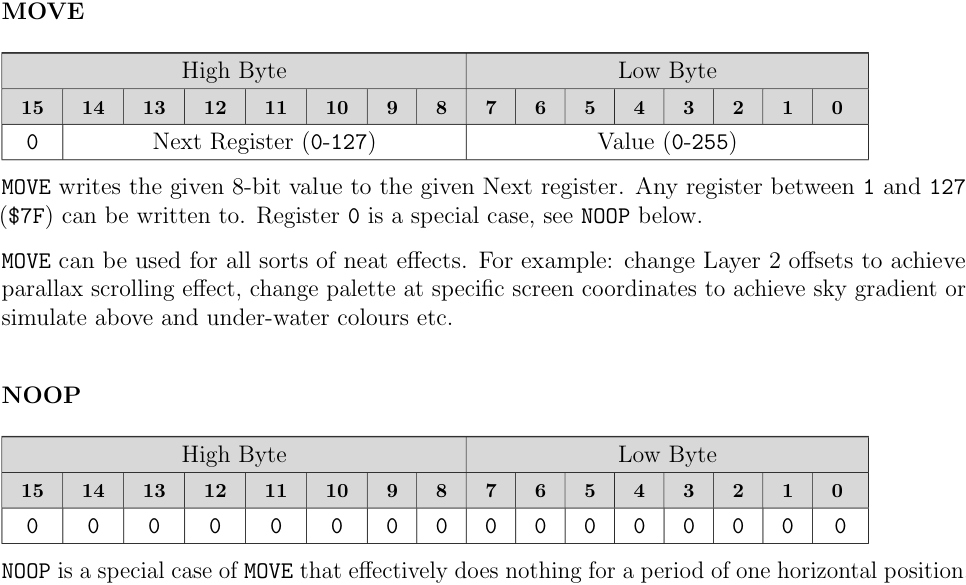
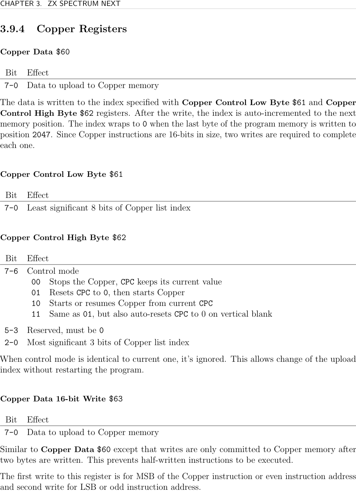
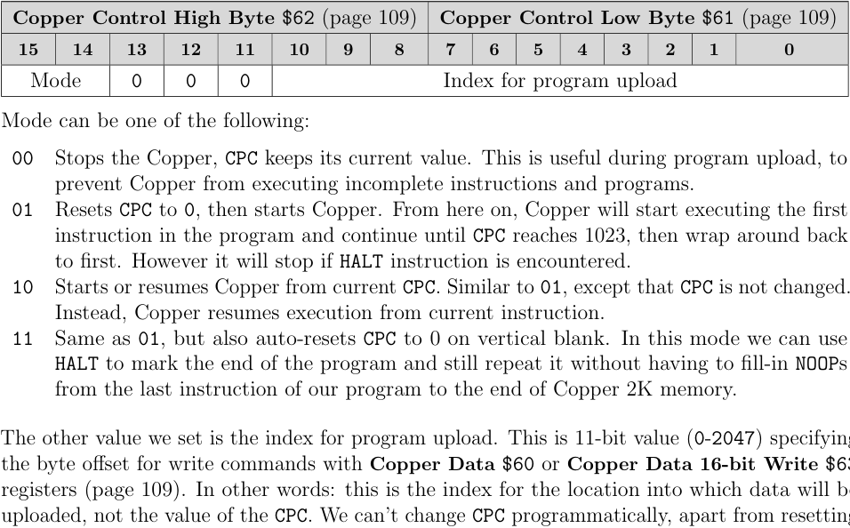

# ZXN Copper

The **Copper** is a co-processor on the ZX Spectrum Next that autonomously modifies Next registers at specific raster positions during screen rendering. It frees the Z80 from per-scanline interrupt overhead. A Rock implementer can use it for raster-split colour effects, scrolling per-line, or other effects that must happen at a precise screen position.

Key facts:
- 2KB of dedicated write-only program memory (up to 1024 16-bit instructions)
- 10-bit program counter, auto-incrementing
- Runs at 28MHz (core 3.0+)
- Can modify any Next register `$01`–`$7F`
- Raster area: 448×312 pixels; 1 horizontal unit = 8 pixels

## Instruction Set (4 operations)

**WAIT** — stall until the raster reaches a specified (vertical, horizontal) position.
- 9-bit vertical position (0–311)
- 6-bit horizontal position (0–55, each unit = 8 pixels)

**HALT** — special WAIT for position (511, 63) — unreachable, so the Copper stops. In mode `%11`, the program counter resets on vertical blank, so HALT cleanly ends the frame's program.

**MOVE** — write an 8-bit value to any Next register `$01`–`$7F`.

**NOOP** — MOVE to register `$00` (no effect). Use for precise timing alignment.

## Uploading a Program

Always stop the Copper before uploading (set `$62` bits 7–6 to `00`). Use `$63` (16-bit write) rather than `$60` to avoid executing half-written instructions:

```asm
; Stop Copper, reset upload index to 0
NEXTREG $61, %00000000
NEXTREG $62, %00000000
; Upload program (B = byte count)
LD HL, CopperList
LD B, CopperListSize
.nextByte:
  LD A, (HL)
  NEXTREG $63, A       ; commits only after both bytes received
  INC HL
  DJNZ .nextByte
; Start in mode %11 (auto-reset on vertical blank)
NEXTREG $61, %00000000
NEXTREG $62, %11000000
```

The copper sample provides both upload paths: direct byte upload through `$63`, and DMA upload by selecting `$63` through `$243B` then streaming bytes to `$253B`. See [[targets/zxn/samples/zxn-copper-sample-summary]].

## Program Format

A Copper program is a list of 16-bit words. Each word is either a WAIT or a MOVE/NOOP. Encode with `DB` pairs (MSB first when using `$63`):

```asm
CopperList:
  ; WAIT for raster line 0
  DB $80, 0
  ; MOVE $41 = green (palette entry write)
  DB $41, %00011100
  ; WAIT for raster line 96
  DB $80, 96
  ; MOVE $41 = red
  DB $41, %11100000
  ; HALT
  DB $FF, $FF
CopperListSize = $-CopperList
```

### Encoding Details

**WAIT encoding:**
- MSB bits 7–1: vertical position bits 7–1
- MSB bit 0: horizontal position bit 5
- LSB bits 7–6: vertical position bit 8, bit 0
- LSB bits 5–0: horizontal position bits 4–0

**MOVE encoding:** `DB register, value` where register `$01`–`$7F`.

**NOOP encoding:** `DB $00, value` (register 0 is a no-op).

**HALT encoding:** `DB $FF, $FF` (WAIT for unreachable position 511,63).







## Registers

**Copper Data `$60`** — writes to Copper memory at the current index; auto-increments (wraps 2047→0). Two writes per 16-bit instruction.

**Copper Control Low Byte `$61`** — bits 7–0: low 8 bits of upload index (0–2047)

**Copper Control High Byte `$62`**

| Bits 7–6 | Mode |
|----------|------|
| `00` | Stop; CPC keeps current value |
| `01` | Reset CPC to 0, start; stops on HALT |
| `10` | Start/resume from current CPC |
| `11` | Reset CPC on every vertical blank, start; HALT marks end ← **recommended** |

Bits 2–0: MSB 3 bits of upload index. Writing mode bits without changing index bits only updates the mode.

**Copper Data 16-bit Write `$63`** — preferred over `$60`. Buffers first write (MSB); commits both bytes atomically on second write. Prevents half-written instructions from executing.

For live patching a single byte of an existing instruction, the sample seeks the Copper PC with `$61`/`$62` and writes through `$60`. `$63` is intentionally not used for one-byte patches because it waits for a pair of bytes before committing.



## See Also

- [[targets/zxn-hardware]] — overview of Next co-processors
- [[targets/zxn/samples/zxn-copper-sample-summary]] — worked Copper list and live-patching sample
- [[targets/zxn/zxn-interrupts]] — alternative: Z80 line interrupt for per-scanline effects
- [[targets/zxn/zxn-ports-registers]] — full register index
- [[targets/zxn/tools/z80asm-reference]] — `CU.*` assembler directives for Copper list generation
