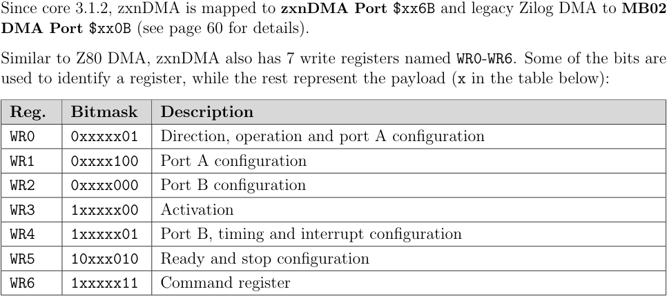
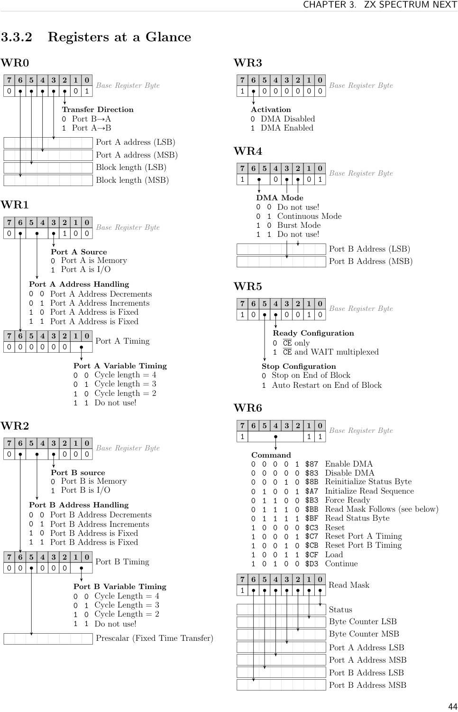
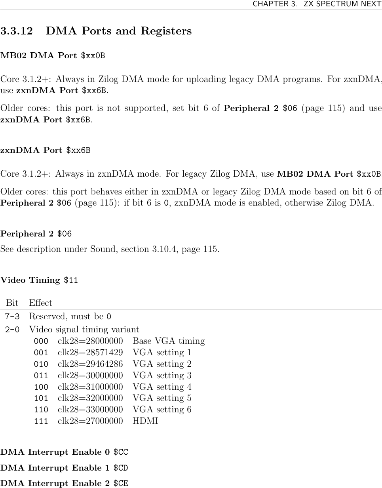

# ZXN DMA

The ZX Spectrum Next includes **zxnDMA**, a single-channel DMA controller accessible at port `$xx6B`. It implements a compatible subset of the Z80 DMA chip and is essential for bulk memory transfers (e.g. loading sprite patterns, streaming audio) without tying up the Z80.

Key capabilities:
- Memory-to-memory, memory-to-I/O, I/O-to-memory transfers
- Up to 64KB per transfer
- Continuous (CPU halted) or burst (interleaved with CPU) modes
- **Fixed-time transfer** (prescalar) for sampled audio playback
- DMA programs up to 256 bytes

> Since core 3.1.2, **zxnDMA is always on port `$xx6B`**. The Zilog-compatible legacy DMA lives on `$xx0B`. Use `$xx6B` for all new code.

## Programming Model

zxnDMA is configured by writing a **DMA program** — a sequence of register/command bytes — to the DMA port. The program is typically uploaded with `OTIR`.

The 7 write registers (WR0–WR6) configure direction, port addresses, transfer length, and timing. Registers are identified by specific bit patterns; parameter bytes follow inline. The sequence always ends with WR6 `$CF` (Load) then WR6 `$87` (Enable).




## Register Summary

| Register | Purpose |
|----------|---------|
| WR0 | Transfer direction, Port A address, block length |
| WR1 | Port A: memory/I/O, address handling (inc/dec/fixed), timing |
| WR2 | Port B: memory/I/O, address handling, timing, prescalar |
| WR3 | Enable/disable DMA |
| WR4 | Port B address, continuous vs burst mode |
| WR5 | CE/WAIT, stop-on-end or auto-restart |
| WR6 | Command register |

### WR0 — Direction, Port A Address, Length

Base byte: `0 [lenMSB] [lenLSB] [addrMSB] [addrLSB] [dir] [op1] [op0]`

- **Bits 1–0 (operation)**: always `01` (Transfer). `00` conflicts with WR1/WR2; `10`/`11` reserved.
- **Bit 2 (direction)**: 0 = B→A, 1 = A→B
- **Bits 4–3**: Port A address — set both to 1 to append LSB then MSB
- **Bits 6–5**: Length — set both to 1 to append LSB then MSB (always required)

Parameters are little-endian, so `DW $C000` writes correctly inline.

### WR1 — Port A Configuration

Base byte: `0 [timing] [addrHi] [addrLo] [src] x x x`

- **Bit 3**: 0=memory, 1=I/O port
- **Bits 5–4**: 00=decrement, 01=increment, 10/11=fixed (use fixed for I/O ports)
- **Bit 6**: if set, append one timing byte (bits 1–0: 00=4 cycles, 01=3, 10=2)

### WR2 — Port B Configuration

Same structure as WR1. Additionally:
- **Bit 6 timing byte, bit 5**: if set, append a prescalar byte

**Prescalar (fixed-time transfer):**
- zxnDMA-specific. Forces each byte to take a fixed time, enabling audio streaming.
- Formula (at 28MHz / base VGA timing): `prescalar = 875000 / rate_hz`
- Example for 16kHz audio: `prescalar = round(875000 / 16000) = 55`
- In burst mode with prescalar, the CPU gets time back during wait periods.
- The 875kHz constant varies with video timing register `$11`.

### WR3 — Enable/Disable

- **Bit 6**: 1=enable, 0=disable. Prefer using WR6 commands instead.

### WR4 — Port B Address, Mode

- **Bits 3–2**: Port B address (both 1 to append 16-bit address)
- **Bits 6–5**: 00=reserved, 01=continuous (CPU halted), 10=burst (yields to CPU), 11=reserved

### WR5 — Stop Configuration

- **Bit 4**: 0=CE only, 1=CE inserts wait states (not currently used)
- **Bit 5**: 0=stop on end of block, 1=auto-restart

### WR6 — Commands

| Value | Command | Notes |
|-------|---------|-------|
| `$83` | Disable DMA | Write first, before uploading program |
| `$87` | Enable DMA | Write last; starts execution |
| `$CF` | Load | Copies addresses into DMA counters; required before Enable |
| `$BB` | Read Mask Follows | Next byte selects which status bytes to read back |
| `$C3` | Reset | Full reset |
| `$8B` | Reinitialize Status Byte | |
| `$A7` | Initialize Read Sequence | |
| `$B3` | Force Ready | |
| `$C7` | Reset Port A Timing | |
| `$CB` | Reset Port B Timing | |
| `$D3` | Continue | Resume after stop |

**Read mask byte** (follows `$BB`):
- Bit 0: status byte (`00E1101T`; E=0 if block complete, T=0 if no byte transferred)
- Bits 1–2: byte counter (LSB/MSB)
- Bits 3–4: current Port A address (LSB/MSB)
- Bits 5–6: current Port B address (LSB/MSB)

Read back via I/O reads from `$xx6B` in the order specified by the mask.

## Examples

### Memory to Memory (`$C000` → `$D000`, 2048 bytes)

```asm
CopyMemory:
  LD HL, .prog
  LD B, .progSize
  LD C, $6B
  OTIR
  RET
.prog:
  DB %1'00000'11      ; WR6: disable DMA
  DB %0'11'11'1'01    ; WR0: append length + Port A addr, A→B
  DW $C000            ; Port A start address
  DW 2048             ; transfer length
  DB %0'0'01'0'100    ; WR1: A increment, A=memory
  DB %0'0'01'0'000    ; WR2: B increment, B=memory
  DB %1'01'0'11'01    ; WR4: continuous, append Port B addr
  DW $D000            ; Port B address
  DB %10'0'0'0010     ; WR5: stop on end, CE only
  DB %1'10011'11      ; WR6: load
  DB %1'00001'11      ; WR6: enable
.progSize = $-.prog
```

### Memory to I/O (`$9000` → port `$5B`, 16384 bytes)

Same as above, with WR2 changed to `%0'0'10'1'000` (B fixed, B=I/O) and Port B address `DW $005B`.

### Loading Sprite Patterns via DMA

```asm
; HL=source, BC=byte count, A=starting sprite index
LoadSprites:
  LD (.dmaSource), HL
  LD (.dmaLength), BC
  LD BC, $303B
  OUT (C), A          ; set starting sprite slot
  LD HL, .prog
  LD B, .progSize
  LD C, $6B
  OTIR
  RET
.prog:
  DB %1'00000'11      ; WR6: disable
  DB %0'11'11'1'01    ; WR0: A→B, append length + addr
.dmaSource:
  DW 0                ; Port A address (filled by caller)
.dmaLength:
  DW 0                ; length (filled by caller)
  DB %0'0'01'0'100    ; WR1: A increment, memory
  DB %0'0'10'1'000    ; WR2: B fixed, I/O
  DB %1'01'0'11'01    ; WR4: continuous, append Port B addr
  DW $005B            ; sprite pattern upload port
  DB %10'0'0'0010     ; WR5: stop on end
  DB %1'10011'11      ; WR6: load
  DB %1'00001'11      ; WR6: enable
.progSize = $-.prog
```

The sprite sample uses this memory-to-I/O form to upload pattern bytes from `sprites.spr` to `$005B`. See [[targets/zxn/samples/zxn-sprite-sample-summary]] for the full sample context and review note about preserving the byte-count register.

The copper sample uses the same DMA shape with Port B fixed as I/O, but targets `$253B` after selecting Copper data register `$63` via `$243B`. See [[targets/zxn/samples/zxn-copper-sample-summary]].

## DMA and Interrupts

- In **continuous mode**, the CPU cannot respond to maskable interrupts (level-triggered, only ~30 cycles at 3.5MHz).
- **NMI** is edge-triggered and is queued internally; handled when CPU resumes.
- In **burst mode** with a large enough prescalar, interrupts can fire between bursts.
- Registers `$CC`/`$CD`/`$CE` control which interrupt sources are allowed to interrupt an active DMA transfer (see [[targets/zxn/zxn-interrupts]]).

## Registers

**zxnDMA port `$xx6B`** — write DMA program bytes or command bytes

**MB02 DMA port `$xx0B`** — Zilog-compatible legacy mode only (core 3.1.2+)

**Video Timing `$11`** (affects prescalar formula)

| Bits 2–0 | Variant | clk28 |
|----------|---------|-------|
| `000` | Base VGA | 28,000,000 |
| `001`–`110` | VGA 1–6 | 28.5M–33M |
| `111` | HDMI | 27,000,000 |

**DMA Interrupt Enable `$CC`/`$CD`/`$CE`** — see [[targets/zxn/zxn-interrupts]]



## See Also

- [[targets/zxn-hardware]] — hardware overview
- [[targets/zxn/zxn-sprites]] — sprite pattern upload via DMA
- [[targets/zxn/samples/zxn-sprite-sample-summary]] — worked sprite DMA upload sample
- [[targets/zxn/samples/zxn-copper-sample-summary]] — worked Copper-list DMA upload sample
- [[targets/zxn/zxn-interrupts]] — DMA interrupt enable registers
- [[targets/zxn/zxn-ports-registers]] — full register index
- [[targets/zxn/tools/z80asm-reference]] — `DMA.*` assembler directives for DMA program generation
