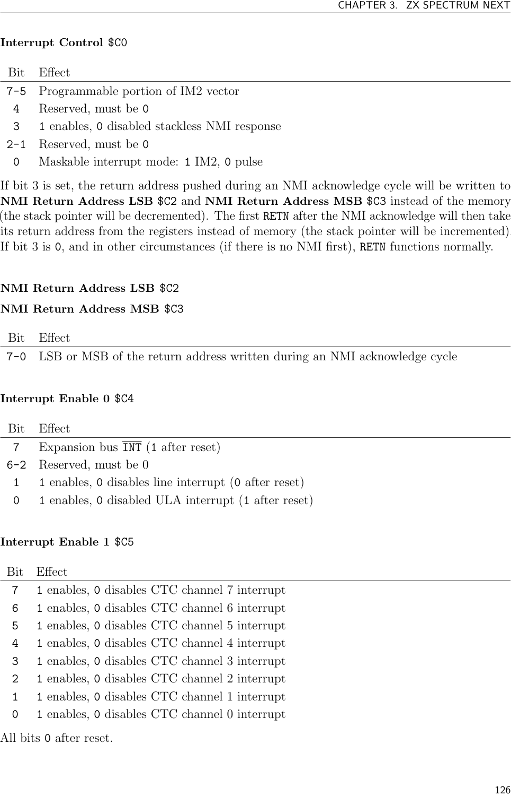
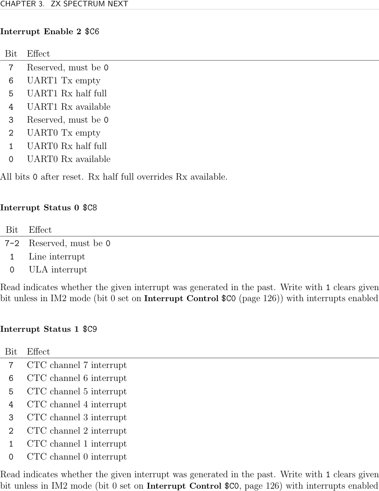
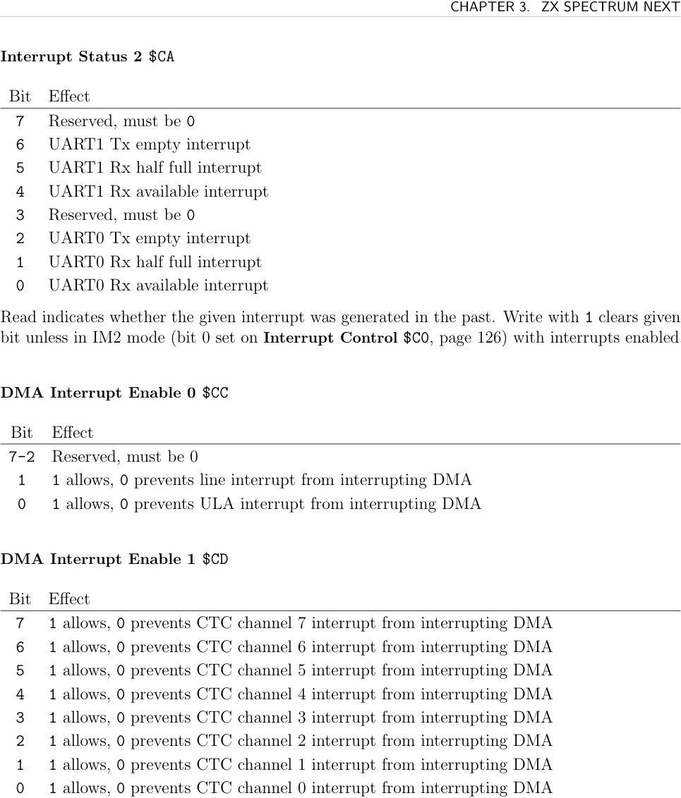
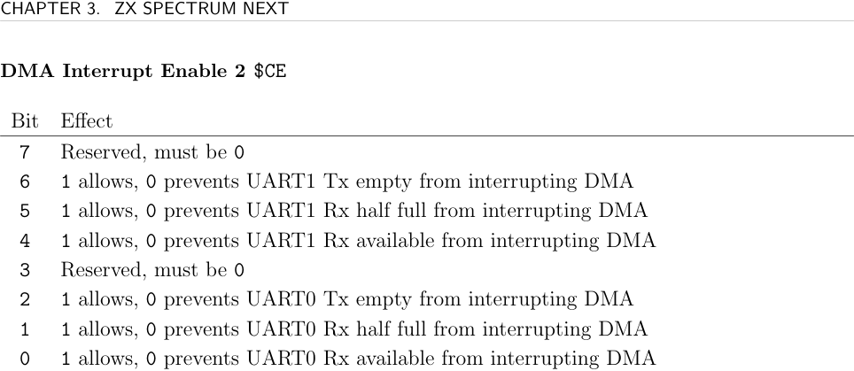

# ZXN Interrupts on Next

The ZX Spectrum Next extends the Z80 interrupt system with **Hardware IM2** — a vectored interrupt controller with 14 independent sources. A Rock implementer needs this for per-scanline effects (line interrupt), CTC timers, UART, or custom interrupt-driven logic.

## Three Interrupt Modes

### IM1 — Default (handler at `$0038`)

The ULA fires INT every frame (~50Hz at 50Hz video). The Z80 jumps to `$0038`. To use a custom handler, page out the ROM and place your handler at `$0038` in the replacement bank:

```asm
DI
NEXTREG $50, 28    ; page 8K bank 28 into slot 0 ($0000-$1FFF)
IM 1
EI
; Handler at address $0038 in bank 28 — assembled with ORG $0038
```

### IM2 — Legacy Vectored

Vector table base: address stored in `I` register (high byte). LSB comes from the data bus (typically random, so make it safe).

Setup rules:
- Table must be on a 256-byte boundary
- All 128 entries should point to the same handler
- Handler address should have equal high and low bytes (e.g. `$8989`) to be safe if bus LSB is `$FF`
- Table must be 257 bytes long to cover the `$FF` bus value

### Hardware IM2 — Next Extended

A 32-byte vector table (16 entries × 2 bytes) on a **32-byte boundary**. The `I` register holds the high byte; `$C0` bits 7–5 provide the top 3 bits of the LSB; hardware fills in the lower bits based on interrupt source priority.

Enable with `NEXTREG $C0, ... | %00000001` (bit 0 = 1).

**16-entry vector table layout:**

| Index | Source | Priority |
|-------|--------|----------|
| 0 | Line interrupt | Highest |
| 1 | UART0 Rx | |
| 2 | UART1 Rx | |
| 3 | CTC channel 0 | |
| 4 | CTC channel 1 | |
| 5 | CTC channel 2 | |
| 6 | CTC channel 3 | |
| 7 | CTC channel 4 | |
| 8 | CTC channel 5 | |
| 9 | CTC channel 6 | |
| 10 | CTC channel 7 | |
| 11 | ULA | |
| 12 | UART0 Tx | |
| 13 | UART1 Tx | Lowest |
| 14–15 | (padding) | |

**Hardware IM2 initialization:**
```asm
DI
NEXTREG $C0, (InterruptVectorTable & %11100000) | %00000001
NEXTREG $C4, %10000001   ; enable expansion bus INT + ULA
NEXTREG $C5, %00000000   ; disable all CTC channels
NEXTREG $C6, %00000000   ; disable UART interrupts
LD A, InterruptVectorTable >> 8
LD I, A
IM 2
EI
```

## Line Interrupt

Fires when the raster finishes a specified line's pixel area. The INT signal is active during horizontal positions 256–319 of that line.

Enable via `$22` bit 0, set line via `$22`/`$23`. Also enable in `$C4` if using Hardware IM2.

```asm
NEXTREG $22, %00000001   ; enable line interrupt
NEXTREG $23, 96          ; fire after raster line 96
```

Read `$22` bit 7 to check if INT is pending (works even with Z80 interrupts disabled).

## NMI

The NMI is edge-triggered and queued internally. Stackless NMI mode (bit 3 of `$C0`): the return address is written to `$C2`/`$C3` instead of the stack (SP still decremented). `RETN` restores from those registers. Use for NMI handlers that may fire during critical stack operations.

## DMA and Interrupts

Use `$CC`/`$CD`/`$CE` to specify which interrupt sources are allowed to interrupt an active DMA transfer. See [[targets/zxn/zxn-dma]].

## Registers

**Video Line Interrupt Control `$22`**

| Bit | Description |
|-----|-------------|
| 7 | Read: INT pending (even if Z80 interrupts disabled) |
| 1 | 1=disable original ULA frame interrupt |
| 0 | 1=enable line interrupt |

Plus MSB of interrupt line value (see source for exact bit position).

**Video Line Interrupt Value `$23`** — bits 7–0: LSB of interrupt line (combined with `$22` MSB bit for 9-bit value)

**Vertical Video Line Offset `$64`** (core 3.1.5+) — 0–255 offset added to Copper/interrupt/active-line readings; effective after current frame ends

**Interrupt Control `$C0`**

| Bit | Description |
|-----|-------------|
| 7–5 | Programmable bits of IM2 vector LSB (top 3 bits) |
| 3 | 1=stackless NMI (return address → `$C2`/`$C3`) |
| 0 | 1=Hardware IM2 mode, 0=standard pulse mode |

**NMI Return Address `$C2`/`$C3`** — LSB/MSB of NMI return address (stackless NMI mode)

**Interrupt Enable 0 `$C4`**

| Bit | Description |
|-----|-------------|
| 7 | Expansion bus INT |
| 1 | Line interrupt |
| 0 | ULA interrupt |

**Interrupt Enable 1 `$C5`** — bits 7–0: CTC channels 7–0 (0 after reset)

**Interrupt Enable 2 `$C6`**

| Bit | Description |
|-----|-------------|
| 6 | UART1 Tx empty |
| 5 | UART1 Rx half full |
| 4 | UART1 Rx available |
| 2 | UART0 Tx empty |
| 1 | UART0 Rx half full |
| 0 | UART0 Rx available |

Note: Rx half full overrides Rx available.

**Interrupt Status 0 `$C8`** — bit 1=line interrupt, bit 0=ULA interrupt. Write 1 to clear (unless HW IM2 mode with interrupts enabled).

**Interrupt Status 1 `$C9`** — bits 7–0: CTC channels 7–0 status

**Interrupt Status 2 `$CA`** — same UART layout as `$C6`, status flags

**DMA Interrupt Enable 0 `$CC`** — bit 1=line interrupt, bit 0=ULA interrupt (allow interrupting DMA)

**DMA Interrupt Enable 1 `$CD`** — bits 7–0: allow CTC channel N to interrupt DMA

**DMA Interrupt Enable 2 `$CE`** — same UART layout as `$C6`, allow interrupting DMA






## See Also

- [[targets/zxn-hardware]] — hardware overview
- [[targets/zxn/zxn-dma]] — DMA interrupt interaction
- [[targets/zxn/zxn-copper]] — alternative to line interrupt for raster effects
- [[targets/zxn/zxn-ports-registers]] — full register index
