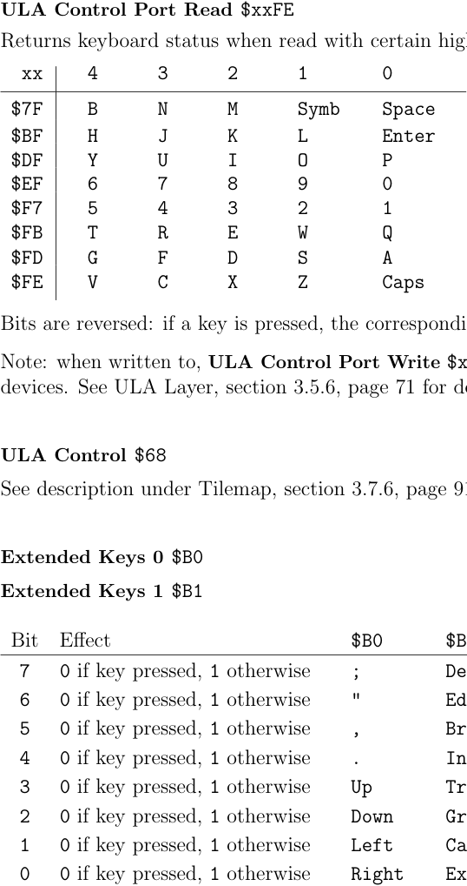

# ZXN Keyboard

The ZX Spectrum keyboard is an 8×5 matrix of 40 keys, read through port `$xxFE`. Key bits are **active low** (0=pressed, 1=not pressed). The Next extends this with 10 additional keys readable from Next registers `$B0`/`$B1`.

## Reading the Legacy Matrix

Read port `$xxFE` with a specific high byte to select one of 8 half-rows. Bits 4–0 of the result = 5 key states.

| High byte (`xx`) | Keys (bit 4 → bit 0) |
|-----------------|----------------------|
| `$FE` | Caps Shift, Z, X, C, V |
| `$FD` | A, S, D, F, G |
| `$FB` | Q, W, E, R, T |
| `$F7` | 1, 2, 3, 4, 5 |
| `$EF` | 0, 9, 8, 7, 6 |
| `$DF` | P, O, I, U, Y |
| `$BF` | Enter, L, K, J, H |
| `$7F` | Space, Sym Shift, M, N, B |

**Fast read (18 T-states)** — uses A as high byte of port address:
```asm
LD A, $DF       ; select row: P O I U Y
IN A, ($FE)     ; A bits 4-0 = key states
```

**Standard 16-bit read (22 T-states):**
```asm
LD BC, $DFFE    ; select row: P O I U Y
IN A, (C)
```

**Check if P is pressed:**
```asm
LD BC, $DFFE
IN A, (C)
BIT 0, A        ; P = bit 0; Z=1 means pressed
```



## Extended Keys (Next-specific)

Since core 3.1.5, 10 additional keys are readable from `$B0` and `$B1`. By default they are also translated into the standard 8×5 matrix (simulated as key combinations). To disable this translation and read them only via `$B0`/`$B1`, set bit 5 of ULA Control `$68` (requires core 3.1.4+).

**Extended Keys 0 `$B0`** (read-only):

| Bit | Key |
|-----|-----|
| 0 | Delete |
| 1 | Break |
| 2 | Up arrow |
| 3 | Down arrow |
| 4 | Left arrow |
| 5 | Right arrow |

**Extended Keys 1 `$B1`** (read-only):

| Bit | Key |
|-----|-----|
| 0 | Edit |
| 1 | Inv Video |
| 2 | True Video |
| 3 | Graph |
| 4 | Caps Lock |
| 5 | Extend |

Bit=0 means pressed (same active-low convention as standard matrix).

## Registers

**ULA Control Port `$xxFE`** — read for keyboard, write for border/audio (see [[targets/zxn/zxn-ula]])

**ULA Control `$68`** bit 5 — disable extended key translation into 8×5 matrix

**Extended Keys 0 `$B0`** — read-only Next register (core 3.1.5+)

**Extended Keys 1 `$B1`** — read-only Next register (core 3.1.5+)

## See Also

- [[targets/zxn/zxn-ula]] — ULA port also controls border colour and audio
- [[targets/zxn/zxn-interrupts]] — keyboard can trigger interrupts indirectly via ULA
- [[targets/zxn/zxn-ports-registers]] — full register index
