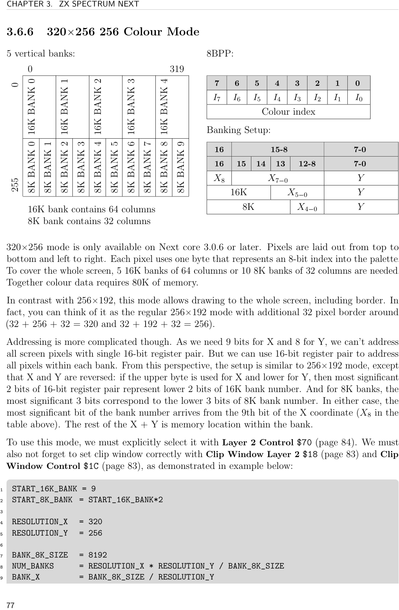
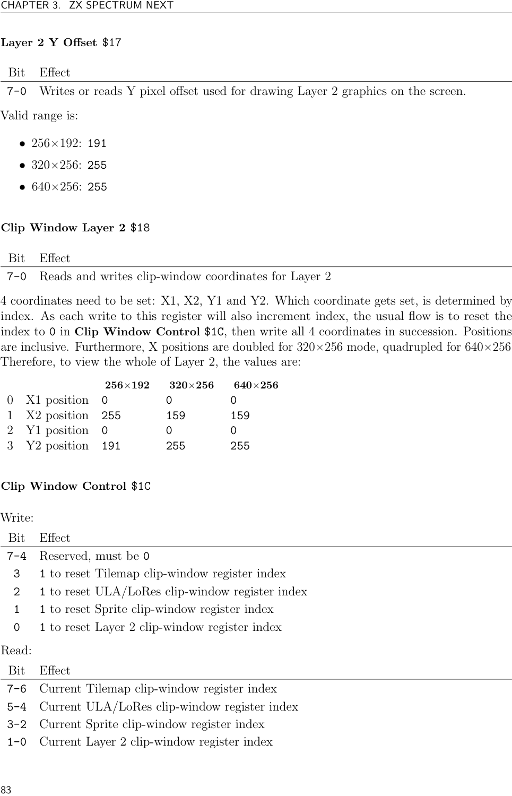
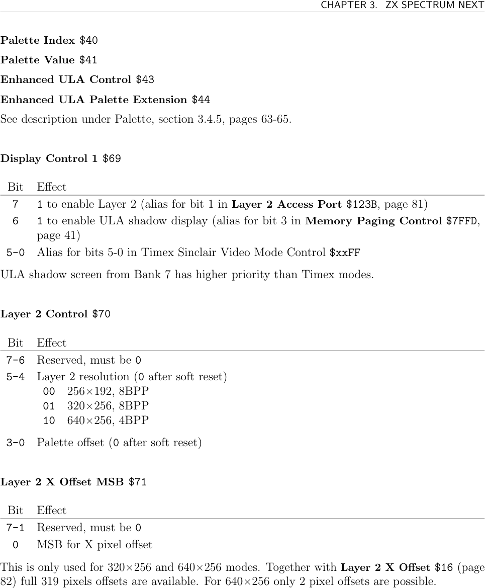

# ZXN Layer 2

**Layer 2** is the ZX Spectrum Next's full-colour framebuffer. Unlike the ULA, it has no colour clash — every pixel has its own palette index. It supports three resolutions and can appear above or below the ULA layer. Layer 2 is essential for any Rock program requiring full-colour graphics.

## Resolutions

| Mode | Size | Colours | Memory | Banks | Available |
|------|------|---------|--------|-------|-----------|
| 256×192 8BPP | 256×192 | 256 | 48KB | 3×16K | Always |
| 320×256 8BPP | 320×256 | 256 | 80KB | 5×16K | Core 3.0.6+ |
| 640×256 4BPP | 640×256 | 16 | 80KB | 5×16K | Core 3.0.6+ |

The 320×256 and 640×256 modes cover the full screen including the 32-pixel border on all sides.

## Initialization

```asm
; Enable Layer 2, default 256x192 mode
LD BC, $123B
LD A, %00000010    ; bit 1 = Layer 2 visible
OUT (C), A
; For 320x256 8BPP mode (core 3.0.6+):
NEXTREG $70, %00010000  ; bits 5-4 = 01
NEXTREG $1C, %00000010  ; reset Layer 2 clip index
NEXTREG $18, 0          ; X1
NEXTREG $18, 159        ; X2 (320/2 - 1)
NEXTREG $18, 0          ; Y1
NEXTREG $18, 255        ; Y2
```

## Paging and Bank Layout

Layer 2 lives in contiguous 16K banks. Default banks: 9–11 (256×192) or 9–13 (320/640×256). Set starting bank via `$12`:
```asm
NEXTREG $12, 9   ; Layer 2 starts at 16K bank 9
```
Use banks 9+ only (lower banks may be needed by the system).

The recommended slot for drawing is **slot 6** (`$C000–$DFFF`, 8K). Swap the needed 8K bank with `NEXTREG $56, bank`.

### Double Buffering

Write shadow bank start to `$13`, then toggle bit 3 of `$123B` to switch:
```asm
NEXTREG $13, 12         ; shadow starts at bank 12
; after drawing:
LD BC, $123B
IN A, (C)
XOR %00001000           ; toggle bit 3
OUT (C), A
```

## Drawing

Each pixel = 1 byte (8BPP) or 4 bits (4BPP). The value is a palette index.

### 256×192 Addressing

3 horizontal banks. Bank = `Y >> 6`; address within bank:
```
offset = ((Y & 63) << 8) | X
```
Swap the correct 8K bank into slot 6, then write to `$C000 + offset`:
```asm
; draw pixel at (X, Y) with colour C
LD A, Y
RRCA
RRCA            ; A = bank offset (0-2 × 2 for 8K banks)
ADD A, 18       ; 16K bank 9 = 8K banks 18,19; bank 0 → 8K 18
NEXTREG $56, A  ; swap bank into slot 6
LD HL, $C000
LD A, Y
AND $3F
RRCA
LD H, A
OR $C0
LD H, A         ; H = $C0 | (Y&63 >> 1)... use full formula
; ... write C to (HL+X)
```



### 320×256 Addressing

5 vertical banks. Each bank = 64 columns. Pixels stored **top-to-bottom within a column** (X and Y axes transposed vs 256×192).

```
bank_offset = X >> 6     (which 64-column bank)
offset = ((X & 63) << 8) | Y
```
Enable with `NEXTREG $70, %00010000`.

### 640×256 Addressing

5 vertical banks, 128 columns per bank. 1 byte = 2 pixels (upper nibble = left, lower nibble = right). Address as 320×256 but memory X = screen X / 2.

Enable with `NEXTREG $70, %00100000`.

## Effects

- **Priority vs ULA/Sprites**: set bits 4–2 of `$15` (see [[targets/zxn-hardware]])
- **Per-pixel priority**: write 9-bit palette entry with bit 7 set in second byte (Layer 2 only) — that colour always appears on top. See [[targets/zxn/zxn-palette]].
- **Scrolling**: `$16` (X offset, 0–255), `$17` (Y offset), `$71` (X MSB for 320/640 modes)
- **Transparent colour**: `$14` (Global Transparency) — same value applies to ULA and LoRes too

## Registers

**Layer 2 Access Port `$123B`** (I/O port, not NextReg)

Write (normal mode):

| Bit | Description |
|-----|-------------|
| 7–6 | Bank select: 00=first 16K, 01=second 16K, 10=third 16K, 11=all 48K (slots 0–2, core 3.0+) |
| 3 | Use shadow banks for paging |
| 2 | Enable Layer 2 read-only paging on slot 0 (core 3.0+) |
| 1 | Layer 2 visible |
| 0 | Enable Layer 2 write-only paging on slot 0 |

Write (core 3.0.7+, bit 4 set):
- Bits 3–0 = 16K bank relative offset (+0..+7) — use to page 5-bank modes

**Layer 2 RAM Page `$12`** — bits 5–0: starting 16K bank (0–45 standard, 0–109 expanded)

**Layer 2 RAM Shadow Page `$13`** — same format, sets shadow starting bank

**Global Transparency `$14`** — 8-bit RRRGGGBB colour index that is transparent. Default `$E3`.

**Sprite and Layers System `$15`** (priority — see [[targets/zxn-hardware]])

**Layer 2 X Offset `$16`** — 8-bit X scroll

**Layer 2 Y Offset `$17`** — 8-bit Y scroll (0–191 for 256×192, 0–255 for others)

**Clip Window Layer 2 `$18`** — sequential X1, X2, Y1, Y2 writes; X values halved for 320×256, quartered for 640×256. Reset index with `$1C` bit 1.

**Clip Window Control `$1C`**

Write:
- Bit 4: reset Tilemap clip index
- Bit 3: reset ULA/LoRes clip index
- Bit 2: reset Sprite clip index
- Bit 1: reset Layer 2 clip index

Read: current indices (bits 7–0 = Tilemap/ULA/Sprite/Layer2)

**Display Control 1 `$69`**
- Bit 7: enable Layer 2 (alias for `$123B` bit 1)
- Bit 6: enable ULA shadow display (alias for `$7FFD` bit 3)

**Layer 2 Control `$70`**

| Bit | Description |
|-----|-------------|
| 5–4 | Resolution: 00=256×192, 01=320×256, 10=640×256 |
| 3–0 | Palette offset (0 after reset) |

**Layer 2 X Offset MSB `$71`** — bit 0: MSB of X offset (for 320/640 modes)




## See Also

- [[targets/zxn-hardware]] — layer priority and compositing
- [[targets/zxn/zxn-palette]] — Layer 2 palette and per-pixel priority flag
- [[targets/zxn/zxn-memory-paging]] — MMU slot paging used for Layer 2 access
- [[targets/zxn/zxn-dma]] — bulk fill/copy of Layer 2 banks
