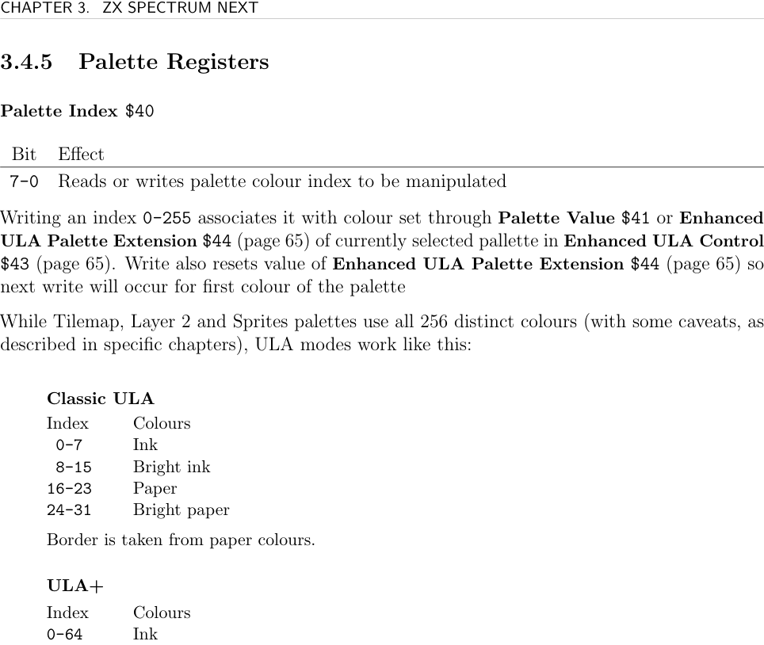
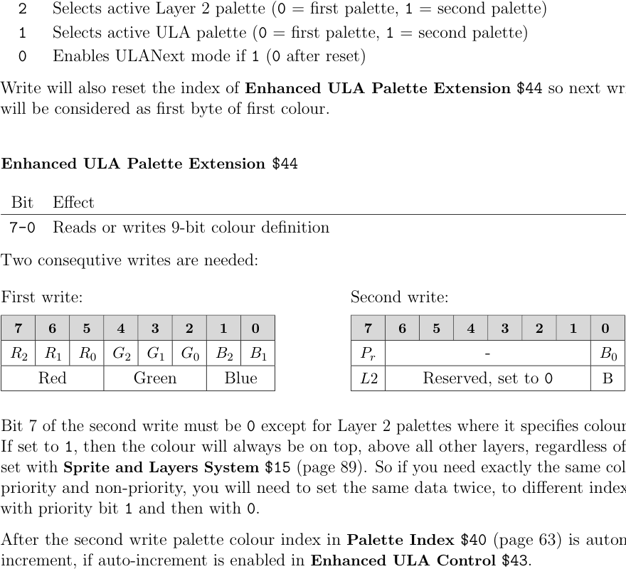
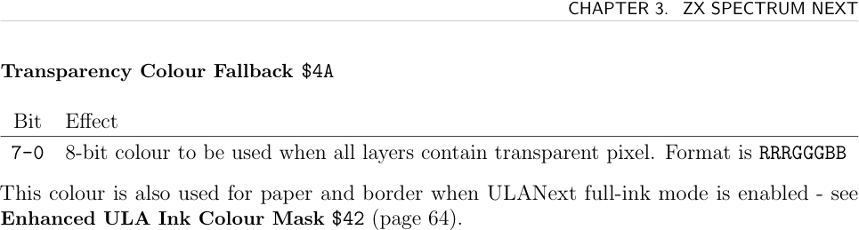
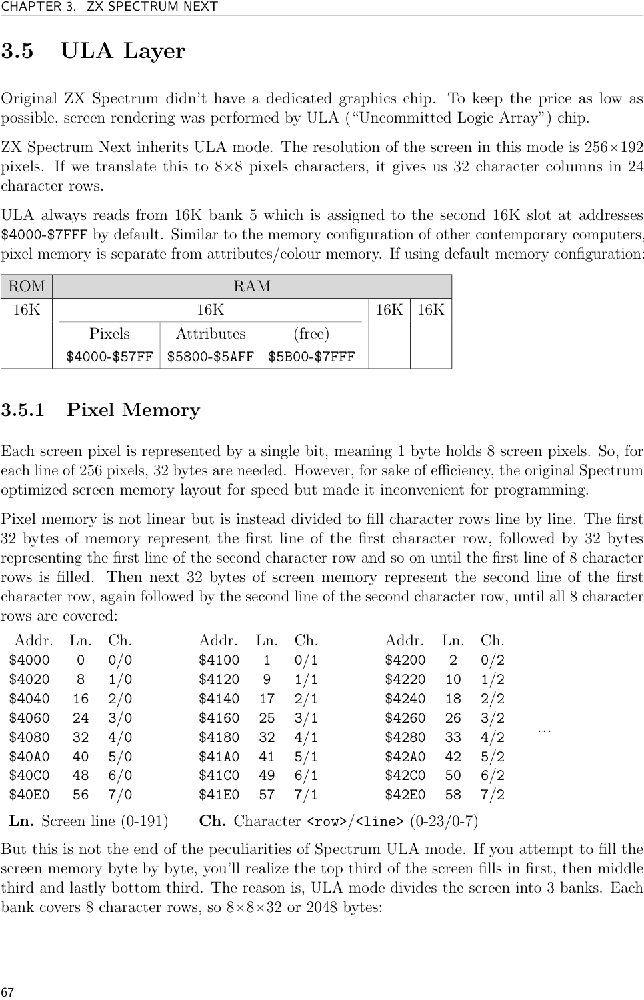

# ZXN Palette

Every graphics layer on the ZX Spectrum Next uses a **palette** — a table of up to 256 colour entries. Each layer (ULA, Layer 2, Sprites, Tilemap) has two palettes; only one is active at a time. Palettes are programmed via Next registers using 8-bit or 9-bit colour values.

## Colour Format

**8-bit colour (RRRGGGBB):** 3 bits red, 3 bits green, 2 bits blue. Single byte. Written to `$41`. The blue LSB is OR'd from the two B bits internally.

**9-bit colour (RRRGGGBBB):** 3 bits each for R, G, B. Two consecutive writes to `$44`:
- First write: RRRGGGBB (8-bit part)
- Second write: bit 0 = LSB of blue; bit 7 must be 0 **except** for Layer 2 (see priority flag below)

## Editing a Palette

1. **Select which palette to edit** — write `$43` (Enhanced ULA Control). Be careful: `$43` controls both which palette is *displayed* and which is *edited*; use read-modify-write to avoid changing the display.
2. **Select colour index** — write index 0–255 to `$40`. Also resets the 9-bit write state.
3. **Write colour** — write to `$41` (8-bit) or `$44` (9-bit, two writes).
4. **Enable auto-increment** — set bit 7 of `$43` to advance the index automatically after each write to `$41` or each pair of writes to `$44`.

### Copy 8-bit Palette

```asm
NEXTREG $43, %00010000  ; auto-increment, select Layer 2 first palette for edit
NEXTREG $40, 0          ; start at index 0
LD HL, palette
LD B, 255
Copy8Bit:
  LD A, (HL)
  INC HL
  NEXTREG $41, A        ; auto-increments index after each write
  DJNZ Copy8Bit
```

### Copy 9-bit Palette

```asm
Copy9Bit:
  LD A, (HL)
  INC HL
  NEXTREG $44, A        ; first byte (RRRGGGBB)
  LD A, (HL)
  INC HL
  NEXTREG $44, A        ; second byte (LSB of blue); index increments here
  DJNZ Copy9Bit
```



## Layer 2 Colour Priority

Layer 2 9-bit palette entries have a special **priority flag**: bit 7 of the second write byte. If set, that colour always appears on top of all other layers regardless of `$15` layer priority settings. To use a colour both with and without priority, write it to two separate palette indices.

## Palette Selection Per Layer

`$43` bits 6–4 select which palette to read/write:

| Bits 6–4 | Palette |
|----------|---------|
| `000` | ULA first |
| `100` | ULA second |
| `001` | Layer 2 first |
| `101` | Layer 2 second |
| `010` | Sprites first |
| `110` | Sprites second |
| `011` | Tilemap first |
| `111` | Tilemap second |

Active display palette per layer is set by bits 3–1 of `$43`.

## Registers

**Palette Index `$40`**
- Bits 7–0: colour entry 0–255 to read/write
- Writing resets `$44` state (next write = first byte)
- ULA Classic: indices 0–7=ink, 8–15=paper/border
- ULA full-ink mode (`$42`=`$FF`): all 256=ink; paper/border from `$4A`

**Palette Value `$41`** (8-bit)
- Bits 7–0: RRRGGGBB colour
- Auto-increments `$40` if enabled in `$43`
- Reading does NOT auto-increment

**Enhanced ULA Ink Colour Mask `$42`**
- Controls ink/paper split in ULANext mode only
- Allowed values: `$00`(1 ink), `$03`(4), `$07`(8), `$0F`(16), `$1F`(32), `$3F`(64), `$7F`(128), `$FF`(full-ink)
- Default: `$07` (core 3.0+)

**Enhanced ULA Control `$43`**

| Bit | Description |
|-----|-------------|
| 7 | 0=enable auto-increment, 1=disable |
| 6–4 | Select palette for edit (see table above) |
| 3 | Active Sprites palette: 0=first, 1=second |
| 2 | Active Layer 2 palette: 0=first, 1=second |
| 1 | Active ULA palette: 0=first, 1=second |
| 0 | Enable ULANext mode (0 after reset) |

Writing `$43` also resets the `$44` byte index.

**Enhanced ULA Palette Extension `$44`** (9-bit, 2 writes)
- First write: RRRGGGBB
- Second write: bit 0=blue LSB; bit 7=0 (Layer 2: bit 7=colour priority flag)
- After second write, `$40` auto-increments if enabled
- Reading always returns second byte (blue LSB only); does not auto-increment

**Transparency Colour Fallback `$4A`**
- 8-bit RRRGGGBB colour shown when all layers are transparent
- Also used for paper and border in ULANext full-ink mode





## See Also

- [[targets/zxn-hardware]] — layer compositing and priority
- [[targets/zxn/zxn-ula]] — ULA layer and its palette use
- [[targets/zxn/zxn-layer2]] — Layer 2 palette and priority flag
- [[targets/zxn/zxn-sprites]] — sprite palette offset scheme
- [[targets/zxn/zxn-tilemap]] — tilemap palette offset scheme
- [[targets/zxn/zxn-ports-registers]] — full register index
