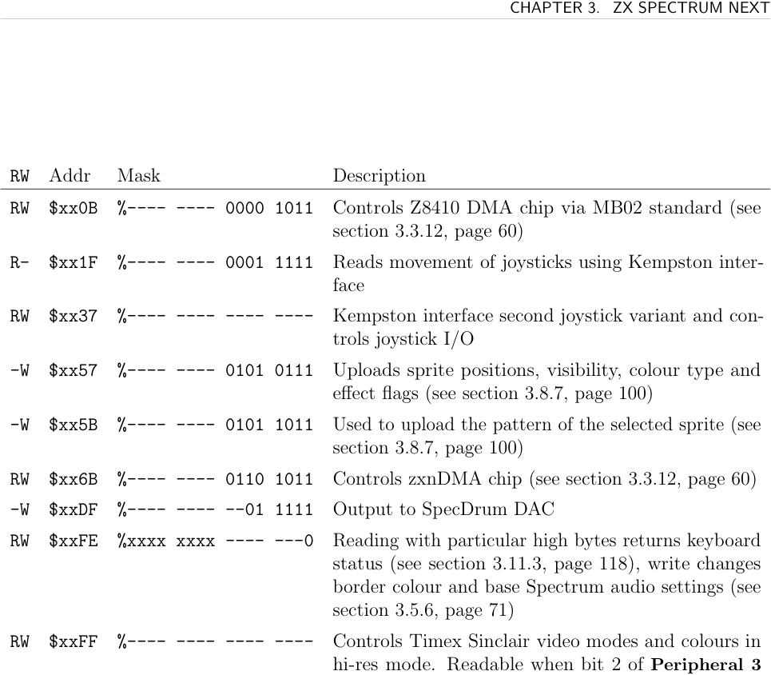
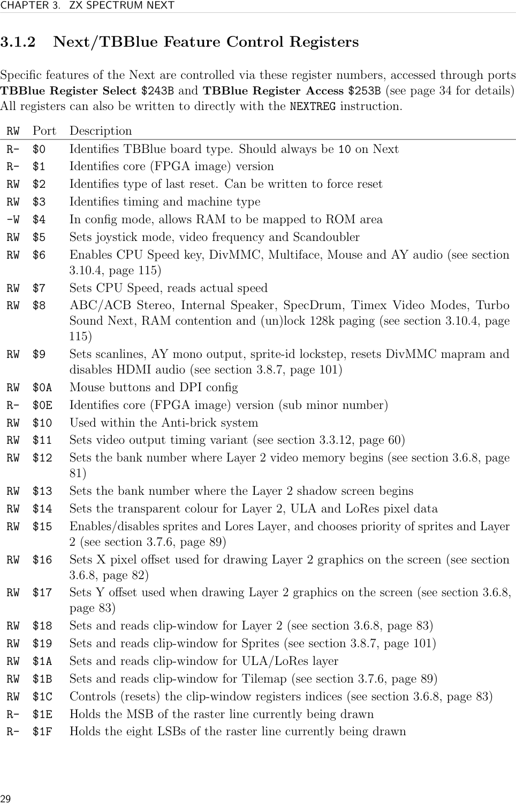
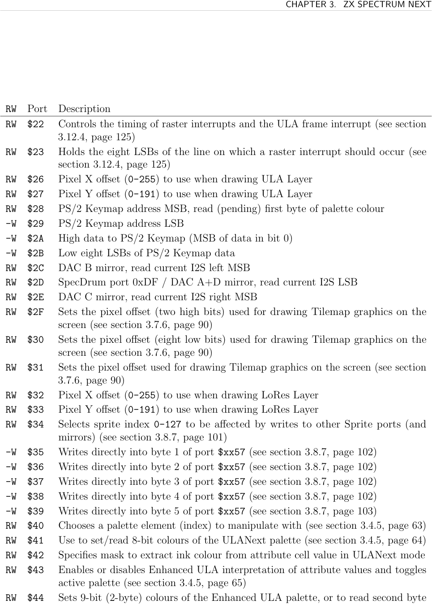
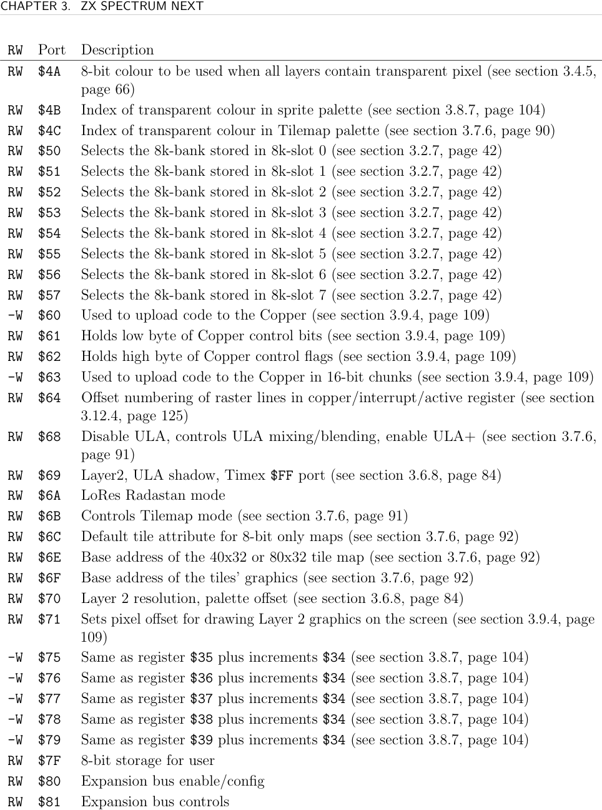
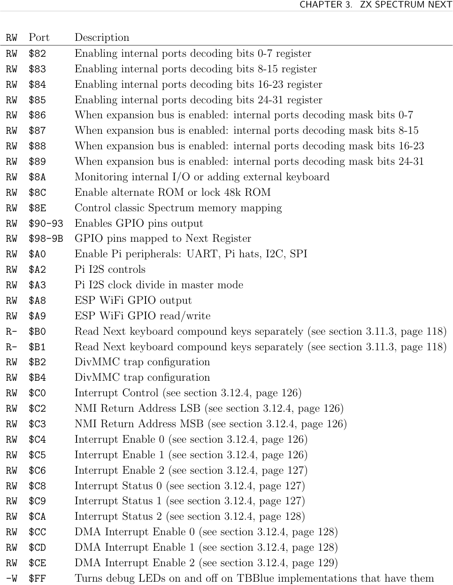

# ZXN Ports and Registers

The ZX Spectrum Next provides two I/O mechanisms: legacy **Spectrum ports** (directly addressed via Z80 `IN`/`OUT`) and **Next registers** (accessed indirectly through TBBlue ports `$243B`/`$253B`, or the `NEXTREG` instruction). A Rock implementer will interact with both.

## Spectrum Ports

### Fully Decoded (all 16 address bits matter)

| Port | Description |
|------|-------------|
| `$123B` | **Layer 2 Access** — enable/page Layer 2 (see [[targets/zxn/zxn-layer2]]) |
| `$1FFD` | +3 ROM paging / special paging (see [[targets/zxn/zxn-memory-paging]]) |
| `$243B` | **Next Register Select** — write register number here |
| `$253B` | **Next Register Access** — read/write selected register |
| `$303B` | **Sprite Status/Slot Select** (see [[targets/zxn/zxn-sprites]]) |
| `$7FFD` | **Memory Paging Control** — RAM/ROM/shadow (see [[targets/zxn/zxn-memory-paging]]) |
| `$BFFD` | AY register write (see [[targets/zxn/zxn-sound]]) |
| `$DFFD` | Extended bank select bits |
| `$FFFD` | **Turbo Sound / AY Register Select** (see [[targets/zxn/zxn-sound]]) |
| `$103B` | I2C SCL line |
| `$113B` | I2C SDA line |
| `$133B` | UART TX / RX status |
| `$143B` | UART RX data / baud rate |
| `$153B` | UART interface config |
| `$FADF`/`$FBDF`/`$FFDF` | Kempston Mouse buttons/X/Y |



### Partially Decoded (masked ports)

| Mask | Description |
|------|-------------|
| `$xx0B` | Z8410 DMA (Zilog legacy, MB02 standard) |
| `$xx1F` | Kempston joystick 1 |
| `$xx37` | Kempston joystick 2 |
| `$xx57` | **Sprite Attribute Upload** (see [[targets/zxn/zxn-sprites]]) |
| `$xx5B` | **Sprite Pattern Upload** (see [[targets/zxn/zxn-sprites]]) |
| `$xx6B` | **zxnDMA** (see [[targets/zxn/zxn-dma]]) |
| `$xxDF` | SpecDrum DAC output |
| `$xxFE` | **ULA port** — keyboard read / border+audio write (see [[targets/zxn/zxn-ula]], [[targets/zxn/zxn-keyboard]]) |
| `$xxFF` | Timex Sinclair video mode |



## Next/TBBlue Registers

### Accessing Registers

**Via NEXTREG instruction (preferred — 20–24 T-states):**
```asm
NEXTREG $16, 5     ; write immediate value to register $16: 24 T-states
NEXTREG $16, A     ; write A to register $16: 20 T-states
```

**Via ports (write — 58 T-states):**
```asm
LD BC, $243B
OUT (C), A         ; select register
LD BC, $253B
OUT (C), A         ; write value
```

**Via ports (read — 45–51 T-states; no NEXTREG read equivalent):**
```asm
LD BC, $243B
OUT (C), A         ; select register
INC B              ; BC = $253B
IN A, (C)          ; read value
```

### Complete Register Index

Each subsystem page documents its registers in full. This table is the cross-reference.

**System ($00–$0E)**

| Reg | Description |
|-----|-------------|
| `$00` | Board type (always 10) |
| `$01` | Core version |
| `$02` | Reset type / force reset |
| `$03` | Timing and machine type |
| `$05` | Joystick mode, video freq, scandoubler |
| `$06` | **Peripheral 2** — see [[targets/zxn/zxn-sound]] |
| `$07` | CPU speed |
| `$08` | **Peripheral 3** — stereo, speaker, DAC, Turbo Sound — see [[targets/zxn/zxn-sound]] |
| `$09` | **Peripheral 4** — scanlines, sprite lockstep — see [[targets/zxn/zxn-sprites]] |

**Video timing & raster ($11, $1E–$1F, $22–$23, $64)**

| Reg | Description |
|-----|-------------|
| `$11` | Video timing variant — see [[targets/zxn/zxn-dma]] |
| `$1E`–`$1F` | Current raster line (MSB / LSBs), read-only |
| `$22`–`$23` | Line interrupt control / value — see [[targets/zxn/zxn-interrupts]] |
| `$64` | Vertical line offset — see [[targets/zxn/zxn-interrupts]] |

**Layer 2 ($12–$18, $69–$71)** — see [[targets/zxn/zxn-layer2]]

| Reg | Description |
|-----|-------------|
| `$12` | Layer 2 RAM page |
| `$13` | Layer 2 shadow RAM page |
| `$14` | **Global Transparency** colour |
| `$15` | **Sprite and Layers System** — priority, visibility |
| `$16`–`$17` | Layer 2 X/Y offset |
| `$18` | Clip window Layer 2 |
| `$69` | Display Control 1 |
| `$70` | Layer 2 Control — resolution, palette offset |
| `$71` | Layer 2 X offset MSB |

**Sprites ($19, $34–$39, $4B, $75–$79)** — see [[targets/zxn/zxn-sprites]]

| Reg | Description |
|-----|-------------|
| `$19` | Clip window Sprites |
| `$34` | Sprite port-mirror index |
| `$35`–`$39` | Sprite attribute bytes 0–4 |
| `$4B` | Sprite transparency index |
| `$75`–`$79` | Sprite attributes with auto-increment |

**ULA ($1A, $26–$27, $42, $68)** — see [[targets/zxn/zxn-ula]]

| Reg | Description |
|-----|-------------|
| `$1A` | Clip window ULA/LoRes |
| `$26`–`$27` | ULA X/Y pixel offset |
| `$42` | Enhanced ULA ink colour mask |
| `$68` | ULA Control — disable, stencil, ULA+ |

**Palette ($40–$44, $4A)** — see [[targets/zxn/zxn-palette]]

| Reg | Description |
|-----|-------------|
| `$40` | Palette index |
| `$41` | Palette value (8-bit RRRGGGBB) |
| `$43` | Enhanced ULA Control — palette select, ULANext mode |
| `$44` | Palette extension (9-bit, 2 writes) |
| `$4A` | Transparency fallback colour |

**Memory paging ($50–$57, $8E)** — see [[targets/zxn/zxn-memory-paging]]

| Reg | Description |
|-----|-------------|
| `$50`–`$57` | **MMU0–MMU7** — 8K bank per slot |
| `$8E` | Classic memory mapping shortcut |

**Copper ($60–$63)** — see [[targets/zxn/zxn-copper]]

| Reg | Description |
|-----|-------------|
| `$60` | Copper data upload |
| `$61`–`$62` | Copper control (low/high byte) |
| `$63` | Copper data 16-bit write |

**Tilemap ($1B, $2F–$31, $4C, $6B–$6F)** — see [[targets/zxn/zxn-tilemap]]

| Reg | Description |
|-----|-------------|
| `$1B` | Clip window Tilemap |
| `$2F`–`$30` | Tilemap X offset MSB/LSB |
| `$31` | Tilemap Y offset |
| `$4C` | Tilemap transparency index |
| `$6B` | **Tilemap Control** |
| `$6C` | Default tilemap attribute |
| `$6E`–`$6F` | Tilemap / tile definitions base address |

**Clip Window Control: `$1C`** (resets indices for Layer 2, Sprites, ULA, Tilemap)

**Keyboard ($B0–$B1)** — see [[targets/zxn/zxn-keyboard]]

**Interrupts ($C0–$CE)** — see [[targets/zxn/zxn-interrupts]]

| Reg | Description |
|-----|-------------|
| `$C0` | Interrupt Control |
| `$C2`–`$C3` | NMI return address |
| `$C4`–`$C6` | Interrupt Enable 0/1/2 |
| `$C8`–`$CA` | Interrupt Status 0/1/2 |
| `$CC`–`$CE` | DMA Interrupt Enable 0/1/2 |





## See Also

- [[targets/zxn-hardware]] — hardware overview and layer compositing
- [[targets/zxn-z80]] — ZXN compilation target
