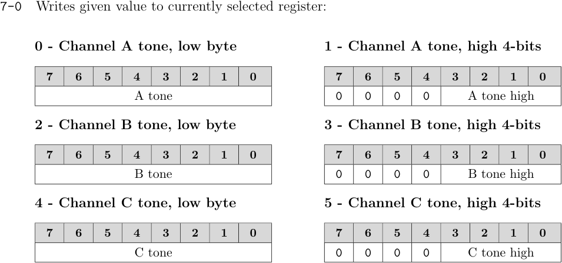
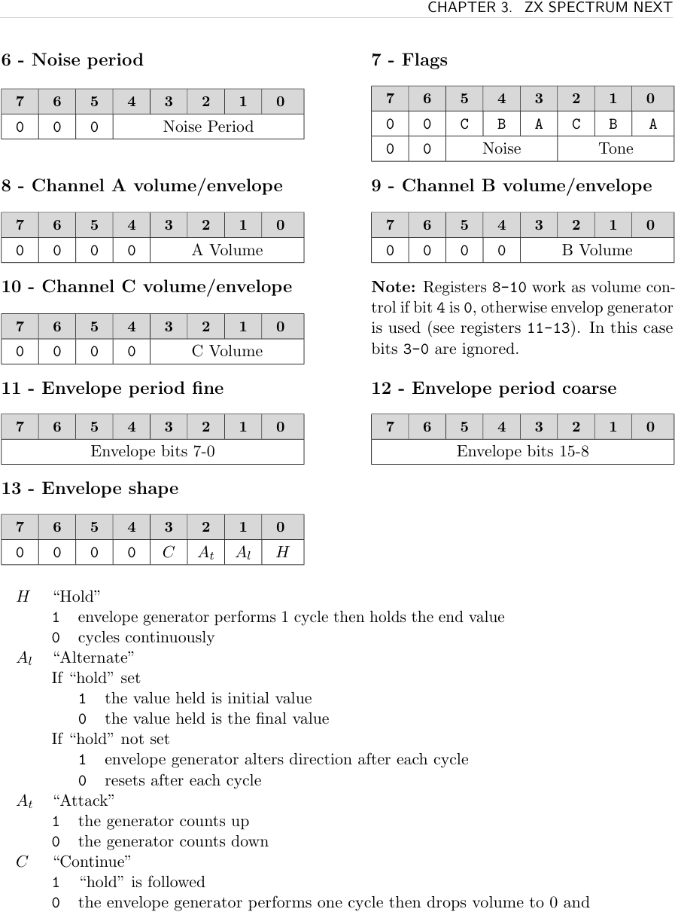
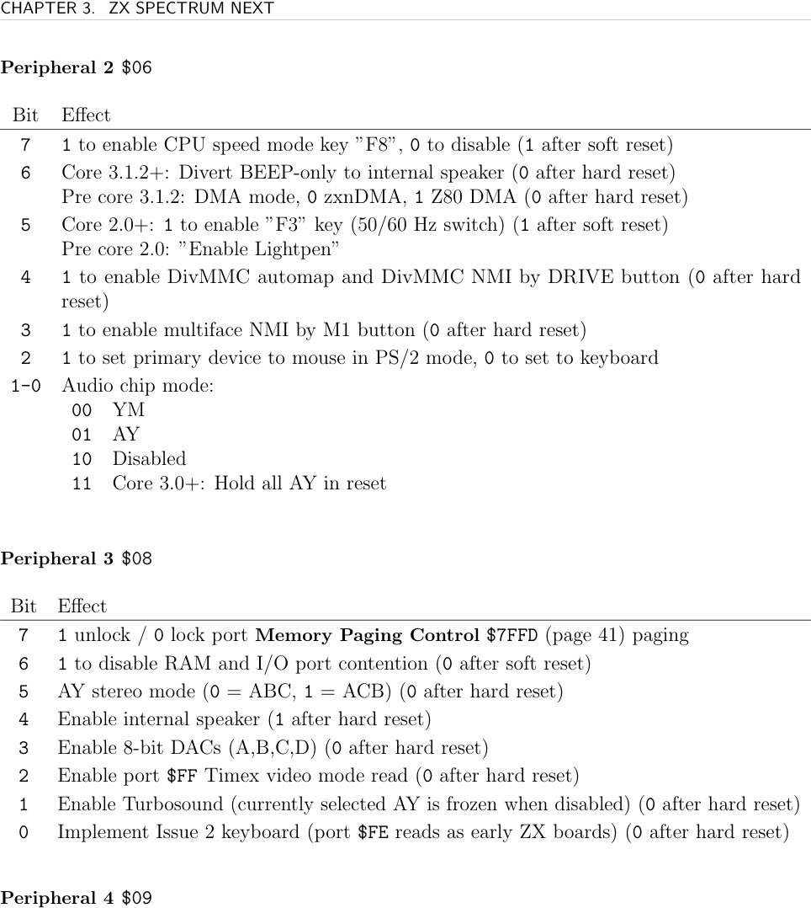

# ZXN Sound

The ZX Spectrum Next includes three **AY-3-8912** sound chips (Turbo Sound Next), giving 9 channels of programmable sound (3 channels per chip × 3 chips). This extends the single AY of the 128K Spectrum. A Rock implementer targeting audio on ZXN will write to AY registers via I/O ports.

## Ports

Sound uses two I/O ports (not Next registers):

**Turbo Sound Next Control / AY Register Select `$FFFD`:**
- When bit 7 = 1: chip select mode
  - Bit 6: enable left audio
  - Bit 5: enable right audio (must be 1)
  - Bits 4–2: active chip — `00x`=AY3, `01x`=AY2, `10x`=AY1
- When bit 7 = 0: register select mode
  - Bits 6–0: AY register number (0–13) for the active chip

**Sound Chip Register Write `$BFFD`:** writes value to the currently selected AY register.

## AY Register Map

| Reg | Function |
|-----|----------|
| 0 | Channel A tone period, low byte |
| 1 | Channel A tone period, high 4 bits |
| 2 | Channel B tone period, low byte |
| 3 | Channel B tone period, high 4 bits |
| 4 | Channel C tone period, low byte |
| 5 | Channel C tone period, high 4 bits |
| 6 | Noise period (bits 4–0) |
| 7 | Mixer: enable/disable tone and noise per channel |
| 8 | Channel A volume (bits 3–0); bit 4=1 uses envelope |
| 9 | Channel B volume; bit 4=1 uses envelope |
| 10 | Channel C volume; bit 4=1 uses envelope |
| 11 | Envelope period, fine |
| 12 | Envelope period, coarse |
| 13 | Envelope shape |

**Register 7 (Mixer)** — bit=0 means *enabled*:
- Bit 5: Noise C enable, Bit 4: Noise B enable, Bit 3: Noise A enable
- Bit 2: Tone C enable, Bit 1: Tone B enable, Bit 0: Tone A enable

**Register 13 (Envelope shape):**
- Bit 3 (Continue): 0=one cycle then silence; 1=continues
- Bit 2 (Attack): 0=count down, 1=count up
- Bit 1 (Alternate): reverses direction on each cycle if Continue set
- Bit 0 (Hold): sustain end value





## Writing to an AY Register

```asm
; Write value in D to AY register number in A
; (assumes chip already selected via $FFFD)
WriteDToAYReg:
  LD BC, $FFFD
  OUT (C), A       ; select register
  LD A, D
  LD BC, $BFFD
  OUT (C), A       ; write value
  RET
```

The sound sample builds on this helper shape with `writeDToAYReg` and `writeDEToAYReg`, then drives a small tune table containing mixer, tone period, noise period, channel, and volume bytes. See [[targets/zxn/samples/zxn-sound-sample-summary]].

## Selecting a Chip (Turbo Sound)

```asm
; Select AY1
LD BC, $FFFD
LD A, %10111101    ; bit 7=1 (chip select), bits 6+5=1 (L+R audio), bits 4-2=100 (AY1)
OUT (C), A
```

The sample uses the same `%11111101` control value as the hardware guide example, then enables Turbo Sound through `$08` and mono output through `$09`.

## Configuration Registers

**Peripheral 3 `$08`**

| Bit | Description |
|-----|-------------|
| 7 | 1=unlock `$7FFD` paging; 0=lock |
| 6 | 1=disable RAM and I/O contention |
| 5 | AY stereo mode: 0=ABC, 1=ACB |
| 4 | Enable internal speaker (1 after hard reset) |
| 3 | Enable 8-bit DACs (A, B, C, D) |
| 2 | Enable port `$FF` Timex video mode read |
| 1 | Enable Turbo Sound (active AY frozen when disabled) |
| 0 | Issue 2 keyboard behaviour |

**Peripheral 2 `$06`** (relevant bits)

| Bit | Description |
|-----|-------------|
| 0 | Core 3.0+: 1=hold all AY chips in reset |

**Peripheral 4 `$09`** (relevant bits)

| Bit | Description |
|-----|-------------|
| 7 | AY2 mono output |
| 6 | AY1 mono output |
| 5 | AY0 mono output |

## See Also

- [[targets/zxn-hardware]] — hardware overview
- [[targets/zxn/samples/zxn-sound-sample-summary]] — worked AY register playback sample
- [[targets/zxn/zxn-dma]] — DMA with prescalar for sampled audio streaming
- [[targets/zxn/zxn-ports-registers]] — full register index
