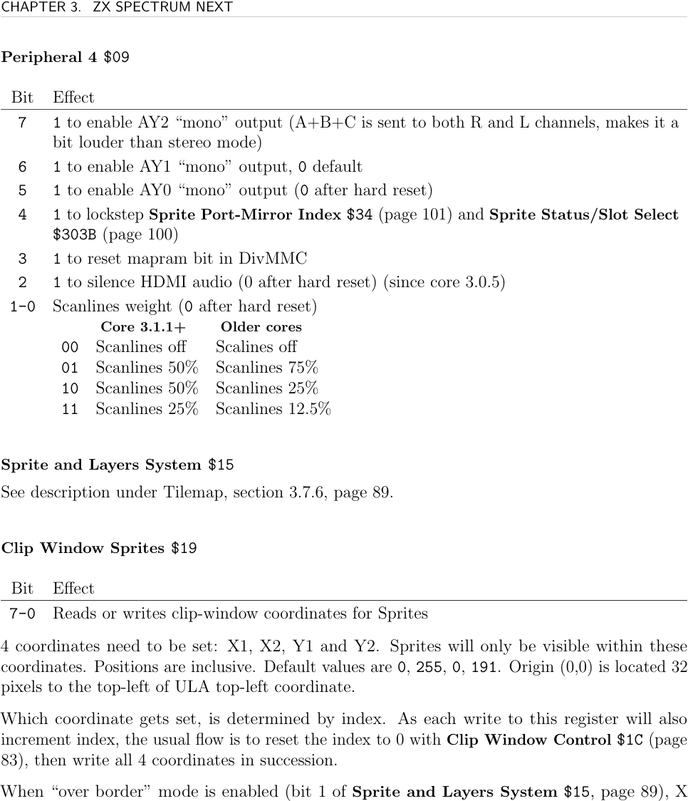
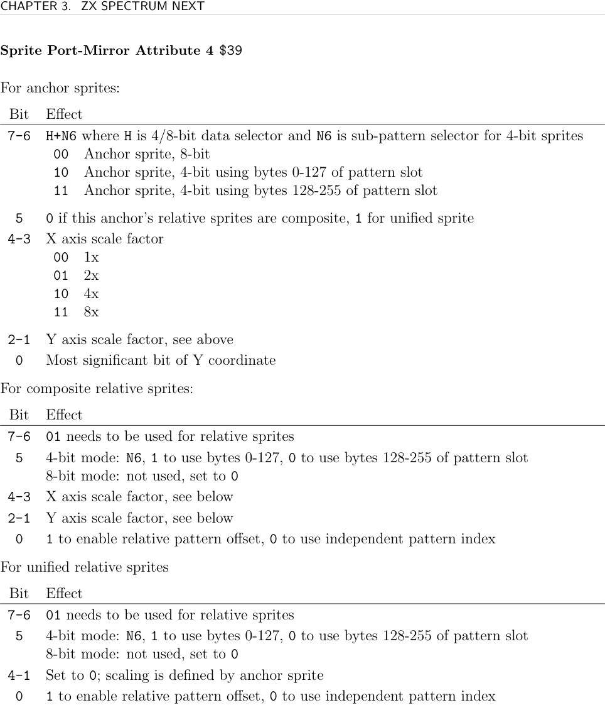
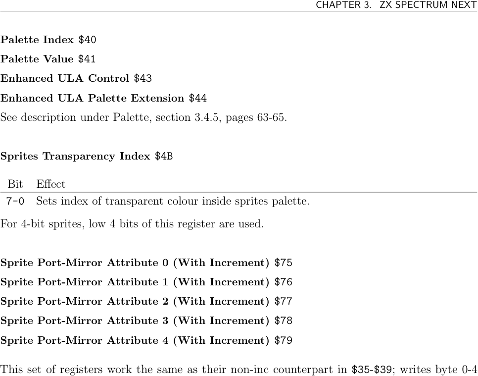

# ZXN Sprites

The ZX Spectrum Next supports **128 hardware sprites**, each 16×16 pixels. Sprite pattern data is stored in 16KB of dedicated FPGA memory (not Z80 RAM), making sprite rendering independent of CPU activity. The display surface is 320×256 pixels (same as large Layer 2 modes); sprites at position (32,32) appear at the top-left of the 256×192 ULA area.

## Capabilities Summary

- 128 simultaneous sprites
- 16×16 pixels per sprite
- 8-bit (256 colour) or 4-bit (16 colour) modes
- Magnification: 2×, 4×, 8× horizontal and vertical independently
- X/Y mirroring and 90° rotation
- Per-sprite palette offset (16 sub-palettes)
- **Composite** and **unified relative** sprite groups (multi-sprite objects)
- Collision detection and overflow detection (hardware flags)

## Pattern Memory

Sprite patterns live in 16KB of dedicated FPGA RAM:
- **8-bit sprites**: 256 bytes each → 64 patterns fit
- **4-bit sprites**: 128 bytes each → 128 patterns fit (2 per 256-byte slot)

Patterns are uploaded via port `$xx5B` (Sprite Pattern Upload) or DMA, selecting the target slot first with `$303B`.

## Colour and Palette

Each sprite has a 4-bit **palette offset**. The effective palette index is:
- **8-bit**: `colour_index = (palette_offset << 4) | pixel_byte`
- **4-bit**: palette offset selects one of 16 sub-palettes of 16 colours

Transparent colour is set via `$4B`. Active palette selected via `$43` (see [[targets/zxn/zxn-palette]]).

## Loading Patterns via DMA

```asm
; HL=source, BC=byte count, A=starting sprite slot
LoadSprites:
  LD (.dmaSource), HL
  LD (.dmaLength), BC
  LD BC, $303B
  OUT (C), A           ; set starting pattern slot
  LD HL, .dmaProgram
  LD B, .dmaProgramSize
  LD C, $6B
  OTIR                 ; upload DMA program
  RET
.dmaProgram:
  DB %1'00000'11       ; WR6: disable
  DB %0'11'11'1'01     ; WR0: A→B, append length + addr
.dmaSource: DW 0
.dmaLength: DW 0
  DB %0'0'01'0'100     ; WR1: A increment, memory
  DB %0'0'10'1'000     ; WR2: B fixed, I/O
  DB %1'01'0'11'01     ; WR4: continuous, append Port B addr
  DW $005B             ; sprite pattern upload port
  DB %10'0'0'0010      ; WR5: stop on end
  DB %1'10011'11       ; WR6: load
  DB %1'00001'11       ; WR6: enable
.dmaProgramSize = $-.dmaProgram
```

The sprite sample packages this pattern as `loadSprites` and pairs it with `INCBIN "sprites.spr"`. It selects the starting pattern slot through `$303B`, then streams pattern bytes to `$005B` with zxnDMA. See [[targets/zxn/samples/zxn-sprite-sample-summary]].

## Enabling Sprites

```asm
NEXTREG $15, %01000001  ; sprite 0 on top, S L U priority, sprites visible
```

## Displaying a Sprite

```asm
NEXTREG $34, 0          ; select sprite 0
NEXTREG $35, 100        ; X low byte = 100
NEXTREG $36, 80         ; Y low byte = 80
NEXTREG $37, %00000000  ; palette offset=0, no mirror, no rotate, X bit8=0
NEXTREG $38, %10000000  ; visible, no byte 4, pattern 0
```

## Composite and Unified Relative Sprites

Sprites can be grouped: one **anchor** sprite with multiple **relative** sprites attached.

**Composite relative**: relative sprites inherit visibility, X/Y scale from anchor. Their coordinates are 8-bit offsets from the anchor. Useful for multi-tile characters.

**Unified relative**: hardware automatically transforms relative sprite X/Y/rotation/scale to match the anchor — the whole group behaves as one large sprite.

**Rules:**
- Anchor must be defined first (lowest slot number in the group)
- Relative sprites follow immediately after the anchor
- The next anchor begins a new group

```asm
; Anchor sprite at (150, 80), with one unified relative to its right
NEXTREG $34, 2          ; anchor = sprite 2
NEXTREG $35, 150        ; X=150
NEXTREG $36, 80         ; Y=80
NEXTREG $37, %00000000
NEXTREG $38, %11000001  ; visible, byte 4 present, pattern 1
NEXTREG $79, %00100000  ; anchor, unified relatives, no scale

; Relative sprite 16px to the right
NEXTREG $35, 16         ; relative X offset
NEXTREG $36, 0          ; relative Y offset
NEXTREG $37, %00000000
NEXTREG $38, %11000010  ; visible, byte 4 present, pattern 2
NEXTREG $79, %01000000  ; relative sprite
```

The sample builds a 2x2 object from one anchor and three unified relatives, then updates only the anchor position and byte 4 to move, rotate, mirror, and scale the whole group. That makes unified-relative sprites the natural representation for multi-pattern actors.

## Registers

**Sprite Status/Slot Select `$303B`** (I/O port)

Write:
- Bit 7: offset reads/writes by 128 bytes
- Bits 6–0: slot index (0–63 for patterns, 0–127 for attributes)

Read:
- Bit 1: 1 = renderer could not display all sprites (cleared on read)
- Bit 0: 1 = sprite–sprite collision occurred (cleared on read)

**Sprite Attribute Upload `$xx57`** (I/O port)
- Upload attribute bytes for current sprite slot; auto-increments after complete set

**Sprite Pattern Upload `$xx5B`** (I/O port)
- Upload pattern data; auto-increments slot after 256 bytes

**Sprite Port-Mirror Index `$34`** — selects sprite for attribute registers `$35`–`$39`

**Sprite Port-Mirror Attribute 0 `$35`** — X position low 8 bits

**Sprite Port-Mirror Attribute 1 `$36`** — Y position low 8 bits

**Sprite Port-Mirror Attribute 2 `$37`**

| Bit | Description |
|-----|-------------|
| 7–4 | Palette offset |
| 3 | X mirror |
| 2 | Y mirror |
| 1 | Rotate 90° clockwise |
| 0 | Anchor: X bit 8 (full X range = 0–319). Relative: 1=add anchor palette offset |

**Sprite Port-Mirror Attribute 3 `$38`**

| Bit | Description |
|-----|-------------|
| 7 | Visible |
| 6 | Enable optional byte 4 (`$39`) |
| 5–0 | Pattern index 0–63 |

**Sprite Port-Mirror Attribute 4 `$39`**

For **anchor** sprites:
- Bit 7+6: H+N6 — H=0 → 8-bit; H=1,N6=0 → 4-bit lower 128 bytes; H=1,N6=1 → 4-bit upper 128 bytes
- Bit 6: 0=composite relatives, 1=unified relatives
- Bits 5–4: X scale (00=1×, 01=2×, 10=4×, 11=8×)
- Bits 3–2: Y scale
- Bit 1: Y position bit 8

For **composite relative** sprites:
- Bits 7–6: must be `01`
- Bit 5: N6 (4-bit byte half selection)
- Bits 4–3: X scale, Bits 2–1: Y scale
- Bit 0: 1=pattern index is offset from anchor's pattern

For **unified relative** sprites:
- Bits 7–6: must be `01`; bits 4–1: 0 (scale comes from anchor)
- Bit 0: 1=pattern index is offset from anchor

**Auto-increment variants `$75`–`$79`** — same as `$35`–`$39` but also increment `$34` after write. Pattern: write bytes 0–3 via `$35`–`$38`, write last byte via `$79` to also advance the index.

**Sprites Transparency Index `$4B`** — transparent colour index (8-bit; 4-bit sprites use low 4 bits)

**Clip Window Sprites `$19`** — sequential X1, X2, Y1, Y2. Default: 0, 255, 0, 191. Reset via `$1C` bit 2.

**Peripheral 4 `$09`**

| Bit | Description |
|-----|-------------|
| 7–5 | AY2/AY1/AY0 mono output |
| 4 | 1=lockstep `$34` with `$303B` |
| 3 | Reset DivMMC mapram |
| 2 | Silence HDMI audio |
| 1–0 | Scanlines weight |





## See Also

- [[targets/zxn-hardware]] — layer priority (`$15`)
- [[targets/zxn/samples/zxn-sprite-sample-summary]] — worked sprite setup and DMA upload sample
- [[targets/zxn/zxn-palette]] — sprite palette and transparency
- [[targets/zxn/zxn-dma]] — bulk pattern loading
- [[targets/zxn/zxn-ports-registers]] — full register index
