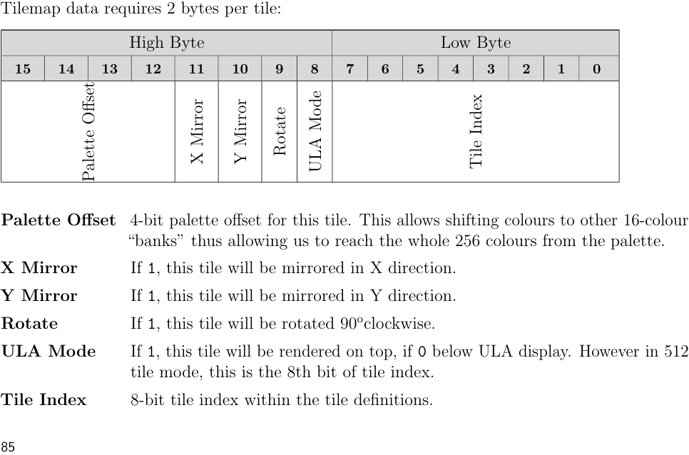
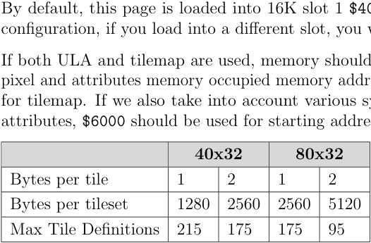
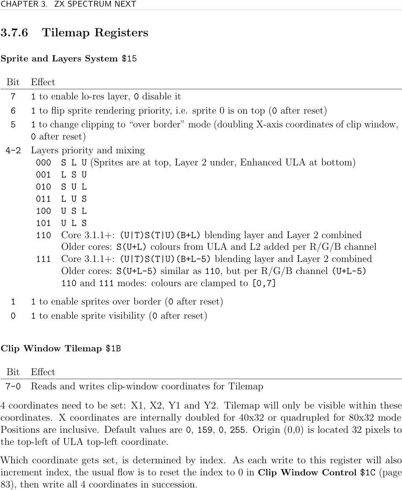
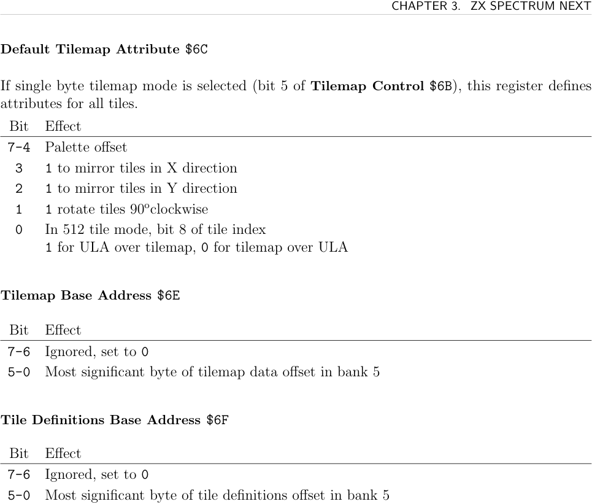
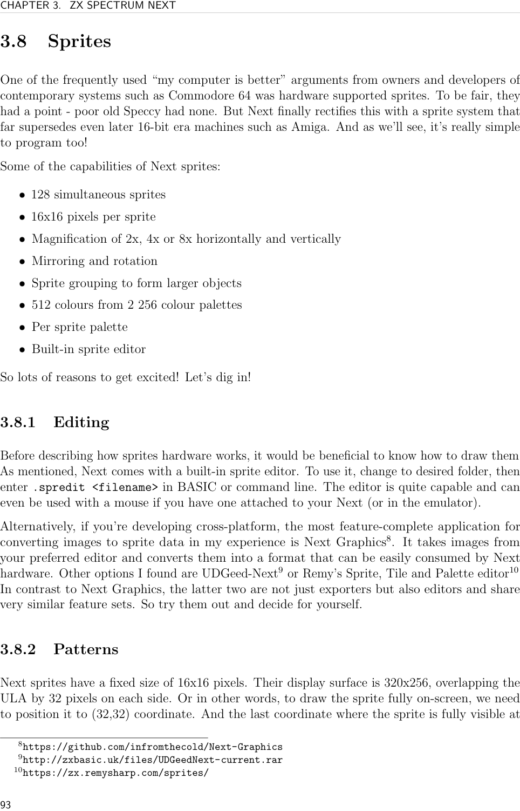

# ZXN Tilemap

The **Tilemap** is a block-based display system using 8×8 pixel tiles. Two resolutions: **40×32** or **80×32** tiles. Like 320×256 Layer 2, it covers the full screen including the 32-pixel border (320×256 pixels total). It is fast for scrolling backgrounds, text rendering, and UI — changing a tile entry redraws its 8×8 block automatically.

## Tile Definitions

Each tile is 8×8 pixels at 4 bits per pixel (16 colours per tile). Stored contiguously in **16K bank 5** (`$4000–$7FFF`, same bank as ULA). Up to 256 tile definitions (512 in 512-tile mode, bit 1 of `$6B`).

In **text mode** (bit 3 of `$6B`): tiles are 1-bit monochrome, 8 bytes each (like ZX UDGs). Transparency is compared against Global Transparency `$14`.

## Tilemap Data

Two bytes per tile (default). Can reduce to 1 byte (index only, bit 5 of `$6B`).

**Attribute byte (byte 1):**

| Bit | Description |
|-----|-------------|
| 7–4 | Palette offset — shifts colour indices by `n×16` to access all 256 palette entries |
| 3 | X mirror (1=flip horizontally) |
| 2 | Y mirror (1=flip vertically) |
| 1 | Rotate 90° clockwise |
| 0 | ULA Mode: 1=tile over ULA, 0=tile under ULA. In 512-tile mode: bit 8 of tile index |

**Index byte (byte 2):** bits 7–0 = tile index (0–255; 9th bit from attribute byte 0 in 512-tile mode)

In 1-byte mode, attributes for all tiles come from `$6C` (Default Tilemap Attribute).



## Memory Organisation

The Tilemap lives in bank 5. To avoid overlap with ULA pixel RAM (`$4000–$57FF`) and attributes (`$5800–$5AFF`):

| Data | Recommended Address | MSB Offset (from `$4000`) |
|------|--------------------|-----------------------------|
| Tilemap (40×32) | `$6000` | `$20` |
| Tile definitions | `$6600` | `$26` |

Registers `$6E` and `$6F` take the MSB of the offset: `(address - $4000) >> 8`.



## Combining ULA and Tilemap

Two modes:
1. **Standard**: per-tile priority from attribute byte bit 0. Transparent pixels show through.
2. **Stencil mode** (bit 0 of `$68`): final pixel is transparent if *both* ULA and tilemap pixels are transparent; otherwise colours are AND'd. Use for cut-out effects. Requires both ULA and Tilemap to be enabled.

## Setup Example

```asm
START_OF_BANK_5  = $4000
START_OF_TILEMAP = $6000
START_OF_TILES   = $6600
OFFSET_OF_MAP    = (START_OF_TILEMAP - START_OF_BANK_5) >> 8   ; $20
OFFSET_OF_TILES  = (START_OF_TILES - START_OF_BANK_5) >> 8     ; $26

NEXTREG $6B, %10100001   ; enable tilemap, 40×32, 8-bit entries
NEXTREG $6C, %00000000   ; default attribute: palette 0, no transform
NEXTREG $6E, OFFSET_OF_MAP
NEXTREG $6F, OFFSET_OF_TILES

; Setup tilemap palette for editing
NEXTREG $43, %00110000   ; auto-increment, select first tilemap palette
```

Copy tile definitions with `LDIR` from source data to `START_OF_TILES`. Copy tilemap data with `LDIR` from source to `START_OF_TILEMAP`.

The tilemap sample implements this setup directly, using `$6000` for 40x32 one-byte tilemap entries and `$6600` for tile definitions. It also uploads a 16-entry palette and toggles `$30` to create a 1-pixel shake. See [[targets/zxn/samples/zxn-tilemap-sample-summary]].



## Registers

**Sprite and Layers System `$15`** (priority, see [[targets/zxn-hardware]])

**Clip Window Tilemap `$1B`**
- Sequential writes: X1, X2, Y1, Y2
- X doubled internally for 40×32, quadrupled for 80×32
- Default: 0, 159, 0, 255. Origin = 32px top-left of ULA origin
- Reset index via `$1C` bit 4

**Clip Window Control `$1C`** — see [[targets/zxn/zxn-layer2]]

**Tilemap Offset X MSB `$2F`** — bit 0: MSB of X offset

**Tilemap Offset X LSB `$30`** — bits 7–0: X offset (combined with `$2F`: range 0–319 for 40×32, 0–639 for 80×32)

**Tilemap Offset Y `$31`** — bits 7–0: Y offset (0–255)

**Tilemap Transparency Index `$4C`**
- Bits 3–0: transparent colour index (4-bit; checked *before* palette offset is applied to upper nibble)
- Bits 7–4: reserved, must be 0

**ULA Control `$68`**

| Bit | Description |
|-----|-------------|
| 7 | 1=disable ULA output |
| 6 | (core 3.1.1+) Blend colour source for SLU modes 6/7 |
| 3 | 1=enable ULA+ |
| 2 | 1=enable ULA half-pixel scroll |
| 0 | 1=enable stencil mode (both ULA and Tilemap active) |

**Tilemap Control `$6B`**

| Bit | Description |
|-----|-------------|
| 7 | 1=enable tilemap |
| 6 | 1=80×32 mode, 0=40×32 |
| 5 | 1=1-byte mode (index only, attributes from `$6C`) |
| 4 | Active palette: 0=first, 1=second |
| 3 | 1=text mode (1-bit monochrome tiles) |
| 2 | Reserved (0) |
| 1 | 1=512-tile mode, 0=256-tile mode |
| 0 | 1=force tilemap over ULA |

**Default Tilemap Attribute `$6C`** (used when `$6B` bit 5 set)

| Bit | Description |
|-----|-------------|
| 7–4 | Palette offset |
| 3 | X mirror |
| 2 | Y mirror |
| 1 | Rotate |
| 0 | In 512-tile mode: bit 8 of tile index. Otherwise: ULA over/under tilemap |

**Tilemap Base Address `$6E`** — bits 5–0: MSB of tilemap data offset from `$4000` in bank 5

**Tile Definitions Base Address `$6F`** — bits 5–0: MSB of tile definitions offset from `$4000`




## See Also

- [[targets/zxn-hardware]] — layer stack and priority
- [[targets/zxn/samples/zxn-tilemap-sample-summary]] — worked tilemap asset setup sample
- [[targets/zxn/zxn-palette]] — tilemap palette offset scheme
- [[targets/zxn/zxn-ula]] — ULA stencil interaction
- [[targets/zxn/zxn-ports-registers]] — full register index
