ZX Spectrum Next

Assembly Developer Guide

Tomaˇz Kragelj

Z80 Undocumented by Jan Wilmans Sean Young

ZX Spectrum Next Assembly Developer Guide

Tomaˇz Kragelj

15 July 2022

REVISIONS 2022-07-15 2022-11-11 2021-07-16

Copyright © 2022 Tomaˇz Kragelj Copyright © 2005 Jan Wilmans Copyright © 1997, 1998, 2001, 2003, 2005 Sean Young

Permission is granted to copy, distribute and/or modify this document under the terms of the GNU Free Documentation License, Version 1.1 or any later version published by the Free Software Foundation; with no Invariant Sections, with no Front-Cover Texts, and with no Back-Cover Texts. A copy of the license is included in the section entitled “GNU Free Documentation License”.

Acknowlegements

A lot of work has gone into this book. But I also learned a lot. Not just about Z80 and Next, also LATEX which basics I learned in secondary school and then all but forgotten. In this regard, I’d like to thank Jan Wilmans and Sean Young for creating the original Z80 Undocumented that I took as a basis for this book. I also need to thank countless kind folks on https://tex.stackexchange.com/, those who asked questions and those who answered them; I found solutions to most issues I encountered there (and I was one very frequent visitor at times :) I’m very grateful to all members of z80-hardcore Spectrum Next Discord channel who pointed out errors and shortcomings of the book but especially Peter Ped Helcmanovsky and Alvin Albrecht (aka Allen Albright) for help in fact-checking and pull request contributions. And last but not least, my family for being patient with my frequent long after-hours. Oh, also special shoutout to Bibi, our small JRT companion with the biggest heart :)

Contents

1 Introduction 1

## 1.1 Where to get this document . . . . . . . . . . . . . . . . . . . . . . . . . . . . . 1

## 1.2 Companion Source Code . . . . . . . . . . . . . . . . . . . . . . . . . . . . . . . 1

## 1.3 Background, Contact & Feedback . . . . . . . . . . . . . . . . . . . . . . . . . . 3

## 1.4 Z80 Undocumented . . . . . . . . . . . . . . . . . . . . . . . . . . . . . . . . . . 4

## 1.5 ChangeLog . . . . . . . . . . . . . . . . . . . . . . . . . . . . . . . . . . . . . . 5

2 Zilog Z80 7

## 2.1 Overview . . . . . . . . . . . . . . . . . . . . . . . . . . . . . . . . . . . . . . . . 8

### 2.1.1 History of the Z80 . . . . . . . . . . . . . . . . . . . . . . . . . . . . . . 8

### 2.1.2 Pin Descriptions [7] . . . . . . . . . . . . . . . . . . . . . . . . . . . . . . 9

### 2.1.3 Power on Defaults . . . . . . . . . . . . . . . . . . . . . . . . . . . . . . 10

### 2.1.4 Registers . . . . . . . . . . . . . . . . . . . . . . . . . . . . . . . . . . . . 11

### 2.1.5 Flags . . . . . . . . . . . . . . . . . . . . . . . . . . . . . . . . . . . . . . 11

## 2.2 Undocumented Opcodes . . . . . . . . . . . . . . . . . . . . . . . . . . . . . . . 12

### 2.2.1 CB Prefix [5] . . . . . . . . . . . . . . . . . . . . . . . . . . . . . . . . . 12

### 2.2.2 DD Prefix [5] . . . . . . . . . . . . . . . . . . . . . . . . . . . . . . . . . 12

### 2.2.3 ED Prefix [5] . . . . . . . . . . . . . . . . . . . . . . . . . . . . . . . . . 13

### 2.2.4 FD Prefix [5] . . . . . . . . . . . . . . . . . . . . . . . . . . . . . . . . . 14

### 2.2.5 DDCB Prefix . . . . . . . . . . . . . . . . . . . . . . . . . . . . . . . . . 14

### 2.2.6 FDCB Prefixes . . . . . . . . . . . . . . . . . . . . . . . . . . . . . . . . 15

### 2.2.7 Combinations of Prefixes . . . . . . . . . . . . . . . . . . . . . . . . . . . 15

## 2.3 Undocumented Effects . . . . . . . . . . . . . . . . . . . . . . . . . . . . . . . .

### 2.3.1 BIT Instructions . . . . . . . . . . . . . . . . . . . . . . . . . . . . . . .

### 2.3.2 Memory Block Instructions [1] . . . . . . . . . . . . . . . . . . . . . . . .

### 2.3.3 I/O Block Instructions . . . . . . . . . . . . . . . . . . . . . . . . . . . .

### 2.3.4 16 Bit I/O ports . . . . . . . . . . . . . . . . . . . . . . . . . . . . . . . 18

### 2.3.5 Block Instructions . . . . . . . . . . . . . . . . . . . . . . . . . . . . . . 18

### 2.3.6 16 Bit Additions . . . . . . . . . . . . . . . . . . . . . . . . . . . . . . . 18

### 2.3.7 DAA Instruction . . . . . . . . . . . . . . . . . . . . . . . . . . . . . . . 19

## 2.4 Interrupts . . . . . . . . . . . . . . . . . . . . . . . . . . . . . . . . . . . . . . . 19

### 2.4.1 Non-Maskable Interrupts (NMI) . . . . . . . . . . . . . . . . . . . . . . . 19

### 2.4.2 Maskable Interrupts (INT) . . . . . . . . . . . . . . . . . . . . . . . . . . 20

### 2.4.3 Things Affecting the Interrupt Flip-Flops . . . . . . . . . . . . . . . . . . 21

### 2.4.4 HALT Instruction . . . . . . . . . . . . . . . . . . . . . . . . . . . . . . . 22

### 2.4.5 Where interrupts are accepted . . . . . . . . . . . . . . . . . . . . . . . . 22

## 2.5 Timing and R register . . . . . . . . . . . . . . . . . . . . . . . . . . . . . . . . 23

### 2.5.1 R register and memory refresh . . . . . . . . . . . . . . . . . . . . . . . . 23

## 2.6 Errors in Official Documentation . . . . . . . . . . . . . . . . . . . . . . . . . . 24

3 ZX Spectrum Next 25

## 3.1 Ports and Registers . . . . . . . . . . . . . . . . . . . . . . . . . . . . . . . . . . 27

### 3.1.1 Mapped Spectrum Ports . . . . . . . . . . . . . . . . . . . . . . . . . . . 27

### 3.1.2 Next/TBBlue Feature Control Registers . . . . . . . . . . . . . . . . . . 29

### 3.1.3 Accessing Registers . . . . . . . . . . . . . . . . . . . . . . . . . . . . . . 33

## 3.2 Memory Map and Paging . . . . . . . . . . . . . . . . . . . . . . . . . . . . . . . 35

### 3.2.1 Banks and Slots . . . . . . . . . . . . . . . . . . . . . . . . . . . . . . . . 35

### 3.2.2 Default Bank Traits . . . . . . . . . . . . . . . . . . . . . . . . . . . . . 35

### 3.2.3 Memory Map . . . . . . . . . . . . . . . . . . . . . . . . . . . . . . . . . 36

### 3.2.4 Legacy Paging Modes . . . . . . . . . . . . . . . . . . . . . . . . . . . . . 37

### 3.2.5 Next MMU Paging Mode . . . . . . . . . . . . . . . . . . . . . . . . . . . 39

### 3.2.6 Interaction Between Paging Modes . . . . . . . . . . . . . . . . . . . . . 40

### 3.2.7 Paging Mode Ports and Registers . . . . . . . . . . . . . . . . . . . . . . 41

## 3.3 DMA . . . . . . . . . . . . . . . . . . . . . . . . . . . . . . . . . . . . . . . . . .

### 3.3.1 Programming . . . . . . . . . . . . . . . . . . . . . . . . . . . . . . . . .

### 3.3.2 Registers at a Glance . . . . . . . . . . . . . . . . . . . . . . . . . . . . .

### 3.3.3 WR0 - Direction, Operation, Port A Configuration . . . . . . . . . . . .

### 3.3.4 WR1 - Port A Configuration . . . . . . . . . . . . . . . . . . . . . . . . . 47

### 3.3.5 WR2 - Port B Configuration . . . . . . . . . . . . . . . . . . . . . . . . . 49

### 3.3.6 WR3 - Activation . . . . . . . . . . . . . . . . . . . . . . . . . . . . . . . 51

### 3.3.7 WR4 - Port B, Timing, Interrupt Control . . . . . . . . . . . . . . . . . . 51

### 3.3.8 WR5 - Ready, Stop Configuration . . . . . . . . . . . . . . . . . . . . . . 52

### 3.3.9 WR6 - Command Register . . . . . . . . . . . . . . . . . . . . . . . . . . 53

### 3.3.10 Examples . . . . . . . . . . . . . . . . . . . . . . . . . . . . . . . . . . . 54

### 3.3.11 Miscellaneous . . . . . . . . . . . . . . . . . . . . . . . . . . . . . . . . . 59

### 3.3.12 DMA Ports and Registers . . . . . . . . . . . . . . . . . . . . . . . . . . 60

## 3.4 Palette . . . . . . . . . . . . . . . . . . . . . . . . . . . . . . . . . . . . . . . . . 61

### 3.4.1 Palette Selection . . . . . . . . . . . . . . . . . . . . . . . . . . . . . . . 61

### 3.4.2 Palette Editing . . . . . . . . . . . . . . . . . . . . . . . . . . . . . . . . 61

### 3.4.3 8 Bit Colours . . . . . . . . . . . . . . . . . . . . . . . . . . . . . . . . . 62

### 3.4.4 9 Bit Colours . . . . . . . . . . . . . . . . . . . . . . . . . . . . . . . . . 62

### 3.4.5 Palette Registers . . . . . . . . . . . . . . . . . . . . . . . . . . . . . . . 63

## 3.5 ULA Layer . . . . . . . . . . . . . . . . . . . . . . . . . . . . . . . . . . . . . . 67

### 3.5.1 Pixel Memory . . . . . . . . . . . . . . . . . . . . . . . . . . . . . . . . . 67

### 3.5.2 Attributes Memory . . . . . . . . . . . . . . . . . . . . . . . . . . . . . . 69

### 3.5.3 Border . . . . . . . . . . . . . . . . . . . . . . . . . . . . . . . . . . . . . 70

### 3.5.4 Shadow Screen . . . . . . . . . . . . . . . . . . . . . . . . . . . . . . . . 70

### 3.5.5 Enhanced ULA Modes . . . . . . . . . . . . . . . . . . . . . . . . . . . . 71

### 3.5.6 ULA Registers . . . . . . . . . . . . . . . . . . . . . . . . . . . . . . . . 71

## 3.6 Layer 2 . . . . . . . . . . . . . . . . . . . . . . . . . . . . . . . . . . . . . . . . . 73

### 3.6.1 Initialization . . . . . . . . . . . . . . . . . . . . . . . . . . . . . . . . . . 73

### 3.6.2 Paging . . . . . . . . . . . . . . . . . . . . . . . . . . . . . . . . . . . . . 73

### 3.6.3 Drawing . . . . . . . . . . . . . . . . . . . . . . . . . . . . . . . . . . . . 74

### 3.6.4 Effects . . . . . . . . . . . . . . . . . . . . . . . . . . . . . . . . . . . . . 74

256 192 256 Colour Mode . . . . . . . . . . . . . . . . . . . . . . . . . .

320 256 256 Colour Mode . . . . . . . . . . . . . . . . . . . . . . . . . .

640 256 16 Colour Mode . . . . . . . . . . . . . . . . . . . . . . . . . .

### 3.6.8 Layer 2 Registers . . . . . . . . . . . . . . . . . . . . . . . . . . . . . . .

## 3.7 Tilemap . . . . . . . . . . . . . . . . . . . . . . . . . . . . . . . . . . . . . . . . 85

### 3.7.1 Tile Definitions . . . . . . . . . . . . . . . . . . . . . . . . . . . . . . . . 85

### 3.7.2 Tilemap Data . . . . . . . . . . . . . . . . . . . . . . . . . . . . . . . . . 85

### 3.7.3 Memory Organization . . . . . . . . . . . . . . . . . . . . . . . . . . . . 86

### 3.7.4 Combining ULA and Tilemap . . . . . . . . . . . . . . . . . . . . . . . . 86

### 3.7.5 Examples . . . . . . . . . . . . . . . . . . . . . . . . . . . . . . . . . . . 87

### 3.7.6 Tilemap Registers . . . . . . . . . . . . . . . . . . . . . . . . . . . . . . . 89

## 3.8 Sprites . . . . . . . . . . . . . . . . . . . . . . . . . . . . . . . . . . . . . . . . . 93

### 3.8.1 Editing . . . . . . . . . . . . . . . . . . . . . . . . . . . . . . . . . . . . . 93

### 3.8.2 Patterns . . . . . . . . . . . . . . . . . . . . . . . . . . . . . . . . . . . . 93

### 3.8.3 Palette . . . . . . . . . . . . . . . . . . . . . . . . . . . . . . . . . . . . . 94

### 3.8.4 Combined Sprites . . . . . . . . . . . . . . . . . . . . . . . . . . . . . . . 95

### 3.8.5 Attributes . . . . . . . . . . . . . . . . . . . . . . . . . . . . . . . . . . . 96

### 3.8.6 Examples . . . . . . . . . . . . . . . . . . . . . . . . . . . . . . . . . . . 96

### 3.8.7 Sprite Ports and Registers . . . . . . . . . . . . . . . . . . . . . . . . . . 100

## 3.9 Copper . . . . . . . . . . . . . . . . . . . . . . . . . . . . . . . . . . . . . . . . . 105

### 3.9.1 Instructions . . . . . . . . . . . . . . . . . . . . . . . . . . . . . . . . . . 105

### 3.9.2 Configuration . . . . . . . . . . . . . . . . . . . . . . . . . . . . . . . . . 107

### 3.9.3 Example . . . . . . . . . . . . . . . . . . . . . . . . . . . . . . . . . . . . 107

### 3.9.4 Copper Registers . . . . . . . . . . . . . . . . . . . . . . . . . . . . . . . 109

## 3.10 Sound . . . . . . . . . . . . . . . . . . . . . . . . . . . . . . . . . . . . . . . . . 111

### 3.10.1 AY Chip Registers . . . . . . . . . . . . . . . . . . . . . . . . . . . . . . 111

### 3.10.2 Editing and Players . . . . . . . . . . . . . . . . . . . . . . . . . . . . . . 111

### 3.10.3 Examples . . . . . . . . . . . . . . . . . . . . . . . . . . . . . . . . . . . 112

### 3.10.4 Sound Ports and Registers . . . . . . . . . . . . . . . . . . . . . . . . . . 113

## 3.11 Keyboard . . . . . . . . . . . . . . . . . . . . . . . . . . . . . . . . . . . . . . . 117

### 3.11.1 Legacy Keyboard Status . . . . . . . . . . . . . . . . . . . . . . . . . . . 117

### 3.11.2 Next Extended Keys . . . . . . . . . . . . . . . . . . . . . . . . . . . . . 117

### 3.11.3 Keyboard Ports and Registers . . . . . . . . . . . . . . . . . . . . . . . . 118

## 3.12 Interrupts on Next . . . . . . . . . . . . . . . . . . . . . . . . . . . . . . . . . . 119

### 3.12.1 Interrupt Mode 1 . . . . . . . . . . . . . . . . . . . . . . . . . . . . . . . 119

### 3.12.2 Interrupt Mode 2 . . . . . . . . . . . . . . . . . . . . . . . . . . . . . . . 121

### 3.12.3 Hardware Interrupt Mode 2 . . . . . . . . . . . . . . . . . . . . . . . . . 123

### 3.12.4 Interrupt Registers . . . . . . . . . . . . . . . . . . . . . . . . . . . . . . 125

4 Instructions at a Glance 131

## 4.1 8-Bit Arithmetic and Logical . . . . . . . . . . . . . . . . . . . . . . . . . . . . . 133

## 4.2 16-Bit Arithmetic . . . . . . . . . . . . . . . . . . . . . . . . . . . . . . . . . . . 134

## 4.3 8-Bit Load . . . . . . . . . . . . . . . . . . . . . . . . . . . . . . . . . . . . . . . 135

## 4.4 General-Purpose Arithmetic and CPU Control . . . . . . . . . . . . . . . . . . . 136

## 4.5 16-Bit Load . . . . . . . . . . . . . . . . . . . . . . . . . . . . . . . . . . . . . . 137

## 4.6 Stack . . . . . . . . . . . . . . . . . . . . . . . . . . . . . . . . . . . . . . . . . . 138

## 4.7 Exchange . . . . . . . . . . . . . . . . . . . . . . . . . . . . . . . . . . . . . . . 138

## 4.8 Bit Set, Reset and Test . . . . . . . . . . . . . . . . . . . . . . . . . . . . . . . . 139

## 4.9 Rotate and Shift . . . . . . . . . . . . . . . . . . . . . . . . . . . . . . . . . . . 140

## 4.10 Jump . . . . . . . . . . . . . . . . . . . . . . . . . . . . . . . . . . . . . . . . . . 141

## 4.11 Call and Return . . . . . . . . . . . . . . . . . . . . . . . . . . . . . . . . . . . . 142

## 4.12 Block Transfer, Search . . . . . . . . . . . . . . . . . . . . . . . . . . . . . . . . 143

## 4.13 Input . . . . . . . . . . . . . . . . . . . . . . . . . . . . . . . . . . . . . . . . . . 144

## 4.14 Output . . . . . . . . . . . . . . . . . . . . . . . . . . . . . . . . . . . . . . . . . 144

## 4.15 ZX Spectrum Next Extended . . . . . . . . . . . . . . . . . . . . . . . . . . . . 145

5 Instructions up Close 147

## 5.1 ADC . . . . . . . . . . . . . . . . . . . . . . . . . . . . . . . . . . . . . . . . . . 151

## 5.2 ADD . . . . . . . . . . . . . . . . . . . . . . . . . . . . . . . . . . . . . . . . . . 152

## 5.3 AND . . . . . . . . . . . . . . . . . . . . . . . . . . . . . . . . . . . . . . . . . . 153

## 5.4 BIT . . . . . . . . . . . . . . . . . . . . . . . . . . . . . . . . . . . . . . . . . . 153

## 5.5 CALL . . . . . . . . . . . . . . . . . . . . . . . . . . . . . . . . . . . . . . . . . 154

## 5.6 CALL c,nn . . . . . . . . . . . . . . . . . . . . . . . . . . . . . . . . . . . . . . 154

## 5.7 BRLC . . . . . . . . . . . . . . . . . . . . . . . . . . . . . . . . . . . . . . . . . 155

BSLA . . . . . . . . . . . . . . . . . . . . . . . . . . . . . . . . . . . . . . . . . 155

BSRA . . . . . . . . . . . . . . . . . . . . . . . . . . . . . . . . . . . . . . . . . 155

## 5.10 BSRF . . . . . . . . . . . . . . . . . . . . . . . . . . . . . . . . . . . . . . . . . 156

## 5.11 BSRL . . . . . . . . . . . . . . . . . . . . . . . . . . . . . . . . . . . . . . . . . 156

## 5.12 CCF . . . . . . . . . . . . . . . . . . . . . . . . . . . . . . . . . . . . . . . . . . 156

## 5.13 CP . . . . . . . . . . . . . . . . . . . . . . . . . . . . . . . . . . . . . . . . . . . 157

## 5.14 CPD . . . . . . . . . . . . . . . . . . . . . . . . . . . . . . . . . . . . . . . . . . 159

## 5.15 CPDR . . . . . . . . . . . . . . . . . . . . . . . . . . . . . . . . . . . . . . . . . 159

## 5.16 CPI . . . . . . . . . . . . . . . . . . . . . . . . . . . . . . . . . . . . . . . . . . 160

## 5.17 CPIR . . . . . . . . . . . . . . . . . . . . . . . . . . . . . . . . . . . . . . . . . . 160

## 5.18 DAA . . . . . . . . . . . . . . . . . . . . . . . . . . . . . . . . . . . . . . . . . . 161

## 5.19 CPL . . . . . . . . . . . . . . . . . . . . . . . . . . . . . . . . . . . . . . . . . . 162

## 5.20 DEC . . . . . . . . . . . . . . . . . . . . . . . . . . . . . . . . . . . . . . . . . . 162

## 5.21 DI . . . . . . . . . . . . . . . . . . . . . . . . . . . . . . . . . . . . . . . . . . . 163

## 5.22 DJNZ . . . . . . . . . . . . . . . . . . . . . . . . . . . . . . . . . . . . . . . . . 163

## 5.23 EI . . . . . . . . . . . . . . . . . . . . . . . . . . . . . . . . . . . . . . . . . . . 163

## 5.24 EX . . . . . . . . . . . . . . . . . . . . . . . . . . . . . . . . . . . . . . . . . . . 164

## 5.25 EXX . . . . . . . . . . . . . . . . . . . . . . . . . . . . . . . . . . . . . . . . . . 164

## 5.26 HALT . . . . . . . . . . . . . . . . . . . . . . . . . . . . . . . . . . . . . . . . . 165

## 5.27 IM . . . . . . . . . . . . . . . . . . . . . . . . . . . . . . . . . . . . . . . . . . . 165

## 5.28 IN . . . . . . . . . . . . . . . . . . . . . . . . . . . . . . . . . . . . . . . . . . . 166

## 5.29 INC . . . . . . . . . . . . . . . . . . . . . . . . . . . . . . . . . . . . . . . . . . 167

## 5.30 IND . . . . . . . . . . . . . . . . . . . . . . . . . . . . . . . . . . . . . . . . . . 169

## 5.31 INDR . . . . . . . . . . . . . . . . . . . . . . . . . . . . . . . . . . . . . . . . . 169

## 5.32 INI . . . . . . . . . . . . . . . . . . . . . . . . . . . . . . . . . . . . . . . . . . . 170

## 5.33 INIR . . . . . . . . . . . . . . . . . . . . . . . . . . . . . . . . . . . . . . . . . . 170

## 5.34 JP . . . . . . . . . . . . . . . . . . . . . . . . . . . . . . . . . . . . . . . . . . . 171

## 5.35 JP c,nn . . . . . . . . . . . . . . . . . . . . . . . . . . . . . . . . . . . . . . . . 171

## 5.36 JP (C) . . . . . . . . . . . . . . . . . . . . . . . . . . . . . . . . . . . . . . . . . 172

## 5.37 JR . . . . . . . . . . . . . . . . . . . . . . . . . . . . . . . . . . . . . . . . . . . 172

## 5.38 JR c,n . . . . . . . . . . . . . . . . . . . . . . . . . . . . . . . . . . . . . . . . . 172

## 5.39 LD . . . . . . . . . . . . . . . . . . . . . . . . . . . . . . . . . . . . . . . . . . . 173

## 5.40 LDD . . . . . . . . . . . . . . . . . . . . . . . . . . . . . . . . . . . . . . . . . . 175

## 5.41 LDDX . . . . . . . . . . . . . . . . . . . . . . . . . . . . . . . . . . . . . . . . . 175

## 5.42 LDI . . . . . . . . . . . . . . . . . . . . . . . . . . . . . . . . . . . . . . . . . . 175

## 5.43 LDIX . . . . . . . . . . . . . . . . . . . . . . . . . . . . . . . . . . . . . . . . . . 176

## 5.44 LDWS . . . . . . . . . . . . . . . . . . . . . . . . . . . . . . . . . . . . . . . . . 176

## 5.45 LDDR . . . . . . . . . . . . . . . . . . . . . . . . . . . . . . . . . . . . . . . . . 177

## 5.46 LDDRX . . . . . . . . . . . . . . . . . . . . . . . . . . . . . . . . . . . . . . . . 177

## 5.47 LDIR . . . . . . . . . . . . . . . . . . . . . . . . . . . . . . . . . . . . . . . . . . 177

## 5.48 LDIRX . . . . . . . . . . . . . . . . . . . . . . . . . . . . . . . . . . . . . . . . . 178

## 5.49 LDPIRX . . . . . . . . . . . . . . . . . . . . . . . . . . . . . . . . . . . . . . . . 178

## 5.50 MUL . . . . . . . . . . . . . . . . . . . . . . . . . . . . . . . . . . . . . . . . . . 179

## 5.51 NEG . . . . . . . . . . . . . . . . . . . . . . . . . . . . . . . . . . . . . . . . . . 179

## 5.52 NEXTREG . . . . . . . . . . . . . . . . . . . . . . . . . . . . . . . . . . . . . . 179

## 5.53 NOP . . . . . . . . . . . . . . . . . . . . . . . . . . . . . . . . . . . . . . . . . . 180

## 5.54 OR . . . . . . . . . . . . . . . . . . . . . . . . . . . . . . . . . . . . . . . . . . . 180

## 5.55 OTDR . . . . . . . . . . . . . . . . . . . . . . . . . . . . . . . . . . . . . . . . . 181

## 5.56 OTIR . . . . . . . . . . . . . . . . . . . . . . . . . . . . . . . . . . . . . . . . . 181

## 5.57 OUTD . . . . . . . . . . . . . . . . . . . . . . . . . . . . . . . . . . . . . . . . . 182

## 5.58 OUTI . . . . . . . . . . . . . . . . . . . . . . . . . . . . . . . . . . . . . . . . . 182

## 5.59 OUT . . . . . . . . . . . . . . . . . . . . . . . . . . . . . . . . . . . . . . . . . . 183

## 5.60 OUTINB . . . . . . . . . . . . . . . . . . . . . . . . . . . . . . . . . . . . . . . . 183

## 5.61 PIXELAD . . . . . . . . . . . . . . . . . . . . . . . . . . . . . . . . . . . . . . . 184

## 5.62 PIXELDN . . . . . . . . . . . . . . . . . . . . . . . . . . . . . . . . . . . . . . . 184

## 5.63 POP . . . . . . . . . . . . . . . . . . . . . . . . . . . . . . . . . . . . . . . . . . 185

## 5.64 PUSH . . . . . . . . . . . . . . . . . . . . . . . . . . . . . . . . . . . . . . . . . 185

## 5.65 RES . . . . . . . . . . . . . . . . . . . . . . . . . . . . . . . . . . . . . . . . . . 186

## 5.66 RET . . . . . . . . . . . . . . . . . . . . . . . . . . . . . . . . . . . . . . . . . . 187

## 5.67 RET c . . . . . . . . . . . . . . . . . . . . . . . . . . . . . . . . . . . . . . . . . 187

## 5.68 RETI . . . . . . . . . . . . . . . . . . . . . . . . . . . . . . . . . . . . . . . . . . 188

## 5.69 RETN . . . . . . . . . . . . . . . . . . . . . . . . . . . . . . . . . . . . . . . . . 188

## 5.70 RL . . . . . . . . . . . . . . . . . . . . . . . . . . . . . . . . . . . . . . . . . . . 189

## 5.71 RLA . . . . . . . . . . . . . . . . . . . . . . . . . . . . . . . . . . . . . . . . . . 189

## 5.72 RLC . . . . . . . . . . . . . . . . . . . . . . . . . . . . . . . . . . . . . . . . . . 190

## 5.73 RLCA . . . . . . . . . . . . . . . . . . . . . . . . . . . . . . . . . . . . . . . . . 191

## 5.74 RR . . . . . . . . . . . . . . . . . . . . . . . . . . . . . . . . . . . . . . . . . . . 191

## 5.75 RRA . . . . . . . . . . . . . . . . . . . . . . . . . . . . . . . . . . . . . . . . . . 191

## 5.76 RRC . . . . . . . . . . . . . . . . . . . . . . . . . . . . . . . . . . . . . . . . . . 192

## 5.77 RLD . . . . . . . . . . . . . . . . . . . . . . . . . . . . . . . . . . . . . . . . . . 193

## 5.78 RRCA . . . . . . . . . . . . . . . . . . . . . . . . . . . . . . . . . . . . . . . . . 193

## 5.79 RRD . . . . . . . . . . . . . . . . . . . . . . . . . . . . . . . . . . . . . . . . . . 194

## 5.80 RST . . . . . . . . . . . . . . . . . . . . . . . . . . . . . . . . . . . . . . . . . . 195

## 5.81 SCF . . . . . . . . . . . . . . . . . . . . . . . . . . . . . . . . . . . . . . . . . . 195

## 5.82 SET . . . . . . . . . . . . . . . . . . . . . . . . . . . . . . . . . . . . . . . . . . 196

## 5.83 SETAE . . . . . . . . . . . . . . . . . . . . . . . . . . . . . . . . . . . . . . . . 196

## 5.84 SLA . . . . . . . . . . . . . . . . . . . . . . . . . . . . . . . . . . . . . . . . . . 197

## 5.85 SLL . . . . . . . . . . . . . . . . . . . . . . . . . . . . . . . . . . . . . . . . . . 197

## 5.86 SLI / SL1 . . . . . . . . . . . . . . . . . . . . . . . . . . . . . . . . . . . . . . . 198

## 5.87 SRA . . . . . . . . . . . . . . . . . . . . . . . . . . . . . . . . . . . . . . . . . . 199

## 5.88 SRL . . . . . . . . . . . . . . . . . . . . . . . . . . . . . . . . . . . . . . . . . . 200

## 5.89 SBC . . . . . . . . . . . . . . . . . . . . . . . . . . . . . . . . . . . . . . . . . . 201

## 5.90 SUB . . . . . . . . . . . . . . . . . . . . . . . . . . . . . . . . . . . . . . . . . . 202

## 5.91 SWAPNIB . . . . . . . . . . . . . . . . . . . . . . . . . . . . . . . . . . . . . . . 203

## 5.92 TEST . . . . . . . . . . . . . . . . . . . . . . . . . . . . . . . . . . . . . . . . . 203

## 5.93 XOR . . . . . . . . . . . . . . . . . . . . . . . . . . . . . . . . . . . . . . . . . . 204

A Instructions Sorted by Mnemonic 205

B Instructions Sorted by Opcode 215

C Bibliography 225

D GNU Free Documentation License

Chapter 1

Introduction

## 1.1 Where to get this document . . . . . . . . . . . . . . . . . . . . . . . . . . . . . 1

## 1.2 Companion Source Code . . . . . . . . . . . . . . . . . . . . . . . . . . . . . . . 1

## 1.3 Background, Contact & Feedback . . . . . . . . . . . . . . . . . . . . . . . . . . 3

## 1.4 Z80 Undocumented . . . . . . . . . . . . . . . . . . . . . . . . . . . . . . . . . . 4

## 1.5 ChangeLog . . . . . . . . . . . . . . . . . . . . . . . . . . . . . . . . . . . . . . 5

## 1.1 Where to get this document

ZX Spectrum Next Assembly Developer Guide is available as coil bound printed book on

https://bit.ly/zx-next-assembly-dev-guide

You can also download it as PDF document from GitHub where you can also find its source LATEX form so you can edit it to your preference

https://github.com/tomaz/zx-next-dev-guide

## 1.2 Companion Source Code

GitHub repository also includes companion source code. Sample projects were created in a cross-platform environment on Windows so instructions on the following page are written with these in mind. All programs mentioned are available on Linux and macOS; you should be able to run everything on those platforms too, but likely with some deviations. Regardless, these are merely suggestions, you should be able to use your preferred editor or tools.

CHAPTER 1. INTRODUCTION

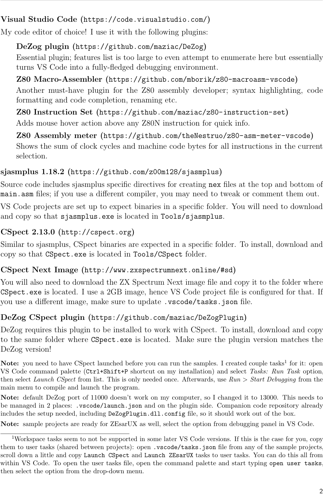

Visual Studio Code (https://code.visualstudio.com/)

My code editor of choice! I use it with the following plugins:

DeZog plugin (https://github.com/maziac/DeZog) Essential plugin; features list is too large to even attempt to enumerate here but essentially turns VS Code into a fully-fledged debugging environment.

Z80 Macro-Assembler (https://github.com/mborik/z80-macroasm-vscode) Another must-have plugin for the Z80 assembly developer; syntax highlighting, code formatting and code completion, renaming etc.

Z80 Instruction Set (https://github.com/maziac/z80-instruction-set) Adds mouse hover action above any Z80N instruction for quick info.

Z80 Assembly meter (https://github.com/theNestruo/z80-asm-meter-vscode) Shows the sum of clock cycles and machine code bytes for all instructions in the current selection.

sjasmplus 1.18.2 (https://github.com/z00m128/sjasmplus)

Source code includes sjasmplus specific directives for creating nex files at the top and bottom of main.asm files; if you use a different compiler, you may need to tweak or comment them out.

VS Code projects are set up to expect binaries in a specific folder. You will need to download and copy so that sjasmplus.exe is located in Tools/sjasmplus.

CSpect 2.13.0 (http://cspect.org)

Similar to sjasmplus, CSpect binaries are expected in a specific folder. To install, download and copy so that CSpect.exe is located in Tools/CSpect folder.

CSpect Next Image (http://www.zxspectrumnext.online/#sd)

You will also need to download the ZX Spectrum Next image file and copy it to the folder where CSpect.exe is located. I use a 2GB image, hence VS Code project file is configured for that. If you use a different image, make sure to update .vscode/tasks.json file.

DeZog CSpect plugin (https://github.com/maziac/DeZogPlugin)

DeZog requires this plugin to be installed to work with CSpect. To install, download and copy to the same folder where CSpect.exe is located. Make sure the plugin version matches the DeZog version!

Note: you need to have CSpect launched before you can run the samples. I created couple tasks1 for it: open VS Code command palette (Ctrl+Shift+P shortcut on my installation) and select Tasks: Run Task option, then select Launch CSpect from list. This is only needed once. Afterwards, use Run > Start Debugging from the main menu to compile and launch the program.

Note: default DeZog port of 11000 doesn’t work on my computer, so I changed it to 13000. This needs to be managed in 2 places: .vscode/launch.json and on the plugin side. Companion code repository already includes the setup needed, including DeZogPlugin.dll.config file, so it should work out of the box.

Note: sample projects are ready for ZEsarUX as well, select the option from debugging panel in VS Code.

1Workspace tasks seem to not be supported in some later VS Code versions. If this is the case for you, copy them to user tasks (shared between projects): open .vscode/tasks.json file from any of the sample projects, scroll down a little and copy Launch CSpect and Launch ZEsarUX tasks to user tasks. You can do this all from within VS Code. To open the user tasks file, open the command palette and start typing open user tasks, then select the option from the drop-down menu.

CHAPTER 1. INTRODUCTION

## 1.3 Background, Contact & Feedback

My first computer was ZX Spectrum 48K. Initially, it was only used to play games, but my creative mind soon set me on the path of building simple games of my own in BASIC. While too young to master assembler at that point, the idea stayed with me. ZX Spectrum Next revived my wish to learn Z80 and return to writing games for the platform.

My original intent was to have coil bound list of all ZX Next instructions so I can quickly compare. However, after finding Z80 Undocumented online, it felt like a perfect starting point. And with additional information included, it also encouraged me to extend the mere instructions list with the Next specific chapters. In a way, this book represents my notes as I was learning those topics. That being said, I did my best to present information as a reference to keep the book relevant.

During the process, I wanted to tweak or unify the look of various elements. For example instruction tables. Original LATEX code required applying changes to each and every instance. As LATEX is all but a programming language, I extracted individual elements into reusable commands which allowed me to tweak appearance in a single place and apply it to the whole document. I also converted almost all drawings from picture to tikz as it’s far more adaptable. With this, I almost completely restructured the original LATEX code. While this took a lot of time and effort, it allowed me to quickly iterate later on. I really love this aspect of LATEX!

English is not my native tongue. And our mind is not the best tool to correct our own work either. Since I can’t afford a professional proofreader, mistakes are a matter of fact I’m afraid. If you spot something or want to contribute, feel free to open an issue on GitHub. Pull requests are also welcome! If you want to contribute, but are unsure of what, check the accompanying readme file on GitHub for ideas. If you want to discuss in advance, or for anything else, you can find me on email tkragelj AT gmail DOT com or Twitter @tomsbarks.

That being said, I hope you’ll enjoy reading this document as much as I did writing it!

Sincerely, Tomaˇz

CHAPTER 1. INTRODUCTION

## 1.4 Z80 Undocumented

As the saying “standing on the shoulders of giants” goes, this book is also based on pre-existing work from Jan and Sean. While my work is ZX Spectrum Next developer-oriented, their original project was more focused on hardware perspective, for Z80 emulator developers.

If interested, you can find it at http://www.myquest.nl/z80undocumented/.

Jan

http://www.myquest.nl/z80undocumented/ Email jw AT dds DOT nl Twitter @janwilmans

Interested in emulation for a long time, but a few years after Sean started writing this document, I have also started writing my own MSX emulator in 2003 and I’ve used this document quite a lot. Now (2005) the Z80 emulation is nearing perfection, I decided to add what extra I have learned and comments various people have sent to Sean, to this document.

I have restyled the document (although very little) to fit my personal needs and I have checked a lot of things that were already in here.

Sean

http://www.msxnet.org/

Ever since I first started working on an MSX emulator, I’ve been very interested in getting the emulation absolutely correct - including the undocumented features. Not just to make sure that all games work, but also to make sure that if a program crashes, it crashes exactly the same way if running on an emulator as on the real thing. Only then is perfection achieved.

I set about collecting information. I found pieces of information on the Internet, but not everything there is to know. So I tried to fill in the gaps, the results of which I put on my website. Various people have helped since then; this is the result of all those efforts and to my knowledge, this document is the most complete.

CHAPTER 1. INTRODUCTION

## 1.5 ChangeLog

15 July 2022 Corrections, updates and improvements. Main focus on making instruction up close chapter more useful. Each instruction now includes description of effects on flags and where makes sense, includes additional description or code examples.

11 November 2021 Corrections and updates based on community comments - with special thanks to Peter Ped Helcmanovsky and Alvin Albrecht. Restructured and updated many ZX Next chapters: added sample code to ports, completely restructured memory map and paging, added new palette chapter including 9-bit palette handling, updated ULA with shadow screen info and added Next extended keyboard, DMA, Copper and Hardware IM2 sections. Other than some cosmetic changes: redesigned title, copyright pages etc. Also, many behind the scenes improvements like splitting previous huge single LATEX file into multiple per-chapter/section. This is not only more manageable but can also compile much faster.

16 July 2021 Added ZX Spectrum Next information and instructions and restructured text for better maintainability and readability.

18 September 2005 Corrected a textual typo in the R register and memory refresh section, thanks to David Aubespin. Corrected the contradiction in the DAA section saying the NF flag was both affected and unchanged :) thanks to Dan Meir. Added an error in official documentation about the way Interrupt Mode 2 works, thanks to Aaldert Dekker.

15 June 2005 Corrected improper notation of JP x,nn mnemonics in opcode list, thanks to Laurens Holst. Corrected a mistake in the INI, INIR, IND, INDR section and documented a mistake in official Z80 documentation concerning Interrupt Mode 2, thanks to Boris Donko. Thanks to Aaldert Dekker for his ideas, for verifying many assumptions and for writing instruction exercisers for various instruction groups.

18 May 2005 Added an alphabetical list of instructions for easy reference and corrected an error in the 16-bit arithmetic section, SBC HL,nn sets the NF flag just like other subtraction instructions, thanks to Fredrik Olssen for pointing that out.

4 April 2005 I (Jan jw AT dds DOT nl) will be maintaining this document from this version on. I restyled the document to fix the page numbering issues, corrected an error in the I/O Block Instructions section, added graphics for the RLD and RRD instructions and corrected the spelling in several places.

20 November 2003 Again, thanks to Ramsoft, added PV flag to OUTI, INI and friends. Minor fix to DAA tables, other minor fixes.

13 November 2003 Thanks to Ramsoft, add the correct tables for the DAA instruction (section 2.3.7, page 19). Minor corrections & typos, thanks to Jim Battle, David Sutherland and most of all Fred Limouzin.

September 2001 Previous documents I had written were in plain text and Microsoft Word, which I now find very embarrassing, so I decided to combine them all and use LATEX. Apart from a full re-write, the only changed information is “Power on defaults” (section 2.1.3, page 10) and the algorithm for the CF and HF flags for OTIR and friends (section 2.3.3, page 17).

CHAPTER 1. INTRODUCTION

This page intentionally left empty

Chapter 2

Zilog Z80

## 2.1 Overview . . . . . . . . . . . . . . . . . . . . . . . . . . . . . . . . . . . . . . . . 8

## 2.2 Undocumented Opcodes . . . . . . . . . . . . . . . . . . . . . . . . . . . . . . . 12

## 2.3 Undocumented Effects . . . . . . . . . . . . . . . . . . . . . . . . . . . . . . . . 16

## 2.4 Interrupts . . . . . . . . . . . . . . . . . . . . . . . . . . . . . . . . . . . . . . . 19

## 2.5 Timing and R register . . . . . . . . . . . . . . . . . . . . . . . . . . . . . . . . 23

## 2.6 Errors in Official Documentation . . . . . . . . . . . . . . . . . . . . . . . . . . 24

CHAPTER 2. ZILOG Z80

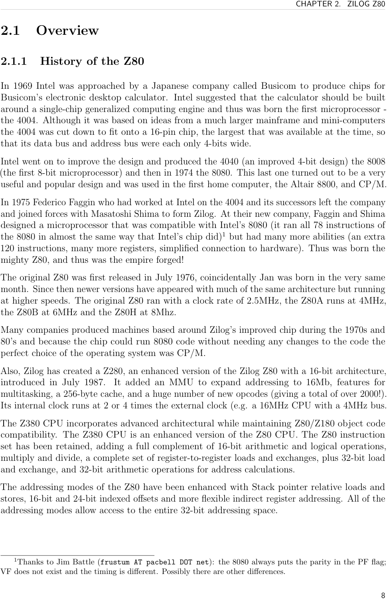

## 2.1 Overview

### 2.1.1 History of the Z80

In 1969 Intel was approached by a Japanese company called Busicom to produce chips for Busicom’s electronic desktop calculator. Intel suggested that the calculator should be built around a single-chip generalized computing engine and thus was born the first microprocessor the 4004. Although it was based on ideas from a much larger mainframe and mini-computers the 4004 was cut down to fit onto a 16-pin chip, the largest that was available at the time, so that its data bus and address bus were each only 4-bits wide.

Intel went on to improve the design and produced the 4040 (an improved 4-bit design) the 8008 (the first 8-bit microprocessor) and then in 1974 the 8080. This last one turned out to be a very useful and popular design and was used in the first home computer, the Altair 8800, and CP/M.

In 1975 Federico Faggin who had worked at Intel on the 4004 and its successors left the company and joined forces with Masatoshi Shima to form Zilog. At their new company, Faggin and Shima designed a microprocessor that was compatible with Intel’s 8080 (it ran all 78 instructions of the 8080 in almost the same way that Intel’s chip did)1 but had many more abilities (an extra 120 instructions, many more registers, simplified connection to hardware). Thus was born the mighty Z80, and thus was the empire forged!

The original Z80 was first released in July 1976, coincidentally Jan was born in the very same month. Since then newer versions have appeared with much of the same architecture but running at higher speeds. The original Z80 ran with a clock rate of 2.5MHz, the Z80A runs at 4MHz, the Z80B at 6MHz and the Z80H at 8Mhz.

Many companies produced machines based around Zilog’s improved chip during the 1970s and 80’s and because the chip could run 8080 code without needing any changes to the code the perfect choice of the operating system was CP/M.

Also, Zilog has created a Z280, an enhanced version of the Zilog Z80 with a 16-bit architecture, introduced in July 1987. It added an MMU to expand addressing to 16Mb, features for multitasking, a 256-byte cache, and a huge number of new opcodes (giving a total of over 2000!). Its internal clock runs at 2 or 4 times the external clock (e.g. a 16MHz CPU with a 4MHz bus.

The Z380 CPU incorporates advanced architectural while maintaining Z80/Z180 object code compatibility. The Z380 CPU is an enhanced version of the Z80 CPU. The Z80 instruction set has been retained, adding a full complement of 16-bit arithmetic and logical operations, multiply and divide, a complete set of register-to-register loads and exchanges, plus 32-bit load and exchange, and 32-bit arithmetic operations for address calculations.

The addressing modes of the Z80 have been enhanced with Stack pointer relative loads and stores, 16-bit and 24-bit indexed offsets and more flexible indirect register addressing. All of the addressing modes allow access to the entire 32-bit addressing space.

1Thanks to Jim Battle (frustum AT pacbell DOT net): the 8080 always puts the parity in the PF flag; VF does not exist and the timing is different. Possibly there are other differences.

CHAPTER 2. ZILOG Z80

### 2.1.2 Pin Descriptions [7]

This section might be relevant even if you don’t do anything with hardware; it might give you insight into how the Z80 operates. Besides, it took me hours to draw this.

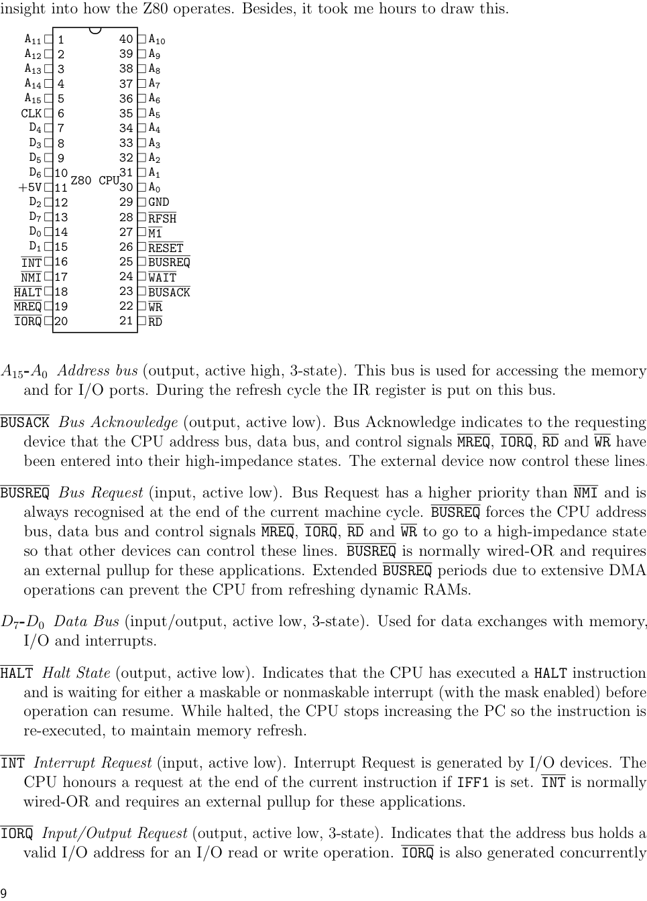

A15-A0 Address bus (output, active high, 3-state). This bus is used for accessing the memory and for I/O ports. During the refresh cycle the IR register is put on this bus.

BUSACK Bus Acknowledge (output, active low). Bus Acknowledge indicates to the requesting device that the CPU address bus, data bus, and control signals MREQ, IORQ, RD and WR have been entered into their high-impedance states. The external device now control these lines.

BUSREQ Bus Request (input, active low). Bus Request has a higher priority than NMI and is always recognised at the end of the current machine cycle. BUSREQ forces the CPU address bus, data bus and control signals MREQ, IORQ, RD and WR to go to a high-impedance state so that other devices can control these lines. BUSREQ is normally wired-OR and requires an external pullup for these applications. Extended BUSREQ periods due to extensive DMA operations can prevent the CPU from refreshing dynamic RAMs.

D7-D0 Data Bus (input/output, active low, 3-state). Used for data exchanges with memory, I/O and interrupts.

HALT Halt State (output, active low). Indicates that the CPU has executed a HALT instruction and is waiting for either a maskable or nonmaskable interrupt (with the mask enabled) before operation can resume. While halted, the CPU stops increasing the PC so the instruction is re-executed, to maintain memory refresh.

INT Interrupt Request (input, active low). Interrupt Request is generated by I/O devices. The CPU honours a request at the end of the current instruction if IFF1 is set. INT is normally wired-OR and requires an external pullup for these applications.

IORQ Input/Output Request (output, active low, 3-state). Indicates that the address bus holds a valid I/O address for an I/O read or write operation. IORQ is also generated concurrently

CHAPTER 2. ZILOG Z80

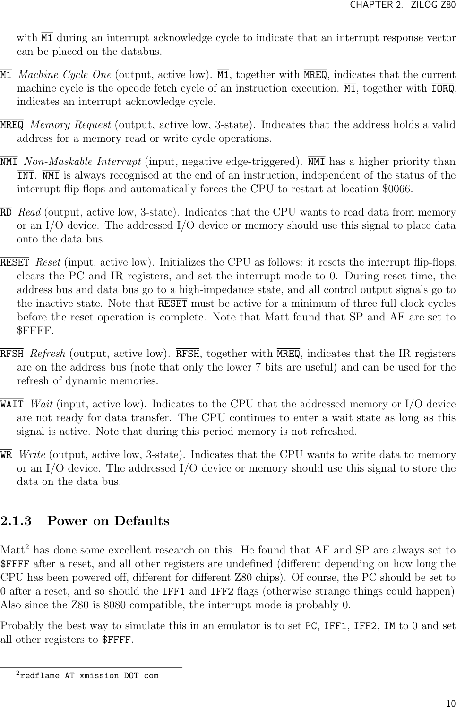

with M1 during an interrupt acknowledge cycle to indicate that an interrupt response vector can be placed on the databus.

M1 Machine Cycle One (output, active low). M1, together with MREQ, indicates that the current machine cycle is the opcode fetch cycle of an instruction execution. M1, together with IORQ, indicates an interrupt acknowledge cycle.

MREQ Memory Request (output, active low, 3-state). Indicates that the address holds a valid address for a memory read or write cycle operations.

NMI Non-Maskable Interrupt (input, negative edge-triggered). NMI has a higher priority than

INT. NMI is always recognised at the end of an instruction, independent of the status of the interrupt flip-flops and automatically forces the CPU to restart at location $0066.

RD Read (output, active low, 3-state). Indicates that the CPU wants to read data from memory or an I/O device. The addressed I/O device or memory should use this signal to place data onto the data bus.

RESET Reset (input, active low). Initializes the CPU as follows: it resets the interrupt flip-flops, clears the PC and IR registers, and set the interrupt mode to 0. During reset time, the address bus and data bus go to a high-impedance state, and all control output signals go to the inactive state. Note that RESET must be active for a minimum of three full clock cycles before the reset operation is complete. Note that Matt found that SP and AF are set to $FFFF.

RFSH Refresh (output, active low). RFSH, together with MREQ, indicates that the IR registers are on the address bus (note that only the lower 7 bits are useful) and can be used for the refresh of dynamic memories.

WAIT Wait (input, active low). Indicates to the CPU that the addressed memory or I/O device are not ready for data transfer. The CPU continues to enter a wait state as long as this signal is active. Note that during this period memory is not refreshed.

WR Write (output, active low, 3-state). Indicates that the CPU wants to write data to memory or an I/O device. The addressed I/O device or memory should use this signal to store the data on the data bus.

### 2.1.3 Power on Defaults

Matt2 has done some excellent research on this. He found that AF and SP are always set to $FFFF after a reset, and all other registers are undefined (different depending on how long the CPU has been powered off, different for different Z80 chips). Of course, the PC should be set to 0 after a reset, and so should the IFF1 and IFF2 flags (otherwise strange things could happen). Also since the Z80 is 8080 compatible, the interrupt mode is probably 0.

Probably the best way to simulate this in an emulator is to set PC, IFF1, IFF2, IM to 0 and set all other registers to $FFFF.

2redflame AT xmission DOT com

CHAPTER 2. ZILOG Z80

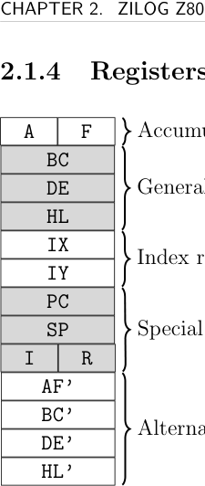

### 2.1.4 Registers

Accumulator and Flags

General purpose registers

Index registers

Special purpose registers

Alternate general purpose registers

### 2.1.5 Flags

The conventional way of denoting the flags is with one letter, “C” for the carry flag for example. It could be confused with the C register, so I’ve chosen to use the “CF” notation for flags (except “P” which uses “PV” notation due to having dual-purpose, either as parity or overflow). And for YF and XF the same notation is used in MAME3.

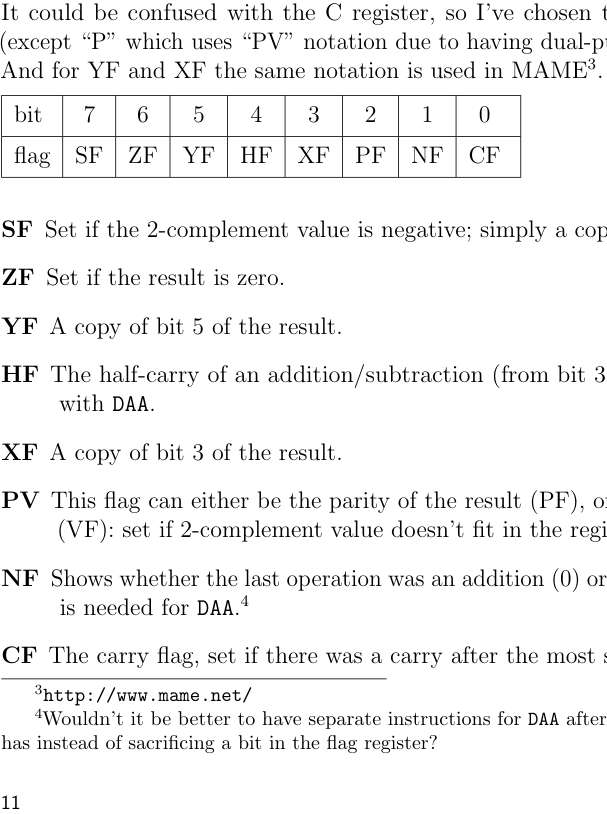

SF Set if the 2-complement value is negative; simply a copy of the most significant bit.

ZF Set if the result is zero.

YF A copy of bit 5 of the result.

HF The half-carry of an addition/subtraction (from bit 3 to 4). Needed for BCD correction with DAA.

XF A copy of bit 3 of the result.

PV This flag can either be the parity of the result (PF), or the 2-complement signed overflow (VF): set if 2-complement value doesn’t fit in the register.

NF Shows whether the last operation was an addition (0) or a subtraction (1). This information is needed for DAA.4

CF The carry flag, set if there was a carry after the most significant bit.

3http://www.mame.net/ 4Wouldn’t it be better to have separate instructions for DAA after addition and subtraction, like the 80x86 has instead of sacrificing a bit in the flag register?

CHAPTER 2. ZILOG Z80

## 2.2 Undocumented Opcodes

There are quite a few undocumented opcodes/instructions. This section should describe every possible opcode so you know what will be executed, whatever the value of the opcode is.

The following prefixes exist: CB, ED, DD, FD, DDCB and FDCB. Prefixes change the way the following opcodes are interpreted. All instructions without a prefix (not a value of one the above) are single-byte opcodes (without the operand, that is), which are documented in the official documentation.

### 2.2.1 CB Prefix [5]

An opcode with a CB prefix is a rotate, shift or bit test/set/reset instruction. A few instructions are missing from the official list, for example SLL (Shift Logical Left). It works like SLA, for one exception: it sets bit 0 (SLA resets it).

CB30 SLL B CB31 SLL C CB32 SLL D CB33 SLL E

CB34 SLL H CB35 SLL L CB36 SLL (HL) CB37 SLL A

### 2.2.2 DD Prefix [5]

In general, the instruction following the DD prefix is executed as is, but if the HL register is supposed to be used the IX register is used instead. Here are the rules:

ˆ Any usage of HL is treated as an access to IX (except EX DE,HL and EXX and the ED prefixed instructions that use HL).

ˆ Any access to (HL) is changed to (IX+d), where “d” is a signed displacement byte placed after the main opcode - except JP (HL), which isn’t indirect anyway. The mnemonic should be JP HL.

ˆ Any access to H is treated as an access to IXh (the high byte of IX) except if (IX+d) is used as well.

ˆ Any access to L is treated as an access to IXl (the low byte of IX) except if (IX+d) is used as well.

ˆ A DD prefix before a CB selects a completely different instruction set, see section 2.2.5, page 14.

Some examples:

Without With DD prefix LD H, (HL) LD H, (IX+d) LD H, A LD IXH, A LD L, H LD IXL, IXH

Without With DD prefix JP (HL) JP (IX) LD DE, 0 LD DE, 0 LD HL, 0 LD IX, 0

CHAPTER 2. ZILOG Z80

### 2.2.3 ED Prefix [5]

There are a number of undocumented EDxx instructions, of which most are duplicates of ** documented instructions. Any instruction not listed here has no effect (same as 2 NOPs).

indicates undocumented instruction:

ED50 IN D, (C) ED51 OUT (C), D ED52 SBC HL, DE ED53 LD (nn), DE NEG** ED54

ED40 IN B, (C) ED41 OUT (C), B ED42 SBC HL, BC ED43 LD (nn), BC ED44 NEG ED45 RETN ED46 IM 0 ED47 LD I, A ED48 IN C, (C) ED49 OUT (C), C ED4A ADC HL, BC ED4B LD BC, (nn) NEG** ED4C

RETN** ED55

ED56 IM 1 ED57 LD A, I ED58 IN E, (C) ED59 OUT (C), E ED5A ADC HL, DE ED5B LD DE, (nn) NEG** ED5C

RETN** ED5D

ED4D RETI IM 0** ED4E

ED5E IM 2 ED5F LD A, R

ED4F LD R, A

IN (C) / IN F, (C)** ED70

ED60 IN H, (C) ED61 OUT (C), H ED62 SBC HL, HL ED63 LD (nn), HL NEG** ED64

OUT (C), 0** ED71

ED72 SBC HL, SP ED73 LD (nn), SP NEG** ED74

RETN** ED65

RETN** ED75

IM 0** ED66

IM 1** ED76

NOP** ED77

ED67 RRD ED68 IN L, (C) ED69 OUT (C), L ED6A ADC HL, HL ED6B LD HL, (nn) NEG** ED6C

ED78 IN A, (C) ED79 OUT (C), A ED7A ADC HL, SP ED7B LD SP, (nn) NEG** ED7C

RETN** ED6D

RETN** ED7D

IM 0** ED6E

IM 2** ED7E

NOP** ED7F

ED6F RLD

The ED70 instruction reads from I/O port C, but does not store the result. It just affects the flags like the other IN x,(C) instructions. ED71 simply outs the value 0 to I/O port C.

The ED63 is a duplicate of the 22 opcode (LD (nn),HL) and similarly ED6B is a duplicate of the 2A opcode (LD HL,(nn)). Of course the timings are different. These instructions are listed in the official documentation.

CHAPTER 2. ZILOG Z80

According to Gerton Lunter5:

The instructions ED 4E and ED 6E are IM 0 equivalents: when FF was put on the bus (physically) at interrupt time, the Spectrum continued to execute normally, whereas when an EF (RST $28) was put on the bus it crashed, just as it does in that case when the Z80 is in the official interrupt mode 0. In IM 1 the Z80 just executes a RST $38 (opcode FF) no matter what is on the bus.

All the RETI/RETN instructions are the same, all like the RETN instruction. So they all, including RETI, copy IFF2 to IFF1. See section 2.4.3, page 21 for more information on RETI and RETN and IM x.

### 2.2.4 FD Prefix [5]

This prefix has the same effect as the DD prefix, though IY is used instead of IX. Note LD IXL, IYH is not possible: only IX or IY is accessed in one instruction, never both.

### 2.2.5 DDCB Prefix

The undocumented DDCB instructions store the result (if any) of the operation in one of the seven all-purpose registers. Which one depends on the lower 3 bits of the last byte of the opcode (not operand, so not the offset).

000 B 001 C 010 D 011 E

100 H 101 L (none: documented opcode) 110 111 A

The documented DDCB0106 is RLC (IX+$01). So, clear the lower three bits (DDCB0100) and something is done to register B. The result of the RLC (which is stored in (IX+$01)) is now also stored in register B. Effectively, it does the following:

```
LD B, (IX+$01)
RLC B
LD (IX+$01), B
```

LD B, (IX+$01) 1

RLC B 2

LD (IX+$01), B 3

So you get double value for money. The result is stored in B and (IX+$01). The most common notation is: RLC (IX+$01), B

I’ve once seen this notation:

```
RLC (IX+$01)
LD B, (IX+$01)
```

RLC (IX+$01) 1

LD B, (IX+$01) 2

That’s not correct: B contains the rotated value, even if (IX+$01) points to ROM.

5gerton AT math.rug DOT nl

CHAPTER 2. ZILOG Z80

The DDCB SET and RES instructions do the same thing as the shift/rotate instructions:

SET 0, (IX+$10), B DDCB10C0 SET 0, (IX+$10), C DDCB10C1 SET 0, (IX+$10), D DDCB10C2 SET 0, (IX+$10), E DDCB10C3 SET 0, (IX+$10), H DDCB10C4 SET 0, (IX+$10), L DDCB10C5 SET 0, (IX+$10) - documented instruction DDCB10C6 SET 0, (IX+$10), A DDCB10C7

So for example with the last instruction, the value of (IX+$10) with bit 0 set is also stored in register A.

The DDCB BIT instructions do not store any value; they merely test a bit. That’s why the undocumented DDCB BIT instructions are no different from the official ones:

DDCB d 78 BIT 7, (IX+d) DDCB d 79 BIT 7, (IX+d) DDCB d 7A BIT 7, (IX+d) DDCB d 7B BIT 7, (IX+d) DDCB d 7C BIT 7, (IX+d) DDCB d 7D BIT 7, (IX+d) BIT 7, (IX+d) - documented instruction DDCB d 7E DDCB d 7F BIT 7, (IX+d)

### 2.2.6 FDCB Prefixes

Same as for the DDCB prefix, though IY is used instead of IX.

### 2.2.7 Combinations of Prefixes

This part may be of some interest to emulator coders. Here we define what happens if strange sequences of prefixes appear in the instruction cycle of the Z80.

If CB or ED is encountered, that byte plus the next make up an instruction. FD or DD should be seen as prefix setting a flag which says “use IX or IY instead of HL”, and not an instruction. In a large sequence of DD and FD bytes, it is the last one that counts. Also any other byte (or instruction) resets this flag.

NOP NOP NOP LD HL, $1000 FD DD 00 21 00 10

CHAPTER 2. ZILOG Z80

## 2.3 Undocumented Effects

### 2.3.1 BIT Instructions

BIT n,r behaves much like AND r,2n with the result thrown away, and CF flag unaffected. Compare BIT 7,A with AND $80: flag YF and XF are reset, SF is set if bit 7 was actually set; ZF is set if the result was 0 (bit was reset), and PV is effectively set if ZF is set (the result of the AND leaves either no bits set (PV set - parity even) or one bit set (PV reset - parity odd). So the rules for the flags are:

SF flag Set if n = 7 and tested bit is set.

ZF flag Set if the tested bit is reset.

YF flag Set if n = 5 and tested bit is set.

HF flag Always set.

XF flag Set if n = 3 and tested bit is set.

PV flag Set just like ZF flag.

NF flag Always reset.

CF flag Unchanged.

This is where things start to get strange. With the BIT n,(IX+d) instructions, the flags behave just like the BIT n,r instruction, except for YF and XF. These are not copied from the result but from something completely different, namely bit 5 and 3 of the high byte of IX+d (so IX plus the displacement).

Things get more bizarre with the BIT n,(HL) instruction. Again, except for YF and XF, the flags are the same. YF and XF are copied from some sort of internal register. This register is related to 16-bit additions. Most instructions do not change this register. Unfortunately, I haven’t tested all instructions yet, but here is the list so far:

Use high byte of HL, ie. H before the addition. ADD HL, xx Use high byte of the resulting address IX+d. LD r, (IX+d) Use high byte target address of the jump. JR d Doesn’t change this register. LD r, r’

Any help here would be most appreciated!

CHAPTER 2. ZILOG Z80

### 2.3.2 Memory Block Instructions [1]

The LDI/LDIR/LDD/LDDR instructions affect the flags in a strange way. At every iteration, a byte is copied. Take that byte and add the value of register A to it. Call that value n. Now, the flags are:

YF flag A copy of bit 1 of n.

HF flag Always reset.

XF flag A copy of bit 3 of n.

PV flag Set if BC not 0.

SF, ZF, CF flags These flags are unchanged.

And now for CPI/CPIR/CPD/CPDR. These instructions compare a series of bytes in memory to register A. Effectively, it can be said they perform CP (HL) at every iteration. The result of that comparison sets the HF flag, which is important for the next step. Take the value of register A, subtract the value of the memory address, and finally subtract the value of HF flag, which is set or reset by the hypothetical CP (HL). So, n=A-(HL)-HF.

SF, ZF, HF flags Set by the hypothetical CP (HL).

YF flag A copy of bit 1 of n.

XF flag A copy of bit 3 of n.

PV flag Set if BC is not 0.

NF flag Always set.

CF flag Unchanged.

### 2.3.3 I/O Block Instructions

These are the most bizarre instructions, as far as the flags are concerned. Ramsoft found all of the flags. The “out” instructions behave differently than the “in” instructions, which doesn’t make the CPU very symmetrical.

First of all, all instructions affect the following flags:

SF, ZF, YF, XF flags Affected by decreasing register B, as in DEC B.

NF flag A copy of bit 7 of the value read from or written to an I/O port.

CHAPTER 2. ZILOG Z80

And now the for OUTI/OTIR/OUTD/OTDR instructions. Take the state of the L after the increment or decrement of HL; add the value written to the I/O port; call that k for now. If k ¡ 255, then the CF and HF flags are set. The PV flag is set like the parity of k bitwise and’ed with 7, bitwise xor’ed with B.

HF and CF Both set if ((HL) + L ¡ 255)

PV The parity of ((((HL) + L) ^ 7) Y B)

INI/INIR/IND/INDR use the C register instead of the L register. There is a catch though, because not the value of C is used, but C + 1 if it’s INI/INIR or C - 1 if it’s IND/INDR. So, first of all INI/INIR:

HF and CF Both set if ((HL) + ((C + 1) ^ 255) Y 255)

PF The parity of (((HL) + ((C + 1) ^ 255)) ^ 7) Y B)

And last IND/INDR:

HF and CF Both set if ((HL) + ((C - 1) ^ 255) ¡ 255)

PF The parity of (((HL) + ((C - 1) ^ 255)) ^ 7) Y B)

### 2.3.4 16 Bit I/O ports

Officially the Z80 has an 8-bit I/O port address space. When using the I/O ports, the 16 address lines are used. And in fact, the high 8 bits do have some value, so you can use 65536 ports after all. IN r, (C), OUT (C), r, and the block I/O instructions actually place the entire BC register on the address bus. Similarly IN A, (n) and OUT (n), A put A 256 + n on the address bus.

The INI, INIR, IND and INDR instructions use BC before decrementing B, and the OUTI, OTIR, OUTD and OTDR instructions use BC after decrementing.

### 2.3.5 Block Instructions

The repeated block instructions simply decrement the PC by two so the instruction is simply re-executed. So interrupts can occur during block instructions. So, LDIR is simply LDI + if BC is not 0, decrement PC by 2.

### 2.3.6 16 Bit Additions

The 16-bit additions are a bit more complicated than the 8-bit ones. Since the Z80 is an 8-bit CPU, 16-bit additions are done in two stages: first, the lower bytes are added, then the two higher bytes. The SF, YF, HF, XF flags are affected by the second (high) 8-bit addition. ZF is set if the whole 16-bit result is 0.

CHAPTER 2. ZILOG Z80

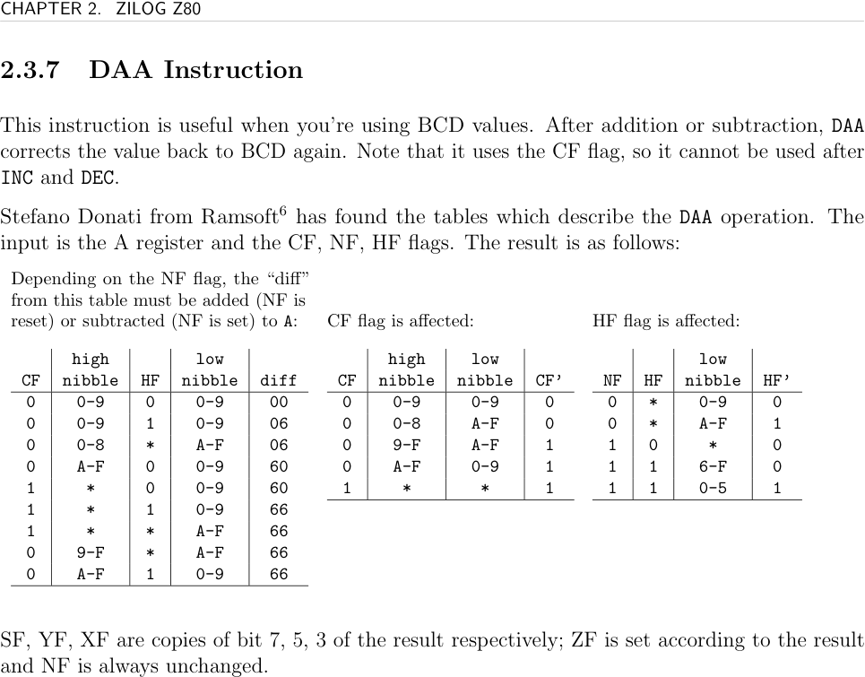

### 2.3.7 DAA Instruction

This instruction is useful when you’re using BCD values. After addition or subtraction, DAA corrects the value back to BCD again. Note that it uses the CF flag, so it cannot be used after INC and DEC.

Stefano Donati from Ramsoft6 has found the tables which describe the DAA operation. The input is the A register and the CF, NF, HF flags. The result is as follows:

Depending on the NF flag, the “diff” from this table must be added (NF is reset) or subtracted (NF is set) to A: CF flag is affected: HF flag is affected:

SF, YF, XF are copies of bit 7, 5, 3 of the result respectively; ZF is set according to the result and NF is always unchanged.

## 2.4 Interrupts

There are two types of interrupts, maskable and non-maskable. The maskable type is ignored if IFF1 is reset. Non-maskable interrupts (NMI) will are always accepted, and they have a higher priority, so if both are requested at the same time, the NMI will be accepted first.

For the interrupts, the following things are important: interrupt Mode (set with the IM 0, IM 1, IM 2 instructions), the interrupt flip-flops (IFF1 and IFF2), and the I register. When a maskable interrupt is accepted, the external device can put a value on the data bus.

Both types of interrupts increase the R register by one when accepted.

### 2.4.1 Non-Maskable Interrupts (NMI)

When an NMI is accepted, IFF1 is reset. At the end of the routine, IFF1 must be restored (so the running program is not affected). That’s why IFF2 is there; to keep a copy of IFF1.

An NMI is accepted when the NMI pin on the Z80 is made low (edge-triggered). The Z80 responds to the change of the line from +5 to 0 - so the interrupt line doesn’t have a state, it’s just a pulse. When this happens, a call is done to address $0066 and IFF1 is reset so the

6http://www.ramsoft.bbk.org/

CHAPTER 2. ZILOG Z80

routine isn’t bothered by maskable interrupts. The routine should end with an RETN (RETurn from Nmi) which is just a usual RET but also copies IFF2 to IFF1, so the IFFs are the same as before the interrupt.

You can check whether interrupts were disabled or not during an NMI by using the LD A,I or LD A,R instruction. These instructions copy IFF2 to the PV flag.

Accepting an NMI costs 11 t-states.

### 2.4.2 Maskable Interrupts (INT)

If the INT line is low and IFF1 is set, a maskable interrupt is accepted - whether or not the last interrupt routine has finished. That’s why you should not enable interrupts during such a routine, and make sure that the device that generated it has put the INT line up again before ending the routine. So unlike NMI interrupts, the interrupt line has a state; it’s not a pulse.

When an interrupt is accepted, both IFF1 and IFF2 are cleared, preventing another interrupt from occurring which would end up as an infinite loop (and overflowing the stack). What happens next depends on the Interrupt Mode.

A device can place a value on the data bus when the interrupt is accepted. Some computer systems do not utilize this feature, and this value ends up being $FF.

Interrupt Mode 0 This is the 8080 compatibility mode. The instruction on the bus is executed (usually an RST instruction, but it can be anything). I register is not used. Assuming it’s a RST instruction, accepting this takes 13 t-states.

Interrupt Mode 1 This is the 8080 compatibility mode. The instruction on the bus is executed (usually an RST instruction, but it can be anything). I register is not used. Assuming it’s a RST instruction, accepting this takes 13 t-states.

Interrupt Mode 2 A call is made to the address read from memory. What address is read from is calculated as follows: pI registerq 256 pvalue on busq. Zilog’s user manual states (very convincingly) that the least significant bit of the address is always 0, so they calculate the address that is read from as: pI registerq 256 pvalue on bus ^ $FEq. I have tested this and it’s not correct. Of course, a word (two bytes) is read, making the address where the call is made to. In this way, you can have a vector table for interrupts. Accepting this interrupt type costs 19 t-states.

At the end of a maskable interrupt, the interrupts should be enabled again. You can assume that was the state of the IFFs because otherwise the interrupt wasn’t accepted. So, an interrupt routine always ends with an EI and a RET (RETI according to the official documentation, more about that later):

```
InterruptRoutine:
...
EI
RETI or RET
```

InterruptRoutine:

...

EI

RETI or RET

CHAPTER 2. ZILOG Z80

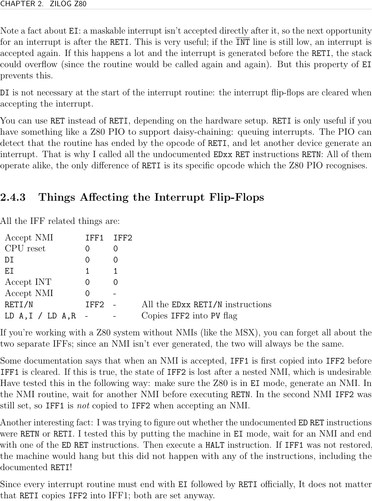

Note a fact about EI: a maskable interrupt isn’t accepted directly after it, so the next opportunity for an interrupt is after the RETI. This is very useful; if the INT line is still low, an interrupt is accepted again. If this happens a lot and the interrupt is generated before the RETI, the stack could overflow (since the routine would be called again and again). But this property of EI prevents this.

DI is not necessary at the start of the interrupt routine: the interrupt flip-flops are cleared when accepting the interrupt.

You can use RET instead of RETI, depending on the hardware setup. RETI is only useful if you have something like a Z80 PIO to support daisy-chaining: queuing interrupts. The PIO can detect that the routine has ended by the opcode of RETI, and let another device generate an interrupt. That is why I called all the undocumented EDxx RET instructions RETN: All of them operate alike, the only difference of RETI is its specific opcode which the Z80 PIO recognises.

### 2.4.3 Things Affecting the Interrupt Flip-Flops

All the IFF related things are:

Accept NMI CPU reset Accept INT Accept NMI All the EDxx RETI/N instructions Copies IFF2 into PV flag LD A,I / LD A,R

If you’re working with a Z80 system without NMIs (like the MSX), you can forget all about the two separate IFFs; since an NMI isn’t ever generated, the two will always be the same.

Some documentation says that when an NMI is accepted, IFF1 is first copied into IFF2 before IFF1 is cleared. If this is true, the state of IFF2 is lost after a nested NMI, which is undesirable. Have tested this in the following way: make sure the Z80 is in EI mode, generate an NMI. In the NMI routine, wait for another NMI before executing RETN. In the second NMI IFF2 was still set, so IFF1 is not copied to IFF2 when accepting an NMI.

Another interesting fact: I was trying to figure out whether the undocumented ED RET instructions were RETN or RETI. I tested this by putting the machine in EI mode, wait for an NMI and end with one of the ED RET instructions. Then execute a HALT instruction. If IFF1 was not restored, the machine would hang but this did not happen with any of the instructions, including the documented RETI!

Since every interrupt routine must end with EI followed by RETI officially, It does not matter that RETI copies IFF2 into IFF1; both are set anyway.

CHAPTER 2. ZILOG Z80

### 2.4.4 HALT Instruction

The HALT instruction halts the Z80; it does not increase the PC so that the instruction is re-executed until a maskable or non-maskable interrupt is accepted. Only then does the Z80 increase the PC again and continues with the next instruction. During the HALT state, the HALT line is set. The PC is increased before the interrupt routine is called.

### 2.4.5 Where interrupts are accepted

During the execution of instructions, interrupts won’t be accepted. Only between instructions. This is also true for prefixed instructions.

Directly after an EI or DI instruction, interrupts aren’t accepted. They’re accepted again after the instruction after the EI (RET in the following example). So for example, look at this MSX2 routine that reads a scanline from the keyboard:

```
LD C, A
DI
IN A, ($AA)
AND $F0
ADD A, C
OUT ($AA), A
EI
IN A, ($A9)
RET
```

LD C, A 1

DI 2

IN A, ($AA) 3

AND $F0 4

ADD A, C 5

OUT ($AA), A 6

EI 7

IN A, ($A9) 8

RET 9

You can assume that there never is an interrupt after the EI, before the IN A,($A9) - which would be a problem because the MSX interrupt routine reads the keyboard too.

Using this feature of EI, it is possible to check whether it is true that interrupts are never accepted during instructions:

```
DI
make sure interrupt is active
EI
insert
instruction to test
InterruptRoutine:
store PC where interrupt was accepted
RET
```

DI 1

make sure interrupt is active 2

EI 3

insert instruction to test 4

InterruptRoutine: 5

store PC where interrupt was accepted 6

RET 7

And yes, for all instructions, including the prefixed ones, interrupts are never accepted during an instruction. Only after the tested instruction. Remember that block instructions simply re-execute themselves (by decreasing the PC with 2) so an interrupt is accepted after each iteration.

Another predictable test: at the “insert instruction to test” insert a large sequence of EI instructions. Of course, during the execution of the EI instructions, no interrupts are accepted.

CHAPTER 2. ZILOG Z80

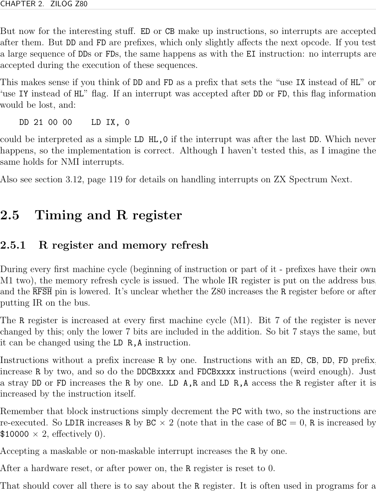

But now for the interesting stuff. ED or CB make up instructions, so interrupts are accepted after them. But DD and FD are prefixes, which only slightly affects the next opcode. If you test a large sequence of DDs or FDs, the same happens as with the EI instruction: no interrupts are accepted during the execution of these sequences.

This makes sense if you think of DD and FD as a prefix that sets the “use IX instead of HL” or “use IY instead of HL” flag. If an interrupt was accepted after DD or FD, this flag information would be lost, and:

could be interpreted as a simple LD HL,0 if the interrupt was after the last DD. Which never happens, so the implementation is correct. Although I haven’t tested this, as I imagine the same holds for NMI interrupts.

Also see section 3.12, page 119 for details on handling interrupts on ZX Spectrum Next.

## 2.5 Timing and R register

### 2.5.1 R register and memory refresh

During every first machine cycle (beginning of instruction or part of it - prefixes have their own M1 two), the memory refresh cycle is issued. The whole IR register is put on the address bus, and the RFSH pin is lowered. It’s unclear whether the Z80 increases the R register before or after putting IR on the bus.

The R register is increased at every first machine cycle (M1). Bit 7 of the register is never changed by this; only the lower 7 bits are included in the addition. So bit 7 stays the same, but it can be changed using the LD R,A instruction.

Instructions without a prefix increase R by one. Instructions with an ED, CB, DD, FD prefix, increase R by two, and so do the DDCBxxxx and FDCBxxxx instructions (weird enough). Just a stray DD or FD increases the R by one. LD A,R and LD R,A access the R register after it is increased by the instruction itself.

Remember that block instructions simply decrement the PC with two, so the instructions are re-executed. So LDIR increases R by BC 2 (note that in the case of BC = 0, R is increased by $10000 2, effectively 0).

Accepting a maskable or non-maskable interrupt increases the R by one.

After a hardware reset, or after power on, the R register is reset to 0.

That should cover all there is to say about the R register. It is often used in programs for a random value, which is good but of course not truly random.

CHAPTER 2. ZILOG Z80

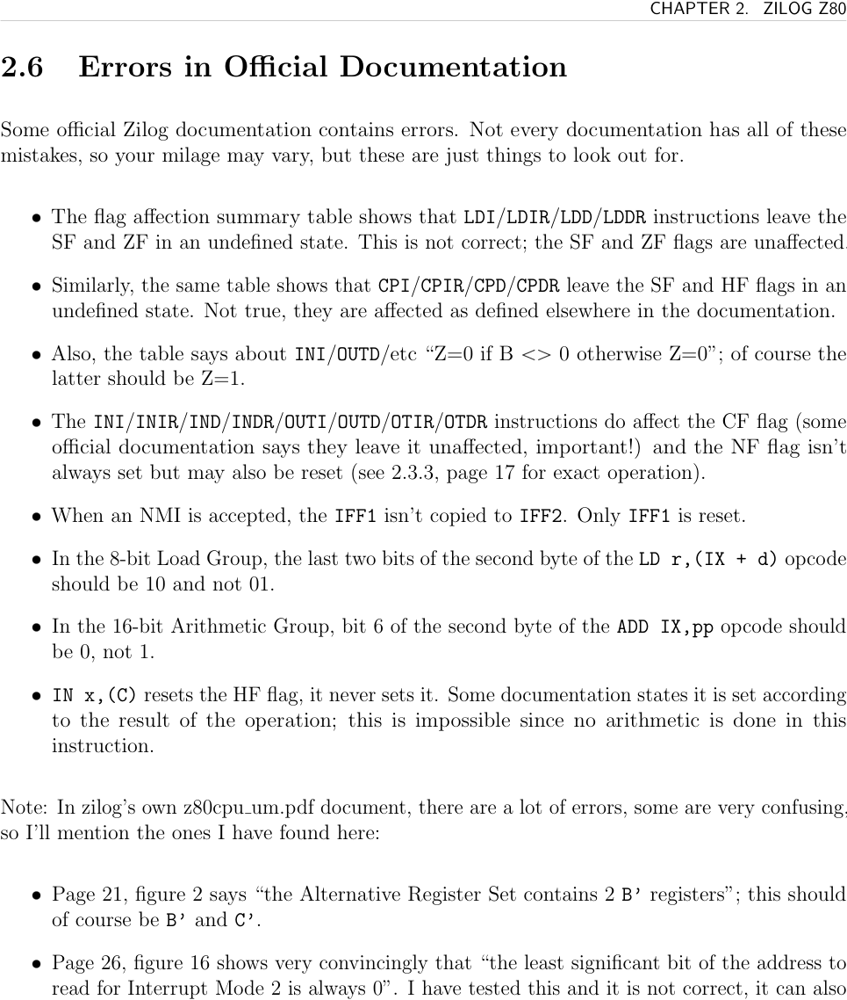

## 2.6 Errors in Official Documentation

Some official Zilog documentation contains errors. Not every documentation has all of these mistakes, so your milage may vary, but these are just things to look out for.

ˆ The flag affection summary table shows that LDI/LDIR/LDD/LDDR instructions leave the SF and ZF in an undefined state. This is not correct; the SF and ZF flags are unaffected.

ˆ Similarly, the same table shows that CPI/CPIR/CPD/CPDR leave the SF and HF flags in an undefined state. Not true, they are affected as defined elsewhere in the documentation.

ˆ Also, the table says about INI/OUTD/etc “Z=0 if B ¡ 0 otherwise Z=0”; of course the latter should be Z=1.

ˆ The INI/INIR/IND/INDR/OUTI/OUTD/OTIR/OTDR instructions do affect the CF flag (some official documentation says they leave it unaffected, important!) and the NF flag isn’t always set but may also be reset (see 2.3.3, page 17 for exact operation).

ˆ When an NMI is accepted, the IFF1 isn’t copied to IFF2. Only IFF1 is reset.

ˆ In the 8-bit Load Group, the last two bits of the second byte of the LD r,(IX + d) opcode should be 10 and not 01.

ˆ In the 16-bit Arithmetic Group, bit 6 of the second byte of the ADD IX,pp opcode should be 0, not 1.

ˆ IN x,(C) resets the HF flag, it never sets it. Some documentation states it is set according to the result of the operation; this is impossible since no arithmetic is done in this instruction.

Note: In zilog’s own z80cpu um.pdf document, there are a lot of errors, some are very confusing, so I’ll mention the ones I have found here:

ˆ Page 21, figure 2 says “the Alternative Register Set contains 2 B’ registers”; this should of course be B’ and C’.

ˆ Page 26, figure 16 shows very convincingly that “the least significant bit of the address to read for Interrupt Mode 2 is always 0”. I have tested this and it is not correct, it can also be 1, in my test case the bus contained $FF and the address that was read did not end in $FE but was $FF.

Chapter 3

ZX Spectrum Next

## 3.1 Ports and Registers . . . . . . . . . . . . . . . . . . . . . . . . . . . . . . . . . . 27

## 3.2 Memory Map and Paging . . . . . . . . . . . . . . . . . . . . . . . . . . . . . . . 35

## 3.3 DMA . . . . . . . . . . . . . . . . . . . . . . . . . . . . . . . . . . . . . . . . . . 43

## 3.4 Palette . . . . . . . . . . . . . . . . . . . . . . . . . . . . . . . . . . . . . . . . . 61

## 3.5 ULA Layer . . . . . . . . . . . . . . . . . . . . . . . . . . . . . . . . . . . . . . 67

## 3.6 Layer 2 . . . . . . . . . . . . . . . . . . . . . . . . . . . . . . . . . . . . . . . . . 73

## 3.7 Tilemap . . . . . . . . . . . . . . . . . . . . . . . . . . . . . . . . . . . . . . . . 85

## 3.8 Sprites . . . . . . . . . . . . . . . . . . . . . . . . . . . . . . . . . . . . . . . . . 93

## 3.9 Copper . . . . . . . . . . . . . . . . . . . . . . . . . . . . . . . . . . . . . . . . . 105

## 3.10 Sound . . . . . . . . . . . . . . . . . . . . . . . . . . . . . . . . . . . . . . . . . 111

## 3.11 Keyboard . . . . . . . . . . . . . . . . . . . . . . . . . . . . . . . . . . . . . . . 117

## 3.12 Interrupts on Next . . . . . . . . . . . . . . . . . . . . . . . . . . . . . . . . . . 119

With increased CPU speeds, more memory, better graphics, hardware sprites and tiles, to mention just some of the most obvious, ZX Spectrum Next is an exciting platform for the retro programmer.

This chapter represents the bulk of the book. Each topic is discussed in its own section. While the sections are laid out in order - later sections sometimes rely on, or refer to the topics discussed earlier, there’s no need to go through them in an orderly fashion. Each section should be quite usable by itself as well. All topics discussed elsewhere are referenced, so you can quickly jump there if needed. If using PDF you can click on the section number to go straight to it. With a printed book though, turning the pages gives you a chance to land on something unrelated, but equally interesting, thus learning something new almost by accident.

One more thing worth mentioning, before leaving you on to explore, are ports and Next registers. You will find the full list in the next section. But that’s just a list with a couple of examples on how to read and write them. Still, many ports and registers are described in detail at the end of the sections in which they are first mentioned. Those registers that are relevant for multiple topics are described in the first section they are mentioned in, and then referenced from other sections. Additionally, each port and register that’s described in detail, has the reference to that section in the list on the following pages as a convenience. I thought for a while about how to approach this. One way would be to describe the ports and references in a single section, together with their list, and then only reference them elsewhere. But ultimately decided on the format described above for two reasons: descriptions are not comprehensive, only relevant ports and registers have this “honour”. And secondly, I wanted to keep all relevant material as close together as possible.

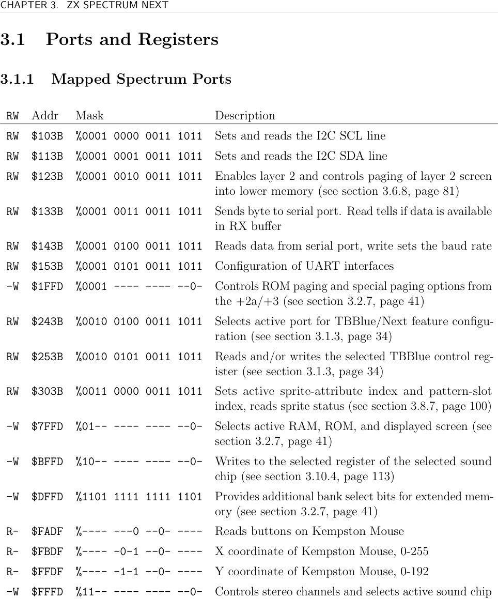

## 3.1 Ports and Registers

### 3.1.1 Mapped Spectrum Ports

Addr Mask Description

$103B Sets and reads the I2C SCL line

$113B Sets and reads the I2C SDA line

$123B Enables layer 2 and controls paging of layer 2 screen into lower memory (see section 3.6.8, page 81)

$133B Sends byte to serial port. Read tells if data is available in RX buffer

$143B Reads data from serial port, write sets the baud rate

$153B Configuration of UART interfaces

$1FFD Controls ROM paging and special paging options from the +2a/+3 (see section 3.2.7, page 41)

$243B Selects active port for TBBlue/Next feature configuration (see section 3.1.3, page 34)

$253B Reads and/or writes the selected TBBlue control register (see section 3.1.3, page 34)

$303B Sets active sprite-attribute index and pattern-slot index, reads sprite status (see section 3.8.7, page 100)

$7FFD Selects active RAM, ROM, and displayed screen (see section 3.2.7, page 41)

$BFFD Writes to the selected register of the selected sound chip (see section 3.10.4, page 113)

$DFFD Provides additional bank select bits for extended memory (see section 3.2.7, page 41)

$FADF Reads buttons on Kempston Mouse

$FBDF X coordinate of Kempston Mouse, 0-255

$FFDF Y coordinate of Kempston Mouse, 0-192

$FFFD Controls stereo channels and selects active sound chip and sound chip channel (see section 3.10.4, page 113)


Addr Mask Description

$xx0B Controls Z8410 DMA chip via MB02 standard (see section 3.3.12, page 60)

$xx1F Reads movement of joysticks using Kempston interface

$xx37 Kempston interface second joystick variant and controls joystick I/O

$xx57 Uploads sprite positions, visibility, colour type and effect flags (see section 3.8.7, page 100)

$xx5B Used to upload the pattern of the selected sprite (see section 3.8.7, page 100)

$xx6B Controls zxnDMA chip (see section 3.3.12, page 60)

$xxDF Output to SpecDrum DAC

$xxFE Reading with particular high bytes returns keyboard %xxxx xxxx ---- ---0 status (see section 3.11.3, page 118), write changes border colour and base Spectrum audio settings (see section 3.5.6, page 71)

$xxFF Controls Timex Sinclair video modes and colours in hi-res mode. Readable when bit 2 of Peripheral 3 $08 (page 115) is set


### 3.1.2 Next/TBBlue Feature Control Registers

Specific features of the Next are controlled via these register numbers, accessed through ports TBBlue Register Select $243B and TBBlue Register Access $253B (see page 34 for details). All registers can also be written to directly with the NEXTREG instruction.

Port Description $0 Identifies TBBlue board type. Should always be 10 on Next $1 Identifies core (FPGA image) version $2 Identifies type of last reset. Can be written to force reset $3 Identifies timing and machine type $4 In config mode, allows RAM to be mapped to ROM area $5 Sets joystick mode, video frequency and Scandoubler $6 Enables CPU Speed key, DivMMC, Multiface, Mouse and AY audio (see section 3.10.4, page 115) $7 Sets CPU Speed, reads actual speed $8 ABC/ACB Stereo, Internal Speaker, SpecDrum, Timex Video Modes, Turbo Sound Next, RAM contention and (un)lock 128k paging (see section 3.10.4, page $9 Sets scanlines, AY mono output, sprite-id lockstep, resets DivMMC mapram and disables HDMI audio (see section 3.8.7, page 101) $0A Mouse buttons and DPI config $0E Identifies core (FPGA image) version (sub minor number) $10 Used within the Anti-brick system $11 Sets video output timing variant (see section 3.3.12, page 60) $12 Sets the bank number where Layer 2 video memory begins (see section 3.6.8, page $13 Sets the bank number where the Layer 2 shadow screen begins $14 Sets the transparent colour for Layer 2, ULA and LoRes pixel data $15 Enables/disables sprites and Lores Layer, and chooses priority of sprites and Layer 2 (see section 3.7.6, page 89) $16 Sets X pixel offset used for drawing Layer 2 graphics on the screen (see section 3.6.8, page 82) $17 Sets Y offset used when drawing Layer 2 graphics on the screen (see section 3.6.8, page 83) $18 Sets and reads clip-window for Layer 2 (see section 3.6.8, page 83) $19 Sets and reads clip-window for Sprites (see section 3.8.7, page 101) $1A Sets and reads clip-window for ULA/LoRes layer $1B Sets and reads clip-window for Tilemap (see section 3.7.6, page 89) $1C Controls (resets) the clip-window registers indices (see section 3.6.8, page 83) $1E Holds the MSB of the raster line currently being drawn $1F Holds the eight LSBs of the raster line currently being drawn


Port Description $22 Controls the timing of raster interrupts and the ULA frame interrupt (see section 3.12.4, page 125) $23 Holds the eight LSBs of the line on which a raster interrupt should occur (see section 3.12.4, page 125) $26 Pixel X offset (0-255) to use when drawing ULA Layer $27 Pixel Y offset (0-191) to use when drawing ULA Layer $28 PS/2 Keymap address MSB, read (pending) first byte of palette colour $29 PS/2 Keymap address LSB $2A High data to PS/2 Keymap (MSB of data in bit 0) $2B Low eight LSBs of PS/2 Keymap data $2C DAC B mirror, read current I2S left MSB $2D SpecDrum port 0xDF / DAC A+D mirror, read current I2S LSB $2E DAC C mirror, read current I2S right MSB $2F Sets the pixel offset (two high bits) used for drawing Tilemap graphics on the screen (see section 3.7.6, page 90) $30 Sets the pixel offset (eight low bits) used for drawing Tilemap graphics on the screen (see section 3.7.6, page 90) $31 Sets the pixel offset used for drawing Tilemap graphics on the screen (see section 3.7.6, page 90) $32 Pixel X offset (0-255) to use when drawing LoRes Layer $33 Pixel Y offset (0-191) to use when drawing LoRes Layer $34 Selects sprite index 0-127 to be affected by writes to other Sprite ports (and mirrors) (see section 3.8.7, page 101) $35 Writes directly into byte 1 of port $xx57 (see section 3.8.7, page 102) $36 Writes directly into byte 2 of port $xx57 (see section 3.8.7, page 102) $37 Writes directly into byte 3 of port $xx57 (see section 3.8.7, page 102) $38 Writes directly into byte 4 of port $xx57 (see section 3.8.7, page 102) $39 Writes directly into byte 5 of port $xx57 (see section 3.8.7, page 103) $40 Chooses a palette element (index) to manipulate with (see section 3.4.5, page 63) $41 Use to set/read 8-bit colours of the ULANext palette (see section 3.4.5, page 64) $42 Specifies mask to extract ink colour from attribute cell value in ULANext mode $43 Enables or disables Enhanced ULA interpretation of attribute values and toggles active palette (see section 3.4.5, page 65) $44 Sets 9-bit (2-byte) colours of the Enhanced ULA palette, or to read second byte of colour (see section 3.4.5, page 65)


Port Description $4A 8-bit colour to be used when all layers contain transparent pixel (see section 3.4.5, page 66) $4B Index of transparent colour in sprite palette (see section 3.8.7, page 104) $4C Index of transparent colour in Tilemap palette (see section 3.7.6, page 90) $50 Selects the 8k-bank stored in 8k-slot 0 (see section 3.2.7, page 42) $51 Selects the 8k-bank stored in 8k-slot 1 (see section 3.2.7, page 42) $52 Selects the 8k-bank stored in 8k-slot 2 (see section 3.2.7, page 42) $53 Selects the 8k-bank stored in 8k-slot 3 (see section 3.2.7, page 42) $54 Selects the 8k-bank stored in 8k-slot 4 (see section 3.2.7, page 42) $55 Selects the 8k-bank stored in 8k-slot 5 (see section 3.2.7, page 42) $56 Selects the 8k-bank stored in 8k-slot 6 (see section 3.2.7, page 42) $57 Selects the 8k-bank stored in 8k-slot 7 (see section 3.2.7, page 42) $60 Used to upload code to the Copper (see section 3.9.4, page 109) $61 Holds low byte of Copper control bits (see section 3.9.4, page 109) $62 Holds high byte of Copper control flags (see section 3.9.4, page 109) $63 Used to upload code to the Copper in 16-bit chunks (see section 3.9.4, page 109) $64 Offset numbering of raster lines in copper/interrupt/active register (see section 3.12.4, page 125) $68 Disable ULA, controls ULA mixing/blending, enable ULA+ (see section 3.7.6, page 91) $69 Layer2, ULA shadow, Timex $FF port (see section 3.6.8, page 84) $6A LoRes Radastan mode $6B Controls Tilemap mode (see section 3.7.6, page 91) $6C Default tile attribute for 8-bit only maps (see section 3.7.6, page 92) $6E Base address of the 40x32 or 80x32 tile map (see section 3.7.6, page 92) $6F Base address of the tiles’ graphics (see section 3.7.6, page 92) $70 Layer 2 resolution, palette offset (see section 3.6.8, page 84) $71 Sets pixel offset for drawing Layer 2 graphics on the screen (see section 3.9.4, page $75 Same as register $35 plus increments $34 (see section 3.8.7, page 104) $76 Same as register $36 plus increments $34 (see section 3.8.7, page 104) $77 Same as register $37 plus increments $34 (see section 3.8.7, page 104) $78 Same as register $38 plus increments $34 (see section 3.8.7, page 104) $79 Same as register $39 plus increments $34 (see section 3.8.7, page 104) $7F 8-bit storage for user $80 Expansion bus enable/config $81 Expansion bus controls


Port Description $82 Enabling internal ports decoding bits 0-7 register $83 Enabling internal ports decoding bits 8-15 register $84 Enabling internal ports decoding bits 16-23 register $85 Enabling internal ports decoding bits 24-31 register $86 When expansion bus is enabled: internal ports decoding mask bits 0-7 $87 When expansion bus is enabled: internal ports decoding mask bits 8-15 $88 When expansion bus is enabled: internal ports decoding mask bits 16-23 $89 When expansion bus is enabled: internal ports decoding mask bits 24-31 $8A Monitoring internal I/O or adding external keyboard $8C Enable alternate ROM or lock 48k ROM $8E Control classic Spectrum memory mapping $90-93 Enables GPIO pins output $98-9B GPIO pins mapped to Next Register $A0 Enable Pi peripherals: UART, Pi hats, I2C, SPI $A2 Pi I2S controls $A3 Pi I2S clock divide in master mode $A8 ESP WiFi GPIO output $A9 ESP WiFi GPIO read/write $B0 Read Next keyboard compound keys separately (see section 3.11.3, page 118) $B1 Read Next keyboard compound keys separately (see section 3.11.3, page 118) $B2 DivMMC trap configuration $B4 DivMMC trap configuration $C0 Interrupt Control (see section 3.12.4, page 126) $C2 NMI Return Address LSB (see section 3.12.4, page 126) $C3 NMI Return Address MSB (see section 3.12.4, page 126) $C4 Interrupt Enable 0 (see section 3.12.4, page 126) $C5 Interrupt Enable 1 (see section 3.12.4, page 126) $C6 Interrupt Enable 2 (see section 3.12.4, page 127) $C8 Interrupt Status 0 (see section 3.12.4, page 127) $C9 Interrupt Status 1 (see section 3.12.4, page 127) $CA Interrupt Status 2 (see section 3.12.4, page 128) $CC DMA Interrupt Enable 0 (see section 3.12.4, page 128) $CD DMA Interrupt Enable 1 (see section 3.12.4, page 128) $CE DMA Interrupt Enable 2 (see section 3.12.4, page 129) $FF Turns debug LEDs on and off on TBBlue implementations that have them

CHAPTER 3. ZX SPECTRUM NEXT

### 3.1.3 Accessing Registers

Writing to Spectrum Ports

When writing to one of the lower 256 ports, OUT (n),A instruction is used. For example to write the value of 43 to peripheral device mapped to port $15:

```
LD A, 43
; we want to write 43
OUT ($15), A
; writes value of A to port $15
```

LD A, 43 ; we want to write 43 1

OUT ($15), A ; writes value of A to port $15 2

To write using full 16-bit address, OUT (C),r instruction is used instead. Example of writing a byte to serial port using UART TX $133B:

```
LD A, 42
; we want to write 42
LD BC, $133B
; we want to write to port $133B
OUT (C), A
```

LD A, 42 ; we want to write 42 1

LD BC, $133B ; we want to write to port $133B 2

OUT (C), A 3

The difference between the two speed-wise is tangible: first example requires only 18 t-states (7+11) while second 29 (7+10+12).

Reading from Spectrum Ports

Reading also uses the same approach as on original Spectrums - for the lower 256 ports IN A,(n) is used. For example reading a byte from port $15:

```
LD A, 0
; perhaps not strictly required, but good idea
IN A, ($15)
; read byte from port $15 to A
```

LD A, 0 ; perhaps not strictly required, but good idea 1

IN A, ($15) ; read byte from port $15 to A 2

Note how the accumulator A is cleared before accessing the port. With IN A,(n), the 16-bit address is composed from A forming high byte and n low byte.

Let’s see how we can use this for reading from 16-bit ports - we have two options: we can either use IN A,(n) or IN r,(C). Example of both, reading a byte from serial port:

```
LD BC, $143B ; read $143B port
IN A, (C)
; read byte to A
```

```
LD A, $14
; high byte
IN A, ($3B)
; read byte to A
```

LD BC, $143B ; read $143B port 1

LD A, $14 ; high byte 1

IN A, ($3B) ; read byte to A 2

IN A, (C) ; read byte to A 2

Both have the same result. The difference speed-wise is 22 t-states (10+12) vs 18 (7+11). Not by a lot, but it may add up if used frequently. However, the intent of the first code is clearer as the port address is provided in full instead of being split between two instructions.

This example nicely demonstrates a common dilemma when programming: frequently we can have readable but not as optimal code, or vice versa. But I also thought this was worth pointing out to avoid possible confusion in case you will encounter different ways in someone else’s code.

CHAPTER 3. ZX SPECTRUM NEXT

Writing to Next registers

Writing values to Next/TBBlue registers occurs through TBBlue Register Select $243B and TBBlue Register Access $253B ports. It’s composed from 2 steps: first we select the register via write to port $243B, then write the value through port $253B. For example writing value of 5 to Next register $16:

```
LD A, $16
; register $16
LD BC, $243B ; port $243B
OUT (C), A
LD A, 5
; write 5
LD BC, $253B ; to port $254B
OUT (C), A
```

```
LD A, $16
; register $16
LD BC, $243B ; port $243B
OUT (C), A
LD A, 5
; write 5
INC B
; to port $253B
OUT (C), A
```

LD A, $16 ; register $16 1

LD A, $16 ; register $16 1

LD BC, $243B ; port $243B 2

LD BC, $243B ; port $243B 2

OUT (C), A 3

OUT (C), A 3

4

4

LD A, 5 ; write 5 5

LD A, 5 ; write 5 5

LD BC, $253B ; to port $254B 6

; to port $253B INC B 6

OUT (C), A 7

OUT (C), A 7

Quite involving, isn’t it? Speed-wise, first example requires 58 t-states ((7+10+12) 2) and second 6 t-states less: 52 ((7+10+12)+(7+4+12)).

The second code relies on the fact that the only difference between two port addresses is the high byte ($24 vs $25). So given we already assigned $243B to BC, we can simply increment B to get $253B. Again, the intent of the first example is clearer. And again, I thought it was worth pointing out in case you will encounter both approaches and wonder...

However, we can do better. Much better, in fact, using Next NEXTREG instruction, which allows direct writes to given Next registers. So above examples could simply be changed to either:

```
LD A, 5
; write 5
NEXTREG $16, A ; to reg $16
```

NEXTREG $16, 5 ; write 5 to reg $16 1

LD A, 5 ; write 5 1

NEXTREG $16, A ; to reg $16 2

The first example requires 24 t-states (7+17) while the second 20. So less than half compared to using ports. In fact, using NEXTREG is the preferred method of writing to Next registers!

Reading from Next Registers

Reading values from Next/TBBlue registers also occurs through $243B and $253B ports. Similar to write, read is also composed from 2 steps: first select the register with port $243B, then read the value from port $253B. For example reading a byte from Next register $B0:

```
LD A, $16
; register $16
LD BC, $243B ; port $243B
OUT (C), A
; set port
LD BC, $253B ; port $253B
IN A, (C)
; read to A
```

```
LD A, $16
; register $16
LD BC, $243B ; port $243B
OUT (C), A
; set port
INC B
; port $253B
IN A, (C)
; read to A
```

LD A, $16 ; register $16 1

LD A, $16 ; register $16 1

LD BC, $243B ; port $243B 2

LD BC, $243B ; port $243B 2

OUT (C), A ; set port 3

OUT (C), A ; set port 3

4

4

LD BC, $253B ; port $253B 5

; port $253B INC B 5

IN A, (C) ; read to A 6

IN A, (C) ; read to A 6

The difference is small: 51 t-states ((7+10+12)+(10+12)) vs 45 ((7+10+12)+(4+12)).

Unfortunately, we don’t have faster means of reading Next registers directly as we do for writing; there is no NEXTREG alternative for reads.

## 3.2 Memory Map and Paging

ZX Spectrum Next comes with 1024K (expanded version with 2048K) of memory. But it can’t see it all at once.

### 3.2.1 Banks and Slots

Due to its 16-bit address bus, Next can only address 216 = 65.536 bytes or 64K of memory at a time. To get access to all available memory, it’s divided into smaller chunks called “banks”1.

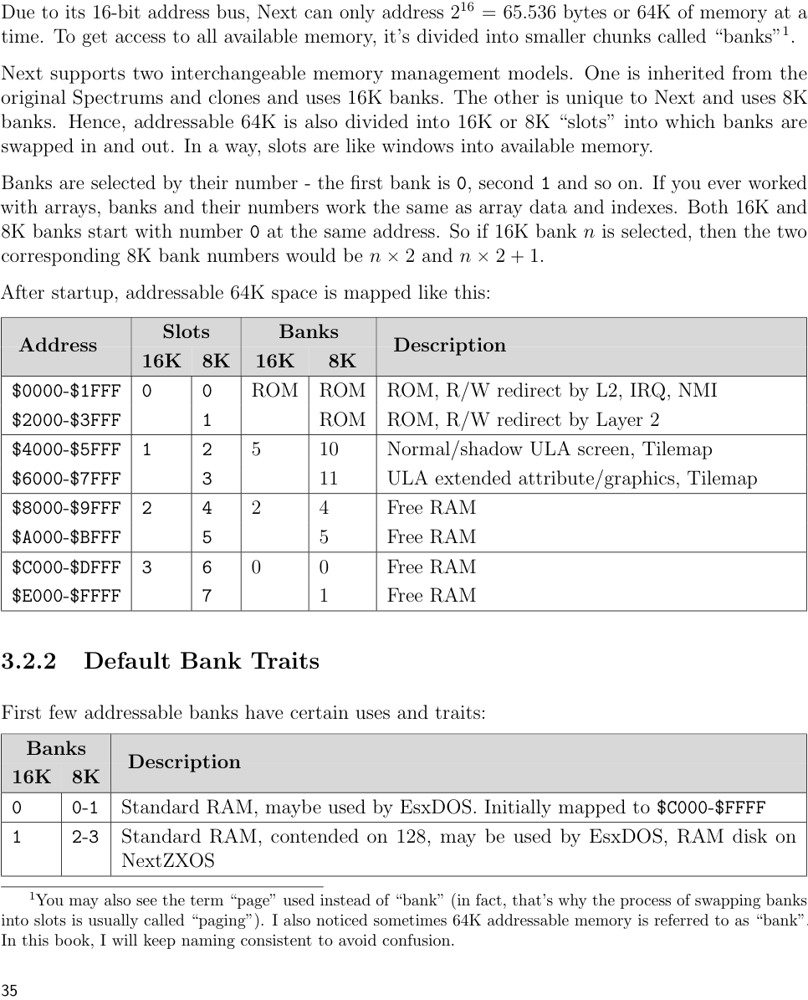

Next supports two interchangeable memory management models. One is inherited from the original Spectrums and clones and uses 16K banks. The other is unique to Next and uses 8K banks. Hence, addressable 64K is also divided into 16K or 8K “slots” into which banks are swapped in and out. In a way, slots are like windows into available memory.

Banks are selected by their number - the first bank is 0, second 1 and so on. If you ever worked with arrays, banks and their numbers work the same as array data and indexes. Both 16K and 8K banks start with number 0 at the same address. So if 16K bank n is selected, then the two corresponding 8K bank numbers would be n 2 and n 2 1.

After startup, addressable 64K space is mapped like this:

### 3.2.2 Default Bank Traits

First few addressable banks have certain uses and traits:

1You may also see the term “page” used instead of “bank” (in fact, that’s why the process of swapping banks into slots is usually called “paging”). I also noticed sometimes 64K addressable memory is referred to as “bank”. In this book, I will keep naming consistent to avoid confusion.

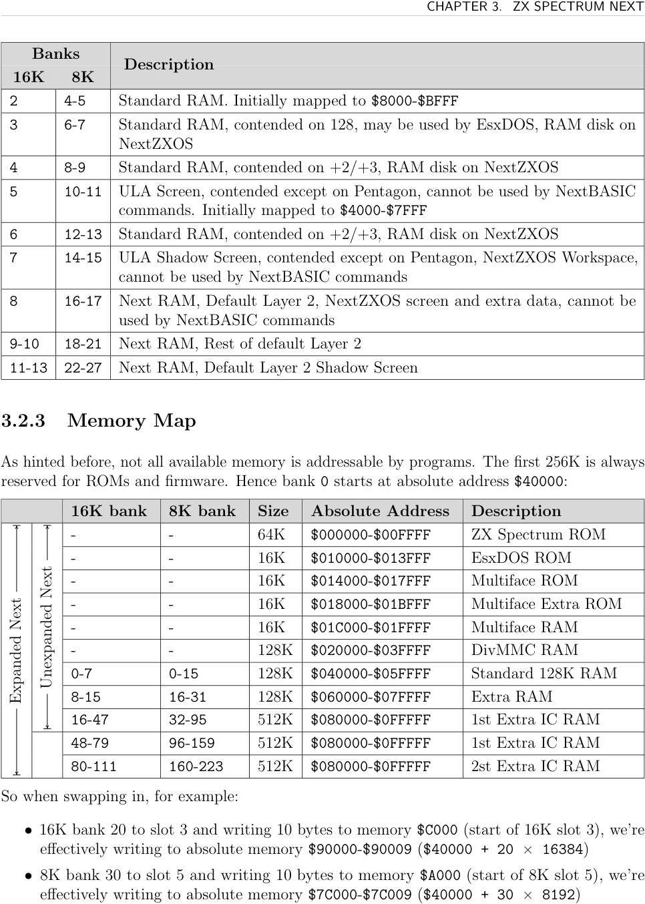

### 3.2.3 Memory Map

As hinted before, not all available memory is addressable by programs. The first 256K is always reserved for ROMs and firmware. Hence bank 0 starts at absolute address $40000:

So when swapping in, for example:

ˆ 16K bank 20 to slot 3 and writing 10 bytes to memory $C000 (start of 16K slot 3), we’re effectively writing to absolute memory $90000-$90009 ($40000 + 20 16384)

ˆ 8K bank 30 to slot 5 and writing 10 bytes to memory $A000 (start of 8K slot 5), we’re effectively writing to absolute memory $7C000-$7C009 ($40000 + 30 8192)

### 3.2.4 Legacy Paging Modes

As mentioned, Next inherits the memory management models from the Spectrum 128K/+2/+3 models and Pentagon clones. It’s unlikely you will use these modes for Next programs, as Next own model is much simpler to use. They are still briefly described here though in case you will encounter them in older programs. All legacy models use 16K slots and banks.

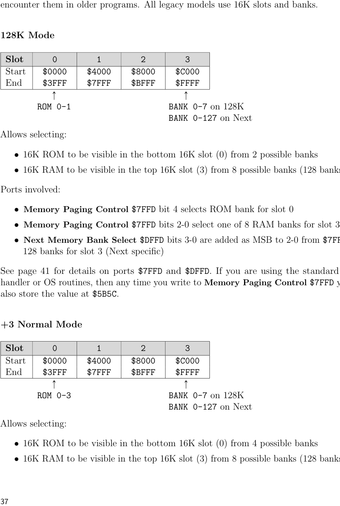

128K Mode

BANK 0-7 on 128K BANK 0-127 on Next

Allows selecting:

ˆ 16K ROM to be visible in the bottom 16K slot (0) from 2 possible banks

ˆ 16K RAM to be visible in the top 16K slot (3) from 8 possible banks (128 banks on Next)

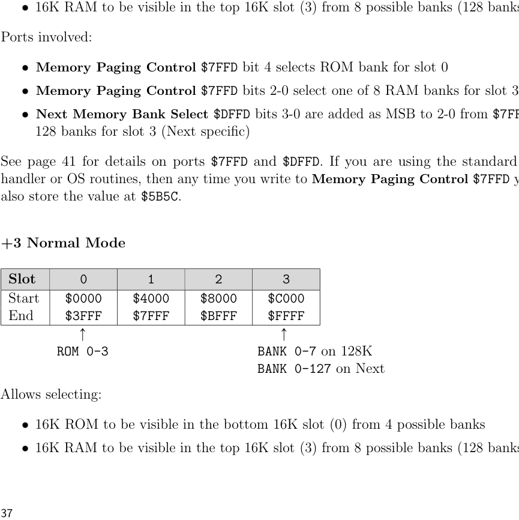

Ports involved:

ˆ Memory Paging Control $7FFD bit 4 selects ROM bank for slot 0

ˆ Memory Paging Control $7FFD bits 2-0 select one of 8 RAM banks for slot 3

ˆ Next Memory Bank Select $DFFD bits 3-0 are added as MSB to 2-0 from $7FFD to form 128 banks for slot 3 (Next specific)

See page 41 for details on ports $7FFD and $DFFD. If you are using the standard interrupt handler or OS routines, then any time you write to Memory Paging Control $7FFD you should also store the value at $5B5C.

+3 Normal Mode

BANK 0-7 on 128K BANK 0-127 on Next

Allows selecting:

ˆ 16K ROM to be visible in the bottom 16K slot (0) from 4 possible banks

ˆ 16K RAM to be visible in the top 16K slot (3) from 8 possible banks (128 banks on Next)

Ports involved:

ˆ +3 Memory Paging Control $1FFD bit 2 as LSB selects ROM bank for slot 0

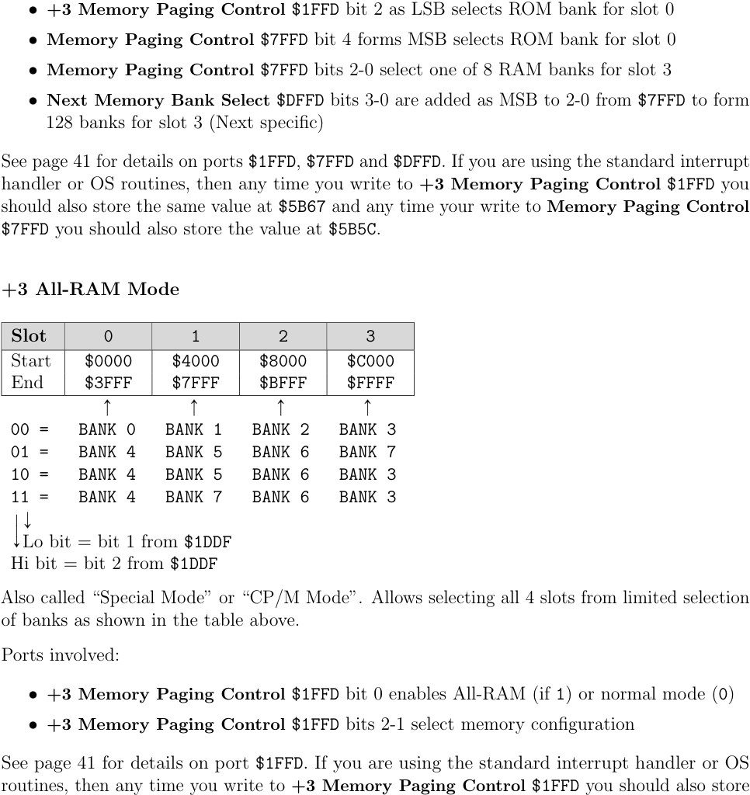

ˆ Memory Paging Control $7FFD bit 4 forms MSB selects ROM bank for slot 0

ˆ Memory Paging Control $7FFD bits 2-0 select one of 8 RAM banks for slot 3

ˆ Next Memory Bank Select $DFFD bits 3-0 are added as MSB to 2-0 from $7FFD to form 128 banks for slot 3 (Next specific)

See page 41 for details on ports $1FFD, $7FFD and $DFFD. If you are using the standard interrupt handler or OS routines, then any time you write to +3 Memory Paging Control $1FFD you should also store the same value at $5B67 and any time your write to Memory Paging Control $7FFD you should also store the value at $5B5C.

+3 All-RAM Mode

00 = 01 = 10 = 11 = ŸŸžÓ Lo bit = bit 1 from $1DDF Hi bit = bit 2 from $1DDF

Also called “Special Mode” or “CP/M Mode”. Allows selecting all 4 slots from limited selection of banks as shown in the table above.

Ports involved:

ˆ +3 Memory Paging Control $1FFD bit 0 enables All-RAM (if 1) or normal mode (0)

ˆ +3 Memory Paging Control $1FFD bits 2-1 select memory configuration

See page 41 for details on port $1FFD. If you are using the standard interrupt handler or OS routines, then any time you write to +3 Memory Paging Control $1FFD you should also store the same value at $5B67.

Pentagon 512K/1024K Mode

Next also supports paging implementation from Pentagon spectrums. It’s unlikely you will ever use it on Next, so just mentioning for completness sake. You can find more information on Next Dev Wiki2 or internet if interested.

2https://wiki.specnext.dev/Next_Memory_Bank_Select

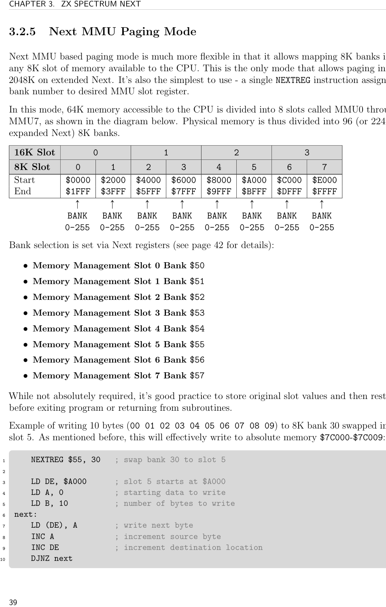

### 3.2.5 Next MMU Paging Mode

Next MMU based paging mode is much more flexible in that it allows mapping 8K banks into any 8K slot of memory available to the CPU. This is the only mode that allows paging in all 2048K on extended Next. It’s also the simplest to use - a single NEXTREG instruction assigning bank number to desired MMU slot register.

In this mode, 64K memory accessible to the CPU is divided into 8 slots called MMU0 through MMU7, as shown in the diagram below. Physical memory is thus divided into 96 (or 224 on expanded Next) 8K banks.

Bank selection is set via Next registers (see page 42 for details):

ˆ Memory Management Slot 0 Bank $50

ˆ Memory Management Slot 1 Bank $51

ˆ Memory Management Slot 2 Bank $52

ˆ Memory Management Slot 3 Bank $53

ˆ Memory Management Slot 4 Bank $54

ˆ Memory Management Slot 5 Bank $55

ˆ Memory Management Slot 6 Bank $56

ˆ Memory Management Slot 7 Bank $57

While not absolutely required, it’s good practice to store original slot values and then restore before exiting program or returning from subroutines.

Example of writing 10 bytes (00 01 02 03 04 05 06 07 08 09) to 8K bank 30 swapped in to slot 5. As mentioned before, this will effectively write to absolute memory $7C000-$7C009:

```
NEXTREG $55, 30
; swap bank 30 to slot 5
LD DE, $A000
; slot 5 starts at $A000
LD A, 0
; starting data to write
LD B, 10
; number of bytes to write
next:
LD (DE), A
; write next byte
INC A
; increment source byte
INC DE
; increment destination location
DJNZ next
```

NEXTREG $55, 30 ; swap bank 30 to slot 5

LD DE, $A000 ; slot 5 starts at $A000

LD A, 0 ; starting data to write

LD B, 10 ; number of bytes to write

next:

LD (DE), A ; write next byte

; increment source byte

; increment destination location

DJNZ next

CHAPTER 3. ZX SPECTRUM NEXT

Note: registers Memory Management Slot 0 Bank $50 and Memory Management Slot 1 Bank $51 (page 42) have extra “functionality”: ROM can be automatically paged in if otherwise nonexistent 8K page $FF is set. Low or high 8K ROM bank is automatically determined based on which 8K slot is used. This may be useful if temporarily paging RAM into the bottom 16K region and then wanting to restore back to ROM.

### 3.2.6 Interaction Between Paging Modes

As mentioned, legacy and Next paging modes are interchangeable. Changing banks in one will be reflected in the other. The most recent change always has priority. Again, keep in mind that legacy modes use 16K banks, therefore single bank change will affect 2 8K banks.

Paging Out ROM

ROM is usually mapped to the bottom 16K slot, addresses $0000-$3FFF. This area can only be remapped using +3 All-RAM or Next MMU-based mode. Beware though that some programs may expect to find ROM routines at fixed addresses between $0000 and $3FFF. And if default interrupt mode (IM 1) is set, Z80 will expect to find interrupt handler at the address $0038.

ULA

ULA always reads content from 16K bank 5. This is mapped to 16K slot 1 by default, addresses $4000-$7FFF. ULA will always use bank 5, regardless of which bank is mapped to slot 1, or which slot bank 5 is mapped to (or if it is mapped into any slot at all).

You can redirect ULA to read from 16K bank 7 instead (the “shadow screen”, used for doublebuffering), using bit 3 of Memory Paging Control $7FFD (page 41). However, you still need to map bank 7 into one of the slots if you want to read or write to it (that’s 8K banks 14 and 15 if using MMU for paging). Read more in ULA chapter, section 3.5, page 67.

Layer 2 Paging

Layer 2 uses specific ports and registers that are can be used to change memory mapping. For example, the bottom 16K slot can be set for write and read access. Layer 2 also supports a double-buffering scheme of its own. Though any other mapping mode discussed here can be used as well. See Layer 2 chapter, section 3.6, page 73 for more details.

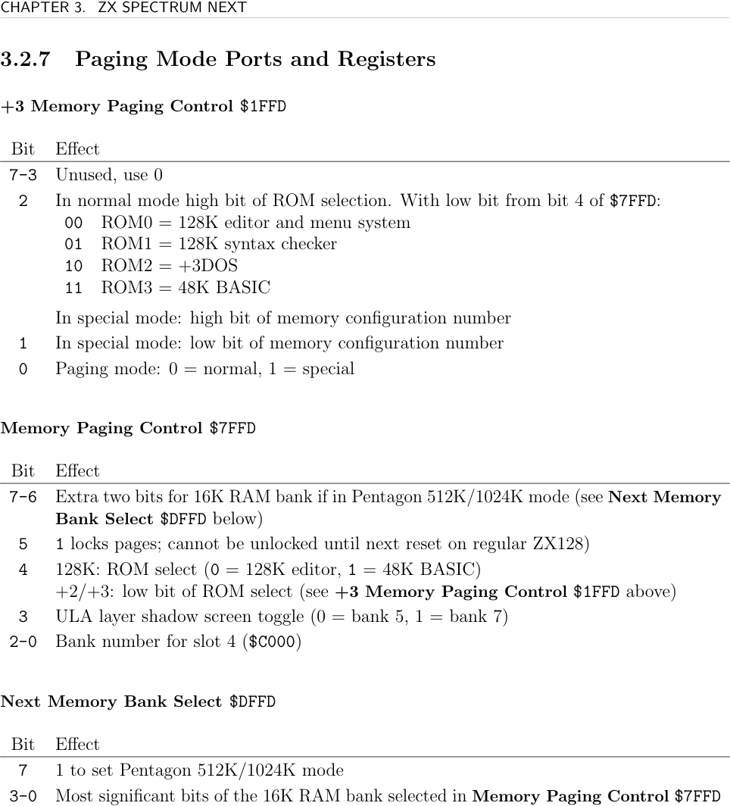

### 3.2.7 Paging Mode Ports and Registers

+3 Memory Paging Control $1FFD

Bit Effect Unused, use 0 In normal mode high bit of ROM selection. With low bit from bit 4 of $7FFD: ROM0 = 128K editor and menu system ROM1 = 128K syntax checker ROM2 = +3DOS ROM3 = 48K BASIC

In special mode: high bit of memory configuration number In special mode: low bit of memory configuration number Paging mode: 0 = normal, 1 = special

Memory Paging Control $7FFD

Bit Effect Extra two bits for 16K RAM bank if in Pentagon 512K/1024K mode (see Next Memory Bank Select $DFFD below) 1 locks pages; cannot be unlocked until next reset on regular ZX128) 128K: ROM select (0 = 128K editor, 1 = 48K BASIC) +2/+3: low bit of ROM select (see +3 Memory Paging Control $1FFD above) ULA layer shadow screen toggle (0 = bank 5, 1 = bank 7) Bank number for slot 4 ($C000)

Next Memory Bank Select $DFFD

Bit Effect 1 to set Pentagon 512K/1024K mode Most significant bits of the 16K RAM bank selected in Memory Paging Control $7FFD

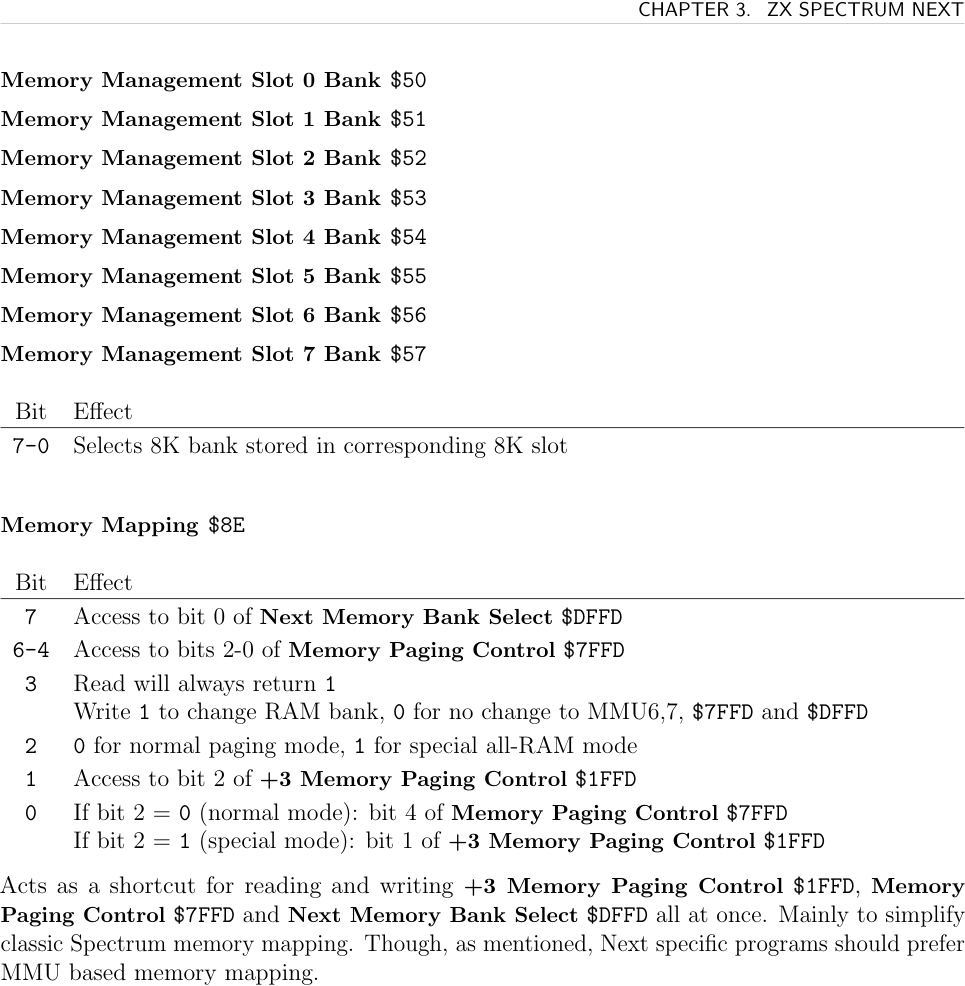

Memory Management Slot 0 Bank $50

Memory Management Slot 1 Bank $51

Memory Management Slot 2 Bank $52

Memory Management Slot 3 Bank $53

Memory Management Slot 4 Bank $54

Memory Management Slot 5 Bank $55

Memory Management Slot 6 Bank $56

Memory Management Slot 7 Bank $57

Bit Effect Selects 8K bank stored in corresponding 8K slot

Memory Mapping $8E

Bit Effect Access to bit 0 of Next Memory Bank Select $DFFD Access to bits 2-0 of Memory Paging Control $7FFD Read will always return 1 Write 1 to change RAM bank, 0 for no change to MMU6,7, $7FFD and $DFFD 0 for normal paging mode, 1 for special all-RAM mode Access to bit 2 of +3 Memory Paging Control $1FFD If bit 2 = 0 (normal mode): bit 4 of Memory Paging Control $7FFD If bit 2 = 1 (special mode): bit 1 of +3 Memory Paging Control $1FFD

Acts as a shortcut for reading and writing +3 Memory Paging Control $1FFD, Memory Paging Control $7FFD and Next Memory Bank Select $DFFD all at once. Mainly to simplify classic Spectrum memory mapping. Though, as mentioned, Next specific programs should prefer MMU based memory mapping.

CHAPTER 3. ZX SPECTRUM NEXT

## 3.3 DMA

The ZX Spectrum Next DMA (zxnDMA) is a single channel direct memory access device that implements a subset of the Z80 DMA functionality. The subset is large enough to be compatible with common uses of the similar Datagear interface available for standard ZX Spectrums but without the idiosyncracies and requirements on the order of commands.

zxnDMA defines two “ports”, called “A” and “B” (port is just a word used for referring to both, source and destination). Either one can be used as a source, the other as the destination. They can be memory location or I/O port, auto-increment, auto-decrement or stay fixed. zxnDMA can operate in continuous or burst mode and implements a special feature that can force each byte transfer to take a fixed amount of time, which can be used to deliver sampled audio.

### 3.3.1 Programming

Since core 3.1.2, zxnDMA is mapped to zxnDMA Port $xx6B and legacy Zilog DMA to MB02 DMA Port $xx0B (see page 60 for details).


Similar to Z80 DMA, zxnDMA also has 7 write registers named WR0-WR6. Some of the bits are used to identify a register, while the rest represent the payload (x in the table below):

Each register can include zero or more parameters. Most often specific bits in the payload define whether and which parameters are used. Each parameter is one byte long. Parameters are written immediately after the base register byte. If multiple parameters are used, the order is specified by the bit position within the base payload. The order is from right to left, the parameter associated with bit 0 is written first, the one from bit 7 last.

Sometimes it’s also possible that a specific configuration of parameter byte requires additional bytes to be inserted. If so, these bytes are inserted immediately after their “parent” parameter byte following the same rules as indicated above. Only after all child parameters are written, we continue with other parents’ parameters, if there are more. This forms a sort of recursive pattern.

After all parameters are written, we can start with a new register byte again. This is then repeated until zxnDMA program is started using WR3 or (preferably) WR6. The same registers can be repeated multiple times within the same DMA program.

DMA programs can be up to 256 bytes long (but the data being transferred can be up to 64K).


### 3.3.2 Registers at a Glance

Base Register Byte

Base Register Byte

Transfer Direction

Activation 0 DMA Disabled 1 DMA Enabled

Port A address (LSB) Port A address (MSB) Block length (LSB) Block length (MSB)

Base Register Byte

Base Register Byte

Port B Address (LSB) Port B Address (MSB)

Base Register Byte

0 Port A Timing

1 CE and WAIT multiplexed

Port A Variable Timing 0 0 Cycle length = 4 0 1 Cycle length = 3 1 0 Cycle length = 2 1 1 Do not use!

Stop Configuration 0 Stop on End of Block 1 Auto Restart on End of Block

Base Register Byte

Base Register Byte

Command 0 0 0 0 1 $87 Enable DMA 0 0 0 0 0 $83 Disable DMA 0 0 0 1 0 $8B Reinitialize Status Byte 0 1 0 0 1 $A7 Initialize Read Sequence 0 1 1 0 0 $B3 Force Ready 0 1 1 1 0 $BB Read Mask Follows (see below) 0 1 1 1 1 $BF Read Status Byte 1 0 0 0 0 $C3 Reset 1 0 0 0 1 $C7 Reset Port A Timing 1 0 0 1 0 $CB Reset Port B Timing 1 0 0 1 1 $CF Load 1 0 1 0 0 $D3 Continue

0 Port B Timing

0 Read Mask

Port B Variable Timing 0 0 Cycle Length = 4 0 1 Cycle Length = 3 1 0 Cycle Length = 2 1 1 Do not use!

Status Byte Counter LSB Byte Counter MSB

Prescalar (Fixed Time Transfer)

Port A Address LSB Port A Address MSB Port B Address LSB Port B Address MSB

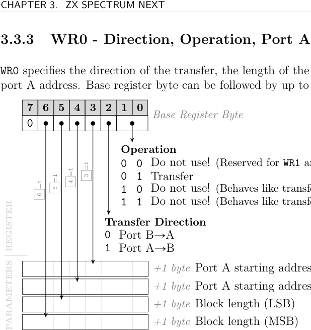

### 3.3.3 WR0 - Direction, Operation, Port A Configuration

WR0 specifies the direction of the transfer, the length of the data that will be transferred and port A address. Base register byte can be followed by up to four parameter bytes:

Base Register Byte

Operation 0 0 Do not use! (Reserved for WR1 and WR2) 0 1 Transfer 1 0 Do not use! (Behaves like transfer) 1 1 Do not use! (Behaves like transfer)

Transfer Direction

+1 byte Port A starting address (LSB)

+1 byte Port A starting address (MSB)

+1 byte Block length (LSB)

+1 byte Block length (MSB)

Base Register Byte

The combination of these two bits defines the type of operation the DMA program will use. While all four combinations are listed, zxnDMA only supports one at the moment - 01:

Bits 1-0: Operation

00 Don’t use, it conflicts with WR1 and WR2. 01 Transfer; this is the only supported operation on zxnDMA. 10 Not recommended for compatibility reasons: at the moment 10 behaves exactly like 01 (transfer) on zxnDMA, but on Z80 it’s “search” instead. So there is a possibility this will change in future cores. 11 Similar to 10; at the moment it behaves like 01 (transfer) on zxnDMA, but on Z80 it’s “search/transfer”. Again, this may change in future cores.

Provides the destination of the data transfer:

Bit 2: Transfer Direction

0 Port B is source, port A destination. 1 Port A is source, port B destination. Either port can act as source, while the other becomes the destination.

Regardless of whether port A acts as a source or destination, we have to define its source address. To do so, set both bits to 1. The address is then entered immediately after this byte. The address is interpreted either as memory or I/O port, based on the configuration from WR1.

Bits 4-3: Port A Starting Address

All DMA operations must have a length defined. Therefore this parameter is also required - set both bits to 1. The length is a 16-bit value and needs to be entered at the end of the data for WR0 register.

Bits 6-5: Transfer Length

CHAPTER 3. ZX SPECTRUM NEXT

Port A Starting Address

If bit 3 of the base register byte is set, then LSB of port A starting address is expected as the first parameter after the base. If bit 4 is set, then MSB byte is expected. If both bits are set, then LSB needs to be written first, followed by MSB. This is in fact the most common setup because port A starting address is required for each DMA operation. And since little-endian format is used, the value forming the 16-bit starting address of port A can be written directly. For example:

DW $253B ; Port A starts at $253B 1

Or, if we have a label that points to the start of the memory:

DW StartLabel ; Port A starts on memory at this label 1

Whether the address represents a memory location or I/O port is defined with WR1.

Transfer Length

Setting bit 5 of the base register byte is associated with LSB of transfer length and bit 6 with MSB. If both bits are set, which is the usual case, then LSB is written first, followed by MSB. Again, 16-bit length can be written directly in this case, as shown above with port A starting address.

Notes

Since all parameters in WR0 are important for DMA transfer, they are typically always included. The configuration would most often look something like this:

```
DB %01111101
; WR0 - append length and port A address, A->B
DW $253B
; Port A starts at $253B
DW 1500
; We will transfer 1500 bytes
```

DB %01111101 ; WR0 - append length and port A address, A->B 1

DW $253B ; Port A starts at $253B 2

DW 1500 ; We will transfer 1500 bytes 3

Usually, the address and length are provided dynamically, and frequently “self-modifying code” approach is used to fill this data on the fly. We’ll discuss this in the example section later on.

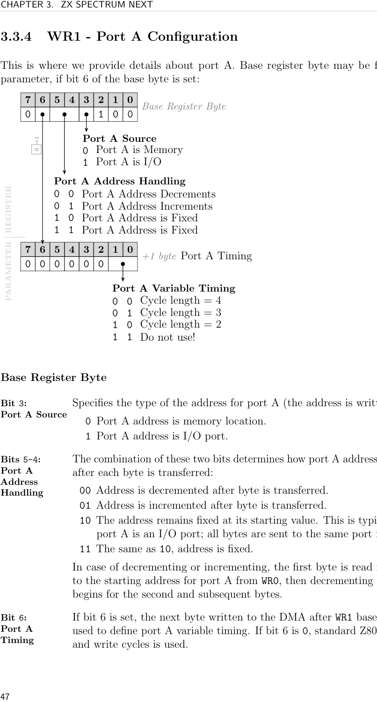

### 3.3.4 WR1 - Port A Configuration

This is where we provide details about port A. Base register byte may be followed by one parameter, if bit 6 of the base byte is set:

Base Register Byte

+1 byte Port A Timing

Port A Variable Timing 0 0 Cycle length = 4 0 1 Cycle length = 3 1 0 Cycle length = 2 1 1 Do not use!

Base Register Byte

Specifies the type of the address for port A (the address is written with WR0):

Bit 3: Port A Source

0 Port A address is memory location. 1 Port A address is I/O port.

The combination of these two bits determines how port A address will be handled after each byte is transferred:

Bits 5-4: Port A Address Handling

00 Address is decremented after byte is transferred. 01 Address is incremented after byte is transferred. 10 The address remains fixed at its starting value. This is typically used when port A is an I/O port; all bytes are sent to the same port in this case. 11 The same as 10, address is fixed.

In case of decrementing or incrementing, the first byte is read from or written to the starting address for port A from WR0, then decrementing or incrementing begins for the second and subsequent bytes.

If bit 6 is set, the next byte written to the DMA after WR1 base register byte is used to define port A variable timing. If bit 6 is 0, standard Z80 timing for read and write cycles is used.

Bit 6: Port A Timing

CHAPTER 3. ZX SPECTRUM NEXT

Port A Timing

This byte is expected if bit 6 of the base register byte is set. Only bits 1 and 0 are used, the rest must be set to 0.

Specifies variable timing configuration for port A that allows shortening the length of port A read or write cycles:

Bits 1-0: Port A Timing

00 Cycle length is 4. 01 Cycle length is 3. 10 Cycle length is 2. 11 Do not use!

The cycle lengths are intended to selectively slow down read or write cycles for hardware that can’t operate at the DMA full speed.

In contrast with Z80 DMA, zxnDMA doesn’t support half-cycle timing for control signals.

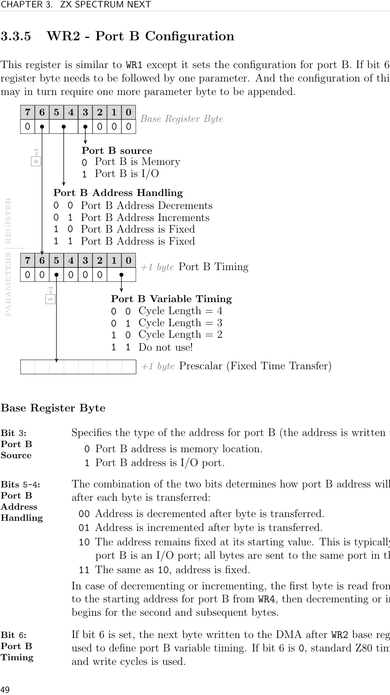

### 3.3.5 WR2 - Port B Configuration

This register is similar to WR1 except it sets the configuration for port B. If bit 6 is set, base register byte needs to be followed by one parameter. And the configuration of this parameter may in turn require one more parameter byte to be appended.

Base Register Byte

+1 byte Port B Timing

Port B Variable Timing 0 0 Cycle Length = 4 0 1 Cycle Length = 3 1 0 Cycle Length = 2 1 1 Do not use!

+1 byte Prescalar (Fixed Time Transfer)

Base Register Byte

Specifies the type of the address for port B (the address is written with WR4):

Bit 3: Port B Source

0 Port B address is memory location. 1 Port B address is I/O port.

The combination of the two bits determines how port B address will be handled after each byte is transferred:

Bits 5-4: Port B Address Handling

00 Address is decremented after byte is transferred. 01 Address is incremented after byte is transferred. 10 The address remains fixed at its starting value. This is typically used when port B is an I/O port; all bytes are sent to the same port in this case. 11 The same as 10, address is fixed. In case of decrementing or incrementing, the first byte is read from or written to the starting address for port B from WR4, then decrementing or incrementing begins for the second and subsequent bytes.

If bit 6 is set, the next byte written to the DMA after WR2 base register byte is used to define port B variable timing. If bit 6 is 0, standard Z80 timing for read and write cycles is used.

Bit 6: Port B Timing

CHAPTER 3. ZX SPECTRUM NEXT

Port B Timing

This byte is expected if bit 6 of the base register byte is set. Only bits 5, 1 and 0 are used, the rest must be set to 0.

Specifies variable timing configuration for port A that allows shortening the length of port A read or write cycles:

Bits 1-0: Port A Timing

00 Cycle length is 4. 01 Cycle length is 3. 10 Cycle length is 2. 11 Do not use!

The cycle lengths are intended to selectively slow down read or write cycles for hardware that can’t operate at the DMA full speed.

If set, then additional byte is expected with prescalar value used for fixed time transfers. See below for details.

Bit 5: Enable Prescalar

In contrast with Z80 DMA, zxnDMA doesn’t support half-cycle timing for control signals.

Prescalar - Fixed Time Transfer

This byte is expected if bit 5 of “Port B Timing” is set. This is a feature of zxnDMA not present in Z80. If non-zero value is written, a delay will be inserted after each byte is transferred. The delay is calculated so that the total amount of time for each byte, including time required for actual transfer, is determined by the prescalar value.

To calculate prescalar value, use formula: prescalar 875kHz{rate where rate is desired frequency. For example to have a constant rate of 16kHz, prescalar needs to be set to 55 (calculation gives 54.6875 which needs to be rounded). The constant 875kHz is assumed for 28MHz system clock. But exact system clock depends on video timing selected by user (HDMI, VGA). The actual value should therefore be adjusted according to exact frequency as described with Video Timing $11 (page 60).

Fixed time transfer works in continuous and burst mode (see WR4). In burst mode, DMA will give up any waiting time to the CPU so it can run while DMA is idle.

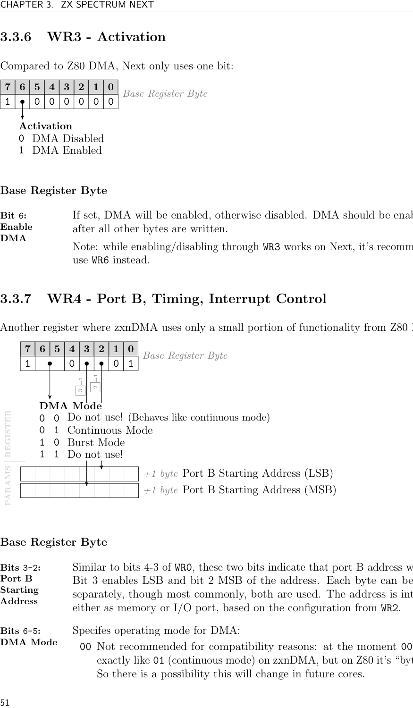

### 3.3.6 WR3 - Activation

Compared to Z80 DMA, Next only uses one bit:

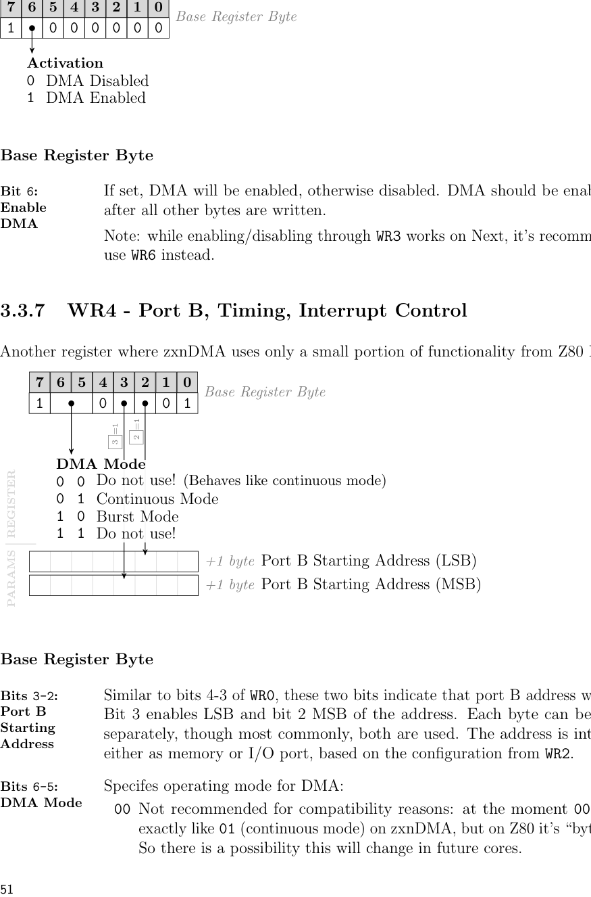

Base Register Byte

Activation 0 DMA Disabled 1 DMA Enabled

Base Register Byte

If set, DMA will be enabled, otherwise disabled. DMA should be enabled only after all other bytes are written.

Bit 6: Enable

Note: while enabling/disabling through WR3 works on Next, it’s recommended to use WR6 instead.

### 3.3.7 WR4 - Port B, Timing, Interrupt Control

Another register where zxnDMA uses only a small portion of functionality from Z80 DMA:

Base Register Byte

0 0 Do not use! (Behaves like continuous mode)

+1 byte Port B Starting Address (LSB)

+1 byte Port B Starting Address (MSB)

Base Register Byte

Similar to bits 4-3 of WR0, these two bits indicate that port B address will follow. Bit 3 enables LSB and bit 2 MSB of the address. Each byte can be enabled separately, though most commonly, both are used. The address is interpreted either as memory or I/O port, based on the configuration from WR2.

Bits 3-2: Port B Starting Address

Specifes operating mode for DMA:

Bits 6-5: DMA Mode

00 Not recommended for compatibility reasons: at the moment 00 behaves exactly like 01 (continuous mode) on zxnDMA, but on Z80 it’s “byte” mode. So there is a possibility this will change in future cores.

01 Continuous mode. When the CPU starts DMA, it will run to completion without allowing the CPU to run. The CPU will only execute the next instruction after DMA completes. 10 Burst mode. In this mode, DMA will let the CPU run if either port is not ready. With zxnDMA, this condition can only occur when operating in fixed time transfer mode, as described with WR2. 11 Do not use!

Port B Starting Address

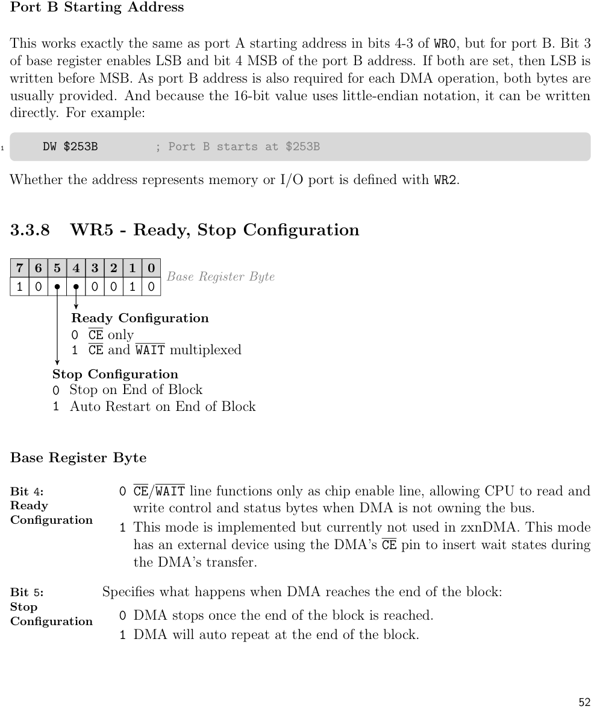

This works exactly the same as port A starting address in bits 4-3 of WR0, but for port B. Bit 3 of base register enables LSB and bit 4 MSB of the port B address. If both are set, then LSB is written before MSB. As port B address is also required for each DMA operation, both bytes are usually provided. And because the 16-bit value uses little-endian notation, it can be written directly. For example:

DW $253B ; Port B starts at $253B

Whether the address represents memory or I/O port is defined with WR2.

### 3.3.8 WR5 - Ready, Stop Configuration

Base Register Byte

Stop Configuration 0 Stop on End of Block 1 Auto Restart on End of Block

Base Register Byte

0 CE/WAIT line functions only as chip enable line, allowing CPU to read and write control and status bytes when DMA is not owning the bus. 1 This mode is implemented but currently not used in zxnDMA. This mode has an external device using the DMA’s CE pin to insert wait states during the DMA’s transfer.

Bit 4: Ready Configuration

Specifies what happens when DMA reaches the end of the block:

Bit 5: Stop Configuration

0 DMA stops once the end of the block is reached. 1 DMA will auto repeat at the end of the block.

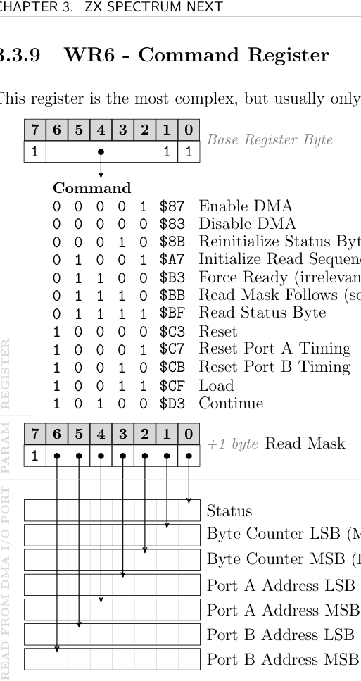

### 3.3.9 WR6 - Command Register

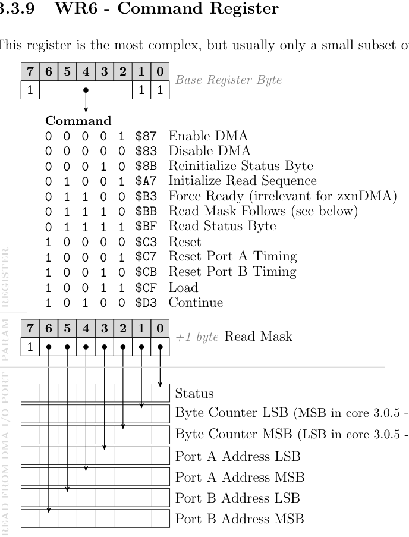

This register is the most complex, but usually only a small subset of functionality is needed:

Base Register Byte

Command 0 0 0 0 1 $87 Enable DMA 0 0 0 0 0 $83 Disable DMA 0 0 0 1 0 $8B Reinitialize Status Byte 0 1 0 0 1 $A7 Initialize Read Sequence 0 1 1 0 0 $B3 Force Ready (irrelevant for zxnDMA) 0 1 1 1 0 $BB Read Mask Follows (see below) 0 1 1 1 1 $BF Read Status Byte 1 0 0 0 0 $C3 Reset 1 0 0 0 1 $C7 Reset Port A Timing 1 0 0 1 0 $CB Reset Port B Timing 1 0 0 1 1 $CF Load 1 0 1 0 0 $D3 Continue

+1 byte Read Mask

Status Byte Counter LSB (MSB in core 3.0.5 - bug) Byte Counter MSB (LSB in core 3.0.5 - bug)

Port A Address LSB Port A Address MSB Port B Address LSB Port B Address MSB

Base Register Byte

WR6 uses a slightly different configuration than other registers. Bits 7, 1 and 0 are always set while bits 6-2 are used together to specify the command to execute. Only a subset of possbible bit combinations are implemented. Some of the most relevant ones:

This should be written as the last command of the DMA program to start Enable DMA executing.

Disable DMA It’s recommended to use this command at the start to ensure the whole program will be written before executing.

This is required for DMA to copy port A and B addresses into its internal Load pointers. Usually, this is used just before Enable DMA.

CHAPTER 3. ZX SPECTRUM NEXT

This is not one of the frequently used commands, but it’s mentioned because Read Mask it works differently: instead of indicating parameter bytes that will follow the register as part of the DMA program, it specifies which bytes will be read from the DMA port in the “future”. See below for more details.

Read Mask

This parameter provides a bit mask that defines which bytes will be read from DMA. While read mask parameter byte has to be written immediately after base register byte, as any other parameter, reading happens separately as I/O read from the DMA port.

Indicates that the status byte will be read from the DMA I/O port. Status byte has the following format: 00E1101T where:

Bit 0: Status

E is 0 if the total block length was transferred at least once, 1 otherwise. T is 0 if no byte transferred yet, 1 if at least one byte was transferred.

Indicates that the 16-bit number of bytes transferred so far will be read from the DMA I/O port. Bit 1 indicates read for LSB and bit 2 for MSB of the value (note: core 3.0.5 has a bug that reverses the bytes, so bit 1 indicates read for MSB and bit 2 for LSB).

Bits 1-2: Byte Counter

Indicates that the current internal 16-bit port A address will be read from the I/O port. Bit 3 indicates LSB and bit 4 MSB of the value will be read. Usually the address it read as the whole 16-bit value, so both bits are set.

Bits 3-4: Port A Address

Similar to bits 3-4 above; indicates that the current internal 16-bit port B address will be read from the I/O port. Bit 3 indicates LSB and bit 4 MSB of the value will be read.

Bits 5-6: Port B Address

Reading From DMA I/O Port

Registers can be read via an I/O read from the DMA port $6B after setting the read mask. Register values are the current internal DMA values. Or in other words: the values that will be used for the next transfer operation. Once the end of the read mask is reached, further reads loop around to the first one.

### 3.3.10 Examples

DMA is another subject that may sound quite complicated when attempting to explain, but is really quite straighforward in practice. As you’ll see in the following pages, most programs can use the same pattern with only slight changes. You can also find use of DMA to transfer data in various projects in companion code, for example sprites and copper.

CHAPTER 3. ZX SPECTRUM NEXT

Copy Data From Memory to Memory

Source is at memory address $C000, destination $D000, size 2048 bytes. We’ll use port A as source, B as destination.

```
CopyMemory:
LD HL, .dmaProgram
; HL = pointer to DMA program
LD B, .dmaProgramSize; B = size of the code
LD C, $6B
; C = $6B (zxnDMA port)
OTIR
; upload DMA program
RET
.dmaProgram:
DB %1’00000’11
; WR6 - disable DMA
DB %0’11’11’1’01
; WR0 - append length + port A address, A->B
DW $C000
; WR0 par 1&2 - port A start address
DW 2048
; WR0 par 3&4 - transfer length
DB %0’0’01’0’100
; WR1 - A incr., A=memory
DB %0’0’01’0’000
; WR2 - B incr., B=memory
DB %1’01’0’11’01
; WR4 - continuous, append port B addres
DW $D000
; WR4 par 1&2 - port B address
DB %10’0’0’0010
; WR5 - stop on end of block, CE only
DB %1’10011’11
; WR6 - load addresses into DMA counters
DB %1’00001’11
; WR6 - enable DMA
.dmaProgramSize = $-.dmaProgram
```

CopyMemory: 1

LD HL, .dmaProgram ; HL = pointer to DMA program 2

LD B, .dmaProgramSize; B = size of the code 3

LD C, $6B ; C = $6B (zxnDMA port) 4

OTIR ; upload DMA program 5

RET 6

7

.dmaProgram: 8

DB %1’00000’11 ; WR6 - disable DMA 9

10

DB %0’11’11’1’01 ; WR0 - append length + port A address, A->B 11

DW $C000 ; WR0 par 1&2 - port A start address 12

DW 2048 ; WR0 par 3&4 - transfer length 13

14

DB %0’0’01’0’100 ; WR1 - A incr., A=memory 15

16

DB %0’0’01’0’000 ; WR2 - B incr., B=memory 17

18

DB %1’01’0’11’01 ; WR4 - continuous, append port B addres 19

DW $D000 ; WR4 par 1&2 - port B address 20

21

DB %10’0’0’0010 ; WR5 - stop on end of block, CE only 22

23

DB %1’10011’11 ; WR6 - load addresses into DMA counters 24

DB %1’00001’11 ; WR6 - enable DMA 25

.dmaProgramSize = $-.dmaProgram 26

The code includes both, the routine that copies the program into DMA memory and the program itself.

Copy routine relies on OTIR to upload the program to DMA memory through port $xx6B. OTIR does all the heavy lifting for us - continuously copies bytes until B becomes 0. Perhaps worth noting: .dmaProgramSize is used to establish the length of the program that will be sent. This way we can safely add or remove instructions and it will continue to work (as long as the size stays within 256 bytes).

The program itself, lines 9-25, should be self-explanatory. But we’ll go through it anyway since this is how most DMA programs look like:

ˆ Line 9 uses WR6 with bits 6-2 set to %00000 which corresponds to command “Disable DMA”. It’s good practice to disable DMA before uploading the rest of the program.

ˆ Next comes WR0 register in line 11; from least to most significant:

- Bits 1-0 have the value %01, so “transfer” operation will be used. On zxnDMA this is the only allowed combination anyway.

CHAPTER 3. ZX SPECTRUM NEXT

- Bit 2 establishes the direction of transfer AÑB with value 1. – Next two bits, 4-3, are both set, which tells DMA we want to append both bytes of the port A starting address. – Similarly bits 6-5 tell DMA to expect both bytes of transfer length.

ˆ Since we enabled all 4 parameters with WR0 register, we have to append all 4 bytes immediately afterwards. In this case, it’s a 16-bit port A starting address first, followed by the 16-bit transfer length. Since little-endian format is expected (LSB first, then MSB), we can simply use a DW and write the exact address in a natural and readable way. Lines 12-13 is where the parameters are written.

Note: we could also use DB to write each byte separately. It emphasizes the fact two bytes are written, but obfuscates the address. Regardless, the program would then look like this:

```
DB $00
DB $C0
; $C000
DB $00
DB $08
; $0800 (=2048)
```

DB $00 12

DB $C0 ; $C000 13

DB $00 14

DB $08 ; $0800 (=2048) 15

ˆ Line 15 specifies the configuration for port A with WR1 and line 17 for port B with WR2. Both use the same:

- Bit 3 is 0 meaning port is memory. – Bits 5-4 are %01 so address will increment after each byte. – Bit 6 is 0 so we use default cycle length.

ˆ Next comes WR4 in line 19 with which we specify additional configuration for port B:

- Bits 3-2 are set, therefore both bytes of port B address are expected after the register. – Bits 6-5 are %01 therefore DMA will run the program in continuous mode.

ˆ 16-bit port B starting address follows in line 20.

ˆ Line 22 has WR5 register with bit 4 and 5 reset. Bit 4 tells DMA to use CE only and bit 5 to stop at the end of the block, after all bytes are transferred.

ˆ Line 24 uses WR6 with bits 6-2 set to %10011 which tells DMA to load source and destination addresses into its own internal pointers. This command must always be included before the end of the program, otherwise DMA internal pointers may point to old values.

ˆ And finally, once everything is configured, line 25 includes another WR6 with bits 6-2 set to %00001. This corresponds to “Enable DMA”. After encountering this command, DMA will start running the program.

Note the use of apostrophes to delimit bits. This is special syntax for binary values, sjasmplus will strip them out, so %1’00000’11 will become %10000011 for example. I used it to emphasize individual bits and bit groups. You can use whichever you prefer though.

Perhaps one more thing: the dot in front of .dmaProgram and .dmaProgramSize labels makes them private within last “normal” label (CopyMemory in our case). This is nice if your editor supports code completion; it will not offer these labels outside this scope.

CHAPTER 3. ZX SPECTRUM NEXT

Copy Data From Memory to I/O Port

Source is at memory address $9000, destination is port $5B, size 16384 bytes. We’ll use port A as source, B as destination.

```
CopyMemory:
LD HL, .dmaProgram
; HL = pointer to DMA program
LD B, .dmaProgramSize; B = size of the code
LD C, $6B
; C = $6B (zxnDMA port)
OTIR
; upload DMA program
RET
.dmaProgram:
DB %1’00000’11
; WR6 - disable DMA
DB %0’11’11’1’01
; WR0 - append length + port A address, A->B
DW $9000
; WR0 par 1&2 - port A start address
DW 16384
; WR0 par 3&4 - transfer length
DB %0’0’01’0’100
; WR1 - A incr., A=memory
DB %0’0’10’1’000
; WR2 - B fixed, B=I/O
DB %1’01’0’11’01
; WR4 - continuous, append port B addres
DW $005B
; WR4 par 1&2 - port B address
DB %10’0’0’0010
; WR5 - stop on end of block, CE only
DB %1’10011’11
; WR6 - load addresses into DMA counters
DB %1’00001’11
; WR6 - enable DMA
.dmaProgramSize = $-.dmaProgram
```

CopyMemory: 1

LD HL, .dmaProgram ; HL = pointer to DMA program 2

LD B, .dmaProgramSize; B = size of the code 3

LD C, $6B ; C = $6B (zxnDMA port) 4

OTIR ; upload DMA program 5

RET 6

7

.dmaProgram: 8

DB %1’00000’11 ; WR6 - disable DMA 9

10

DB %0’11’11’1’01 ; WR0 - append length + port A address, A->B 11

DW $9000 ; WR0 par 1&2 - port A start address 12

DW 16384 ; WR0 par 3&4 - transfer length 13

14

DB %0’0’01’0’100 ; WR1 - A incr., A=memory 15

16

DB %0’0’10’1’000 ; WR2 - B fixed, B=I/O 17

18

DB %1’01’0’11’01 ; WR4 - continuous, append port B addres 19

DW $005B ; WR4 par 1&2 - port B address 20

21

DB %10’0’0’0010 ; WR5 - stop on end of block, CE only 22

23

DB %1’10011’11 ; WR6 - load addresses into DMA counters 24

DB %1’00001’11 ; WR6 - enable DMA 25

.dmaProgramSize = $-.dmaProgram 26

Apart from the obvious differences - source and destination addresses and size in lines 12, 13 and 20, the program is almost the same as before.

The only other difference is port B setup in line 17. Because we’re sending the bytes to an I/O port, which exists on a specific address and doesn’t change, we need to tweak WR2 register data:

ˆ Bit 3 is now set to indicate port B is an I/O port.

ˆ Bits 5-4 are %10 to indicate port B address is fixed.

With this change, port B address will remain fixed at the given value of $5B throughout the whole transfer, while port A address will be incremented after each byte.

While the result is quite different, the two programs share a lot of similarities. Even more so if we want to use this program multiple times, for transferring data to the same port but from another memory address or of a different size. As it stands now, we’d have to repeat the above program, only replace port A source and transfer length in lines 12-13.

Well, we can use a neat trick to have a reusable DMA program and pass in the address and length as parameters! And it’s right on the next page for easy comparison.

CHAPTER 3. ZX SPECTRUM NEXT

Using Generic Routine for DMA Transfer

The routine gets the address of the source memory through HL and length in BC register pair:

```
CopyMemory:
LD (.dmaPortAAddress), HL
; modify program with actual address
LD (.dmaTransferLength), BC ; modify program with actual length
LD HL, .dmaProgram
; HL = pointer to DMA program
LD B, .dmaProgramSize; B = size of the code
LD C, $6B
; C = $6B (zxnDMA port)
OTIR
; upload DMA program
RET
.dmaProgram:
DB %1’00000’11
; WR6 - disable DMA
DB %0’11’11’1’01
; WR0 - append length + port A address, A->B
.dmaPortAAddress:
DW 0
; WR0 par 1&2 - port A start address
.dmaTransferLength:
DW 0
; WR0 par 3&4 - transfer length
DB %0’0’01’0’100
; WR1 - A incr., A=memory
DB %0’0’10’1’000
; WR2 - B fixed, B=I/O
DB %1’01’0’11’01
; WR4 - continuous, append port B address
DW $005B
; WR4 par 1&2 - port B address
DB %10’0’0’0010
; WR5 - stop on end of block, CE only
DB %1’10011’11
; WR6 - load addresses into DMA counters
DB %1’00001’11
; WR6 - enable DMA
.dmaProgramSize = $-.dmaProgram
```

CopyMemory: 1

LD (.dmaPortAAddress), HL ; modify program with actual address 2

LD (.dmaTransferLength), BC ; modify program with actual length 3

4

LD HL, .dmaProgram ; HL = pointer to DMA program 5

LD B, .dmaProgramSize; B = size of the code 6

LD C, $6B ; C = $6B (zxnDMA port) 7

OTIR ; upload DMA program 8

RET 9

10

.dmaProgram: 11

DB %1’00000’11 ; WR6 - disable DMA 12

13

DB %0’11’11’1’01 ; WR0 - append length + port A address, A->B 14

.dmaPortAAddress: 15

DW 0 ; WR0 par 1&2 - port A start address 16

.dmaTransferLength: 17

DW 0 ; WR0 par 3&4 - transfer length 18

19

DB %0’0’01’0’100 ; WR1 - A incr., A=memory 20

21

DB %0’0’10’1’000 ; WR2 - B fixed, B=I/O 22

23

DB %1’01’0’11’01 ; WR4 - continuous, append port B address 24

DW $005B ; WR4 par 1&2 - port B address 25

26

DB %10’0’0’0010 ; WR5 - stop on end of block, CE only 27

28

DB %1’10011’11 ; WR6 - load addresses into DMA counters 29

DB %1’00001’11 ; WR6 - enable DMA 30

.dmaProgramSize = $-.dmaProgram 31

DMA program is exactly the same, except for the two WR0 parameters.

The labels in lines 15 and 17 are the first part of the puzzle. They are used to get the exact memory address of the first byte of the 16-bit value declared with DW 0. Lines 2 and 3 are where the magic happens. We take the address from the labels and load the value from the corresponding register pair over it.

That’s all there is to it. This is one of the most frequent implementations of DMA routines, you likely saw it in various code listings.

The technique is called “self-modifying code”, for obvious reasons: we are modifying the program loaded into memory. It’s a useful trick to keep in our bag, and this is just one of the simplest implementations. However, we should take care - it’s very easy to modify wrong parts which can lead to all sorts of issues. So use with care!

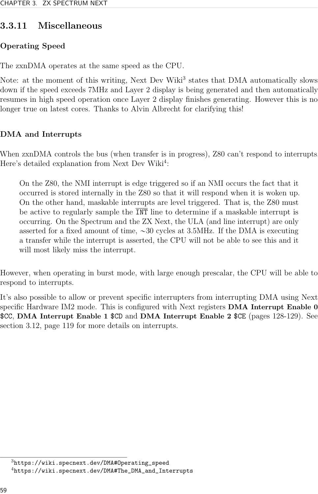

### 3.3.11 Miscellaneous

Operating Speed

The zxnDMA operates at the same speed as the CPU.

Note: at the moment of this writing, Next Dev Wiki3 states that DMA automatically slows down if the speed exceeds 7MHz and Layer 2 display is being generated and then automatically resumes in high speed operation once Layer 2 display finishes generating. However this is no longer true on latest cores. Thanks to Alvin Albrecht for clarifying this!

DMA and Interrupts

When zxnDMA controls the bus (when transfer is in progress), Z80 can’t respond to interrupts. Here’s detailed explanation from Next Dev Wiki4:

On the Z80, the NMI interrupt is edge triggered so if an NMI occurs the fact that it occurred is stored internally in the Z80 so that it will respond when it is woken up. On the other hand, maskable interrupts are level triggered. That is, the Z80 must be active to regularly sample the INT line to determine if a maskable interrupt is occurring. On the Spectrum and the ZX Next, the ULA (and line interrupt) are only asserted for a fixed amount of time, 30 cycles at 3.5MHz. If the DMA is executing a transfer while the interrupt is asserted, the CPU will not be able to see this and it will most likely miss the interrupt.

However, when operating in burst mode, with large enough prescalar, the CPU will be able to respond to interrupts.

It’s also possible to allow or prevent specific interrupters from interrupting DMA using Next specific Hardware IM2 mode. This is configured with Next registers DMA Interrupt Enable 0 $CC, DMA Interrupt Enable 1 $CD and DMA Interrupt Enable 2 $CE (pages 128-129). See section 3.12, page 119 for more details on interrupts.

3https://wiki.specnext.dev/DMA#Operating_speed 4https://wiki.specnext.dev/DMA#The_DMA_and_Interrupts


### 3.3.12 DMA Ports and Registers

MB02 DMA Port $xx0B

Core 3.1.2+: Always in Zilog DMA mode for uploading legacy DMA programs. For zxnDMA, use zxnDMA Port $xx6B.

Older cores: this port is not supported, set bit 6 of Peripheral 2 $06 (page 115) and use zxnDMA Port $xx6B.

zxnDMA Port $xx6B

Core 3.1.2+: Always in zxnDMA mode. For legacy Zilog DMA, use MB02 DMA Port $xx0B.

Older cores: this port behaves either in zxnDMA or legacy Zilog DMA mode based on bit 6 of Peripheral 2 $06 (page 115): if bit 6 is 0, zxnDMA mode is enabled, otherwise Zilog DMA.

Peripheral 2 $06

See description under Sound, section 3.10.4, page 115.

Video Timing $11

Bit Effect Reserved, must be 0 Video signal timing variant clk28=28000000 Base VGA timing clk28=28571429 VGA setting 1 clk28=29464286 VGA setting 2 clk28=30000000 VGA setting 3 clk28=31000000 VGA setting 4 clk28=32000000 VGA setting 5 clk28=33000000 VGA setting 6 clk28=27000000

DMA Interrupt Enable 0 $CC

DMA Interrupt Enable 1 $CD

DMA Interrupt Enable 2 $CE

See description under Interrupts, section 3.12.4, pages 128-129.

CHAPTER 3. ZX SPECTRUM NEXT

## 3.4 Palette

Next greatly enhances ZX Spectrum video capabilities by offering several new ways to draw graphics on a screen. We’ll see how to program each in later chapters, but let’s check common behaviour first - colour management.

To draw a pixel on a screen, we need to set its colour as data in memory. Next shares implementation to other contemporary 8-bit computers - all possible colours are stored together in a palette, as an array of RGB values, and each pixel is simply an index into this array. This approach requires less memory and allows creating efficient effects such as fade to/from black, transitions from day to night, water animations etc.

### 3.4.1 Palette Selection

Each graphics mode or layer has not one but two palettes, each of which can be changed independently. Of course, only one of two can be active at any given time for each mode. The other can be initialized with alternate colours and can be quickly activated to achieve colour animation effects.

Active palette is set with Enhanced ULA Control $43 (page 65) for ULA, Layer 2 and Sprites and Tilemap Control $6B (page 91) for Tilemap.

### 3.4.2 Palette Editing

Next palettes have 256 colours. All are initialized with default values, so they are usable out of the box. But it’s also possible to change every colour. Regardless of the palette, the procedure to read or write colours is:

1. Enhanced ULA Control $43 (page 65) selects palette which colours you want to edit

2. Palette Index $40 (page 63) selects colour index that will be read or written

3. Palette Value $41 (page 64) or Enhanced ULA Palette Extension $44 (page 65) reads or writes data for selected colour

When writing colours, we can chose to automatically increment colour indexes after each write. Bit 7 of Enhanced ULA Control $43 is used for that purpose. This works the same for both write registers ($41 and $44). Colour RGB values can either be 8-bit RRRGGGBB, or 9-bit RRRGGGBBB values. Use Palette Value $41 for 8-bit and Enhanced ULA Palette Extension $44 for 9-bit.

Note: Enhanced ULA Control $43 has two roles when working with palettes - it selects the active palette for display (out of two available - only for ULA, Layer 2 and Sprites) and selects palette for editing (for all layers, including Tilemap). Therefore care needs to be taken when updating colour entries to avoid accidentally changing the active palette for display at the same time. Depending on our program, we may first need to read the value and then only change bits affecting the palette for editing to ensure the rest of the data remains unaffected.

CHAPTER 3. ZX SPECTRUM NEXT

### 3.4.3 8 Bit Colours

8-bit colours are stored as RRRGGGBB values with 3 bits per red and green and 2 bits per blue component. Each colour is therefore stored as a single byte. Palette Value $41 (page 64) is used to read or write the value.

Here’s a reusable subroutine for copying B number of colours stored as a contiguous block in memory addressed by HL register, starting at the currently selected colour index:

```
Copy8BitPalette:
LD A, (HL)
; Load RRRGGGBB into A
INC HL
; Increment to next colour entry
NEXTREG $41, A
; Send colour data to Next HW
DJNZ Copy8BitPalette
; Repeat until B=0
```

Copy8BitPalette: 1

LD A, (HL) ; Load RRRGGGBB into A 2

INC HL ; Increment to next colour entry 3

NEXTREG $41, A ; Send colour data to Next HW 4

DJNZ Copy8BitPalette ; Repeat until B=0 5

And we’d call the subroutine with something like:

```
NEXTREG $43, %00010000 ; Auto increment, Layer 2 first palette for read/write
NEXTREG $40, 0
; Start copying into index 0
LD HL, palette
; Address to copy RRRGGGBB values from
LD B, 255
; Copy 255 colours
CALL Copy8BitPalette
```

NEXTREG $43, %00010000 ; Auto increment, Layer 2 first palette for read/write 1

NEXTREG $40, 0 ; Start copying into index 0 2

LD HL, palette ; Address to copy RRRGGGBB values from 3

LD B, 255 ; Copy 255 colours 4

CALL Copy8BitPalette 5

Note: we could also use DMA to transfer all the bytes. I won’t show it here, but feel free to implement it as an excercise - see section 3.3 for details on programming the DMA.

### 3.4.4 9 Bit Colours

With 9 bits per colour, each RGB component uses full 3 bits, thus greatly increasing the available colour gamut. However, each colour needs 2 bytes in memory instead of 1. To read or write we use Enhanced ULA Palette Extension $44 (page 65) register instead of $41. It works similarly to $41 except that each colour requires two writes: first one stores RRRGGGBB part and second least significant bit of blue component. Subroutine for copying 9-bit colours:

```
Copy9BitPalette:
LD A, (HL)
; Load RRRGGGBB into A
INC HL
; Increment to next byte
NEXTREG $44, A
; Send colour data to Next HW
LD A, (HL)
; Load remaining byte with LSB of B component into A
INC HL
; Increment to next colour entry
NEXTREG $44, A
; Send colour data to Next HW and increment index
DJNZ Copy9BitPalette
; Repeat until B=0
```

Copy9BitPalette: 1

LD A, (HL) ; Load RRRGGGBB into A 2

INC HL ; Increment to next byte 3

NEXTREG $44, A ; Send colour data to Next HW 4

LD A, (HL) ; Load remaining byte with LSB of B component into A 5

INC HL ; Increment to next colour entry 6

NEXTREG $44, A ; Send colour data to Next HW and increment index 7

DJNZ Copy9BitPalette ; Repeat until B=0 8

Note: subroutine requires that colours are stored in 2 bytes with first containing RRRGGGBB part and second least significant bit of blue. Which is how typically drawing programs store a 9-bit palette anyways. The code for calling this subroutine is exactly the same as for the 8-bit colours above.


### 3.4.5 Palette Registers

Palette Index $40

Bit Effect Reads or writes palette colour index to be manipulated

Writing an index 0-255 associates it with colour set through Palette Value $41 or Enhanced ULA Palette Extension $44 (page 65) of currently selected pallette in Enhanced ULA Control $43 (page 65). Write also resets value of Enhanced ULA Palette Extension $44 (page 65) so next write will occur for first colour of the palette

While Tilemap, Layer 2 and Sprites palettes use all 256 distinct colours (with some caveats, as described in specific chapters), ULA modes work like this:

Classic ULA Index Colours Ink Bright ink Paper Bright paper

Border is taken from paper colours.

Index Colours Ink

Paper and border are taken from Transparency Colour Fallback $4A (page 66).

ULANext normal mode Index Colours Ink (only a subset) Paper (only a subset)

Border is taken from paper colours. The number of active indices depends on the number of attribute bits assigned to ink and paper out of the attribute byte by Enhanced ULA Ink Colour Mask $42.

ULANext full-ink mode Index Colours Ink 0-255

Paper and border are taken from Transparency Colour Fallback $4A (page 66).

Palette Value $41

Bit Effect Reads or writes 8-bit colour data

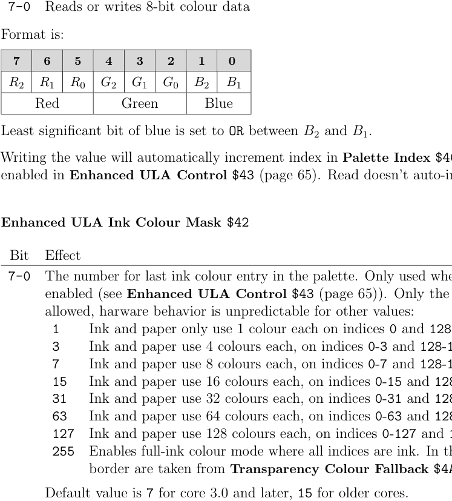

Format is:

Least significant bit of blue is set to OR between B2 and B1.

Writing the value will automatically increment index in Palette Index $40, if auto-increment is enabled in Enhanced ULA Control $43 (page 65). Read doesn’t auto-increment index.

Enhanced ULA Ink Colour Mask $42

Bit Effect The number for last ink colour entry in the palette. Only used when ULANext mode is enabled (see Enhanced ULA Control $43 (page 65)). Only the following values are allowed, harware behavior is unpredictable for other values: Ink and paper only use 1 colour each on indices 0 and 128 respectively Ink and paper use 4 colours each, on indices 0-3 and 128-131 Ink and paper use 8 colours each, on indices 0-7 and 128-135 Ink and paper use 16 colours each, on indices 0-15 and 128-143 Ink and paper use 32 colours each, on indices 0-31 and 128-159 Ink and paper use 64 colours each, on indices 0-63 and 128-191 Ink and paper use 128 colours each, on indices 0-127 and 128-255 Enables full-ink colour mode where all indices are ink. In this mode paper and border are taken from Transparency Colour Fallback $4A (page 66)

Default value is 7 for core 3.0 and later, 15 for older cores.

CHAPTER 3. ZX SPECTRUM NEXT

Enhanced ULA Control $43

Bit Effect 1 to disable palette index auto-increment, 0 to enable 7 Selects palette for read or write 6-4 ULA first palette 000 ULA second palette 100 Layer 2 first palette 001 Layer 2 second palette 101 Sprites first palette 010 Sprites second palette 110 Tilemap first palette 011 Tilemap second palette 111

Selects active Sprites palette (0 = first palette, 1 = second palette) 3 Selects active Layer 2 palette (0 = first palette, 1 = second palette) Selects active ULA palette (0 = first palette, 1 = second palette) Enables ULANext mode if 1 (0 after reset)


Write will also reset the index of Enhanced ULA Palette Extension $44 so next write there will be considered as first byte of first colour.

Enhanced ULA Palette Extension $44

Bit Effect Reads or writes 9-bit colour definition

Two consequtive writes are needed:

First write:

Second write:

Bit 7 of the second write must be 0 except for Layer 2 palettes where it specifies colour priority. If set to 1, then the colour will always be on top, above all other layers, regardless of priority set with Sprite and Layers System $15 (page 89). So if you need exactly the same colour with priority and non-priority, you will need to set the same data twice, to different indexes, once with priority bit 1 and then with 0.

After the second write palette colour index in Palette Index $40 (page 63) is automatically increment, if auto-increment is enabled in Enhanced ULA Control $43.

Note: reading will always return the second byte of the colour (least significant bit of blue) and will not auto-increment index. You can read RRRGGGBB part with Palette Value $41 (page 64).


Transparency Colour Fallback $4A

Bit Effect 8-bit colour to be used when all layers contain transparent pixel. Format is RRRGGGBB

This colour is also used for paper and border when ULANext full-ink mode is enabled - see Enhanced ULA Ink Colour Mask $42 (page 64).


## 3.5 ULA Layer

Original ZX Spectrum didn’t have a dedicated graphics chip. To keep the price as low as possible, screen rendering was performed by ULA (“Uncommitted Logic Array”) chip.

ZX Spectrum Next inherits ULA mode. The resolution of the screen in this mode is 256 192 pixels. If we translate this to 8 8 pixels characters, it gives us 32 character columns in 24 character rows.

ULA always reads from 16K bank 5 which is assigned to the second 16K slot at addresses $4000-$7FFF by default. Similar to the memory configuration of other contemporary computers, pixel memory is separate from attributes/colour memory. If using default memory configuration:

### 3.5.1 Pixel Memory

Each screen pixel is represented by a single bit, meaning 1 byte holds 8 screen pixels. So, for each line of 256 pixels, 32 bytes are needed. However, for sake of efficiency, the original Spectrum optimized screen memory layout for speed but made it inconvenient for programming.

Pixel memory is not linear but is instead divided to fill character rows line by line. The first 32 bytes of memory represent the first line of the first character row, followed by 32 bytes representing the first line of the second character row and so on until the first line of 8 character rows is filled. Then next 32 bytes of screen memory represent the second line of the first character row, again followed by the second line of the second character row, until all 8 character rows are covered:

Addr. Ln. Ch. Addr. Ln. Ch. Addr. Ln. Ch. $4000 $4100 $4200

$4020 $4120 $4220 $4040 $4140 $4240 $4060 $4160 $4260 $4080 $4180 $4280 $40A0 $41A0 $42A0 $40C0 $41C0 $42C0 $40E0 $41E0 $42E0

Ln. Screen line (0-191) Ch. Character <row>/<line> (0-23/0-7)

But this is not the end of the peculiarities of Spectrum ULA mode. If you attempt to fill the screen memory byte by byte, you’ll realize the top third of the screen fills in first, then middle third and lastly bottom third. The reason is, ULA mode divides the screen into 3 banks. Each bank covers 8 character rows, so 8 8 32 or 2048 bytes:

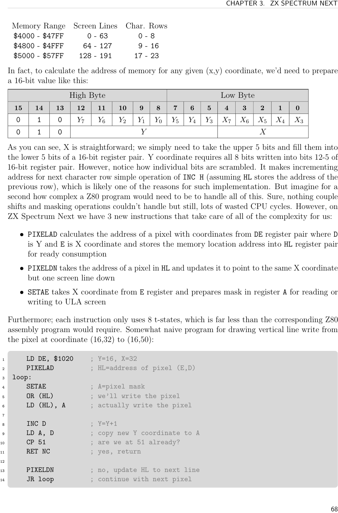

Memory Range Screen Lines Char. Rows $4000 - $47FF $4800 - $4FFF $5000 - $57FF

In fact, to calculate the address of memory for any given (x,y) coordinate, we’d need to prepare a 16-bit value like this:

As you can see, X is straightforward; we simply need to take the upper 5 bits and fill them into the lower 5 bits of a 16-bit register pair. Y coordinate requires all 8 bits written into bits 12-5 of 16-bit register pair. However, notice how individual bits are scrambled. It makes incrementing address for next character row simple operation of INC H (assuming HL stores the address of the previous row), which is likely one of the reasons for such implementation. But imagine for a second how complex a Z80 program would need to be to handle all of this. Sure, nothing couple shifts and masking operations couldn’t handle but still, lots of wasted CPU cycles. However, on ZX Spectrum Next we have 3 new instructions that take care of all of the complexity for us:

ˆ PIXELAD calculates the address of a pixel with coordinates from DE register pair where D is Y and E is X coordinate and stores the memory location address into HL register pair for ready consumption

ˆ PIXELDN takes the address of a pixel in HL and updates it to point to the same X coordinate but one screen line down

ˆ SETAE takes X coordinate from E register and prepares mask in register A for reading or writing to ULA screen

Furthermore; each instruction only uses 8 t-states, which is far less than the corresponding Z80 assembly program would require. Somewhat naive program for drawing vertical line write from the pixel at coordinate (16,32) to (16,50):

```
LD DE, $1020
; Y=16, X=32
PIXELAD
; HL=address of pixel (E,D)
loop:
SETAE
; A=pixel mask
OR (HL)
; we’ll write the pixel
LD (HL), A
; actually write the pixel
INC D
; Y=Y+1
LD A, D
; copy new Y coordinate to A
CP 51
; are we at 51 already?
RET NC
; yes, return
PIXELDN
; no, update HL to next line
JR loop
; continue with next pixel
```

LD DE, $1020 ; Y=16, X=32

; HL=address of pixel (E,D)

loop:

; A=pixel mask

; we’ll write the pixel

LD (HL), A ; actually write the pixel

LD A, D ; copy new Y coordinate to A

; are we at 51 already?

; yes, return

; no, update HL to next line

JR loop ; continue with next pixel

CHAPTER 3. ZX SPECTRUM NEXT

Note: because we’re updating our Y coordinate in D register within the loop, we could also use PIXELAD instead of PIXELDN in line 13. Both instructions require 8 T states for execution, so there’s no difference performance-wise.

If we instead wanted to check if the pixel at the given coordinate is set or not, we would use AND (HL) instead of OR (HL). For example:

```
LD DE, $1020
; Y=16, X=32
PIXELAD
; HL=address of pixel (E,D)
SETAE
; A=pixel mask
AND (HL)
; we’ll read the pixel
RET Z
; exit if pixel is not set
```

LD DE, $1020 ; Y=16, X=32 1

PIXELAD ; HL=address of pixel (E,D) 2

SETAE ; A=pixel mask 3

AND (HL) ; we’ll read the pixel 4

RET Z ; exit if pixel is not set 5

### 3.5.2 Attributes Memory

Now that we know how to draw individual pixels, it’s time to handle colour. Memory wise, it’s stored immediately after pixel RAM, at memory locations $5800 - $5AFF. Each byte represents colour and attributes for 8 8 pixel block on the screen. Byte contents are as follows:

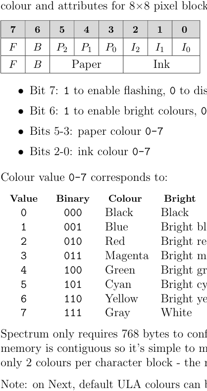

ˆ Bit 7: 1 to enable flashing, 0 to disables it

ˆ Bit 6: 1 to enable bright colours, 0 for normal colours

ˆ Bits 5-3: paper colour 0-7

ˆ Bits 2-0: ink colour 0-7

Colour value 0-7 corresponds to:

Value Binary Colour Bright Black Black Blue Bright blue Red Bright red Magenta Bright magenta Green Bright green Cyan Bright cyan Yellow Bright yellow Gray White

Spectrum only requires 768 bytes to configure colour and attributes for the whole screen. And memory is contiguous so it’s simple to manage. However, it comes at expense of restricting to only 2 colours per character block - the reason for the (in)famous colour clash.

Note: on Next, default ULA colours can be changed, see Palette chapter 3.4, page 61 for details.

CHAPTER 3. ZX SPECTRUM NEXT

### 3.5.3 Border

Next inherits Spectrum border colour handling through ULA Control Port Write $xxFE (page 71). The bottom 3 bits are used to specify one of 8 possible colours (see table on the previous page for full list). Example:

```
LD A, 1
; Select blue colour
OUT ($FE), A
; Set border colour from A
```

LD A, 1 ; Select blue colour 1

OUT ($FE), A ; Set border colour from A 2

Note: border colour is set the same way regardless of graphics mode used. However, some Layer 2 modes and Tileset may partially or fully cover the border, effectively making it invisible to the user.

### 3.5.4 Shadow Screen

As mentioned, ULA uses 16K bank 5 by default to determine what to show on the screen. However, it’s possible to change this to bank 7 instead by using bit 3 of Memory Paging Control $7FFD (page 41). Bank 7 mode is called the “shadow” screen. It gives us two separate memory spaces for rendering ULA data and means for quickly swapping between them. It allows always drawing into inactive bank and only swapping it in when ready thus help eliminating flicker.

Note: Memory Paging Control $7FFD (page 41) only controls which of the two possible banks is being used by ULA, but it doesn’t map the bank into any of the memory slots. This needs to be done by one of the paging modes as described in the Memory Map and Paging chapter, section 3.2, page 35. Using MMU, we could do something like:

```
LD HL, $5800
; we’ll be swapping colours
NEXTREG $52, 10
; swap first half of 16K bank 5 to 8K slot 2
LD A, %00000000
; paper=black, ink=black
LD (HL), A
; write data to screen (immediately visible)
NEXTREG $52, 14
; swap first half of 16K bank 7 to 8K slot 2
LD A, %00000101
; paper=black, ink=cyan
LD (HL), A
; write to 16K bank 7 (not visible)
LD BC, $7FFD
; prepare port for changing layers
LD A, %00001000
; activate shadow layer
OUT (C), A
; top left char now has black background
LD A, %00000000
; deactivate shadow layer
OUT (C), A
; top left char now has cyan background
```

LD HL, $5800 ; we’ll be swapping colours 1

2

NEXTREG $52, 10 ; swap first half of 16K bank 5 to 8K slot 2 3

LD A, %00000000 ; paper=black, ink=black 4

LD (HL), A ; write data to screen (immediately visible) 5

6

NEXTREG $52, 14 ; swap first half of 16K bank 7 to 8K slot 2 7

LD A, %00000101 ; paper=black, ink=cyan 8

LD (HL), A ; write to 16K bank 7 (not visible) 9

10

LD BC, $7FFD ; prepare port for changing layers 11

LD A, %00001000 ; activate shadow layer 12

OUT (C), A ; top left char now has black background 13

14

LD A, %00000000 ; deactivate shadow layer 15

OUT (C), A ; top left char now has cyan background 16

Remember: 16K bank 7 corresponds to 8K banks 14 and 15. And because pixel and attributes combined fit within single 8K, only single bank needs to be swapped in.

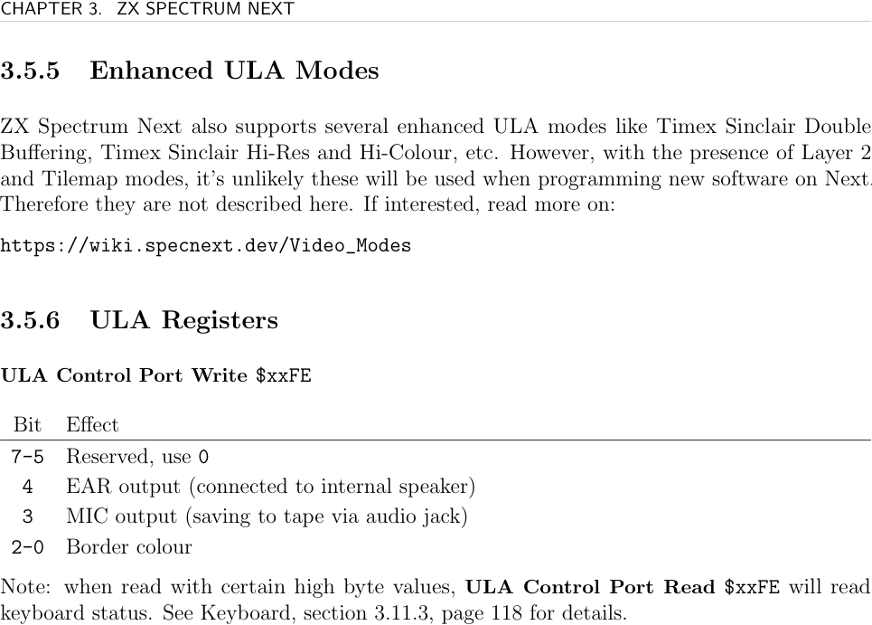

### 3.5.5 Enhanced ULA Modes

ZX Spectrum Next also supports several enhanced ULA modes like Timex Sinclair Double Buffering, Timex Sinclair Hi-Res and Hi-Colour, etc. However, with the presence of Layer 2 and Tilemap modes, it’s unlikely these will be used when programming new software on Next. Therefore they are not described here. If interested, read more on:

https://wiki.specnext.dev/Video_Modes

### 3.5.6 ULA Registers

ULA Control Port Write $xxFE

Bit Effect Reserved, use 0 EAR output (connected to internal speaker) MIC output (saving to tape via audio jack) Border colour

Note: when read with certain high byte values, ULA Control Port Read $xxFE will read keyboard status. See Keyboard, section 3.11.3, page 118 for details.

Memory Paging Control $7FFD

See description under Memory Map and Paging, section 3.2.7, page 41.

Palette Index $40

Palette Value $41

Enhanced ULA Ink Colour Mask $42

Enhanced ULA Control $43

Enhanced ULA Palette Extension $44

Transparency Colour Fallback $4A

See description under Palette, section 3.4.5, pages 63-66.

CHAPTER 3. ZX SPECTRUM NEXT

This page intentionally left empty

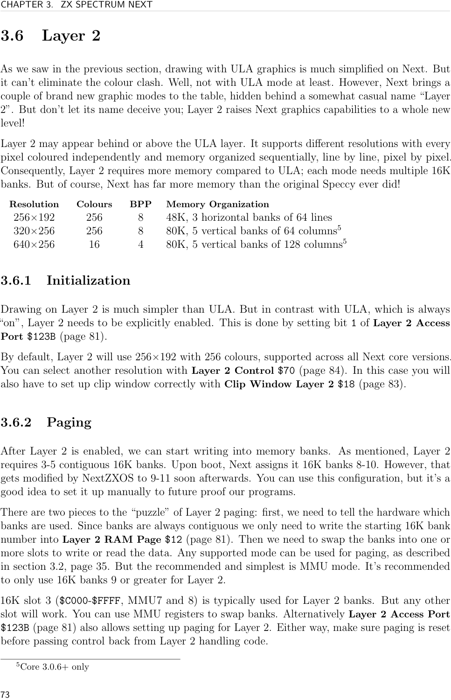

## 3.6 Layer 2

As we saw in the previous section, drawing with ULA graphics is much simplified on Next. But it can’t eliminate the colour clash. Well, not with ULA mode at least. However, Next brings a couple of brand new graphic modes to the table, hidden behind a somewhat casual name “Layer 2”. But don’t let its name deceive you; Layer 2 raises Next graphics capabilities to a whole new level!

Layer 2 may appear behind or above the ULA layer. It supports different resolutions with every pixel coloured independently and memory organized sequentially, line by line, pixel by pixel. Consequently, Layer 2 requires more memory compared to ULA; each mode needs multiple 16K banks. But of course, Next has far more memory than the original Speccy ever did!

Resolution Colours Memory Organization 48K, 3 horizontal banks of 64 lines 80K, 5 vertical banks of 64 columns5

80K, 5 vertical banks of 128 columns5

### 3.6.1 Initialization

Drawing on Layer 2 is much simpler than ULA. But in contrast with ULA, which is always “on”, Layer 2 needs to be explicitly enabled. This is done by setting bit 1 of Layer 2 Access Port $123B (page 81).

By default, Layer 2 will use 256 192 with 256 colours, supported across all Next core versions. You can select another resolution with Layer 2 Control $70 (page 84). In this case you will also have to set up clip window correctly with Clip Window Layer 2 $18 (page 83).

### 3.6.2 Paging

After Layer 2 is enabled, we can start writing into memory banks. As mentioned, Layer 2 requires 3-5 contiguous 16K banks. Upon boot, Next assigns it 16K banks 8-10. However, that gets modified by NextZXOS to 9-11 soon afterwards. You can use this configuration, but it’s a good idea to set it up manually to future proof our programs.

There are two pieces to the “puzzle” of Layer 2 paging: first, we need to tell the hardware which banks are used. Since banks are always contiguous we only need to write the starting 16K bank number into Layer 2 RAM Page $12 (page 81). Then we need to swap the banks into one or more slots to write or read the data. Any supported mode can be used for paging, as described in section 3.2, page 35. But the recommended and simplest is MMU mode. It’s recommended to only use 16K banks 9 or greater for Layer 2.

16K slot 3 ($C000-$FFFF, MMU7 and 8) is typically used for Layer 2 banks. But any other slot will work. You can use MMU registers to swap banks. Alternatively Layer 2 Access Port $123B (page 81) also allows setting up paging for Layer 2. Either way, make sure paging is reset before passing control back from Layer 2 handling code.

5Core 3.0.6+ only

CHAPTER 3. ZX SPECTRUM NEXT

Similar to ULA, Layer 2 can also be set up to use a double-buffering scheme. Layer 2 RAM Shadow Page $13 (page 82) defines starting 16K bank number for “shadow screen” (back buffer) in this case. This is mainly used when paging is set up through Layer 2 Access Port $123B (page 81); bit 3 is used to switch configuration between normal and shadow banks. Or we can use MMU registers instead. If we track shadow banks manually, we don’t have to use register $13 at all. We still need to assign starting shadow screen bank to register Layer 2 RAM Page $12 (page 81) in order to make it visible on screen.

### 3.6.3 Drawing

In general, drawing pixels requires the programmer to:

ˆ Determine and select bank to write to

ˆ Calculate address of the pixel within the bank

ˆ Write byte with colour data

All Layer 2 modes use the same approach when drawing pixels. Each pixel uses one byte (except 640 320 where each byte contains data for 2 pixels). The value is simply an index into the palette entries list. Similar to other layers, Layer 2 also has two palettes, of which only one can be active at any given time. Enhanced ULA Control $43 (page 65) is used to select active palette. See Palette chapter 3.4, page 61 for details on how to program palettes.

See specific modes in the following pages for examples of writing pixel data.

### 3.6.4 Effects

Sprite and Layers System $15 (page 89) can be used to change Layer 2 priority, effectively moving Layer 2 above or below other layers - see Tilemap chapter, section 3.7.6, page 89 for details.

We can even be more specific and only prioritize specific colours, so only pixels using those colours will appear on top while other pixels below other layers. This way we can achieve a simple depth effect. Per-pixel priority is available when writing a custom palette with Enhanced ULA Palette Extension $44 (page 65) (9-bit colours). See description under Palette chapter, section 3.4, page 61 for details on how to program palette.

We can also use both Layer 2 palettes to achieve simple effects. For example, certain colours can be marked with the priority flag on one palette but not on the other. When swapping palettes, pixels drawn with these colours would appear on top or below other layers. Another simple effect using both palettes could be colour animation, though it can’t be very smooth with only two states.

Global Transparency $14 (page 82) register can be used to alter the transparent colour of Layer 2. This same register also affects ULA, LoRes and 1-bit (“text mode”) tilemap.

Scrolling effects can be achieved by writing pixel offsets to registers Layer 2 X Offset MSB $71 (page 84), Layer 2 X Offset $16 (page 82) and Layer 2 Y Offset $17 (page 83).

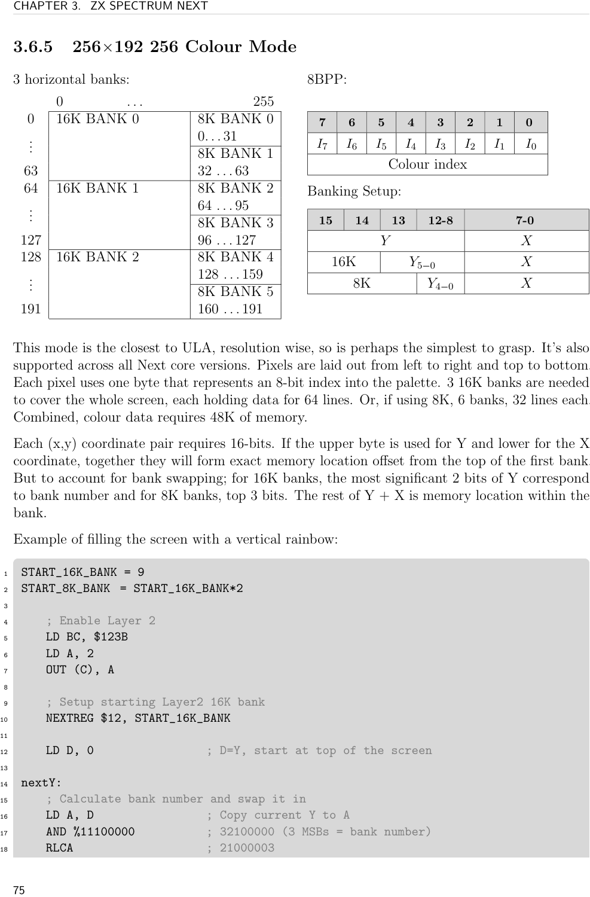

### 3.6.5 256 192 256 Colour Mode

3 horizontal banks:

. . . ...

Banking Setup:

This mode is the closest to ULA, resolution wise, so is perhaps the simplest to grasp. It’s also supported across all Next core versions. Pixels are laid out from left to right and top to bottom. Each pixel uses one byte that represents an 8-bit index into the palette. 3 16K banks are needed to cover the whole screen, each holding data for 64 lines. Or, if using 8K, 6 banks, 32 lines each. Combined, colour data requires 48K of memory.

Each (x,y) coordinate pair requires 16-bits. If the upper byte is used for Y and lower for the X coordinate, together they will form exact memory location offset from the top of the first bank. But to account for bank swapping; for 16K banks, the most significant 2 bits of Y correspond to bank number and for 8K banks, top 3 bits. The rest of Y + X is memory location within the bank.

Example of filling the screen with a vertical rainbow:

```
START_16K_BANK = 9
START_8K_BANK = START_16K_BANK*2
; Enable Layer 2
LD BC, $123B
LD A, 2
OUT (C), A
; Setup starting Layer2 16K bank
NEXTREG $12, START_16K_BANK
LD D, 0
; D=Y, start at top of the screen
nextY:
; Calculate bank number and swap it in
LD A, D
; Copy current Y to A
AND %11100000
; 32100000 (3 MSBs = bank number)
RLCA
; 21000003
```

START_16K_BANK = 9

START_8K_BANK = START_16K_BANK*2

; Enable Layer 2

LD BC, $123B

OUT (C), A

; Setup starting Layer2 16K bank

NEXTREG $12, START_16K_BANK

LD D, 0 ; D=Y, start at top of the screen

nextY:

; Calculate bank number and swap it in

LD A, D ; Copy current Y to A

; 32100000 (3 MSBs = bank number)

; 21000003

CHAPTER 3. ZX SPECTRUM NEXT

```
RLCA
; 10000032
RLCA
; 00000321
ADD A, START_8K_BANK
; A=bank number to swap in
NEXTREG $56, A
; Swap bank to slot 6 ($C000-$DFFF)
; Convert DE (yx) to screen memory location starting at $C000
PUSH DE
; (DE) will be changed to bank offset
LD A, D
; Copy current Y to A
AND %00011111
; Discard bank number
OR $C0
; Screen starts at $C000
LD D, A
; D=high byte for $C000 screen memory
; Loop X through 0..255; we don’t have to deal with bank swapping
; here because it only occurs when changing Y
LD E, 0
nextX:
LD A, E
; A=current X
LD (DE), A
; Use X as colour index
INC E
; Increment to next X
JR NZ, nextX
; Repeat until E rolls over
; Continue with next line or exit
POP DE
; Restore DE to coordinates
INC D
; Increment to next Y
LD A, D
; A=current Y
CP 192
; Did we just complete last line?
JP C, nextY
; No, continue with next linee
```

RLCA ; 10000032

RLCA ; 00000321

ADD A, START_8K_BANK ; A=bank number to swap in

NEXTREG $56, A ; Swap bank to slot 6 ($C000-$DFFF) 22

23

; Convert DE (yx) to screen memory location starting at $C000 24

PUSH DE ; (DE) will be changed to bank offset 25

LD A, D ; Copy current Y to A 26

AND %00011111 ; Discard bank number 27

OR $C0 ; Screen starts at $C000 28

; D=high byte for $C000 screen memory LD D, A 29

30

; Loop X through 0..255; we don’t have to deal with bank swapping 31

; here because it only occurs when changing Y 32

LD E, 0 33

nextX: 34

LD A, E ; A=current X 35

LD (DE), A ; Use X as colour index 36

INC E ; Increment to next X 37

JR NZ, nextX ; Repeat until E rolls over 38

39

; Continue with next line or exit 40

POP DE ; Restore DE to coordinates 41

INC D ; Increment to next Y 42

LD A, D ; A=current Y 43

CP 192 ; Did we just complete last line? 44

JP C, nextY ; No, continue with next linee 45

Worth noting: MMU page 6 (next register $56) covers memory $C000 - $DFFF. As we swap different 8K banks there, we’re effectively changing 8K banks that are readable and writable at those memory addresses. That’s why we OR $C0 in line 24; we need to convert zero based address to $C000 based.

We don’t have to handle bank swapping on every iteration; once per 32 rows would do for this example. But the code is more versatile this way and could be easily converted into a reusable pixel setting routine.

You can find fully working example in companion code on GitHub in folder layer2-256x192.


| vertical 0 | | 320 banks: | 256 | | 256 | | Colour | | Mode 319 |
| --- | --- | --- | --- | --- | --- | --- | --- | --- | --- |
| 0 | | 1 | | 2 | | 3 | | 4 | |
| BANK | | BANK | | BANK | | BANK | | BANK | |
| | | | | | | | | | |
| 16K | | 16K | | 16K | | 16K | | 16K | |
| | | | | | | | | | |
| 0 | 1 | 2 | 3 | 4 | 5 | 6 | 7 | 8 | 9 |
| BANK | BANK | BANK | BANK | BANK | BANK | BANK | BANK | BANK | BANK |
| | | | | | | | | | |
| 8K | 8K | 8K | 8K | 8K | 8K | 8K | 8K | 8K | 8K |
| | | | | | | | | | |
| 16K | | bank | contains | | 64 | columns | | | |

### 3.6.6 320 256 256 Colour Mode

5 vertical banks:

Banking Setup:

16K bank contains 64 columns 8K bank contains 32 columns

320 256 mode is only available on Next core 3.0.6 or later. Pixels are laid out from top to bottom and left to right. Each pixel uses one byte that represents an 8-bit index into the palette. To cover the whole screen, 5 16K banks of 64 columns or 10 8K banks of 32 columns are needed. Together colour data requires 80K of memory.

In contrast with 256 192, this mode allows drawing to the whole screen, including border. In fact, you can think of it as the regular 256 192 mode with additional 32 pixel border around (32 + 256 + 32 = 320 and 32 + 192 + 32 = 256).

Addressing is more complicated though. As we need 9 bits for X and 8 for Y, we can’t address all screen pixels with single 16-bit register pair. But we can use 16-bit register pair to address all pixels within each bank. From this perspective, the setup is similar to 256 192 mode, except that X and Y are reversed: if the upper byte is used for X and lower for Y, then most significant 2 bits of 16-bit register pair represent lower 2 bits of 16K bank number. And for 8K banks, the most significant 3 bits correspond to the lower 3 bits of 8K bank number. In either case, the most significant bit of the bank number arrives from the 9th bit of the X coordinate (X8 in the table above). The rest of the X + Y is memory location within the bank.

To use this mode, we must explicitly select it with Layer 2 Control $70 (page 84). We must also not forget to set clip window correctly with Clip Window Layer 2 $18 (page 83) and Clip Window Control $1C (page 83), as demonstrated in example below:

```
START_16K_BANK = 9
START_8K_BANK = START_16K_BANK*2
RESOLUTION_X
= 320
RESOLUTION_Y
= 256
BANK_8K_SIZE
= 8192
NUM_BANKS
= RESOLUTION_X * RESOLUTION_Y / BANK_8K_SIZE
BANK_X
= BANK_8K_SIZE / RESOLUTION_Y
```

START_16K_BANK = 9

START_8K_BANK = START_16K_BANK*2

= RESOLUTION_X * RESOLUTION_Y / BANK_8K_SIZE

= BANK_8K_SIZE / RESOLUTION_Y

CHAPTER 3. ZX SPECTRUM NEXT

```
; Enable Layer 2
LD BC, $123B
LD A, 2
OUT (C), A
; Setup starting Layer2 16K bank
NEXTREG $12, START_16K_BANK
NEXTREG $70, %00010000 ; 320x256 256 colour mode
; Setup window clip for 320x256 resolution
NEXTREG $1C, 1
; Reset Layer 2 clip window reg index
NEXTREG $18, 0
; X1; X2 next line
NEXTREG $18, RESOLUTION_X / 2 - 1
NEXTREG $18, 0
; Y1; Y2 next line
NEXTREG $18, RESOLUTION_Y - 1
LD B, START_8K_BANK
; Bank number
LD H, 0
; Colour index
nextBank:
; Swap to next bank, exit once all 5 are done
LD A, B
; Copy current bank number to A
NEXTREG $56, A
; Swap bank to slot 6 ($C000-$DFFF)
; Fill in current bank
LD DE, $C000
; Prepare starting address
nextY:
; Fill in 256 pixels of current line
LD A, H
; Copy colour index to A
LD (DE), A
; Write colour index into memory
INC E
; Increment Y
JR NZ, nextY
; Continue with next Y until we wrap to next X
; Prepare for next line until bank is full
INC H
; Increment colour
INC D
; Increment X
LD A, D
; Copy X to A
AND %00111111
; Clear $C0 to get pure X coordinate
CP BANK_X
; Did we reach next bank?
JP NZ, nextY
; No, continue with next Y
; Prepare for next bank
INC B
; Increment to next bank
LD A, B
; Copy bank to A
CP START_8K_BANK+NUM_BANKS; Did we fill last bank?
JP NZ, nextBank
; No, proceed with next bank
```

; Enable Layer 2

LD BC, $123B

LD A, 2 13

OUT (C), A 14

15

; Setup starting Layer2 16K bank 16

NEXTREG $12, START_16K_BANK 17

NEXTREG $70, %00010000 ; 320x256 256 colour mode 18

19

; Setup window clip for 320x256 resolution 20

NEXTREG $1C, 1 ; Reset Layer 2 clip window reg index 21

NEXTREG $18, 0 ; X1; X2 next line 22

NEXTREG $18, RESOLUTION_X / 2 - 1 23

NEXTREG $18, 0 ; Y1; Y2 next line 24

NEXTREG $18, RESOLUTION_Y - 1 25

26

LD B, START_8K_BANK ; Bank number 27

LD H, 0 ; Colour index 28

nextBank: 29

; Swap to next bank, exit once all 5 are done 30

LD A, B ; Copy current bank number to A 31

NEXTREG $56, A ; Swap bank to slot 6 ($C000-$DFFF) 32

33

; Fill in current bank 34

LD DE, $C000 ; Prepare starting address 35

nextY: 36

; Fill in 256 pixels of current line 37

LD A, H ; Copy colour index to A 38

LD (DE), A ; Write colour index into memory 39

INC E ; Increment Y 40

JR NZ, nextY ; Continue with next Y until we wrap to next X 41

42

; Prepare for next line until bank is full 43

INC H ; Increment colour 44

INC D ; Increment X 45

LD A, D ; Copy X to A 46

; Clear $C0 to get pure X coordinate AND %00111111 47

CP BANK_X ; Did we reach next bank? 48

JP NZ, nextY ; No, continue with next Y 49

50

; Prepare for next bank 51

INC B ; Increment to next bank 52

LD A, B ; Copy bank to A 53

CP START_8K_BANK+NUM_BANKS; Did we fill last bank? 54

JP NZ, nextBank ; No, proceed with next bank 55

You can find fully working example in companion code on GitHub in folder layer2-320x256.

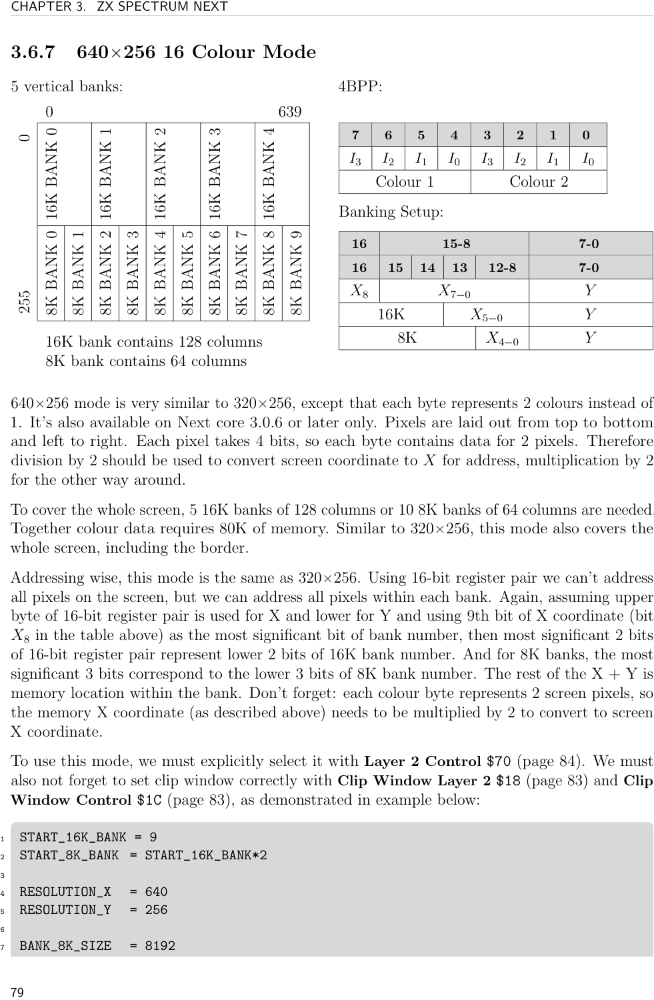

| vertical 0 | | 640 banks: | 256 | | 16 | Colour | | | Mode 639 |
| --- | --- | --- | --- | --- | --- | --- | --- | --- | --- |
| 0 | | 1 | | 2 | | 3 | | 4 | |
| BANK | | BANK | | BANK | | BANK | | BANK | |
| | | | | | | | | | |
| 16K | | 16K | | 16K | | 16K | | 16K | |
| | | | | | | | | | |
| 0 | 1 | 2 | 3 | 4 | 5 | 6 | 7 | 8 | 9 |
| BANK | BANK | BANK | BANK | BANK | BANK | BANK | BANK | BANK | BANK |
| | | | | | | | | | |
| 8K | 8K | 8K | 8K | 8K | 8K | 8K | 8K | 8K | 8K |
| | | | | | | | | | |
| 16K | | bank | contains | | 128 | | columns | | |

### 3.6.7 640 256 16 Colour Mode

5 vertical banks:

Banking Setup:

16K bank contains 128 columns 8K bank contains 64 columns

640 256 mode is very similar to 320 256, except that each byte represents 2 colours instead of 1. It’s also available on Next core 3.0.6 or later only. Pixels are laid out from top to bottom and left to right. Each pixel takes 4 bits, so each byte contains data for 2 pixels. Therefore division by 2 should be used to convert screen coordinate to X for address, multiplication by 2 for the other way around.

To cover the whole screen, 5 16K banks of 128 columns or 10 8K banks of 64 columns are needed. Together colour data requires 80K of memory. Similar to 320 256, this mode also covers the whole screen, including the border.

Addressing wise, this mode is the same as 320 256. Using 16-bit register pair we can’t address all pixels on the screen, but we can address all pixels within each bank. Again, assuming upper byte of 16-bit register pair is used for X and lower for Y and using 9th bit of X coordinate (bit X8 in the table above) as the most significant bit of bank number, then most significant 2 bits of 16-bit register pair represent lower 2 bits of 16K bank number. And for 8K banks, the most significant 3 bits correspond to the lower 3 bits of 8K bank number. The rest of the X + Y is memory location within the bank. Don’t forget: each colour byte represents 2 screen pixels, so the memory X coordinate (as described above) needs to be multiplied by 2 to convert to screen X coordinate.

To use this mode, we must explicitly select it with Layer 2 Control $70 (page 84). We must also not forget to set clip window correctly with Clip Window Layer 2 $18 (page 83) and Clip Window Control $1C (page 83), as demonstrated in example below:

```
START_16K_BANK = 9
START_8K_BANK = START_16K_BANK*2
RESOLUTION_X
= 640
RESOLUTION_Y
= 256
BANK_8K_SIZE
= 8192
```

START_16K_BANK = 9

START_8K_BANK = START_16K_BANK*2

CHAPTER 3. ZX SPECTRUM NEXT

```
NUM_BANKS
= RESOLUTION_X * RESOLUTION_Y / BANK_8K_SIZE / 2
BANK_X
= BANK_8K_SIZE / RESOLUTION_Y
; Enable Layer 2
LD BC, $123B
LD A, 2
OUT (C), A
; Setup starting Layer2 16K bank
NEXTREG $12, START_16K_BANK
NEXTREG $70, %00100000 ; 640x256 16 colour mode
NEXTREG $1C, 1
; Reset Layer 2 clip window reg index
NEXTREG $18, 0
NEXTREG $18, RESOLUTION_X / 4 - 1
NEXTREG $18, 0
NEXTREG $18, RESOLUTION_Y - 1
LD B, START_8K_BANK
; Bank number
LD H, 0
; Colour index for 2 pixels
nextBank:
; Swap to next bank, exit once all 5 are done
LD A, B
; Copy current bank number to A
NEXTREG $56, A
; Swap bank to slot 6 ($C000-$DFFF)
; Fill in current bank
LD DE, $C000
; Prepare starting address
nextY:
; Fill in 256 pixels of current line
LD A, H
; Copy colour indexes for 2 pixels to A
LD (DE), A
; Write colour indexes into memory
INC E
; Increment Y
JR NZ, nextY
; Continue with next Y until we wrap to next X
; Prepare for next line until bank is full
INC H
; Increment colour index for both colours
INC D
; Increment X
LD A, D
; Copy X to A
AND %00111111
; Clear $C0 to get pure X coordinate
CP BANK_X
; Did we reach next bank?
JP NZ, nextY
; No, continue with next Y
; Prepare for next bank
INC B
; Increment to next bank
LD A, B
; Copy bank to A
CP START_8K_BANK+NUM_BANKS; Did we fill last bank?
JP NZ, nextBank
; No, proceed with next bank
```

NUM_BANKS = RESOLUTION_X * RESOLUTION_Y / BANK_8K_SIZE / 2

BANK_X = BANK_8K_SIZE / RESOLUTION_Y

; Enable Layer 2 11

LD BC, $123B 12

LD A, 2 13

OUT (C), A 14

15

; Setup starting Layer2 16K bank 16

NEXTREG $12, START_16K_BANK 17

NEXTREG $70, %00100000 ; 640x256 16 colour mode 18

19

NEXTREG $1C, 1 ; Reset Layer 2 clip window reg index 20

NEXTREG $18, 0 21

NEXTREG $18, RESOLUTION_X / 4 - 1 22

NEXTREG $18, 0 23

NEXTREG $18, RESOLUTION_Y - 1 24

25

LD B, START_8K_BANK ; Bank number 26

LD H, 0 ; Colour index for 2 pixels 27

nextBank: 28

; Swap to next bank, exit once all 5 are done 29

LD A, B ; Copy current bank number to A 30

NEXTREG $56, A ; Swap bank to slot 6 ($C000-$DFFF) 31

32

; Fill in current bank 33

LD DE, $C000 ; Prepare starting address 34

nextY: 35

; Fill in 256 pixels of current line 36

LD A, H ; Copy colour indexes for 2 pixels to A 37

LD (DE), A ; Write colour indexes into memory 38

INC E ; Increment Y 39

JR NZ, nextY ; Continue with next Y until we wrap to next X 40

41

; Prepare for next line until bank is full 42

INC H ; Increment colour index for both colours 43

INC D ; Increment X 44

LD A, D ; Copy X to A 45

; Clear $C0 to get pure X coordinate AND %00111111 46

CP BANK_X ; Did we reach next bank? 47

JP NZ, nextY ; No, continue with next Y 48

49

; Prepare for next bank 50

INC B ; Increment to next bank 51

LD A, B ; Copy bank to A 52

CP START_8K_BANK+NUM_BANKS; Did we fill last bank? 53

JP NZ, nextBank ; No, proceed with next bank 54

You can find fully working example in companion code on GitHub in folder layer2-640x256.

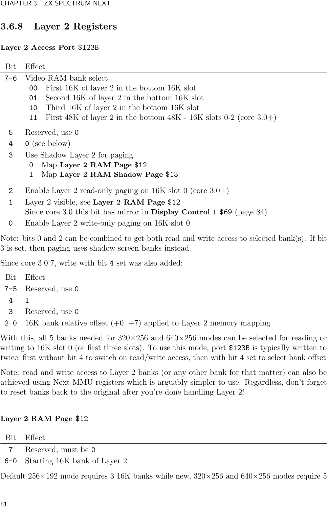

### 3.6.8 Layer 2 Registers

Layer 2 Access Port $123B

Bit Effect Video RAM bank select First 16K of layer 2 in the bottom 16K slot Second 16K of layer 2 in the bottom 16K slot Third 16K of layer 2 in the bottom 16K slot First 48K of layer 2 in the bottom 48K - 16K slots 0-2 (core 3.0+)

Reserved, use 0 0 (see below) Use Shadow Layer 2 for paging Map Layer 2 RAM Page $12 Map Layer 2 RAM Shadow Page $13

Enable Layer 2 read-only paging on 16K slot 0 (core 3.0+) Layer 2 visible, see Layer 2 RAM Page $12 Since core 3.0 this bit has mirror in Display Control 1 $69 (page 84) Enable Layer 2 write-only paging on 16K slot 0

Note: bits 0 and 2 can be combined to get both read and write access to selected bank(s). If bit 3 is set, then paging uses shadow screen banks instead.

Since core 3.0.7, write with bit 4 set was also added:

Bit Effect Reserved, use 0 Reserved, use 0 16K bank relative offset (+0..+7) applied to Layer 2 memory mapping

With this, all 5 banks needed for 320 256 and 640 256 modes can be selected for reading or writing to 16K slot 0 (or first three slots). To use this mode, port $123B is typically written to twice, first without bit 4 to switch on read/write access, then with bit 4 set to select bank offset.

Note: read and write access to Layer 2 banks (or any other bank for that matter) can also be achieved using Next MMU registers which is arguably simpler to use. Regardless, don’t forget to reset banks back to the original after you’re done handling Layer 2!

Layer 2 RAM Page $12

Bit Effect Reserved, must be 0 Starting 16K bank of Layer 2

Default 256 192 mode requires 3 16K banks while new, 320 256 and 640 256 modes require 5

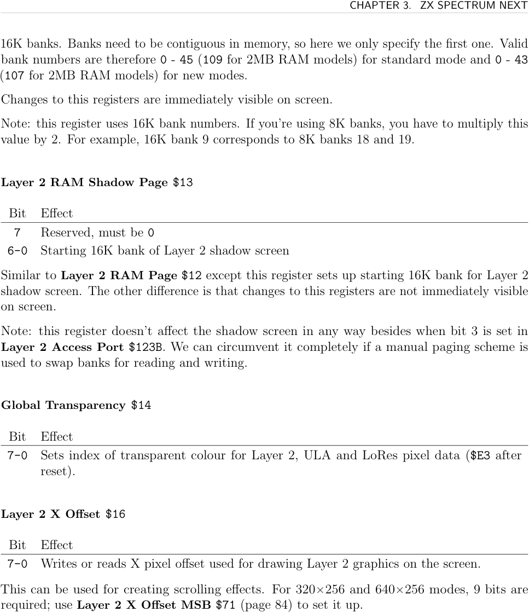

16K banks. Banks need to be contiguous in memory, so here we only specify the first one. Valid bank numbers are therefore 0 - 45 (109 for 2MB RAM models) for standard mode and 0 - 43 (107 for 2MB RAM models) for new modes.

Changes to this registers are immediately visible on screen.

Note: this register uses 16K bank numbers. If you’re using 8K banks, you have to multiply this value by 2. For example, 16K bank 9 corresponds to 8K banks 18 and 19.

Layer 2 RAM Shadow Page $13

Bit Effect Reserved, must be 0 Starting 16K bank of Layer 2 shadow screen

Similar to Layer 2 RAM Page $12 except this register sets up starting 16K bank for Layer 2 shadow screen. The other difference is that changes to this registers are not immediately visible on screen.

Note: this register doesn’t affect the shadow screen in any way besides when bit 3 is set in Layer 2 Access Port $123B. We can circumvent it completely if a manual paging scheme is used to swap banks for reading and writing.

Global Transparency $14

Bit Effect Sets index of transparent colour for Layer 2, ULA and LoRes pixel data ($E3 after reset).

Layer 2 X Offset $16

Bit Effect Writes or reads X pixel offset used for drawing Layer 2 graphics on the screen.

This can be used for creating scrolling effects. For 320 256 and 640 256 modes, 9 bits are required; use Layer 2 X Offset MSB $71 (page 84) to set it up.


Layer 2 Y Offset $17

Bit Effect Writes or reads Y pixel offset used for drawing Layer 2 graphics on the screen.

Valid range is:

ˆ 256 192: 191

ˆ 320 256: 255

ˆ 640 256: 255

Clip Window Layer 2 $18

Bit Effect Reads and writes clip-window coordinates for Layer 2

4 coordinates need to be set: X1, X2, Y1 and Y2. Which coordinate gets set, is determined by index. As each write to this register will also increment index, the usual flow is to reset the index to 0 in Clip Window Control $1C, then write all 4 coordinates in succession. Positions are inclusive. Furthermore, X positions are doubled for 320 256 mode, quadrupled for 640 256. Therefore, to view the whole of Layer 2, the values are:

X1 position X2 position Y1 position Y2 position

Clip Window Control $1C

Write:

Bit Effect Reserved, must be 0 1 to reset Tilemap clip-window register index 1 to reset ULA/LoRes clip-window register index 1 to reset Sprite clip-window register index 1 to reset Layer 2 clip-window register index

Read:

Bit Effect Current Tilemap clip-window register index Current ULA/LoRes clip-window register index Current Sprite clip-window register index Current Layer 2 clip-window register index


Palette Index $40

Palette Value $41

Enhanced ULA Control $43

Enhanced ULA Palette Extension $44

See description under Palette, section 3.4.5, pages 63-65.

Display Control 1 $69

Bit Effect 1 to enable Layer 2 (alias for bit 1 in Layer 2 Access Port $123B, page 81) 1 to enable ULA shadow display (alias for bit 3 in Memory Paging Control $7FFD, page 41) Alias for bits 5-0 in Timex Sinclair Video Mode Control $xxFF

ULA shadow screen from Bank 7 has higher priority than Timex modes.

Layer 2 Control $70

Bit Effect Reserved, must be 0 Layer 2 resolution (0 after soft reset) 256 192, 8BPP 320 256, 8BPP 640 256, 4BPP

Palette offset (0 after soft reset)

Layer 2 X Offset MSB $71

Bit Effect Reserved, must be 0 MSB for X pixel offset

This is only used for 320 256 and 640 256 modes. Together with Layer 2 X Offset $16 (page 82) full 319 pixels offsets are available. For 640 256 only 2 pixel offsets are possible.

CHAPTER 3. ZX SPECTRUM NEXT

## 3.7 Tilemap

Tilemap is fast and effective way of displaying 8x8 pixel blocks on the screen. There are two possible resolutions available: 40x32 or 80x32 tiles. Tilemap layer overlaps ULA by 32 pixels on each side. Or in other words, similar to 320x256 and 640x256 modes of Layer 2, tilemap also covers the whole of the screen, including the border.

Tilemap is defined by 2 data structures: tile definitions and tilemap data itself.

### 3.7.1 Tile Definitions

Tiles are 8x8 pixels with each pixel representing an index of the colour from the currently selected tilemap palette.

Each pixel occupies 4-bits, meaning tiles can use 16 colours. However, as we’ll see in the next section, it’s possible to specify a 4-bit palette offset for each tile which allows us to reach all 256 colours from the palette.

A maximum of 256 tile definitions are possible, but this can be extended to 512 if needed using Tilemap Control $6B (page 91).

All tiles definitions are specified in a contiguous memory block. The offset of tile definitions memory address relative to the start of bank 5 needs to be specified with Tile Definitions Base Address $6F (page 92).

### 3.7.2 Tilemap Data

Tilemap data requires 2 bytes per tile:


Palette Offset 4-bit palette offset for this tile. This allows shifting colours to other 16-colour “banks” thus allowing us to reach the whole 256 colours from the palette.

X Mirror If 1, this tile will be mirrored in X direction.

Y Mirror If 1, this tile will be mirrored in Y direction.

If 1, this tile will be rotated 90oclockwise. Rotate

ULA Mode If 1, this tile will be rendered on top, if 0 below ULA display. However in 512 tile mode, this is the 8th bit of tile index.

Tile Index 8-bit tile index within the tile definitions.

CHAPTER 3. ZX SPECTRUM NEXT

However, it’s possible to eliminate attributes byte by setting bit 5 in Tilemap Control $6B (page 91). This only leaves an 8-bit tile index. Tileset then only occupies half the memory. But we lose the option to specify attributes for each tile separately. Instead attributes for all tiles are taken from Default Tilemap Attribute $6C (page 92).

The offset of the tilemap data memory address relative to the start of bank 5 needs to be specified with Tilemap Base Address $6E (page 92).

### 3.7.3 Memory Organization

The Tilemap layer is closely tied with ULA. Memory wise, it always exists in 16K slot 5. By default, this page is loaded into 16K slot 1 $4000-$7FFF (examples here will assume this configuration, if you load into a different slot, you will have to adjust addresses accordingly).


If both ULA and tilemap are used, memory should be arranged to avoid overlap. Given ULA pixel and attributes memory occupied memory addresses $4000-$5AFF, this leaves $5B00-$7FFF for tilemap. If we also take into account various system variables that reside on top of ULA attributes, $6000 should be used for starting address. This leaves us:

We as programmers need to tell hardware where in the memory tilemap and tile definitions are stored. Tilemap Base Address $6E and Tile Definitions Base Address $6F registers (page 92) are used for that.

Both addresses are provided as most significant byte of the offset into memory slot 5 (which starts at $4000). This means we can only store data at multiples of 256 bytes. For example, if data is stored at $6000, the MSB offset value would be $20 ($6000 - $4000 = $2000).

Generic formula to calculate MSB of the offset is: (Address - $4000) >> 8.

### 3.7.4 Combining ULA and Tilemap

ULA and Tilemap can be combined in two ways:

ˆ Standard mode: uses bit 0 from tile’s attribute byte to determine if a tile is above or below ULA. If tilemap uses 2 bytes per tile, we can specify the priority for each tile separately, otherwise we specify it for all tiles. Transparent pixels are taken into account - if the top layer is transparent, the bottom one is visible through.

ˆ Stencil mode: only used if both, ULA and tileset are enabled. The final pixel is transparent if both, ULA and tilemap pixels are transparent. Otherwise final pixel is AND of both colour bits. This mode allows one layer to act as a cut-out for the other.

CHAPTER 3. ZX SPECTRUM NEXT

### 3.7.5 Examples

Using tilemaps is very simple. The most challenging part of my experience was finding a drawing program that would export to required formats in full. In my experience, Next Graphics6 is the most feature-complete application for generating data for the Next. It takes images from your preferred editor and converts them into a format that can be easily consumed by Next hardware. It supports many different configurations too.

Alternatively, Remy’s Sprite, Tile and Palette editor website7 is the readily available editor and exporter. However, at the time of this writing, export is limited.

Regardless of the editor, we need 3 pieces of data: palette, tile definitions and tileset itself. In this example, they are included as binary files:

```
tilemap:
INCBIN "tiles.map"
tilemapLength = $-tilemap
tiles:
INCBIN "tiles.spr"
tilesLength = $-tiles
palette:
INCBIN "tiles.pal"
paletteLength = $-palette
```

tilemap: 1

INCBIN "tiles.map" 2

tilemapLength = $-tilemap 3

4

tiles: 5

INCBIN "tiles.spr" 6

tilesLength = $-tiles 7

8

palette: 9

INCBIN "tiles.pal" 10

paletteLength = $-palette 11

With all data in place, we can start setting up tilemap:

```
START_OF_BANK_5
= $4000
START_OF_TILEMAP
= $6000
; Just after ULA attributes and system vars
START_OF_TILES
= $6600
; Just after 40x32 tilemap
OFFSET_OF_MAP
= (START_OF_TILEMAP - START_OF_BANK_5) >> 8
OFFSET_OF_TILES
= (START_OF_TILES - START_OF_BANK_5) >> 8
; Enable tilemap mode
NEXTREG $6B, %10100001
; 40x32, 8-bit entries
NEXTREG $6C, %00000000
; palette offset, visuals
; Tell hardware where to find tiles
NEXTREG $6E, OFFSET_OF_MAP ; MSB of tilemap in bank 5
NEXTREG $6F, OFFSET_OF_TILES ; MSB of tilemap definitions
```

= $4000 START_OF_BANK_5 1

= $6000 START_OF_TILEMAP ; Just after ULA attributes and system vars 2

= $6600 START_OF_TILES ; Just after 40x32 tilemap 3

4

OFFSET_OF_MAP = (START_OF_TILEMAP - START_OF_BANK_5) >> 8 5

OFFSET_OF_TILES = (START_OF_TILES - START_OF_BANK_5) >> 8 6

7

; Enable tilemap mode 8

NEXTREG $6B, %10100001 ; 40x32, 8-bit entries 9

NEXTREG $6C, %00000000 ; palette offset, visuals 10

11

; Tell hardware where to find tiles 12

NEXTREG $6E, OFFSET_OF_MAP ; MSB of tilemap in bank 5 13

NEXTREG $6F, OFFSET_OF_TILES ; MSB of tilemap definitions 14

Above code uses couple neat preprocessing tricks to automatically calculate MSB for tilemap and tile definitions offsets. The rest is simply setting up desired behaviour using Next registers.

6https://github.com/infromthecold/Next-Graphics 7https://zx.remysharp.com/sprites/

CHAPTER 3. ZX SPECTRUM NEXT

The only remaining piece is to actually copy all the data to expected memory locations:

```
; Setup tilemap palette
NEXTREG $43, %00110000
; Auto increment, select first tilemap palette
; Copy palette
LD HL, palette
; Address of palette data in memory
LD B, 16
; Copy 16 colours
CALL Copy8BitPalette
; Call routine for copying
; Copy tile definitions to expected memory
LD HL, tiles
; Address of tiles in memory
LD BC, tilesLength
; Number of bytes to copy
CALL CopyTileDefinitions
; Copy all tiles data
; Copy tilemap to expected memory
LD HL, tilemap
; Addreess of tilemap in memory
CALL CopyTileMap40x32
; Copy 40x32 tilemaps
```

; Setup tilemap palette

NEXTREG $43, %00110000 ; Auto increment, select first tilemap palette 2

3

; Copy palette 4

LD HL, palette ; Address of palette data in memory 5

LD B, 16 ; Copy 16 colours 6

CALL Copy8BitPalette ; Call routine for copying 7

8

; Copy tile definitions to expected memory 9

LD HL, tiles ; Address of tiles in memory 10

LD BC, tilesLength ; Number of bytes to copy 11

CALL CopyTileDefinitions ; Copy all tiles data 12

13

; Copy tilemap to expected memory 14

LD HL, tilemap ; Addreess of tilemap in memory 15

CALL CopyTileMap40x32 ; Copy 40x32 tilemaps 16

We already know Copy8BitPalette routine from Layer 2 chapter, the other two are straightforward LDIR loops:

```
CopyTileDefinitions:
LD DE, START_OF_TILES
LDIR
RET
CopyTileMap40x32:
LD BC, 40*32
; This variant always loads 40x32
JR copyTileMap
CopyTileMap80x32:
LD BC, 80*32
; This variant always loads 80x32
CopyTileMap:
LD DE, START_OF_TILEMAP
LDIR
RET
```

CopyTileDefinitions: 1

LD DE, START_OF_TILES 2

LDIR 3

RET 4

5

CopyTileMap40x32: 6

LD BC, 40*32 ; This variant always loads 40x32 7

JR copyTileMap 8

9

CopyTileMap80x32: 10

LD BC, 80*32 ; This variant always loads 80x32 11

12

CopyTileMap: 13

LD DE, START_OF_TILEMAP 14

LDIR 15

RET 16

You can find fully working example in companion code on GitHub in folder tilemap.


### 3.7.6 Tilemap Registers

Sprite and Layers System $15

Bit Effect 1 to enable lo-res layer, 0 disable it 1 to flip sprite rendering priority, i.e. sprite 0 is on top (0 after reset) 1 to change clipping to “over border” mode (doubling X-axis coordinates of clip window, 0 after reset) Layers priority and mixing S L U (Sprites are at top, Layer 2 under, Enhanced ULA at bottom) Core 3.1.1+: (U|T)S(T|U)(B+L) blending layer and Layer 2 combined Older cores: S(U+L) colours from ULA and L2 added per R/G/B channel Core 3.1.1+: (U|T)S(T|U)(B+L-5) blending layer and Layer 2 combined Older cores: S(U+L-5) similar as 110, but per R/G/B channel (U+L-5) 110 and 111 modes: colours are clamped to [0,7]

1 to enable sprites over border (0 after reset) 1 to enable sprite visibility (0 after reset)

Clip Window Tilemap $1B

Bit Effect Reads and writes clip-window coordinates for Tilemap

4 coordinates need to be set: X1, X2, Y1 and Y2. Tilemap will only be visible within these coordinates. X coordinates are internally doubled for 40x32 or quadrupled for 80x32 mode. Positions are inclusive. Default values are 0, 159, 0, 255. Origin (0,0) is located 32 pixels to the top-left of ULA top-left coordinate.

Which coordinate gets set, is determined by index. As each write to this register will also increment index, the usual flow is to reset the index to 0 in Clip Window Control $1C (page 83), then write all 4 coordinates in succession.

Clip Window Control $1C

See description under Layer 2, section 3.6.8, page 83.

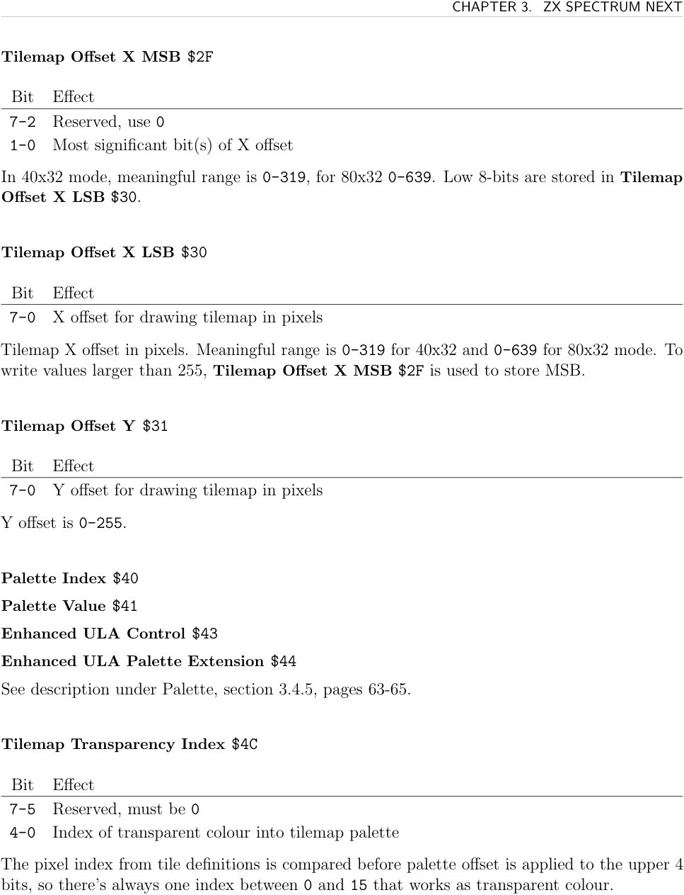

Tilemap Offset X MSB $2F

Bit Effect Reserved, use 0 Most significant bit(s) of X offset

In 40x32 mode, meaningful range is 0-319, for 80x32 0-639. Low 8-bits are stored in Tilemap Offset X LSB $30.

Tilemap Offset X LSB $30

Bit Effect X offset for drawing tilemap in pixels

Tilemap X offset in pixels. Meaningful range is 0-319 for 40x32 and 0-639 for 80x32 mode. To write values larger than 255, Tilemap Offset X MSB $2F is used to store MSB.

Tilemap Offset Y $31

Bit Effect Y offset for drawing tilemap in pixels

Y offset is 0-255.

Palette Index $40

Palette Value $41

Enhanced ULA Control $43

Enhanced ULA Palette Extension $44

See description under Palette, section 3.4.5, pages 63-65.

Tilemap Transparency Index $4C

Bit Effect Reserved, must be 0 Index of transparent colour into tilemap palette

The pixel index from tile definitions is compared before palette offset is applied to the upper 4 bits, so there’s always one index between 0 and 15 that works as transparent colour.

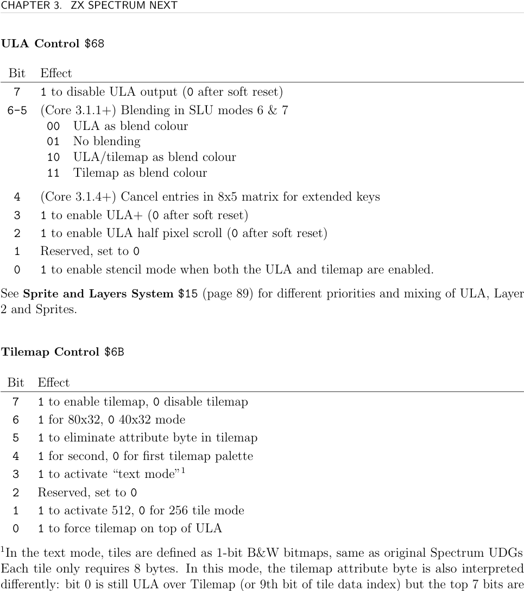

ULA Control $68

Bit Effect 1 to disable ULA output (0 after soft reset) (Core 3.1.1+) Blending in SLU modes 6 & 7 ULA as blend colour No blending ULA/tilemap as blend colour Tilemap as blend colour

(Core 3.1.4+) Cancel entries in 8x5 matrix for extended keys 1 to enable ULA+ (0 after soft reset) 1 to enable ULA half pixel scroll (0 after soft reset) Reserved, set to 0 1 to enable stencil mode when both the ULA and tilemap are enabled.

See Sprite and Layers System $15 (page 89) for different priorities and mixing of ULA, Layer 2 and Sprites.

Tilemap Control $6B

Bit Effect 1 to enable tilemap, 0 disable tilemap 1 for 80x32, 0 40x32 mode 1 to eliminate attribute byte in tilemap 1 for second, 0 for first tilemap palette 1 to activate “text mode”1

Reserved, set to 0 1 to activate 512, 0 for 256 tile mode 1 to force tilemap on top of ULA

1In the text mode, tiles are defined as 1-bit B&W bitmaps, same as original Spectrum UDGs. Each tile only requires 8 bytes. In this mode, the tilemap attribute byte is also interpreted differently: bit 0 is still ULA over Tilemap (or 9th bit of tile data index) but the top 7 bits are extended palette offset (the least significant bit is the value of the pixel itself). In this mode, transparency is checked against Global Transparency $14 (page 82) colour, not against the four-bit tilemap colour index.


Default Tilemap Attribute $6C

If single byte tilemap mode is selected (bit 5 of Tilemap Control $6B), this register defines attributes for all tiles.

Bit Effect Palette offset 1 to mirror tiles in X direction 1 to mirror tiles in Y direction 1 rotate tiles 90oclockwise In 512 tile mode, bit 8 of tile index 1 for ULA over tilemap, 0 for tilemap over ULA

Tilemap Base Address $6E

Bit Effect Ignored, set to 0 Most significant byte of tilemap data offset in bank 5

Tile Definitions Base Address $6F

Bit Effect Ignored, set to 0 Most significant byte of tile definitions offset in bank 5


## 3.8 Sprites

One of the frequently used “my computer is better” arguments from owners and developers of contemporary systems such as Commodore 64 was hardware supported sprites. To be fair, they had a point - poor old Speccy had none. But Next finally rectifies this with a sprite system that far supersedes even later 16-bit era machines such as Amiga. And as we’ll see, it’s really simple to program too!

Some of the capabilities of Next sprites:

ˆ 128 simultaneous sprites

ˆ 16x16 pixels per sprite

ˆ Magnification of 2x, 4x or 8x horizontally and vertically

ˆ Mirroring and rotation

ˆ Sprite grouping to form larger objects

ˆ 512 colours from 2 256 colour palettes

ˆ Per sprite palette

ˆ Built-in sprite editor

So lots of reasons to get excited! Let’s dig in!

### 3.8.1 Editing

Before describing how sprites hardware works, it would be beneficial to know how to draw them. As mentioned, Next comes with a built-in sprite editor. To use it, change to desired folder, then enter .spredit <filename> in BASIC or command line. The editor is quite capable and can even be used with a mouse if you have one attached to your Next (or in the emulator).

Alternatively, if you’re developing cross-platform, the most feature-complete application for converting images to sprite data in my experience is Next Graphics8. It takes images from your preferred editor and converts them into a format that can be easily consumed by Next hardware. Other options I found are UDGeed-Next9 or Remy’s Sprite, Tile and Palette editor10. In contrast to Next Graphics, the latter two are not just exporters but also editors and share very similar feature sets. So try them out and decide for yourself.

### 3.8.2 Patterns

Next sprites have a fixed size of 16x16 pixels. Their display surface is 320x256, overlapping the ULA by 32 pixels on each side. Or in other words, to draw the sprite fully on-screen, we need to position it to (32,32) coordinate. And the last coordinate where the sprite is fully visible at

8https://github.com/infromthecold/Next-Graphics 9http://zxbasic.uk/files/UDGeedNext-current.rar 10https://zx.remysharp.com/sprites/

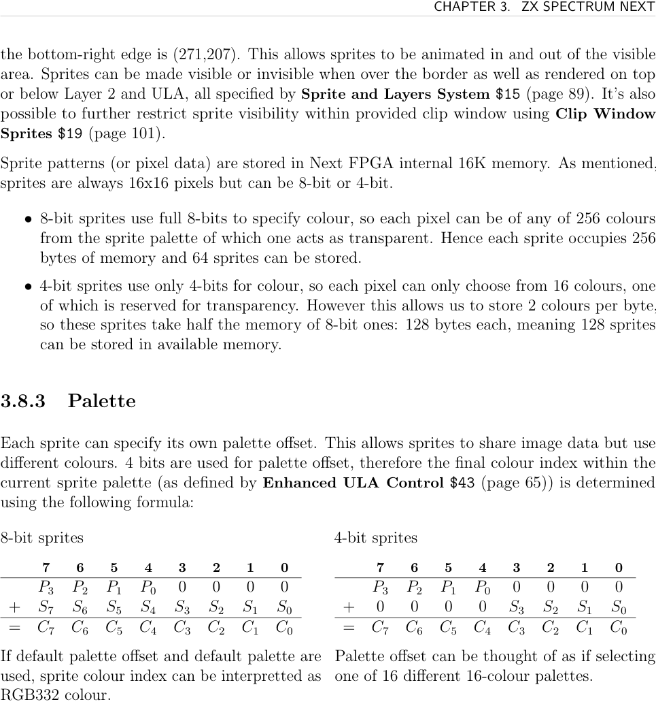

the bottom-right edge is (271,207). This allows sprites to be animated in and out of the visible area. Sprites can be made visible or invisible when over the border as well as rendered on top or below Layer 2 and ULA, all specified by Sprite and Layers System $15 (page 89). It’s also possible to further restrict sprite visibility within provided clip window using Clip Window Sprites $19 (page 101).

Sprite patterns (or pixel data) are stored in Next FPGA internal 16K memory. As mentioned, sprites are always 16x16 pixels but can be 8-bit or 4-bit.

ˆ 8-bit sprites use full 8-bits to specify colour, so each pixel can be of any of 256 colours from the sprite palette of which one acts as transparent. Hence each sprite occupies 256 bytes of memory and 64 sprites can be stored.

ˆ 4-bit sprites use only 4-bits for colour, so each pixel can only choose from 16 colours, one of which is reserved for transparency. However this allows us to store 2 colours per byte, so these sprites take half the memory of 8-bit ones: 128 bytes each, meaning 128 sprites can be stored in available memory.

### 3.8.3 Palette

Each sprite can specify its own palette offset. This allows sprites to share image data but use different colours. 4 bits are used for palette offset, therefore the final colour index within the current sprite palette (as defined by Enhanced ULA Control $43 (page 65)) is determined using the following formula:

8-bit sprites

4-bit sprites

Palette offset can be thought of as if selecting one of 16 different 16-colour palettes.

If default palette offset and default palette are used, sprite colour index can be interpretted as RGB332 colour.

Pn is palette offset bit, Sn sprite colour index bit and Cn final colour index.

Transparent colour is defined with Sprites Transparency Index $4B (page 104).

CHAPTER 3. ZX SPECTRUM NEXT

### 3.8.4 Combined Sprites

Anchor Sprites

These are “normal” 16x16 pixel sprites, as described in previous sections. They act as standalone sprites.

The reason they are called “anchors” is because multiple sprites can be grouped together to form larger sprites. In such case “anchor” acts as a parent and all its “relative” sprites are tied to it. In order to combine sprites, anchor needs to be defined first, immediately followed by all its relative sprites. The group ends with the next anchor sprite which can either be another standalone sprite, or an anchor for another sprite group. For example, if sprite 5 is setup as an anchor, its relative sprites must be followed at 6, 7, 8... until another sprite that’s setup as “anchor”.

There are 2 types of relative sprites: composite and unified sprites.

Composite Relative Sprites

Composite sprites inherit certain attributes from their anchor.

NOT inherited:

Inherited attributes:

ˆ Visibility

ˆ Rotation

ˆ X

ˆ X & Y mirroring

ˆ Y

ˆ X & Y scaling

ˆ Palette offset

ˆ Pattern number

ˆ 4 or 8-bit pattern

Relative sprites only have 8-bits for X and Y coordinates (ninth bits are used for other purposes). But as the name suggests, these coordinates are relative to their parent anchor sprite so they are usually positioned close by. When the anchor sprite is moved to a different position on the screen, all its relatives are also moved by the same amount.

Visibility of relative sprites is determined as AND between anchor visibility and relative sprite visibility. This way individual relative sprites can be made invisible independently from their anchor, but if the anchor is invisible, then all its relative sprites will also be invisible.

Relative sprites inherit 4 or 8-bit setup from their anchor. They can’t use a different type but can use a different palette offset than its anchor.

It’s also possible to tie relative sprite’s pattern number to act as an offset on top of its anchor’s pattern number and thus easily animate the whole sprite group simply by changing the anchor’s pattern number.

CHAPTER 3. ZX SPECTRUM NEXT

Unified Relative Sprites

Unified relative sprites are an extension of the composite type. Everything described above applies here as well.

The main difference is the hardware will automatically adjust relative sprites X, Y, rotation, mirroring and scaling attributes according to changes in anchor. So relatives will rotate, mirror and scale around the anchor as if it was a single larger sprite.

### 3.8.5 Attributes

Attributes are 4 or 5 bytes that define where and how the sprite is drawn. The data can be set either by selecting sprite index with Sprite Status/Slot Select $303B and then continuously sending bytes to Sprite Attribute Upload $xx57 (details on page 100) which automatically increments sprite index after all data for single sprite is transferred or by calling individual direct access Next registers $35-$39 or their auto-increment variants $75-$79. See ports and registers section 3.8.7, page 100 for a description of individual bytes:

ˆ Byte 0: Sprite Port-Mirror Attribute 0 $35 (page 102)

ˆ Byte 1: Sprite Port-Mirror Attribute 1 $36 (page 102)

ˆ Byte 2: Sprite Port-Mirror Attribute 2 $37 (page 102)

ˆ Byte 3: Sprite Port-Mirror Attribute 3 $38 (page 102)

ˆ Byte 4: Sprite Port-Mirror Attribute 4 $39 (page 103)

### 3.8.6 Examples

Reading about sprites may seem complicated, but in practice, it’s quite simple. The following pages include sample code for working with sprites.

To preserve space, only partial code demonstrating relevant parts is included. You can find fully working example in companion code on GitHub in folder sprites. Besides demonstrating anchor and relative sprites, it also includes some very crude animations as a bonus.

CHAPTER 3. ZX SPECTRUM NEXT

Loading Patterns into FPGA Memory

Before we can use sprites, we need to load their data into FPGA memory. This example introduces a generic routine that uses DMA11 to copy from given memory to FPGA. Don’t worry if it seems like magic - it’s implemented as a reusable routine, just copy it to your project. Routine requires 3 parameters:

ˆ HL Source address of sprites to copy from

ˆ BC Number of bytes to copy

ˆ A Starting sprite number to copy to

```
LoadSprites:
LD (.dmaSource), HL
; Copy sprite sheet address from HL
LD (.dmaLength), BC
; Copy length in bytes from BC
LD BC, $303B
; Prepare port for sprite index
OUT (C), A
; Load index of first sprite
LD HL, .dmaProgram
; Setup source for OTIR
LD B, .dmaProgramLength ; Setup length for OTIR
LD C, $6B
; Setup DMA port
OTIR
; Invoke DMA code
RET
.dmaProgram:
DB %10000011
; WR6 - Disable DMA
DB %01111101
; WR0 - append length + port A address, A->B
.dmaSource:
DW 0
; WR0 par 1&2 - port A start address
.dmaLength:
DW 0
; WR0 par 3&4 - transfer length
DB %00010100
; WR1 - A incr., A=memory
DB %00101000
; WR2 - B fixed, B=I/O
DB %10101101
; WR4 - continuous, append port B address
DW $005B
; WR4 par 1&2 - port B address
DB %10000010
; WR5 - stop on end of block, CE only
DB %11001111
; WR6 - load addresses into DMA counters
DB %10000111
; WR6 - enable DMA
.dmaProgramLength = $-.dmaProgram
```

LoadSprites: 1

LD (.dmaSource), HL ; Copy sprite sheet address from HL 2

LD (.dmaLength), BC ; Copy length in bytes from BC 3

LD BC, $303B ; Prepare port for sprite index 4

OUT (C), A ; Load index of first sprite 5

LD HL, .dmaProgram ; Setup source for OTIR 6

LD B, .dmaProgramLength ; Setup length for OTIR 7

LD C, $6B ; Setup DMA port 8

OTIR ; Invoke DMA code 9

RET 10

.dmaProgram: 11

DB %10000011 ; WR6 - Disable DMA 12

DB %01111101 ; WR0 - append length + port A address, A->B 13

.dmaSource: 14

DW 0 ; WR0 par 1&2 - port A start address 15

.dmaLength: 16

DW 0 ; WR0 par 3&4 - transfer length 17

DB %00010100 ; WR1 - A incr., A=memory 18

DB %00101000 ; WR2 - B fixed, B=I/O 19

DB %10101101 ; WR4 - continuous, append port B address 20

DW $005B ; WR4 par 1&2 - port B address 21

DB %10000010 ; WR5 - stop on end of block, CE only 22

DB %11001111 ; WR6 - load addresses into DMA counters 23

DB %10000111 ; WR6 - enable DMA 24

.dmaProgramLength = $-.dmaProgram 25

See section 3.3, page 43 for details on how to program the zxnDMA.

11https://wiki.specnext.dev/DMA

CHAPTER 3. ZX SPECTRUM NEXT

Loading Sprites

Using loadSprites routine is very simple. This example assumes you’ve edited sprites with one of the editors and saved them as sprites.spr file in the same folder as the assembler code:

```
LD HL, sprites
; Sprites data source
LD BC, 16*16*5
; Copy 5 sprites, each 16x16 pixels
LD A, 0
; Start with first sprite
CALL LoadSprites
; Load sprites to FPGA
sprites:
INCBIN "sprites.spr"
; Sprite sheets file
```

LD HL, sprites ; Sprites data source 1

LD BC, 16*16*5 ; Copy 5 sprites, each 16x16 pixels 2

LD A, 0 ; Start with first sprite 3

CALL LoadSprites ; Load sprites to FPGA 4

5

sprites: 6

INCBIN "sprites.spr" ; Sprite sheets file 7

Enabling Sprites

After sprites are loaded into FPGA memory, we need to enable them:

NEXTREG $15, %01000001 ; Sprite 0 on top, SLU, sprites visible 1

Displaying a Sprite

Sprites are now loaded into FPGA memory, they are enabled, so we can start displaying them. This example displays the same sprite pattern twice, as two separate sprites:

```
NEXTREG $34, 0
; First sprite
NEXTREG $35, 100
; X=100
NEXTREG $36, 80
; Y=80
NEXTREG $37, %00000000
; Palette offset, no mirror, no rotation
NEXTREG $38, %10000000
; Visible, no byte 4, pattern 0
NEXTREG $34, 1
; Second sprite
NEXTREG $35, 86
; X=86
NEXTREG $36, 80
; Y=80
NEXTREG $37, %00000000
; Palette offset, no mirror, no rotation
NEXTREG $38, %10000000
; Visible, no byte 4, pattern 0
```

NEXTREG $34, 0 ; First sprite 1

NEXTREG $35, 100 ; X=100 2

NEXTREG $36, 80 ; Y=80 3

NEXTREG $37, %00000000 ; Palette offset, no mirror, no rotation 4

NEXTREG $38, %10000000 ; Visible, no byte 4, pattern 0 5

6

NEXTREG $34, 1 ; Second sprite 7

NEXTREG $35, 86 ; X=86 8

NEXTREG $36, 80 ; Y=80 9

NEXTREG $37, %00000000 ; Palette offset, no mirror, no rotation 10

NEXTREG $38, %10000000 ; Visible, no byte 4, pattern 0 11

CHAPTER 3. ZX SPECTRUM NEXT

Displaying Combined Sprites

Even handling combined sprites is much simpler in practice than in theory! This example combines 4 sprites into a single one using unified relative sprites. Note use of “inc” register $79 which auto-increments sprite index for next sprite:

```
NEXTREG $34, 2
; Select third sprite
NEXTREG $35, 150
; X=150
NEXTREG $36, 80
; Y=80
NEXTREG $37, %00000000
; Palette offset, no mirror, no rotation
NEXTREG $38, %11000001
; Visible, use byte 4, pattern 1
NEXTREG $79, %00100000
; Anchor with unified relatives, no scaling
NEXTREG $35, 16
; X=AnchorX+16
NEXTREG $36, 0
; Y=AnchorY+0
NEXTREG $37, %00000000
; Palette offset, no mirror, no rotation
NEXTREG $38, %11000010
; Visible, use byte 4, pattern 2
NEXTREG $79, %01000000
; Relative sprite
NEXTREG $35, 0
; X=AnchorX+0
NEXTREG $36, 16
; Y=AnchorY+16
NEXTREG $37, %00000000
; Palette offset, no mirror, no rotation
NEXTREG $38, %11000011
; Visible, use byte 4, pattern 3
NEXTREG $79, %01000000
; Relative sprite
NEXTREG $35, 16
; X=AnchorX+16
NEXTREG $36, 16
; Y=AnchorY+16
NEXTREG $37, %00000000
; Palette offset, no mirror, no rotation
NEXTREG $38, %11000100
; Visible, use byte 4, pattern 4
NEXTREG $79, %01000000
; Relative sprite
```

NEXTREG $34, 2 ; Select third sprite 1

NEXTREG $35, 150 ; X=150 2

NEXTREG $36, 80 ; Y=80 3

NEXTREG $37, %00000000 ; Palette offset, no mirror, no rotation 4

NEXTREG $38, %11000001 ; Visible, use byte 4, pattern 1 5

NEXTREG $79, %00100000 ; Anchor with unified relatives, no scaling 6

7

NEXTREG $35, 16 ; X=AnchorX+16 8

NEXTREG $36, 0 ; Y=AnchorY+0 9

NEXTREG $37, %00000000 ; Palette offset, no mirror, no rotation 10

NEXTREG $38, %11000010 ; Visible, use byte 4, pattern 2 11

NEXTREG $79, %01000000 ; Relative sprite 12

13

NEXTREG $35, 0 ; X=AnchorX+0 14

NEXTREG $36, 16 ; Y=AnchorY+16 15

NEXTREG $37, %00000000 ; Palette offset, no mirror, no rotation 16

NEXTREG $38, %11000011 ; Visible, use byte 4, pattern 3 17

NEXTREG $79, %01000000 ; Relative sprite 18

19

NEXTREG $35, 16 ; X=AnchorX+16 20

NEXTREG $36, 16 ; Y=AnchorY+16 21

NEXTREG $37, %00000000 ; Palette offset, no mirror, no rotation 22

NEXTREG $38, %11000100 ; Visible, use byte 4, pattern 4 23

NEXTREG $79, %01000000 ; Relative sprite 24

Because we use combined sprite, we only need to update the anchor to change all its relatives. And because we set it up as unified relative sprites, even rotation, mirroring and scaling is inherited as if it was a single sprite!

```
NEXTREG $34, 1
; Select second sprite
NEXTREG $35, 200
; X=200
NEXTREG $36, 100
; Y=100
NEXTREG $37, %00001010
; Palette offset, mirror X, rotate
NEXTREG $38, %11000001
; Visible, use byte 4, pattern 1
NEXTREG $39, %00101010
; Anchor with unified relatives, scale X$Y
```

NEXTREG $34, 1 ; Select second sprite 1

NEXTREG $35, 200 ; X=200 2

NEXTREG $36, 100 ; Y=100 3

NEXTREG $37, %00001010 ; Palette offset, mirror X, rotate 4

NEXTREG $38, %11000001 ; Visible, use byte 4, pattern 1 5

NEXTREG $39, %00101010 ; Anchor with unified relatives, scale X$Y 6

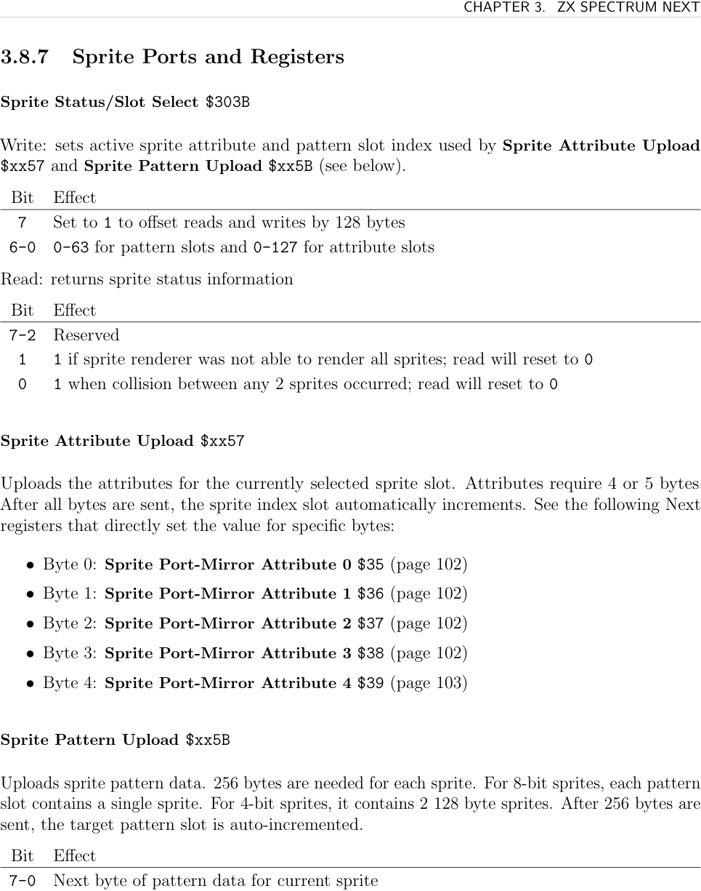

### 3.8.7 Sprite Ports and Registers

Sprite Status/Slot Select $303B

Write: sets active sprite attribute and pattern slot index used by Sprite Attribute Upload $xx57 and Sprite Pattern Upload $xx5B (see below).

Bit Effect Set to 1 to offset reads and writes by 128 bytes 0-63 for pattern slots and 0-127 for attribute slots

Read: returns sprite status information

Bit Effect Reserved 1 if sprite renderer was not able to render all sprites; read will reset to 0 1 when collision between any 2 sprites occurred; read will reset to 0

Sprite Attribute Upload $xx57

Uploads the attributes for the currently selected sprite slot. Attributes require 4 or 5 bytes. After all bytes are sent, the sprite index slot automatically increments. See the following Next registers that directly set the value for specific bytes:

ˆ Byte 0: Sprite Port-Mirror Attribute 0 $35 (page 102)

ˆ Byte 1: Sprite Port-Mirror Attribute 1 $36 (page 102)

ˆ Byte 2: Sprite Port-Mirror Attribute 2 $37 (page 102)

ˆ Byte 3: Sprite Port-Mirror Attribute 3 $38 (page 102)

ˆ Byte 4: Sprite Port-Mirror Attribute 4 $39 (page 103)

Sprite Pattern Upload $xx5B

Uploads sprite pattern data. 256 bytes are needed for each sprite. For 8-bit sprites, each pattern slot contains a single sprite. For 4-bit sprites, it contains 2 128 byte sprites. After 256 bytes are sent, the target pattern slot is auto-incremented.

Bit Effect Next byte of pattern data for current sprite


Peripheral 4 $09

Bit Effect 1 to enable AY2 “mono” output (A+B+C is sent to both R and L channels, makes it a bit louder than stereo mode) 1 to enable AY1 “mono” output, 0 default 1 to enable AY0 “mono” output (0 after hard reset) 1 to lockstep Sprite Port-Mirror Index $34 (page 101) and Sprite Status/Slot Select $303B (page 100) 1 to reset mapram bit in DivMMC 1 to silence HDMI audio (0 after hard reset) (since core 3.0.5) Scanlines weight (0 after hard reset) Core 3.1.1+ Older cores Scanlines off Scalines off Scanlines 50% Scanlines 75% Scanlines 50% Scanlines 25% Scanlines 25% Scanlines 12.5%

Sprite and Layers System $15

See description under Tilemap, section 3.7.6, page 89.

Clip Window Sprites $19

Bit Effect Reads or writes clip-window coordinates for Sprites

4 coordinates need to be set: X1, X2, Y1 and Y2. Sprites will only be visible within these coordinates. Positions are inclusive. Default values are 0, 255, 0, 191. Origin (0,0) is located 32 pixels to the top-left of ULA top-left coordinate.

Which coordinate gets set, is determined by index. As each write to this register will also increment index, the usual flow is to reset the index to 0 with Clip Window Control $1C (page 83), then write all 4 coordinates in succession.

When “over border” mode is enabled (bit 1 of Sprite and Layers System $15, page 89), X coordinates are doubled internally.

Clip Window Control $1C

See description under Layer 2, section 3.6.8, page 83.

Sprite Port-Mirror Index $34

If sprite id lockstep in Peripheral 4 $09 (page 101) is enabled, write to this registers has same effect as writing to Sprite Status/Slot Select $303B (page 100).

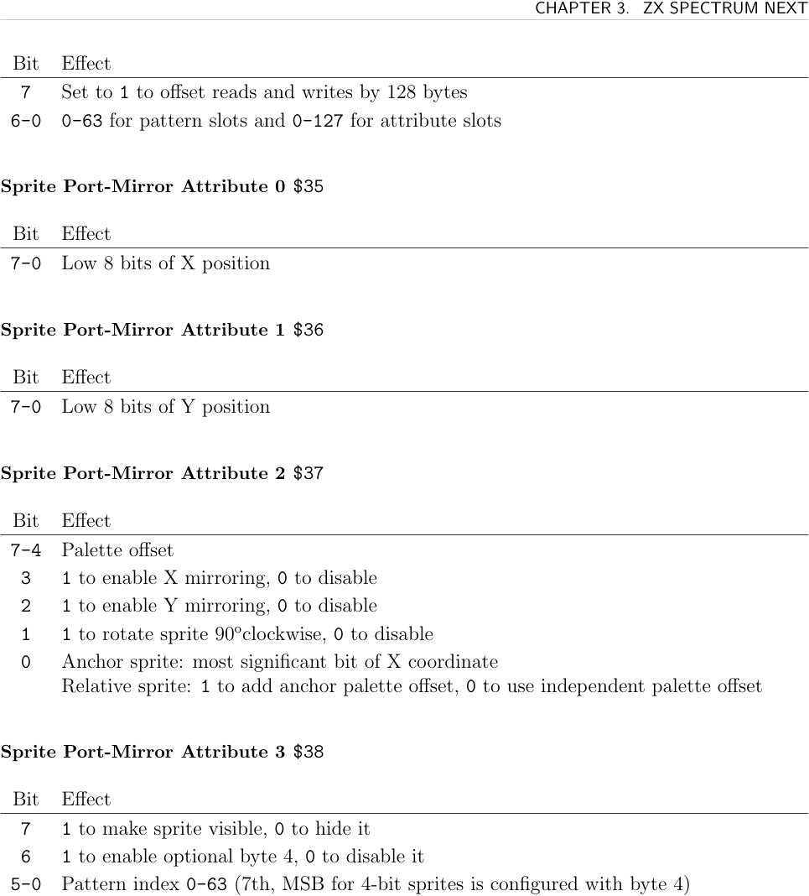

Bit Effect Set to 1 to offset reads and writes by 128 bytes 0-63 for pattern slots and 0-127 for attribute slots

Sprite Port-Mirror Attribute 0 $35

Bit Effect Low 8 bits of X position

Sprite Port-Mirror Attribute 1 $36

Bit Effect Low 8 bits of Y position

Sprite Port-Mirror Attribute 2 $37

Bit Effect Palette offset 1 to enable X mirroring, 0 to disable 1 to enable Y mirroring, 0 to disable 1 to rotate sprite 90oclockwise, 0 to disable Anchor sprite: most significant bit of X coordinate Relative sprite: 1 to add anchor palette offset, 0 to use independent palette offset

Sprite Port-Mirror Attribute 3 $38

Bit Effect 1 to make sprite visible, 0 to hide it 1 to enable optional byte 4, 0 to disable it Pattern index 0-63 (7th, MSB for 4-bit sprites is configured with byte 4)


Sprite Port-Mirror Attribute 4 $39

For anchor sprites:

Bit Effect H+N6 where H is 4/8-bit data selector and N6 is sub-pattern selector for 4-bit sprites Anchor sprite, 8-bit Anchor sprite, 4-bit using bytes 0-127 of pattern slot Anchor sprite, 4-bit using bytes 128-255 of pattern slot

0 if this anchor’s relative sprites are composite, 1 for unified sprite X axis scale factor 1x 2x 4x 8x

Y axis scale factor, see above Most significant bit of Y coordinate

For composite relative sprites:

Bit Effect 01 needs to be used for relative sprites 4-bit mode: N6, 1 to use bytes 0-127, 0 to use bytes 128-255 of pattern slot 8-bit mode: not used, set to 0 X axis scale factor, see below Y axis scale factor, see below 1 to enable relative pattern offset, 0 to use independent pattern index

For unified relative sprites

Bit Effect 01 needs to be used for relative sprites 4-bit mode: N6, 1 to use bytes 0-127, 0 to use bytes 128-255 of pattern slot 8-bit mode: not used, set to 0 Set to 0; scaling is defined by anchor sprite 1 to enable relative pattern offset, 0 to use independent pattern index


Palette Index $40

Palette Value $41

Enhanced ULA Control $43

Enhanced ULA Palette Extension $44

See description under Palette, section 3.4.5, pages 63-65.

Sprites Transparency Index $4B

Bit Effect Sets index of transparent colour inside sprites palette.

For 4-bit sprites, low 4 bits of this register are used.

Sprite Port-Mirror Attribute 0 (With Increment) $75

Sprite Port-Mirror Attribute 1 (With Increment) $76

Sprite Port-Mirror Attribute 2 (With Increment) $77

Sprite Port-Mirror Attribute 3 (With Increment) $78

Sprite Port-Mirror Attribute 4 (With Increment) $79

This set of registers work the same as their non-inc counterpart in $35-$39; writes byte 0-4 of Sprite attributes for currently selected sprite, except $7X variants also increment Sprite Port-Mirror Index $34 (page 101) after write. When batch updating multiple sprites, typically the first sprite is selected explicitly, then $3X registers are used until the last write, which occurs through $7X register. This way we’ll also increment the sprite index for the next iteration.

CHAPTER 3. ZX SPECTRUM NEXT

## 3.9 Copper

Copper stands for “co-processor”. If the name sounds familiar, there’s a reason - it functions similarly to the Copper from the Commodore Amiga Agnus chip. It allows changing a subset of Next registers at certain scanline positions, which frees the Z80 processor for other tasks.

Copper uses 2K of dedicated write-only memory for its programs. A program consists of a series of instructions. Instructions are 16-bits in size, meaning we can store up to 1024 instructions. Internally, Copper uses a 10-bit program counter (CPC) that by default auto-increments and wraps around from the last to the first instruction. But we can change this behaviour if needed.

Timing for Copper is 14MHz on core 2.0 and 28MHz on core 3.0. If interested, this document describes the timing and many other details for core 2.0 in great detail12.

### 3.9.1 Instructions

There are only two types of instructions ZX Next Copper understands, but each type has a special case, so in total, we can say there are four operations:


WAIT blocks Copper program until the current raster line reaches the 9-bit vertical position from bits 8-0. When the line matches, it further waits until the given 6-bit horizontal position is reached.

The raster area addressable by Copper is 448 312 pixels. So for the standard 256 192 resolution, one horizontal position translates into 8 pixels. The visible portion of the screen is positioned top-left within the raster area like shown in this drawing. This means Copper line 0 corresponds with the top line of the screen, just below the border.

Raster Area

12https://gitlab.com/thesmog358/tbblue/blob/master/docs/extra-hw/copper/COPPER-v0.1c.TXT


HALT is a special case of WAIT instruction that tells Copper to wait for the vertical position 511 and horizontal 63. As these are unreachable positions, it will effectively stop all further Copper processing until Next is reset.

However, when mode 11 is used (bits 7-6 of Copper Control High Byte $62, page 109), Copper will auto-wrap to the first instruction on every vertical blank. This allows us to use HALT to mark the end of the Copper program without having to fill in the remaining bytes with 0. Quite convenient! In fact, I’d imagine this would be the most commonly used mode. If you’re used to Copper on Amiga, this is also how it behaved there.


MOVE writes the given 8-bit value to the given Next register. Any register between 1 and 127 ($7F) can be written to. Register 0 is a special case, see NOOP below.

MOVE can be used for all sorts of neat effects. For example: change Layer 2 offsets to achieve parallax scrolling effect, change palette at specific screen coordinates to achieve sky gradient or simulate above and under-water colours etc.

NOOP is a special case of MOVE that effectively does nothing for a period of one horizontal position. It can be used to fine-tune timing, align colour and display changes etc.

### 3.9.2 Configuration

To load a program, we need to send it, byte by byte, through Copper Data $60 or Copper Data 16-bit Write $63 registers (page 109). As instructions are 16-bits in size, two writes are required. The difference between the two registers is that $60 sends bytes immediately while $63 only after both bytes of an instruction are provided, thus preventing half-written instructions from executing.

Copper is controlled through 16-bit control word accessible through Copper Control High Byte $62 and Copper Control Low Byte $61 registers (page 109):


Mode can be one of the following:

Stops the Copper, CPC keeps its current value. This is useful during program upload, to prevent Copper from executing incomplete instructions and programs. Resets CPC to 0, then starts Copper. From here on, Copper will start executing the first instruction in the program and continue until CPC reaches 1023, then wrap around back to first. However it will stop if HALT instruction is encountered. Starts or resumes Copper from current CPC. Similar to 01, except that CPC is not changed. Instead, Copper resumes execution from current instruction. Same as 01, but also auto-resets CPC to 0 on vertical blank. In this mode we can use HALT to mark the end of the program and still repeat it without having to fill-in NOOPs from the last instruction of our program to the end of Copper 2K memory.

The other value we set is the index for program upload. This is 11-bit value (0-2047) specifying the byte offset for write commands with Copper Data $60 or Copper Data 16-bit Write $63 registers (page 109). In other words: this is the index for the location into which data will be uploaded, not the value of the CPC. We can’t change CPC programmatically, apart from resetting it to 0.

### 3.9.3 Example

Enough theory, let’s see how it works in practice, Copper program first. It changes palette colour to green at the top of the screen and then to red in the middle:

```
CopperList:
DB $80, 0
; Wait line 0
DB $41, %00011100 ; Set palette entry to green
DB $80, 96
; Wait line 96
DB $41, %11100000 ; Set palette entry to red
DB $FF, $FF
; HALT
CopperListSize = $-CopperList
```

CopperList:

DB $80, 0 ; Wait line 0

DB $41, %00011100 ; Set palette entry to green

DB $80, 96 ; Wait line 96 4

DB $41, %11100000 ; Set palette entry to red 5

DB $FF, $FF ; HALT

CopperListSize = $-CopperList

In case you may be wondering: we should also ensure we update the correct colour with

CHAPTER 3. ZX SPECTRUM NEXT

Enhanced ULA Control $43 (page 65) and Palette Index $40 (page 63). But I wanted to keep the program simple for demonstration purposes.

With Copper program in place, we can upload it to Copper memory. We can use DMA or directly upload values through Next registers. The code here demonstrates later, but companion code implements both so you can compare:

```
; Stop Copper and set data upload index to 0
NEXTREG $61, %00000000
NEXTREG $62, %00000000
; Copy list into Copper memory
LD HL, CopperList
; HL points to start of copper list
LD B, CopperListSize
; B = size of our Copper list in bytes
.nextByte:
LD A, (HL)
; Load current byte to A
NEXTREG $63, A
; Copy it to Copper memory
INC HL
; Increment HL to next byte
DJNZ .nextByte
; Repeat or continue
; Start Copper in mode %11 - reset on every vertical blank
NEXTREG $61, %00000000
NEXTREG $62, %11000000
```

; Stop Copper and set data upload index to 0 1

NEXTREG $61, %00000000 2

NEXTREG $62, %00000000 3

4

; Copy list into Copper memory 5

LD HL, CopperList ; HL points to start of copper list 6

LD B, CopperListSize ; B = size of our Copper list in bytes 7

.nextByte: 8

LD A, (HL) ; Load current byte to A 9

NEXTREG $63, A ; Copy it to Copper memory 10

INC HL ; Increment HL to next byte 11

DJNZ .nextByte ; Repeat or continue 12

13

; Start Copper in mode %11 - reset on every vertical blank 14

NEXTREG $61, %00000000 15

NEXTREG $62, %11000000 16

Again, this is an overly simplified example. It only works for lists that are less than 256 bytes long.

The next step is... Well, there is no next step - if we enabled Layer 2 and filled it with the colour we’re changing in our Copper list, we should see the screen divided into two halves with top in green and bottom red colour.

Not the most impressive display of Copper capabilities, I give you that. You can find a more complex example in companion code on GitHub, folder copper with couple additional points of interest:

ˆ Upload routine that supports programs of arbitrary size (within 1024 instructions limit)

ˆ Example of upload routine using DMA

ˆ Using DMA to fill in Layer 2 banks

ˆ Macros that hopefully make Copper programs easier to read and write

ˆ Usage of Copper Data $60 (page 109) to dynamically update individual bytes of the program in memory to achieve couple effects


### 3.9.4 Copper Registers

Copper Data $60

Bit Effect Data to upload to Copper memory

The data is written to the index specified with Copper Control Low Byte $61 and Copper Control High Byte $62 registers. After the write, the index is auto-incremented to the next memory position. The index wraps to 0 when the last byte of the program memory is written to position 2047. Since Copper instructions are 16-bits in size, two writes are required to complete each one.

Copper Control Low Byte $61

Bit Effect Least significant 8 bits of Copper list index

Copper Control High Byte $62

Bit Effect Control mode Stops the Copper, CPC keeps its current value Resets CPC to 0, then starts Copper Starts or resumes Copper from current CPC Same as 01, but also auto-resets CPC to 0 on vertical blank

Reserved, must be 0 Most significant 3 bits of Copper list index

When control mode is identical to current one, it’s ignored. This allows change of the upload index without restarting the program.

Copper Data 16-bit Write $63

Bit Effect Data to upload to Copper memory

Similar to Copper Data $60 except that writes are only committed to Copper memory after two bytes are written. This prevents half-written instructions to be executed.

The first write to this register is for MSB of the Copper instruction or even instruction address and second write for LSB or odd instruction address.

CHAPTER 3. ZX SPECTRUM NEXT

This page intentionally left empty

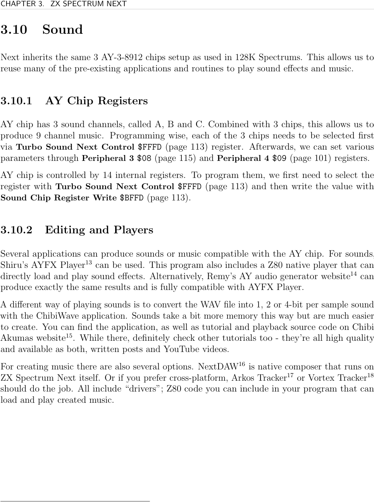

## 3.10 Sound

Next inherits the same 3 AY-3-8912 chips setup as used in 128K Spectrums. This allows us to reuse many of the pre-existing applications and routines to play sound effects and music.

### 3.10.1 AY Chip Registers

AY chip has 3 sound channels, called A, B and C. Combined with 3 chips, this allows us to produce 9 channel music. Programming wise, each of the 3 chips needs to be selected first via Turbo Sound Next Control $FFFD (page 113) register. Afterwards, we can set various parameters through Peripheral 3 $08 (page 115) and Peripheral 4 $09 (page 101) registers.

AY chip is controlled by 14 internal registers. To program them, we first need to select the register with Turbo Sound Next Control $FFFD (page 113) and then write the value with Sound Chip Register Write $BFFD (page 113).

### 3.10.2 Editing and Players

Several applications can produce sounds or music compatible with the AY chip. For sounds, Shiru’s AYFX Player13 can be used. This program also includes a Z80 native player that can directly load and play sound effects. Alternatively, Remy’s AY audio generator website14 can produce exactly the same results and is fully compatible with AYFX Player.

A different way of playing sounds is to convert the WAV file into 1, 2 or 4-bit per sample sound with the ChibiWave application. Sounds take a bit more memory this way but are much easier to create. You can find the application, as well as tutorial and playback source code on Chibi Akumas website15. While there, definitely check other tutorials too - they’re all high quality and available as both, written posts and YouTube videos.

For creating music there are also several options. NextDAW16 is native composer that runs on ZX Spectrum Next itself. Or if you prefer cross-platform, Arkos Tracker17 or Vortex Tracker18

should do the job. All include “drivers”; Z80 code you can include in your program that can load and play created music.

13https://shiru.untergrund.net/software.shtml#old 14https://zx.remysharp.com/audio/ 15https://www.chibiakumas.com/z80/platform4.php#LessonP35 16https://nextdaw.biasillo.com/ 17https://www.julien-nevo.com/arkostracker/ 18https://bulba.untergrund.net/vortex_e.htm

CHAPTER 3. ZX SPECTRUM NEXT

### 3.10.3 Examples

Before we can start playing sounds, we need to enable the sound hardware. While this is usually enabled by default, it’s nonetheless a good idea to ensure our program will always run under the same conditions.

```
; Setup Turbo Sound chip
LD BC, $FFFD
; Turbo Sound Next Control Register
LD A, %11111101
; Enable left+right audio, select AY1
OUT (C), A
; Setup mapping of chip channels to stereo channels
NEXTREG $08, %00010010 ; Use ABC, enable internal speaker $turbosound
NEXTREG $09, %11100000 ; Enable mono for AY1-3
```

; Setup Turbo Sound chip 1

LD BC, $FFFD ; Turbo Sound Next Control Register 2

LD A, %11111101 ; Enable left+right audio, select AY1 3

OUT (C), A 4

5

; Setup mapping of chip channels to stereo channels 6

NEXTREG $08, %00010010 ; Use ABC, enable internal speaker $turbosound 7

NEXTREG $09, %11100000 ; Enable mono for AY1-3 8

Programming AY consists of writing various values to its registers. As mentioned, this is a two-step process: first select register number, then write the value. Multiple writes are required for each tone to set period, volume etc. To make it simpler, I created a subroutine. It takes 2 parameters: A for register number (0-13) and D with value to write.

```
WriteDToAYReg:
; Select desired register
LD BC, $FFFD
OUT (C), A
; Write given value
LD A, D
LD BC, $BFFD
OUT (C), A
RET
```

WriteDToAYReg: 1

; Select desired register 2

LD BC, $FFFD 3

OUT (C), A 4

5

; Write given value 6

LD A, D 7

LD BC, $BFFD 8

OUT (C), A 9

10

RET 11

Companion code on GitHub, folder sound includes expanded code as well as a simple player that plays multiple tones in sequence. For the purposes of this book, I used Remy’s AY audio generator website to load one of the example effects, then manually copied raw values into the source code. Laborious process to say the least - this is not how effects should be handled in real life. But I wanted to learn and demonstrate how to program AY chip, not how to use ready-made drivers to play effects or music. Furthermore, my “player” blocks the main loop; ideally, sound effects and music would play on the interrupt handler. This could be a nice homework for the reader - example in section 3.12, page 119 should give you an idea of how to achieve this - happy coding!

CHAPTER 3. ZX SPECTRUM NEXT

### 3.10.4 Sound Ports and Registers

Turbo Sound Next Control $FFFD

When bit 7 is 1:

Bit Effect 7 1 1 to enable left audio 6 1 to enable right audio 5 Must be 1 4-2 Selects active chip: 1-0 Unused 00 AY3 01 AY2 10 AY1 11

When bit 7 is 0:

Bit Effect 7 0 Selects given AY register number for read or write from active sound chip 6-0

Sound Chip Register Write $BFFD

Bit Effect Writes given value to currently selected register:


0 - Channel A tone, low byte

1 - Channel A tone, high 4-bits

2 - Channel B tone, low byte

3 - Channel B tone, high 4-bits

4 - Channel C tone, low byte

5 - Channel C tone, high 4-bits


6 - Noise period

7 - Flags

8 - Channel A volume/envelope

9 - Channel B volume/envelope

10 - Channel C volume/envelope

Note: Registers 8-10 work as volume control if bit 4 is 0, otherwise envelop generator is used (see registers 11-13). In this case bits 3-0 are ignored.

11 - Envelope period fine

12 - Envelope period coarse

13 - Envelope shape

“Hold” envelope generator performs 1 cycle then holds the end value cycles continuously Al “Alternate” If “hold” set the value held is initial value the value held is the final value If “hold” not set envelope generator alters direction after each cycle resets after each cycle At “Attack” the generator counts up the generator counts down “Continue” “hold” is followed the envelope generator performs one cycle then drops volume to 0 and stays there, overriding “hold”


Peripheral 2 $06

Bit Effect 1 to enable CPU speed mode key ”F8”, 0 to disable (1 after soft reset) Core 3.1.2+: Divert BEEP-only to internal speaker (0 after hard reset) Pre core 3.1.2: DMA mode, 0 zxnDMA, 1 Z80 DMA (0 after hard reset) Core 2.0+: 1 to enable ”F3” key (50/60 Hz switch) (1 after soft reset) Pre core 2.0: ”Enable Lightpen” 1 to enable DivMMC automap and DivMMC NMI by DRIVE button (0 after hard reset) 1 to enable multiface NMI by M1 button (0 after hard reset) 1 to set primary device to mouse in PS/2 mode, 0 to set to keyboard Audio chip mode: Disabled Core 3.0+: Hold all AY in reset

Peripheral 3 $08

Bit Effect 1 unlock / 0 lock port Memory Paging Control $7FFD (page 41) paging 1 to disable RAM and I/O port contention (0 after soft reset) AY stereo mode (0 = ABC, 1 = ACB) (0 after hard reset) Enable internal speaker (1 after hard reset) Enable 8-bit DACs (A,B,C,D) (0 after hard reset) Enable port $FF Timex video mode read (0 after hard reset) Enable Turbosound (currently selected AY is frozen when disabled) (0 after hard reset) Implement Issue 2 keyboard (port $FE reads as early ZX boards) (0 after hard reset)

Peripheral 4 $09

See description under Sprites, section 3.8.7, page 101.

CHAPTER 3. ZX SPECTRUM NEXT

This page intentionally left empty

CHAPTER 3. ZX SPECTRUM NEXT

## 3.11 Keyboard

Next inherits ZX Spectrum keyboard handling, so all legacy programs will work out of the box. Additionally, it allows reading the status of extended keys.

### 3.11.1 Legacy Keyboard Status

ZX Spectrum uses 8 5 matrix for reading keyboard status. This means 40 distinct keys can be represented. The keyboard is read from ULA Control Port Read $xxFE (page 118) with particular high bytes. There are 8 possible bytes, each will return the status of 5 associated keys. If a key is pressed, the corresponding bit is set to 0 and vice versa.

Example for checking if P or I is pressed:

```
LD BC, $DFFE
; We want to read keys..... YUIOP
IN A, (C)
; A holds values in bits... 43210
checkP:
BIT 0, A
; test bit 0 of A (P key)
JR NZ checkI
; if bit0=1, P not pressed
...
; P is pressed
checkI:
BIT 2, A
; test bit 2 of A (I key)
JR NZ continue ; if bit2=1, I not pressed
...
; I is pressed
continue:
```

LD BC, $DFFE ; We want to read keys..... YUIOP 1

IN A, (C) ; A holds values in bits... 43210 2

checkP: 3

BIT 0, A ; test bit 0 of A (P key) 4

JR NZ checkI ; if bit0=1, P not pressed 5

... ; P is pressed 6

checkI: 7

BIT 2, A ; test bit 2 of A (I key) 8

JR NZ continue ; if bit2=1, I not pressed 9

... ; I is pressed 10

continue: 11

As mentioned in Ports chapter, section 3.1.3, page 33, we can slightly improve performance if we replace first two lines with:

```
LD A, $DF
IN ($FE)
```

LD A, $DF 1

IN ($FE) 2

Reading the port in first example requires 22 t-states (10+12) vs. 18 (7+11). The difference is small, but it can add up as typically keyboard is read multiple times per frame.

The first program is more understandable at a glance - the port address is given as a whole 16-bit value, as usually provided in the documentation. The second program splits it into 2 8-bit values, so intent may not be immediately apparent. Of course, one learns the patterns with experience, but it nonetheless demonstrates the compromise between readability and speed.

### 3.11.2 Next Extended Keys

Next uses larger 8 7 matrix for keyboard, with 10 additional keys. By default, hardware is translating keys from extra two columns into the existing 8 5 set. But you can turn this off with bit 4 of ULA Control $68 (page 91). Extra keys can be read separately via Extended Keys 0 $B0 and Extended Keys 1 $B1, details on page 118.

### 3.11.3 Keyboard Ports and Registers

ULA Control Port Read $xxFE


Returns keyboard status when read with certain high byte values:

xx

$7F Symb Space $BF Enter $DF $EF $F7 $FB $FD $FE Caps

Bits are reversed: if a key is pressed, the corresponding bit is 0, if a key is not pressed, bit is 1.

Note: when written to, ULA Control Port Write $xxFE is used to set border colour and audio devices. See ULA Layer, section 3.5.6, page 71 for details.

ULA Control $68

See description under Tilemap, section 3.7.6, page 91.

Extended Keys 0 $B0

Extended Keys 1 $B1

$B0 $B1 Bit Effect 0 if key pressed, 1 otherwise ; Delete 0 if key pressed, 1 otherwise " Edit 0 if key pressed, 1 otherwise , Break 0 if key pressed, 1 otherwise . Inv Video 0 if key pressed, 1 otherwise Up True Video 0 if key pressed, 1 otherwise Down Graph 0 if key pressed, 1 otherwise Left Caps Lock 0 if key pressed, 1 otherwise Right Extend

Available since core 3.1.5

CHAPTER 3. ZX SPECTRUM NEXT

## 3.12 Interrupts on Next

Like many other functionalities, Next also inherits interrupts handling from ZX Spectrum. As described in the Z80 chapter, section 2.4, page 19, Interrupt Mode 0 is used for a short period of time after booting up, before ROM activates Mode 1. IM1 remains active unless we explicitly change it. To replace the default IM1 interrupt handler, we can page out ROM or change to Interrupt Mode 2.

Both IM1 and IM2 are triggered by standard Spectrum ULA on every video frame. However timing can be adjusted using Video Line Interrupt Control $22 and Video Line Interrupt Value $23 registers (page 125). This allows disabling standard ULA interrupt, or add an extra interrupt that occurs on a particular video line.

Interrupts are most frequently used for driving music playback. Though they can also be used for other purposes such as synchronizing game state etc.

### 3.12.1 Interrupt Mode 1

In Interrupt Mode 1, an interrupt handler is expected on address $0038 in ROM. Default handler updates frame counter system variable, scans the keyboard and updates keyboard state system variables. We can replace it with our routine by paging out ROM.

Let’s see how to do this with an example. We will use the interrupt routine to update an 8-bit counter. The example uses sjasmplus directives to establish paging. If you are using a different assembler, you may need to change! First, let’s prepare the groundwork - declare the variable and main part of the program:

```
DEVICE ZXSPECTRUMNEXT ; this is Next program - important for paging setup!
ORG $8000
; set PC to $8000
Start:
DI
; disable interrupts while we page out ROM
NEXTREG $50, 28
; page out ROM in slot 0 ($000-$1FFF) with page 28
IM 1
; enable Interrupt Mode 1
EI
; enable interrupts
.loop:
JP .loop
; infinite loop
RET
; this is never reached...
counter: DB 0
; counter variable
```

DEVICE ZXSPECTRUMNEXT ; this is Next program - important for paging setup! 1

2

ORG $8000 ; set PC to $8000 3

Start: 4

DI ; disable interrupts while we page out ROM 5

NEXTREG $50, 28 ; page out ROM in slot 0 ($000-$1FFF) with page 28 6

IM 1 ; enable Interrupt Mode 1 7

EI ; enable interrupts 8

9

.loop: 10

JP .loop ; infinite loop 11

RET ; this is never reached... 12

13

counter: DB 0 ; counter variable 14

The first directive tells sjasmplus to generate the code for Next. This will become important later on. Then we set the program counter to $8000; all subsequent instructions and data will be assembled starting at this address.

Next, we are paging out ROM in 8K slot 0 with bank 28. We’ll write our interrupt handler subroutine into this bank later on. Afterwards, we enable Interrupt Mode 1. This is optional;

CHAPTER 3. ZX SPECTRUM NEXT

by default, Next will run in this mode already, but being explicit is more future proof. Maybe another program would change to IM2. Note how we disable interrupts during this setup to prevent undesired side effects.

The remaining part is simply an infinite loop to prevent the program from exiting. And finally, we declare our counter variable.

The interrupt subroutine is expected at $0038. There are several ways to achieve this with sjasmplus. I opted for explicit slot/bank technique so we’re in control of the paging:

```
SLOT 6
; activate slot 6
PAGE 28
; load page 28K to active slot
ORG $C038
; set PC to $C038
InterruptHandler:
LD HL, counter
; load address of counter var
INC (HL)
; increment it
EI
; enable interrupts
RETI
; return from interrupt
```

SLOT 6 ; activate slot 6 1

PAGE 28 ; load page 28K to active slot 2

ORG $C038 ; set PC to $C038 3

4

InterruptHandler: 5

LD HL, counter ; load address of counter var 6

INC (HL) ; increment it 7

EI ; enable interrupts 8

RETI ; return from interrupt 9

This is where the previously mentioned DEVICE directive comes to play - sjasmplus decides slot and bank configuration based on it. ZXSPECTRUMNEXT assumes 8K slot and bank size. Lines 1-3 are the key to ensure our interrupt handler will be present on $0038:

ˆ SLOT directive tells sjasmplus we want the following section to be loaded into 8K slot 6, addresses $C000-$DFFF.

ˆ Next, we specify 8K bank number to load into the selected slot with PAGE directive. Subsequent code will be assembled into this bank. This step is optional; default bank would be used otherwise, 0 in this case (see section 3.2, page 35). Being explicit is more future proof though. I chose bank 28 but feel free to use others. What’s important is to use the same bank with NEXTREG instruction when paging out ROM!

ˆ Since we selected slot 6, we also need to set the program counter to the corresponding address - we want the code to be assembled into the selected bank that we will page into ROM slot 0 at runtime. Because interrupt handler is expected on $0038, we need to start at $C038 (slot 6 starts at $C000, but this will be loaded into slot 0 at $0000).

Not that hard, right!? It may take a while to wrap the head around those SLOT, PAGE and ORG directives and addresses, but it’s quite straightforward otherwise. While at it: this same technique can be used to load assets into specific banks and then page them in during runtime!

You can find the full source code for this example in companion code, folder im1. Feel free to run it, set breakpoints and see how the counter is being changed.

Note there’s one potentially deal-breaking issue with this approach: since we are paging out ROM, we can’t use any of its functionality. For example, ROM routines like print text at $203C. But we can do this with IM2 - read on!

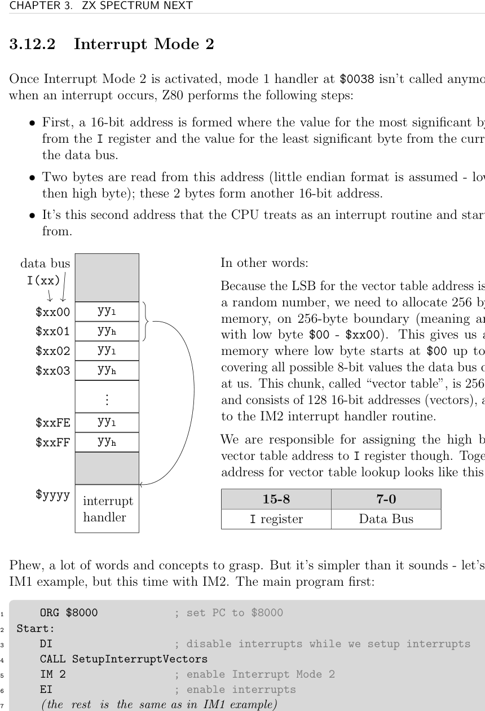

### 3.12.2 Interrupt Mode 2

Once Interrupt Mode 2 is activated, mode 1 handler at $0038 isn’t called anymore. Instead, when an interrupt occurs, Z80 performs the following steps:

ˆ First, a 16-bit address is formed where the value for the most significant byte is taken from the I register and the value for the least significant byte from the current value of the data bus.

ˆ Two bytes are read from this address (little endian format is assumed - low byte first, then high byte); these 2 bytes form another 16-bit address.

ˆ It’s this second address that the CPU treats as an interrupt routine and starts executing from.

In other words:

data bus

I(xx)

Because the LSB for the vector table address is effectively a random number, we need to allocate 256 bytes in the memory, on 256-byte boundary (meaning any address with low byte $00 - $xx00). This gives us a chunk of memory where low byte starts at $00 up to $FF, thus covering all possible 8-bit values the data bus can “throw” at us. This chunk, called “vector table”, is 256 bytes long and consists of 128 16-bit addresses (vectors), all pointing to the IM2 interrupt handler routine.

$xx00 $xx01 $xx02 $xx03

$xxFE $xxFF

We are responsible for assigning the high byte of the vector table address to I register though. Together 16-bit address for vector table lookup looks like this:

$yyyy

Phew, a lot of words and concepts to grasp. But it’s simpler than it sounds - let’s rewrite the IM1 example, but this time with IM2. The main program first:

```
ORG $8000
; set PC to $8000
Start:
DI
; disable interrupts while we setup interrupts
CALL SetupInterruptVectors
IM 2
; enable Interrupt Mode 2
EI
; enable interrupts
(the rest is the same as in IM1 example)
```

ORG $8000 ; set PC to $8000

Start:

; disable interrupts while we setup interrupts

CALL SetupInterruptVectors

; enable Interrupt Mode 2

; enable interrupts

(the rest is the same as in IM1 example)

Almost the same except for the NEXTREG replaced with SetupInterruptVectors subroutine call that initializes vector table:

```
SetupInterruptVectors:
LD DE, InterruptHandler
; prepare pointer to IM2 routine
```

SetupInterruptVectors:

LD DE, InterruptHandler ; prepare pointer to IM2 routine

CHAPTER 3. ZX SPECTRUM NEXT

```
LD HL, InterruptVectorTable ; prepare pointer to vector table
LD B, 128
; we need to fill 128 addresses
.loop:
LD (HL), E
; copy low byte
INC HL
; increment vector table pointer
LD (HL), D
; copy high byte
INC HL
; increment vector table pointer
DJNZ .loop
; repeat until the end of the vector table
LD A, InterruptVectorTable >> 8
LD I, A
; I now holds high byte of vector table
RET
```

LD HL, InterruptVectorTable ; prepare pointer to vector table

LD B, 128 ; we need to fill 128 addresses

.loop:

LD (HL), E ; copy low byte 6

INC HL ; increment vector table pointer 7

LD (HL), D ; copy high byte 8

INC HL ; increment vector table pointer 9

DJNZ .loop ; repeat until the end of the vector table 10

LD A, InterruptVectorTable >> 8 11

LD I, A ; I now holds high byte of vector table 12

RET 13

The subroutine fills in all 128 entries of the vector table with the address of our actual interrupt routine. The only remaining piece is the declaration of the vector table itself; I chose .ALIGN 256 directive that fills in bytes until 256-byte boundary is reached:

```
.ALIGN 256
; section must start on 256-byte boundary $xx00
InterruptVectorTable:
; I register should therefore have value $xx
DEFS 128*2
; 128 16-bit vectors
```

; section must start on 256-byte boundary $xx00 .ALIGN 256 1

; I register should therefore have value $xx InterruptVectorTable: 2

DEFS 128*2 ; 128 16-bit vectors 3

The interrupt handler itself can reside anywhere in the memory. Code-wise it’s the same as for IM1 mode previously.

So there’s some more work when using IM2 mode, but it leaves ROM untouched so we can rely on its routines and other functionality. I only demonstrated relevant bits here. You can find a fully working example in companion code, folder im2 (make sure to read the next section!).

What About Odd Data Bus Values?

Sharp-eyed readers may be wondering what would happen if the value from the data bus is odd? Given our IM2 example from above, our interrupt handler happens to be on address $802A. Therefore the vector table would have the following contents:

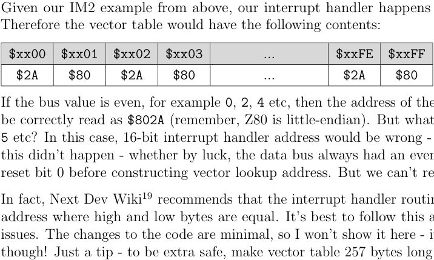

If the bus value is even, for example 0, 2, 4 etc, then the address of the interrupt handler would be correctly read as $802A (remember, Z80 is little-endian). But what if the value is odd, 1, 3, 5 etc? In this case, 16-bit interrupt handler address would be wrong - $2A80! During my tests, this didn’t happen - whether by luck, the data bus always had an even number, or, maybe Z80 reset bit 0 before constructing vector lookup address. But we can’t rely on luck!

In fact, Next Dev Wiki19 recommends that the interrupt handler routine is always placed on an address where high and low bytes are equal. It’s best to follow this advice to avoid potential issues. The changes to the code are minimal, so I won’t show it here - it could be a nice exercise though! Just a tip - to be extra safe, make vector table 257 bytes long in case the data bus has $FF. You can find a working example in companion code, folder im2safe.

19https://wiki.specnext.dev/Interrupts

CHAPTER 3. ZX SPECTRUM NEXT

### 3.12.3 Hardware Interrupt Mode 2

In addition to regular IM2, Next also supports a “Hardware IM2” mode. This mode works similar to legacy IM2 in that we still need to provide vector tables. But it properly implements the Z80 IM2 scheme with daisy chain priority. So when particular interrupt subroutine is called, we know exactly which device caused it without having to figure it out as needed in legacy IM2. Let’s go over the details with an example. First, the initialization:

```
DI
; disable interrupts
NEXTREG $C0, (InterruptVectorTable & %11100000) | %00000001
NEXTREG $C4, %10000001
; enable expansion bus INT and ULA interrupts
NEXTREG $C5, %00000000
; disable all CTC channel interrupts
NEXTREG $C6, %00000000
; disable UART interrupts
LD A, InterruptVectorTable >> 8
LD I, A
; I now holds high byte of vector table
IM 2
; enable HW Interrupt Mode 2
EI
; enable interrupts
```

DI ; disable interrupts 1

NEXTREG $C0, (InterruptVectorTable & %11100000) | %00000001 2

NEXTREG $C4, %10000001 ; enable expansion bus INT and ULA interrupts 3

NEXTREG $C5, %00000000 ; disable all CTC channel interrupts 4

NEXTREG $C6, %00000000 ; disable UART interrupts 5

6

LD A, InterruptVectorTable >> 8 7

LD I, A ; I now holds high byte of vector table 8

9

IM 2 ; enable HW Interrupt Mode 2 10

EI ; enable interrupts 11

Line 3 is where hardware IM2 mode is established. The crucial part is Interrupt Control $C0 (page 126) register: firstly, we are supplying the top 3 bits of LSB of the vector table to bits 7-5, and secondly, we enable IM2 mode by setting bit 0.

Lines 4-6 enable or disable specific interrupters with Interrupt Enable 0 $C4 (page 126), Interrupt Enable 1 $C5 (page 126) and Interrupt Enable 2 $C6 (page 127).

Lines 8-12 are the same as with legacy IM2 mode - we assign the LSB of the vector table address to I register. Then we enable IM2 mode and interrupts.

Interrupt vectors table is quite a bit different (in a good way though):

```
.ALIGN 32
InterruptVectorTable:
DW InterruptHandler
; 0 = line interrupt (highest priority)
DW InterruptHandler
; 1 = UART0 Rx
DW InterruptHandler
; 2 = UART1 Rx
DW InterruptHandler
; 3 = CTC channel 0
DW InterruptHandler
; 4 = CTC channel 1
DW InterruptHandler
; 5 = CTC channel 2
DW InterruptHandler
; 6 = CTC channel 3
DW InterruptHandler
; 7 = CTC channel 4
DW InterruptHandler
; 8 = CTC channel 5
DW InterruptHandler
; 9 = CTC channel 6
DW InterruptHandler
; 10 = CTC channel 7
DW InterruptHandlerULA
; 11 = ULA
DW InterruptHandler
; 12 = UART0 Tx
DW InterruptHandler
; 13 = UART1 Tx (lowest priority)
DW InterruptHandler
DW InterruptHandler
```

.ALIGN 32 1

InterruptVectorTable: 2

DW InterruptHandler ; 0 = line interrupt (highest priority) 3

DW InterruptHandler ; 1 = UART0 Rx 4

DW InterruptHandler ; 2 = UART1 Rx 5

DW InterruptHandler ; 3 = CTC channel 0 6

DW InterruptHandler ; 4 = CTC channel 1 7

DW InterruptHandler ; 5 = CTC channel 2 8

DW InterruptHandler ; 6 = CTC channel 3 9

DW InterruptHandler ; 7 = CTC channel 4 10

DW InterruptHandler ; 8 = CTC channel 5 11

DW InterruptHandler ; 9 = CTC channel 6 12

DW InterruptHandler ; 10 = CTC channel 7 13

DW InterruptHandlerULA ; 11 = ULA 14

DW InterruptHandler ; 12 = UART0 Tx

DW InterruptHandler ; 13 = UART1 Tx (lowest priority)

DW InterruptHandler

DW InterruptHandler

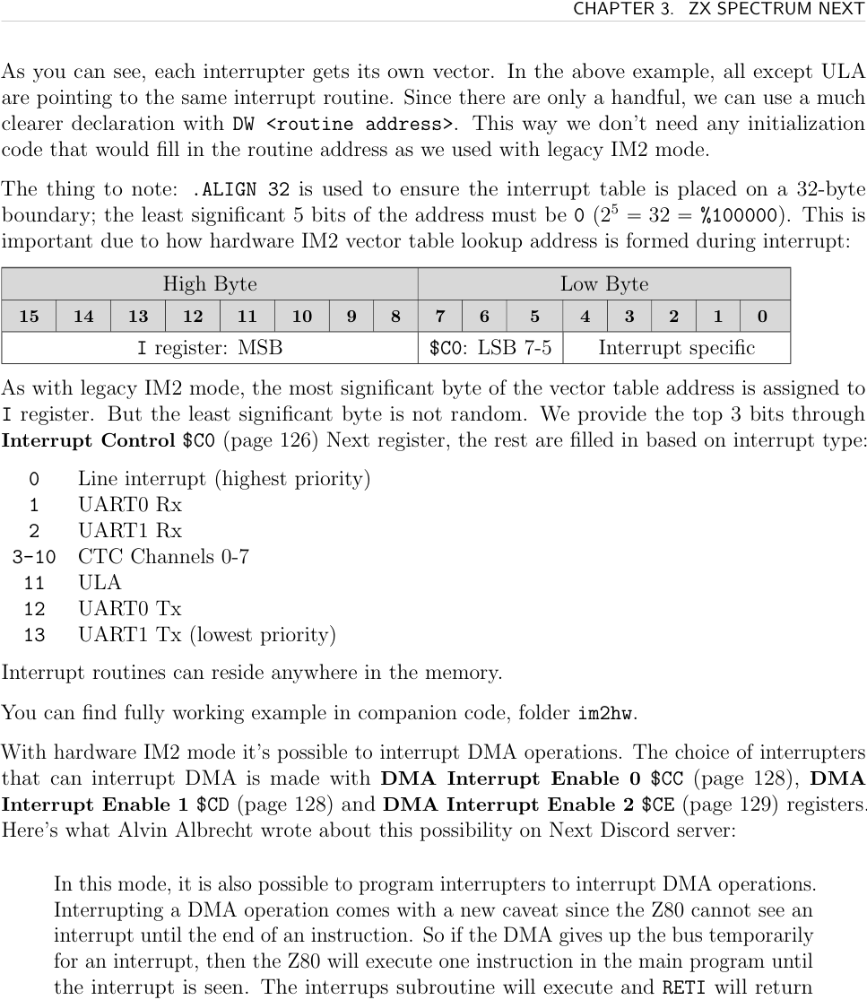

As you can see, each interrupter gets its own vector. In the above example, all except ULA are pointing to the same interrupt routine. Since there are only a handful, we can use a much clearer declaration with DW <routine address>. This way we don’t need any initialization code that would fill in the routine address as we used with legacy IM2 mode.

The thing to note: .ALIGN 32 is used to ensure the interrupt table is placed on a 32-byte boundary; the least significant 5 bits of the address must be 0 (25 32 %100000). This is important due to how hardware IM2 vector table lookup address is formed during interrupt:

As with legacy IM2 mode, the most significant byte of the vector table address is assigned to I register. But the least significant byte is not random. We provide the top 3 bits through Interrupt Control $C0 (page 126) Next register, the rest are filled in based on interrupt type:

Line interrupt (highest priority) UART0 Rx UART1 Rx CTC Channels 0-7 UART0 Tx UART1 Tx (lowest priority)

Interrupt routines can reside anywhere in the memory.

You can find fully working example in companion code, folder im2hw.

With hardware IM2 mode it’s possible to interrupt DMA operations. The choice of interrupters that can interrupt DMA is made with DMA Interrupt Enable 0 $CC (page 128), DMA Interrupt Enable 1 $CD (page 128) and DMA Interrupt Enable 2 $CE (page 129) registers. Here’s what Alvin Albrecht wrote about this possibility on Next Discord server:

In this mode, it is also possible to program interrupters to interrupt DMA operations. Interrupting a DMA operation comes with a new caveat since the Z80 cannot see an interrupt until the end of an instruction. So if the DMA gives up the bus temporarily for an interrupt, then the Z80 will execute one instruction in the main program until the interrupt is seen. The interrups subroutine will execute and RETI will return control to the DMA. Anyway there is another rabbit hole here.

For details and more, see this discussion on Discord20, highly recommended!

Very special thanks to the folks from Next Discord server: Alvin Albrecht for mentioning21

hardware IM2 mode and @varmfskii whos discussion22 and sample code was the basis for my exploration into this mode!

20https://discord.com/channels/556228195767156758/692885312296190102/894284968614854749 21https://discord.com/channels/556228195767156758/692885312296190102/865955247552462848 22https://discord.com/channels/556228195767156758/692885353161293895/817807486744526886

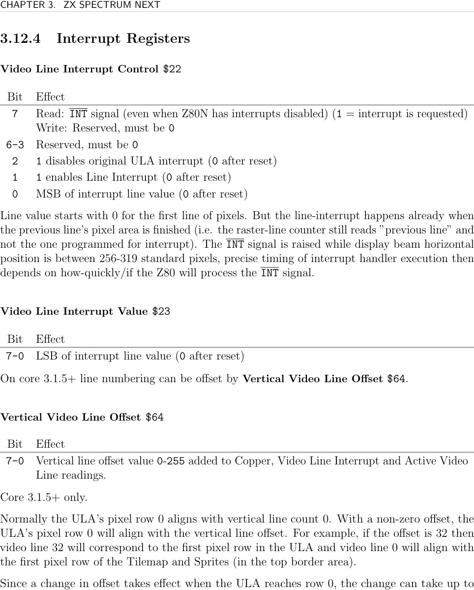

### 3.12.4 Interrupt Registers

Video Line Interrupt Control $22

Bit Effect Read: INT signal (even when Z80N has interrupts disabled) (1 = interrupt is requested) Write: Reserved, must be 0 Reserved, must be 0 1 disables original ULA interrupt (0 after reset) 1 enables Line Interrupt (0 after reset) MSB of interrupt line value (0 after reset)

Line value starts with 0 for the first line of pixels. But the line-interrupt happens already when the previous line’s pixel area is finished (i.e. the raster-line counter still reads ”previous line” and not the one programmed for interrupt). The INT signal is raised while display beam horizontal position is between 256-319 standard pixels, precise timing of interrupt handler execution then depends on how-quickly/if the Z80 will process the INT signal.

Video Line Interrupt Value $23

Bit Effect LSB of interrupt line value (0 after reset)

On core 3.1.5+ line numbering can be offset by Vertical Video Line Offset $64.

Vertical Video Line Offset $64

Bit Effect Vertical line offset value 0-255 added to Copper, Video Line Interrupt and Active Video Line readings.

Core 3.1.5+ only.

Normally the ULA’s pixel row 0 aligns with vertical line count 0. With a non-zero offset, the ULA’s pixel row 0 will align with the vertical line offset. For example, if the offset is 32 then video line 32 will correspond to the first pixel row in the ULA and video line 0 will align with the first pixel row of the Tilemap and Sprites (in the top border area).

Since a change in offset takes effect when the ULA reaches row 0, the change can take up to one frame to occur.


Interrupt Control $C0

Bit Effect Programmable portion of IM2 vector Reserved, must be 0 1 enables, 0 disabled stackless NMI response Reserved, must be 0 Maskable interrupt mode: 1 IM2, 0 pulse

If bit 3 is set, the return address pushed during an NMI acknowledge cycle will be written to NMI Return Address LSB $C2 and NMI Return Address MSB $C3 instead of the memory (the stack pointer will be decremented). The first RETN after the NMI acknowledge will then take its return address from the registers instead of memory (the stack pointer will be incremented). If bit 3 is 0, and in other circumstances (if there is no NMI first), RETN functions normally.

NMI Return Address LSB $C2

NMI Return Address MSB $C3

Bit Effect LSB or MSB of the return address written during an NMI acknowledge cycle

Interrupt Enable 0 $C4

Bit Effect Expansion bus INT (1 after reset) Reserved, must be 0 1 enables, 0 disables line interrupt (0 after reset) 1 enables, 0 disabled ULA interrupt (1 after reset)

Interrupt Enable 1 $C5

Bit Effect 1 enables, 0 disables CTC channel 7 interrupt 1 enables, 0 disables CTC channel 6 interrupt 1 enables, 0 disables CTC channel 5 interrupt 1 enables, 0 disables CTC channel 4 interrupt 1 enables, 0 disables CTC channel 3 interrupt 1 enables, 0 disables CTC channel 2 interrupt 1 enables, 0 disables CTC channel 1 interrupt 1 enables, 0 disables CTC channel 0 interrupt

All bits 0 after reset.


Interrupt Enable 2 $C6

Bit Effect Reserved, must be 0 UART1 Tx empty UART1 Rx half full UART1 Rx available Reserved, must be 0 UART0 Tx empty UART0 Rx half full UART0 Rx available

All bits 0 after reset. Rx half full overrides Rx available.

Interrupt Status 0 $C8

Bit Effect Reserved, must be 0 Line interrupt ULA interrupt

Read indicates whether the given interrupt was generated in the past. Write with 1 clears given bit unless in IM2 mode (bit 0 set on Interrupt Control $C0 (page 126)) with interrupts enabled.

Interrupt Status 1 $C9

Bit Effect CTC channel 7 interrupt CTC channel 6 interrupt CTC channel 5 interrupt CTC channel 4 interrupt CTC channel 3 interrupt CTC channel 2 interrupt CTC channel 1 interrupt CTC channel 0 interrupt

Read indicates whether the given interrupt was generated in the past. Write with 1 clears given bit unless in IM2 mode (bit 0 set on Interrupt Control $C0, page 126) with interrupts enabled.


Interrupt Status 2 $CA

Bit Effect Reserved, must be 0 UART1 Tx empty interrupt UART1 Rx half full interrupt UART1 Rx available interrupt Reserved, must be 0 UART0 Tx empty interrupt UART0 Rx half full interrupt UART0 Rx available interrupt

Read indicates whether the given interrupt was generated in the past. Write with 1 clears given bit unless in IM2 mode (bit 0 set on Interrupt Control $C0, page 126) with interrupts enabled.

DMA Interrupt Enable 0 $CC

Bit Effect Reserved, must be 0 1 allows, 0 prevents line interrupt from interrupting DMA 1 allows, 0 prevents ULA interrupt from interrupting DMA

DMA Interrupt Enable 1 $CD

Bit Effect 1 allows, 0 prevents CTC channel 7 interrupt from interrupting DMA 1 allows, 0 prevents CTC channel 6 interrupt from interrupting DMA 1 allows, 0 prevents CTC channel 5 interrupt from interrupting DMA 1 allows, 0 prevents CTC channel 4 interrupt from interrupting DMA 1 allows, 0 prevents CTC channel 3 interrupt from interrupting DMA 1 allows, 0 prevents CTC channel 2 interrupt from interrupting DMA 1 allows, 0 prevents CTC channel 1 interrupt from interrupting DMA 1 allows, 0 prevents CTC channel 0 interrupt from interrupting DMA


DMA Interrupt Enable 2 $CE

Bit Effect Reserved, must be 0 1 allows, 0 prevents UART1 Tx empty from interrupting DMA 1 allows, 0 prevents UART1 Rx half full from interrupting DMA 1 allows, 0 prevents UART1 Rx available from interrupting DMA Reserved, must be 0 1 allows, 0 prevents UART0 Tx empty from interrupting DMA 1 allows, 0 prevents UART0 Rx half full from interrupting DMA 1 allows, 0 prevents UART0 Rx available from interrupting DMA

CHAPTER 3. ZX SPECTRUM NEXT

This page intentionally left empty

Chapter 4

Instructions at a Glance

## 4.1 8-Bit Arithmetic and Logical . . . . . . . . . . . . . . . . . . . . . . . . . . . . . 133

## 4.2 16-Bit Arithmetic . . . . . . . . . . . . . . . . . . . . . . . . . . . . . . . . . . . 134

## 4.3 8-Bit Load . . . . . . . . . . . . . . . . . . . . . . . . . . . . . . . . . . . . . . . 135

## 4.4 General-Purpose Arithmetic and CPU Control . . . . . . . . . . . . . . . . . . . 136

## 4.5 16-Bit Load . . . . . . . . . . . . . . . . . . . . . . . . . . . . . . . . . . . . . . 137

## 4.6 Stack . . . . . . . . . . . . . . . . . . . . . . . . . . . . . . . . . . . . . . . . . . 138

## 4.7 Exchange . . . . . . . . . . . . . . . . . . . . . . . . . . . . . . . . . . . . . . . 138

## 4.8 Bit Set, Reset and Test . . . . . . . . . . . . . . . . . . . . . . . . . . . . . . . . 139

## 4.9 Rotate and Shift . . . . . . . . . . . . . . . . . . . . . . . . . . . . . . . . . . . 140

## 4.10 Jump . . . . . . . . . . . . . . . . . . . . . . . . . . . . . . . . . . . . . . . . . . 141

## 4.11 Call and Return . . . . . . . . . . . . . . . . . . . . . . . . . . . . . . . . . . . . 142

## 4.12 Block Transfer, Search . . . . . . . . . . . . . . . . . . . . . . . . . . . . . . . . 143

## 4.13 Input . . . . . . . . . . . . . . . . . . . . . . . . . . . . . . . . . . . . . . . . . . 144

## 4.14 Output . . . . . . . . . . . . . . . . . . . . . . . . . . . . . . . . . . . . . . . . . 144

## 4.15 ZX Spectrum Next Extended . . . . . . . . . . . . . . . . . . . . . . . . . . . . 145

This chapter presents all instructions at a glance for quick info and to easily compare them when choosing the most optimal combination for the task at hand. Instructions are grouped into logical sections based on the area they operate on.

Instruction Execution

B Number of bytes instruction uses in RAM Mc Number of machine cycles instruction takes to complete Ts Number of clock periods instruction requires to complete

Flags (copied from section 2.1.5, page 11 as convenience)

SF Sign Set if 2-complement value is negative. ZF Zero Set if the result is zero. Half-Carry The half-carry of an addition/subtraction (from bit 3 to 4)*. HY PV Parity/Overflow This flag can either be the parity of the result (PF), or 2-complement signed overflow (VF). Add/Subtract Indicates the last operation was an addition (0) or a subtraction (1)*. NF CF Carry Set if there was a carry from the most significant bit.

- Primarily used for BCD operations.

Effects

0/1 Flag is set to 0 or 1 Flag is modified according to operation Ù Flag is not affected Effect on flag is unpredictable ? P/V flag is used as overflow VF P/V flag is used as parity PF Special case, see description under the table or in chapter 5, page 147

Notes

YF and XF flags are not represented; they’re irrelevant from the programmer point of view.

I used 4 sources for comparing effects: Z80 undocumented1, Programming the Z80 third edition2, Zilog Z80 manual3 and Next Dev Wiki4. Where different and I couldn’t verify, I opted for variant that matches most sources with slightly greater precedence for Next Dev Wiki side.

1http://www.myquest.nl/z80undocumented/ 2http://www.z80.info/zaks.html 3https://www.zilog.com/docs/z80/um0080.pdf 4https://wiki.specnext.dev/Extended_Z80_instruction_set

CHAPTER 4. INSTRUCTIONS AT A GLANCE

## 4.1 8-Bit Arithmetic and Logical

Symbolic Flags Opcode Mnemonic Operation SF ZF HF PV NF CF 76 543 210 Hex B Mc Ts Comments Ù Ù Ù Ù r r ADD A,r VF 0 10 000 r .. 1B 1 4 AÐA+r B 000 C 001 D 010 E 011 H 100 L 101 A 111

Ù Ù Ù Ù ADD A,p VF 0 11 011 101 DD 2B 2 8 AÐA+p 10 000 p ..

Ù Ù Ù Ù ADD A,q VF 0 11 111 101 FD 2B 2 8 AÐA+q 10 000 q ..

Ù Ù Ù Ù 11 000 110 C6 2B 2 7 ADD A,n VF 0 AÐA+n n ..

Ù Ù Ù Ù 10 000 110 86 1B 2 7 ADD A,(HL) VF 0 AÐA+(HL) p p B 000 C 001 D 010 E 011 IXh 100 IXl 101 A 111

Ù Ù Ù Ù ADD A,(IX+d) VF 0 11 011 101 DD 3B 5 19 AÐA+(IX+d) 10 000 110 86

d ..

Ù Ù Ù Ù ADD A,(IY+d) VF 0 11 111 101 FD 3B 5 19 AÐA+(IY+d) 10 000 110 86

d .. Ò ADC A,s2 Ù Ù Ù Ù VF 0 .. 001 ... AÐA+s+CF q q IYh 100 IYl 101

SUB s2 .. 010 ... AÐA-s

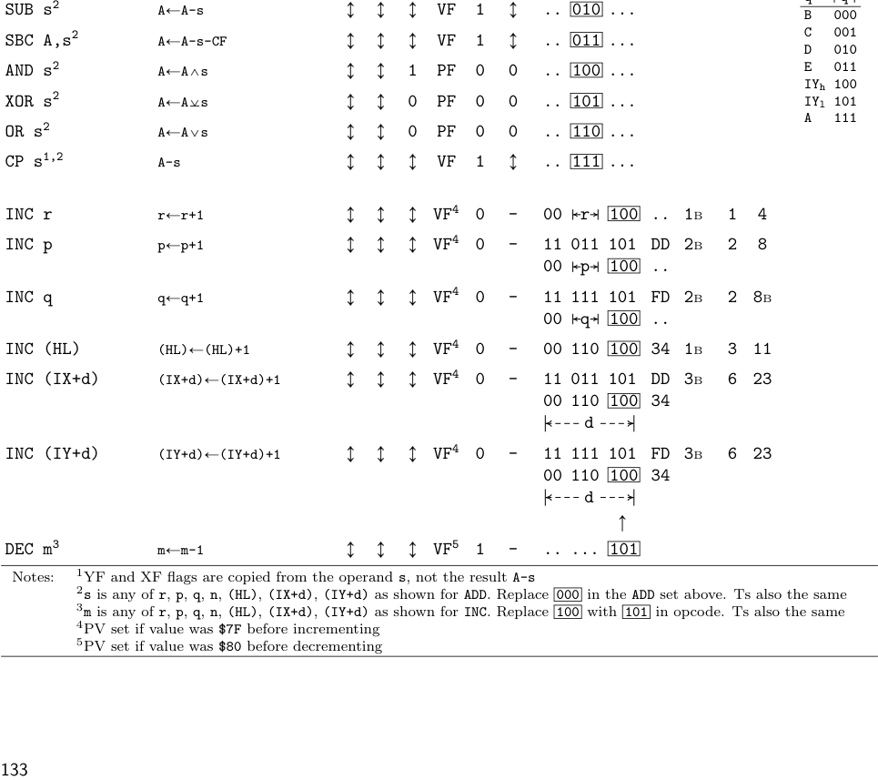

SBC A,s2 .. 011 ... AÐA-s-CF

AND s2 .. 100 ... AÐA^s

XOR s2 AÐAYs .. 101 ...

OR s2 .. 110 ... AÐA_s

CP s1,2 .. 111 ... A-s

INC r r 100 .. 1B rÐr+1

INC p pÐp+1 p 100 ..

INC q qÐq+1 q 100 ..

INC (IX+d) (IX+d)Ð(IX+d)+1

d

INC (IY+d) (IY+d)Ð(IY+d)+1

d

DEC m3 .. ... 101 mÐm-1

1YF and XF flags are copied from the operand s, not the result A-s Notes: 2s is any of r, p, q, n, (HL), (IX+d), (IY+d) as shown for ADD. Replace 000 in the ADD set above. Ts also the same 3m is any of r, p, q, n, (HL), (IX+d), (IY+d) as shown for INC. Replace 100 with 101 in opcode. Ts also the same 4PV set if value was $7F before incrementing 5PV set if value was $80 before decrementing

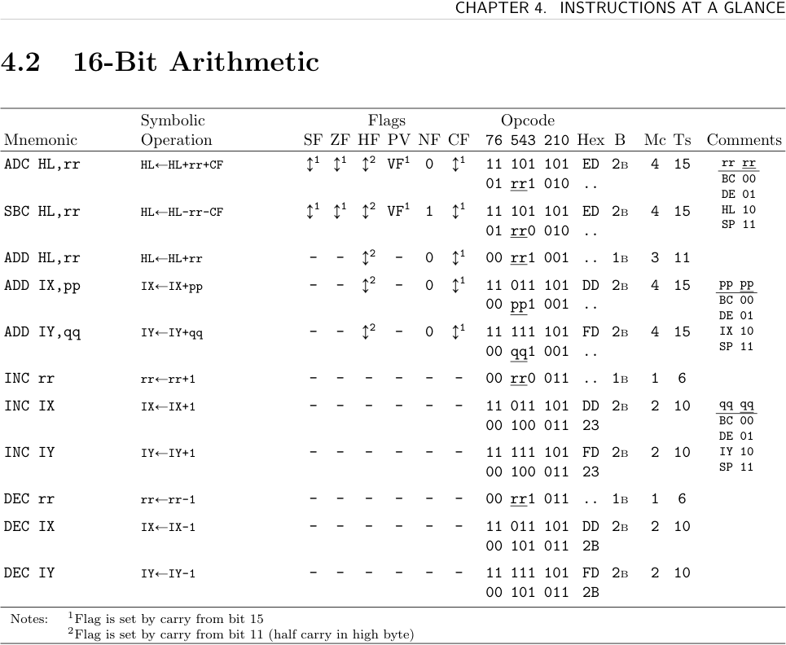

## 4.2 16-Bit Arithmetic

Symbolic Flags Opcode Mnemonic Operation 76 543 210 Hex B Mc Ts Comments rr rr ADC HL,rr HLÐHL+rr+CF

01 rr1 010 ..

SBC HL,rr HLÐHL-rr-CF 01 rr0 010 ..

ADD HL,rr 00 rr1 001 .. 1B HLÐHL+rr

pp pp ADD IX,pp IXÐIX+pp

00 pp1 001 ..

ADD IY,qq IYÐIY+qq 00 qq1 001 ..

INC rr 00 rr0 011 .. 1B rrÐrr+1

qq qq

DEC rr 00 rr1 011 .. 1B rrÐrr-1

1Flag is set by carry from bit 15 Notes: 2Flag is set by carry from bit 11 (half carry in high byte)

## 4.3 8-Bit Load

Symbolic Flags Opcode Mnemonic Operation 76 543 210 Hex B Mc Ts Comments r r LD r,r’ r r’ .. 1B rÐr’ r’ r’

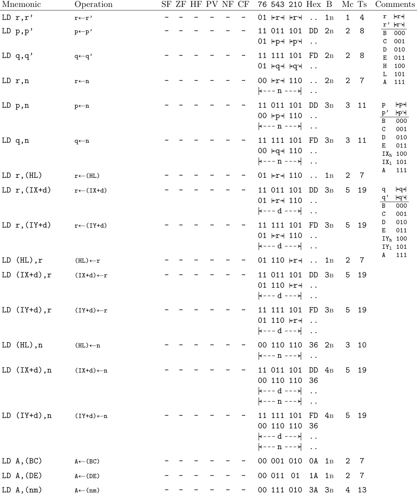

LD p,p’ pÐp’ p p’ ..

LD q,q’ qÐq’ q q’ ..

LD r,n r 110 .. 2B rÐn n ..

p p LD p,n pÐn p’ p’ IXh 100 IXl 101

p 110 .. n ..

LD q,n qÐn q 110 .. n ..

LD r,(HL) r 110 .. 1B rÐ(HL)

q q LD r,(IX+d) rÐ(IX+d) q’ q’ IYh 100 IYl 101

r 110 .. d ..

LD r,(IY+d) rÐ(IY+d) r 110 .. d ..

LD (HL),r r .. 1B (HL)Ðr

LD (IX+d),r (IX+d)Ðr r .. d ..

LD (IY+d),r (IY+d)Ðr r .. d ..

LD (HL),n (HL)Ðn n ..

LD (IX+d),n (IX+d)Ðn

d .. n ..

LD (IY+d),n (IY+d)Ðn

d .. n ..

LD A,(BC)

LD A,(DE)

LD A,(nm) AÐ(nm) m .. n ..

(continued on next page)

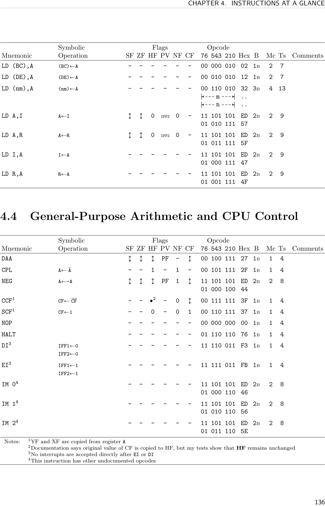

Symbolic Flags Opcode Mnemonic Operation 76 543 210 Hex B Mc Ts Comments LD (BC),A

LD (DE),A

LD (nm),A (nm)ÐA m .. n ..

## 4.4 General-Purpose Arithmetic and CPU Control

Symbolic Flags Opcode Mnemonic Operation 76 543 210 Hex B Mc Ts Comments

1YF and XF are copied from register A Notes: 2Documentation says original value of CF is copied to HF, but my tests show that HF remains unchanged 3No interrupts are accepted directly after EI or DI 4This instruction has other undocumented opcodes

## 4.5 16-Bit Load

Symbolic Flags Opcode Mnemonic Operation 76 543 210 Hex B Mc Ts Comments rr rr LD rr,nm 00 rr0 001 .. 3B rrÐnm

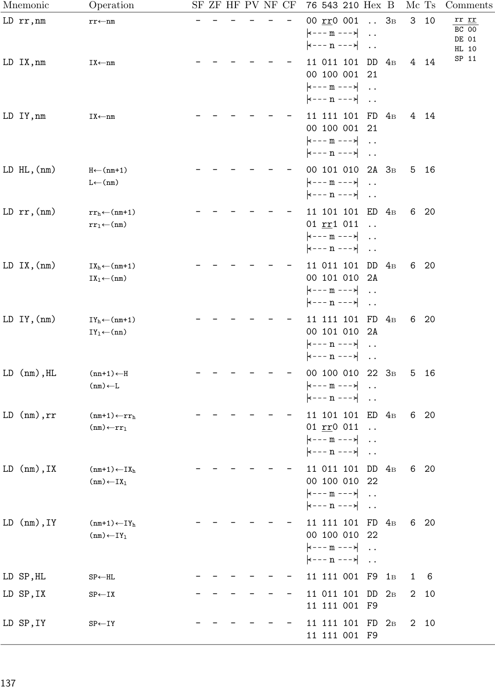

m .. n ..

LD IX,nm IXÐnm

m .. n ..

LD IY,nm IXÐnm

m .. n ..

LD HL,(nm) HÐ(nm+1) m .. LÐ(nm) n ..

LD rr,(nm) rrhÐ(nm+1) 01 rr1 011 .. rrlÐ(nm)

m .. n ..

LD IX,(nm) IXhÐ(nm+1) IXlÐ(nm)

m .. n ..

LD IY,(nm) IYhÐ(nm+1) IYlÐ(nn)

n .. n ..

LD (nm),HL (nn+1)ÐH m .. (nm)ÐL n ..

LD (nm),rr (nm+1)Ðrrh

01 rr0 011 .. (nm)Ðrrl

m .. n ..

LD (nm),IX (nm+1)ÐIXh (nm)ÐIXl

m .. n ..

LD (nm),IY (nm+1)ÐIYh (nm)ÐIYl

m .. n ..

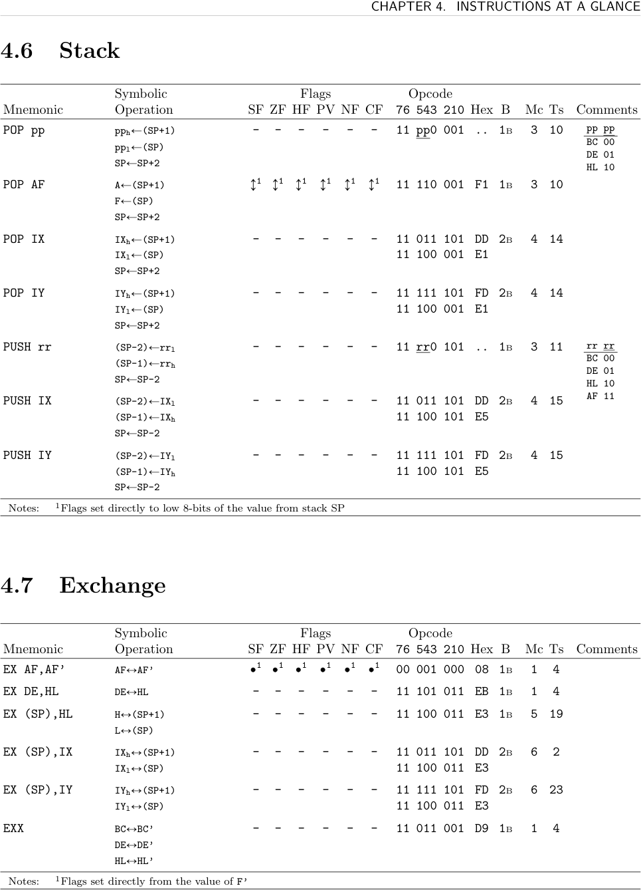

## 4.6 Stack

Symbolic Flags Opcode Mnemonic Operation 76 543 210 Hex B Mc Ts Comments pp pp POP pp 11 pp0 001 .. 1B pphÐ(SP+1)

pplÐ(SP)

IXhÐ(SP+1) IXlÐ(SP)

IYhÐ(SP+1)

IYlÐ(SP)

rr rr 11 rr0 101 .. 1B PUSH rr (SP-2)Ðrrl

(SP-1)Ðrrh

(SP-2)ÐIXl (SP-1)ÐIXh

(SP-2)ÐIYl (SP-1)ÐIYh

1Flags set directly to low 8-bits of the value from stack SP Notes:

## 4.7 Exchange

Symbolic Flags Opcode Mnemonic Operation 76 543 210 Hex B Mc Ts Comments EX AF,AF’ AFØAF’

EX (SP),HL

EX (SP),IX IXhØ(SP+1) IXlØ(SP)

EX (SP),IY IYhØ(SP+1) IYlØ(SP)

BCØBC’ DEØDE’ HLØHL’

1Flags set directly from the value of F’ Notes:

## 4.8 Bit Set, Reset and Test

Symbolic Flags Opcode Mnemonic Operation 76 543 210 Hex B Mc Ts Comments ?1 ?1 r r BIT b,r ZFÐ rb

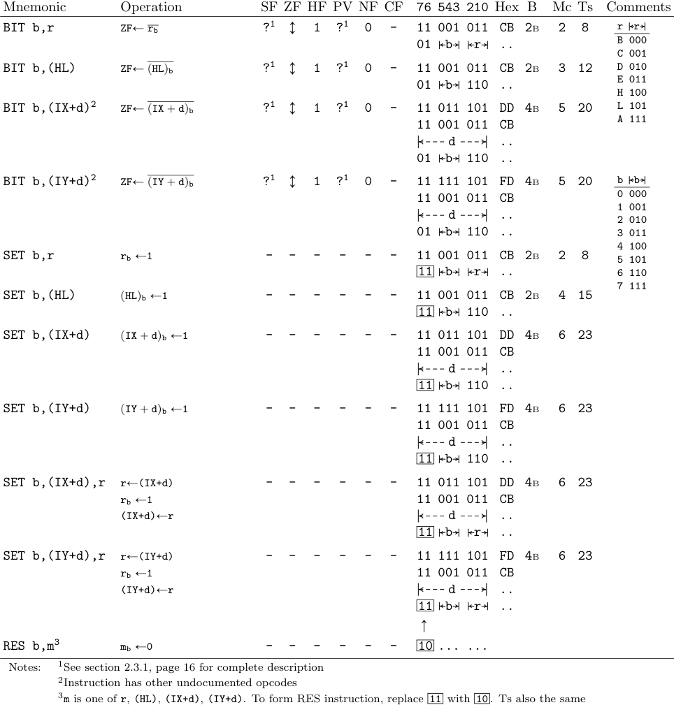

b r ..

?1 ?1 BIT b,(HL) ZFÐ pHLqb b 110 ..

BIT b,(IX+d)2 ?1 ?1 ZFÐ pIX dqb

d .. b 110 ..

BIT b,(IY+d)2 ?1 ?1 b b ZFÐ pIY dqb

d .. b 110 ..

SET b,r rb Ð1 b r ..

SET b,(HL) pHLqb Ð1 b 110 ..

SET b,(IX+d) pIX dqb Ð1

d .. b 110 ..

SET b,(IY+d) pIY dqb Ð1

d .. b 110 ..

SET b,(IX+d),r rÐ(IX+d) rb Ð1 d .. (IX+d)Ðr b r ..

SET b,(IY+d),r rÐ(IY+d)

rb Ð1 d .. (IY+d)Ðr b r .. RES b,m3 10 ... ... mb Ð0

1See section 2.3.1, page 16 for complete description Notes: 2Instruction has other undocumented opcodes 3m is one of r, (HL), (IX+d), (IY+d). To form RES instruction, replace 11 with 10 . Ts also the same

## 4.9 Rotate and Shift

Symbolic Flags Opcode Mnemonic Operation 76 543 210 Hex B Mc Ts Comments

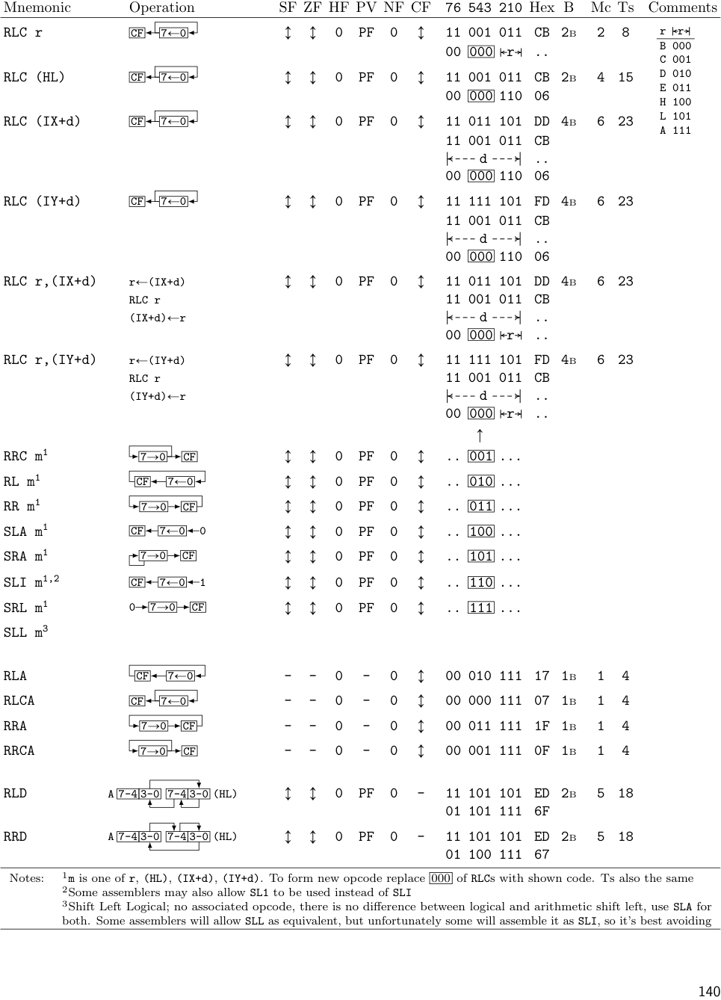

r r RLC r

r ..

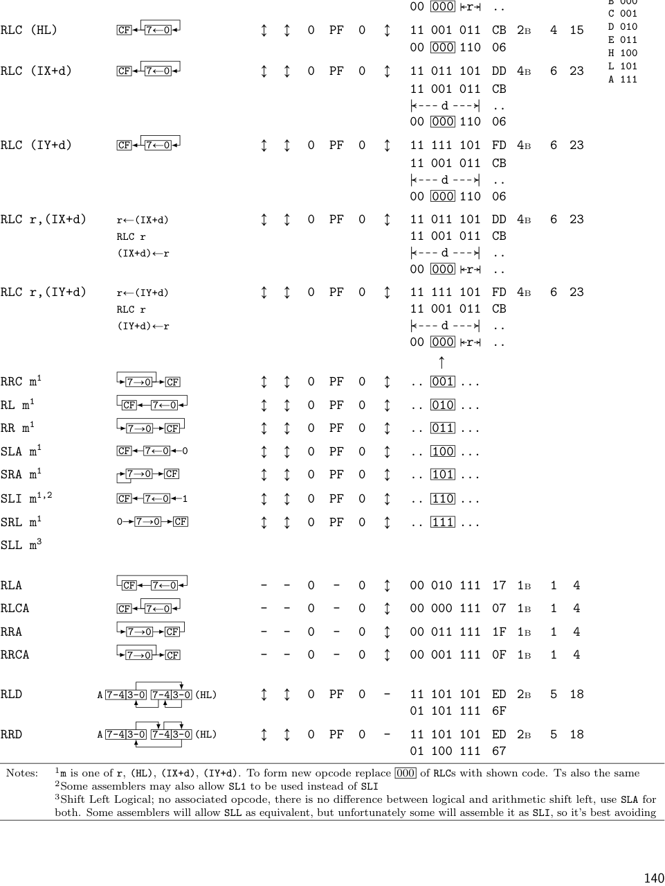

RLC (IX+d)

d ..

RLC (IY+d)

d ..

RLC r,(IX+d) rÐ(IX+d)

RLC r d .. (IX+d)Ðr r ..

RLC r,(IY+d) rÐ(IY+d) RLC r d .. (IY+d)Ðr r .. RRC m1 .. 001 ...

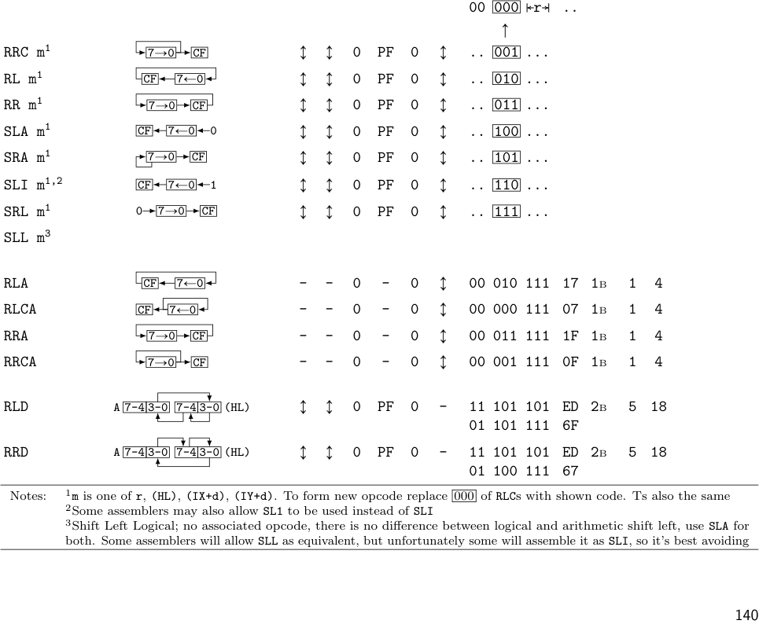

RL m1 .. 010 ...

RR m1 .. 011 ...

SLA m1 .. 100 ...

SRA m1 .. 101 ...

SLI m1,2 .. 110 ...

SRL m1 .. 111 ...

SLL m3

1m is one of r, (HL), (IX+d), (IY+d). To form new opcode replace 000 of RLCs with shown code. Ts also the same Notes: 2Some assemblers may also allow SL1 to be used instead of SLI 3Shift Left Logical; no associated opcode, there is no difference between logical and arithmetic shift left, use SLA for both. Some assemblers will allow SLL as equivalent, but unfortunately some will assemble it as SLI, so it’s best avoiding

## 4.10 Jump

Symbolic Flags Opcode Mnemonic Operation 76 543 210 Hex B Mc Ts Comments JP nm PCÐnm c c

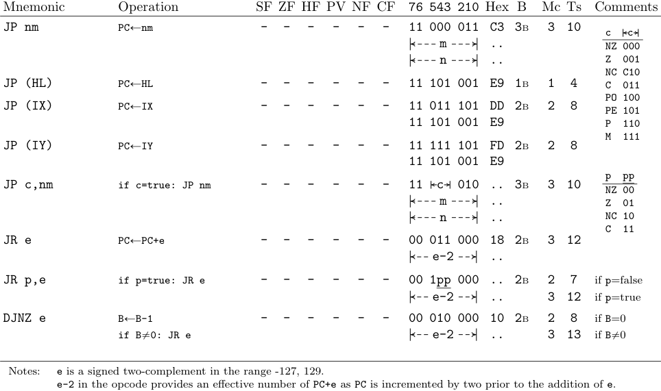

m .. n ..

p pp

JP c,nm c 010 .. 3B if c=true: JP nm m .. n ..

JR e PCÐPC+e e-2 ..

JR p,e 00 1pp 000 .. 2B if p=false if p=true: JR e e-2 .. if p=true

DJNZ e if B=0 e-2 .. if B 0 if B 0: JR e

Notes: e is a signed two-complement in the range -127, 129. e-2 in the opcode provides an effective number of PC+e as PC is incremented by two prior to the addition of e.

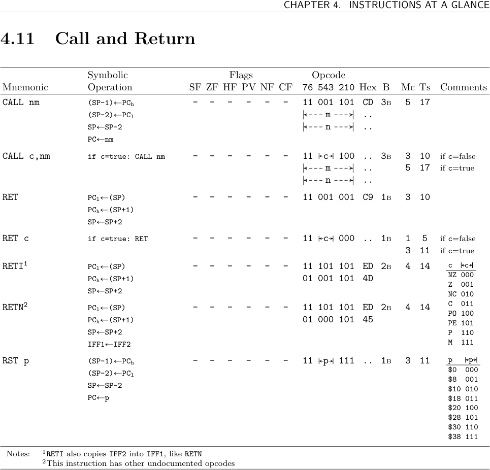

## 4.11 Call and Return

Symbolic Flags Opcode Mnemonic Operation 76 543 210 Hex B Mc Ts Comments CALL nm (SP-1)ÐPCh m .. (SP-2)ÐPCl n .. PCÐnm

CALL c,nm c 100 .. 3B if c=false if c=true: CALL nm m .. if c=true n ..

PClÐ(SP) PChÐ(SP+1)

c 000 .. 1B RET c if c=false if c=true: RET if c=true

c c PClÐ(SP)

PChÐ(SP+1)

PClÐ(SP) PChÐ(SP+1)

p p RST p p 111 .. 1B (SP-1)ÐPCh $0 $8 $10 010 $18 011 $20 100 $28 101 $30 110 $38 111

(SP-2)ÐPCl PCÐp

1RETI also copies IFF2 into IFF1, like RETN Notes: 2This instruction has other undocumented opcodes

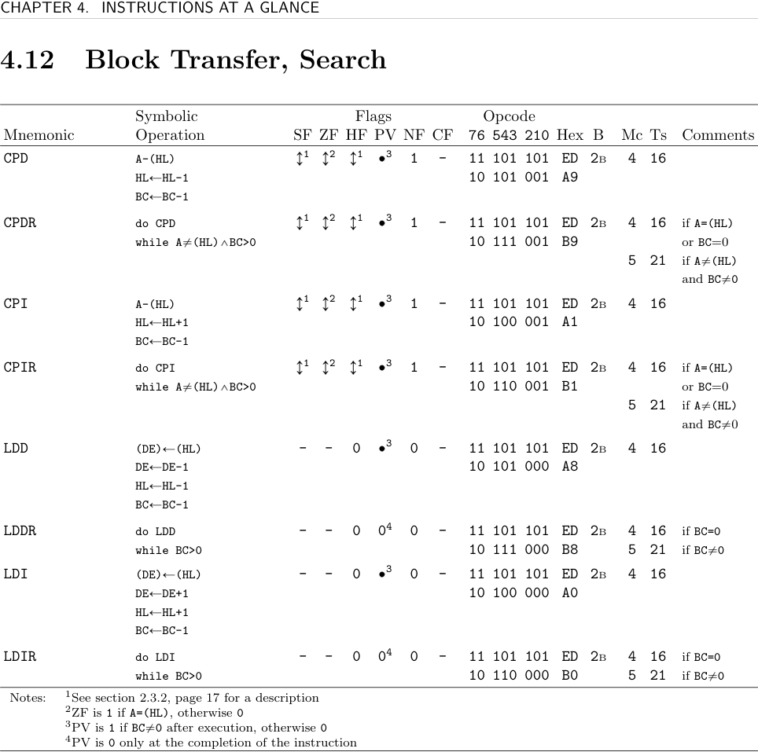

## 4.12 Block Transfer, Search

Symbolic Flags Opcode Mnemonic Operation 76 543 210 Hex B Mc Ts Comments

if A=(HL) do CPD or BC=0 while A (HL)^BC>0 if A (HL) and BC 0

if A=(HL) do CPI or BC=0 while A (HL)^BC>0 if A (HL) and BC 0

if BC=0 do LDD if BC 0 while BC>0

if BC=0 do LDI

if BC 0 while BC>0

1See section 2.3.2, page 17 for a description Notes: 2ZF is 1 if A=(HL), otherwise 0 3PV is 1 if BC 0 after execution, otherwise 0 4PV is 0 only at the completion of the instruction

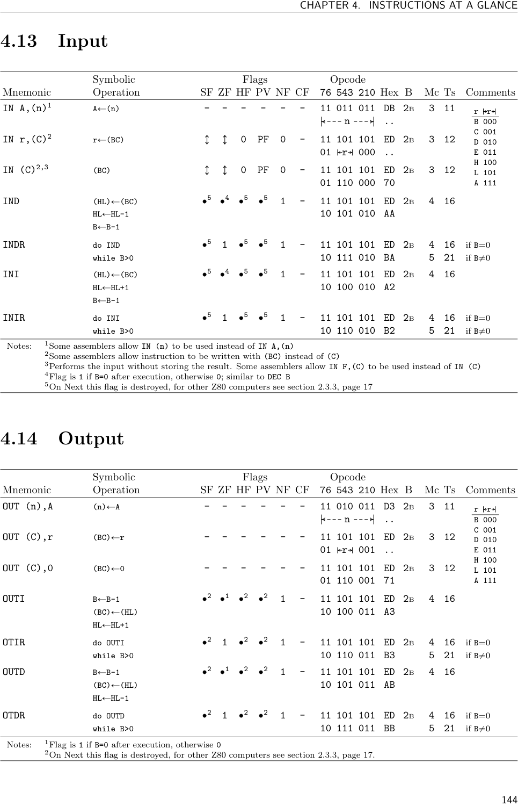

## 4.13 Input

Symbolic Flags Opcode Mnemonic Operation 76 543 210 Hex B Mc Ts Comments IN A,(n)1 AÐ(n) r r

n ..

IN r,(C)2 rÐ(BC) r 000 ..

IN (C)2,3

if B=0 do IND if B 0 while B>0

if B=0 do INI if B 0 while B>0

1Some assemblers allow IN (n) to be used instead of IN A,(n) Notes: 2Some assemblers allow instruction to be written with (BC) instead of (C) 3Performs the input without storing the result. Some assemblers allow IN F,(C) to be used instead of IN (C) 4Flag is 1 if B=0 after execution, otherwise 0; similar to DEC B 5On Next this flag is destroyed, for other Z80 computers see section 2.3.3, page 17

## 4.14 Output

Symbolic Flags Opcode Mnemonic Operation 76 543 210 Hex B Mc Ts Comments OUT (n),A (n)ÐA r r

n ..

OUT (C),r (BC)Ðr r 001 ..

OUT (C),0

if B=0 do OUTI

if B 0 while B>0

if B=0 do OUTD if B 0 while B>0

1Flag is 1 if B=0 after execution, otherwise 0 Notes: 2On Next this flag is destroyed, for other Z80 computers see section 2.3.3, page 17.

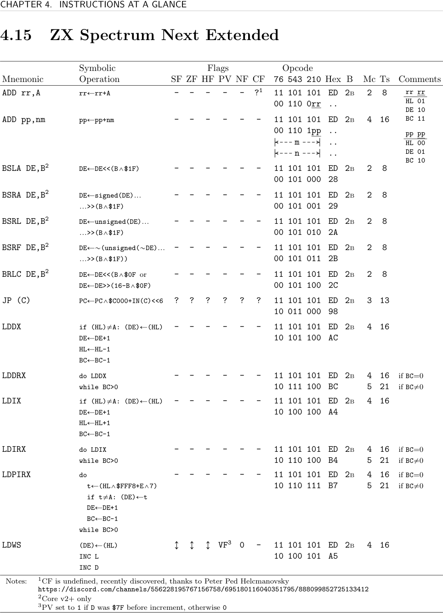

## 4.15 ZX Spectrum Next Extended

Symbolic Flags Opcode Mnemonic Operation 76 543 210 Hex B Mc Ts Comments ?1 rr rr ADD rr,A rrÐrr+A

00 110 0rr ..

ADD pp,nm ppÐpp+nm

00 110 1pp ..

pp pp

m .. n ..

BSLA DE,B2 DEÐDE<<(B^$1F)

BSRA DE,B2 DEÐsigned(DE)... ...>>(B^$1F)

BSRL DE,B2 DEÐunsigned(DE)... ...>>(B^$1F)

BSRF DE,B2 DEÐ (unsigned( DE)... ...>>(B^$1F))

BRLC DE,B2 DEÐDE<<(B^$0F or DEÐDE>>(16-B^$0F)

? ? ? ? ? ? PCÐPC^$C000+IN(C)<<6

if (HL) A: (DE)Ð(HL)

if BC=0 do LDDX if BC 0 while BC>0

if (HL) A: (DE)Ð(HL)

if BC=0 do LDIX if BC 0 while BC>0

if BC=0 do tÐ(HL^$FFF8+E^7) if BC 0 if t A: (DE)Ðt while BC>0

1CF is undefined, recently discovered, thanks to Peter Ped Helcmanovsky Notes: https://discord.com/channels/556228195767156758/695180116040351795/888099852725133412 2Core v2+ only 3PV set to 1 if D was $7F before increment, otherwise 0 (continued on next page)

Symbolic Flags Opcode Mnemonic Operation 76 543 210 Hex B Mc Ts Comments

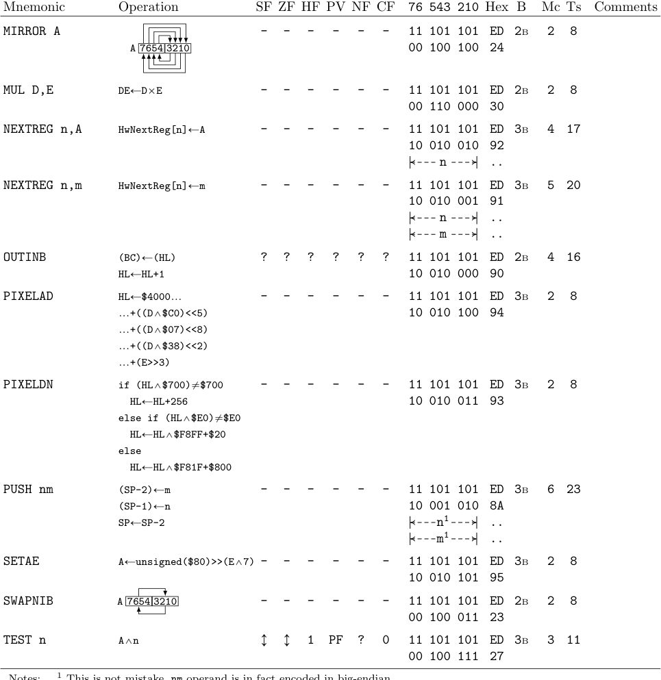

NEXTREG n,A HwNextReg[n]ÐA

n ..

NEXTREG n,m HwNextReg[n]Ðm

n .. m ..

? ? ? ? ? ?

HLÐ$4000... ...+((D^$C0)<<5)

...+((D^$07)<<8) ...+((D^$38)<<2) ...+(E>>3)

if (HL^$700) $700 else if (HL^$E0) $E0 HLÐHL^$F8FF+$20

else HLÐHL^$F81F+$800

PUSH nm (SP-2)Ðm (SP-1)Ðn n1 .. m1 ..

AÐunsigned($80)>>(E^7) -

TEST n ? A^n

1 This is not mistake, nm operand is in fact encoded in big-endian Notes:

Chapter 5

Instructions up Close

The following pages describe all instructions in detail. Alphabetical order is used as much as possible, but some deviations were made to better fit to pages. Each instruction includes:

ˆ Mnemonic

ˆ Symbolic operation for quick info on what instruction does

ˆ All variants (where applicable)

ˆ Description with further details

ˆ Effects on flags

ˆ Timing table with machine cycles, T states and time required for execution on different CPU speeds

Where possible, multiple variants of same instruction are grouped together and where multiple timings are possible, timing table is sorted from quickest to slowest.

Flags

Sign Flag is set to twos-complement of the most-significant bit (bit 7) of the result of an SF instruction. If the result is positive (bit 7 is 0), SF is set, and if the result is negative (bit 7 is 1), SF is reset. This leaves bits 0-6 to represent the value. Positive numbers range from 0 to 127 and negative from -1 to -128.

Zero Flag depends on whether the result of an instruction is 0. ZF is set if the result if 0 ZF and reset otherwise.

Half Carry Flag represents a carry or borrow status between bits 3 and 4 of an 8-bit HF arithmetic operation (bits 11 and 12 for 16-bit operations). Set if: ˆ A carry from bit 3 to bit 4 occurs during addition (bit 11 to 12 for 16-bit operations) ˆ A borrow from bit 4 occurs during subtraction (from bit 12 for 16-bit operations)

PV Parity/Overflow Flag value depends on the type of the operation.

For arithmetic operations, PV indicates an overflow. The flag is set when the sign of the result is different from the sign of the operands: ˆ all operands are positive but the result is negative or ˆ all operands are negative but the result is positive

For logical and rotate operations, PV indicates the parity of the result. The number of set bits in the result are counted. If the total is an even value, PV is set. If the total is odd, PV is reset.

Add/Subtract Flag is used primarily for DAA instruction to distinguish between add and NF subtract operations. But other instructions may also affect it as described in the following pages.

Carry Flag represents a carry or borrow status for arithmetic operations. CF is set if add CF instruction generates a carry, or subtract generates a borrow.

For rotate and shift instructions, CF is used: ˆ as a link between least-significat and most significant bit for RLA, RL, RRA and RR ˆ contains the value shifted out of bit 7 for RLC, RLCA and SLA ˆ contains the value shifted out of bit 0 for RRC, RRCA, SRA and SRL

Finally, some instructions directly affect the value of CF: ˆ reset with AND, OR and XOR ˆ set with SCF ˆ completed with CCF

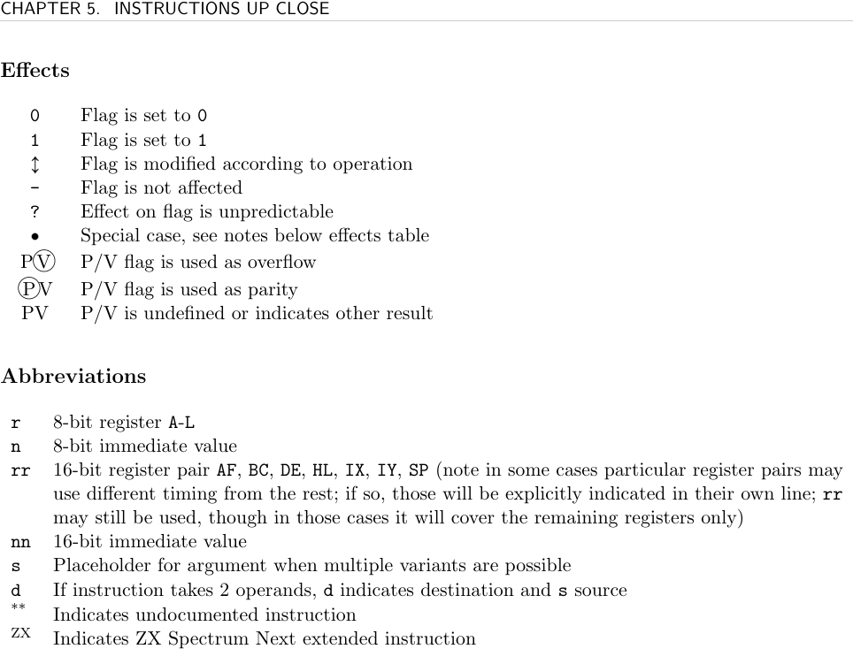

Effects

Flag is set to 0 Flag is set to 1 Flag is modified according to operation Flag is not affected Effect on flag is unpredictable ? Special case, see notes below effects table P/V flag is used as overflow P/V flag is used as parity P/V is undefined or indicates other result

Abbreviations

8-bit register A-L r 8-bit immediate value n 16-bit register pair AF, BC, DE, HL, IX, IY, SP (note in some cases particular register pairs may rr use different timing from the rest; if so, those will be explicitly indicated in their own line; rr may still be used, though in those cases it will cover the remaining registers only) 16-bit immediate value nn Placeholder for argument when multiple variants are possible s If instruction takes 2 operands, d indicates destination and s source d ** Indicates undocumented instruction Indicates ZX Spectrum Next extended instruction

CHAPTER 5. INSTRUCTIONS UP CLOSE

This page intentionally left empty

ADC d,s ADd with Carry

dÐd+s+CF

8 bit 8 bit 8 bit 8 bit 16 bit ADC A,IXH** ADC A,A ADC A,E ADC A,(HL) ADC HL,BC ADC A,IXL** ADC A,B ADC A,H ADC A,(IX+d) ADC HL,DE ADC A,IYH** ADC A,C ADC A,L ADC A,(IY+d) ADC HL,HL ADC A,IYL** ADC A,D ADC A,n ADC HL,SP

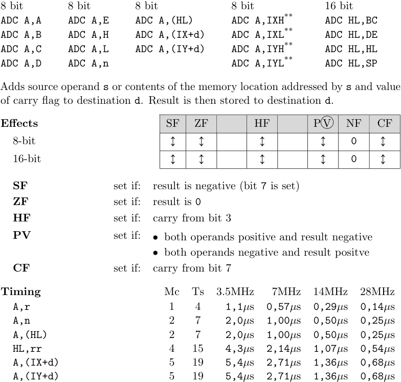

Adds source operand s or contents of the memory location addressed by s and value of carry flag to destination d. Result is then stored to destination d.

Effects

8-bit

16-bit

set if: result is negative (bit 7 is set) set if: result is 0 set if: carry from bit 3

set if: ˆ both operands positive and result negative ˆ both operands negative and result positve set if: carry from bit 7

Timing Mc Ts 3.5MHz 7MHz 14MHz 28MHz 1,1µs 0,57µs 0,29µs 0,14µs A,r 2,0µs 1,00µs 0,50µs 0,25µs A,n 2,0µs 1,00µs 0,50µs 0,25µs A,(HL) 4,3µs 2,14µs 1,07µs 0,54µs HL,rr 5,4µs 2,71µs 1,36µs 0,68µs A,(IX+d) 5,4µs 2,71µs 1,36µs 0,68µs A,(IY+d)

ADD d,s ADD

dÐd+s

8-bit 8-bit 16-bit 16-bit ZX Next ADD BC,AZX ADD A,A ADD A,(HL) ADD IX,BC ADD HL,BC

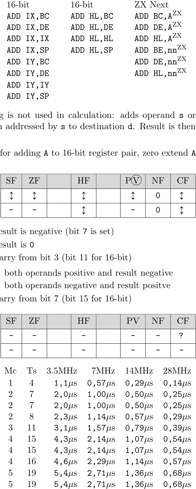

ADD DE,AZX ADD A,B ADD A,(IX+d) ADD IX,DE ADD HL,DE

ADD HL,AZX ADD A,C ADD A,(IY+d) ADD IX,IX ADD HL,HL

ADD A,IXH** ADD BE,nnZX ADD A,D ADD IX,SP ADD HL,SP

ADD A,IXL** ADD DE,nnZX ADD A,E ADD IY,BC

ADD A,IYH** ADD HL,nnZX ADD A,H ADD IY,DE

ADD A,IYL** ADD A,L ADD IY,IY ADD A,n ADD IY,SP

Similar to ADC except carry flag is not used in calculation: adds operand s or contents of the memory location addressed by s to destination d. Result is then stored to destination d.

ZX Next Extended instructions for adding A to 16-bit register pair, zero extend A to 16-bits.

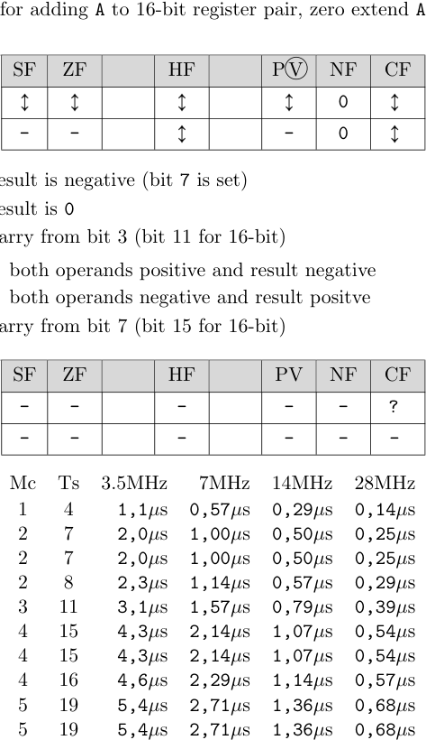

Effects

8-bit

16-bit

8-bit only, set if: result is negative (bit 7 is set) 8-bit only, set if: result is 0 set if: carry from bit 3 (bit 11 for 16-bit)

8-bit only, set if: ˆ both operands positive and result negative ˆ both operands negative and result positve set if: carry from bit 7 (bit 15 for 16-bit)

Effects

ADD rr,AZX

ADD rr,nnZX

Timing Mc Ts 3.5MHz 7MHz 14MHz 28MHz 1,1µs 0,57µs 0,29µs 0,14µs A,r 2,0µs 1,00µs 0,50µs 0,25µs A,n 2,0µs 1,00µs 0,50µs 0,25µs A,(HL) rr,AZX 2,3µs 1,14µs 0,57µs 0,29µs 3,1µs 1,57µs 0,79µs 0,39µs HL,rr 4,3µs 2,14µs 1,07µs 0,54µs IX,rr 4,3µs 2,14µs 1,07µs 0,54µs IY,rr rr,nnZX 4,6µs 2,29µs 1,14µs 0,57µs 5,4µs 2,71µs 1,36µs 0,68µs A,(IX+d) 5,4µs 2,71µs 1,36µs 0,68µs A,(IY+d)

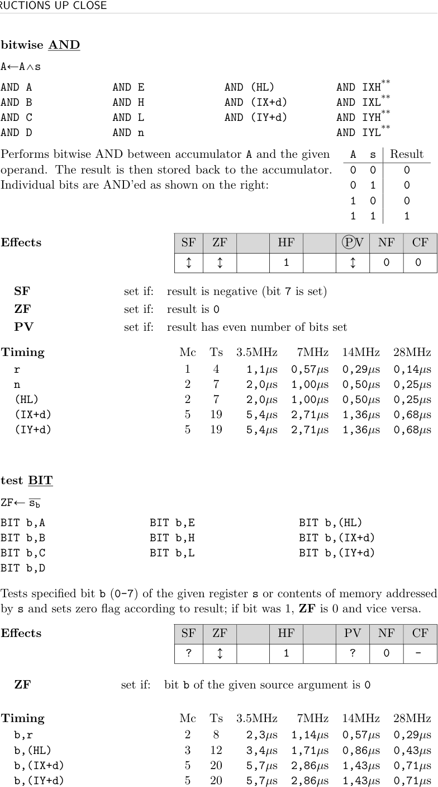

AND s bitwise AND

AÐA^s

AND IXH**

AND IXL**

AND (IX+d) AND (IY+d)

AND IYH**

AND IYL**

AND n

Performs bitwise AND between accumulator A and the given operand. The result is then stored back to the accumulator. Individual bits are AND’ed as shown on the right:

Result s

Effects

set if: result is negative (bit 7 is set) set if: result is 0 set if: result has even number of bits set

Timing Mc Ts 3.5MHz 7MHz 14MHz 28MHz 1,1µs 0,57µs 0,29µs 0,14µs r 2,0µs 1,00µs 0,50µs 0,25µs n 2,0µs 1,00µs 0,50µs 0,25µs 5,4µs 2,71µs 1,36µs 0,68µs (IX+d) 5,4µs 2,71µs 1,36µs 0,68µs (IY+d)

BIT b,s test BIT

ZFÐ sb

BIT b,A BIT b,B BIT b,C BIT b,D

BIT b,E BIT b,H BIT b,L

BIT b,(HL) BIT b,(IX+d) BIT b,(IY+d)

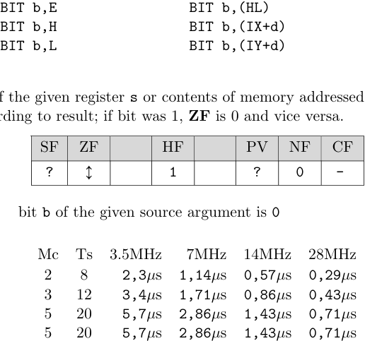

Tests specified bit b (0-7) of the given register s or contents of memory addressed by s and sets zero flag according to result; if bit was 1, ZF is 0 and vice versa.

Effects

set if: bit b of the given source argument is 0

Timing Mc Ts 3.5MHz 7MHz 14MHz 28MHz 2,3µs 1,14µs 0,57µs 0,29µs b,r 3,4µs 1,71µs 0,86µs 0,43µs b,(HL) 5,7µs 2,86µs 1,43µs 0,71µs b,(IX+d) 5,7µs 2,86µs 1,43µs 0,71µs b,(IY+d)

BRLC, BSLA, BSRA, BSRF, BSRL See pages 155 and 156

CALL nn CALL subroutine

(SP-1)ÐPCh (SP-2)ÐPCl SPÐSP-2 PCÐnn

Pushes program counter PC to stack and calls subroutine at the given location nn by changing PC to point to address nn.

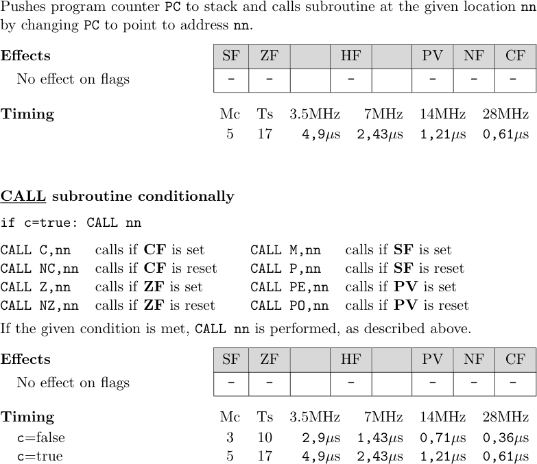

Effects

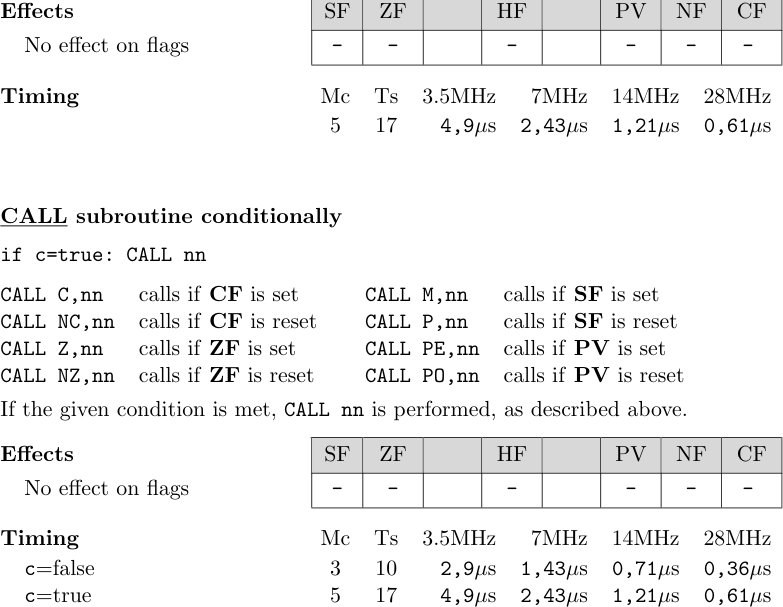

No effect on flags

Timing Mc Ts 3.5MHz 7MHz 14MHz 28MHz 4,9µs 2,43µs 1,21µs 0,61µs

CALL c,nn CALL subroutine conditionally

if c=true: CALL nn

calls if CF is set calls if SF is set CALL C,nn CALL M,nn calls if CF is reset calls if SF is reset CALL NC,nn CALL P,nn calls if ZF is set calls if PV is set CALL Z,nn CALL PE,nn calls if ZF is reset calls if PV is reset CALL NZ,nn CALL PO,nn

If the given condition is met, CALL nn is performed, as described above.

Effects

No effect on flags

Timing Mc Ts 3.5MHz 7MHz 14MHz 28MHz c=false 2,9µs 1,43µs 0,71µs 0,36µs c=true 4,9µs 2,43µs 1,21µs 0,61µs

BRLC DE,BZX Barrel Rotate Left Circular

DEÐDE<<(B^$0F or DEÐDE>>(16-B^$0F)

Rotates value in register pair DE left for the amount given in bits 3-0 (low nibble) of register B. To rotate right, use formula: B=16-places. The result is stored in DE.

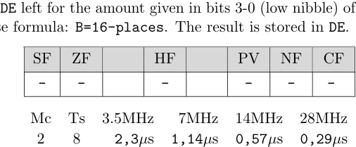

Effects

No effect on flags

Timing Mc Ts 3.5MHz 7MHz 14MHz 28MHz 2,3µs 1,14µs 0,57µs 0,29µs

BSLA DE,BZX Barrel Shift Left Arithmetic

DEÐDE<<(B^$1F)

Performs shift left of the value in register pair DE for the amount given in lower 5 bits of register B. The result is stored in DE.

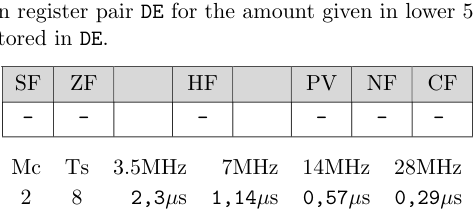

Effects

No effect on flags

Timing Mc Ts 3.5MHz 7MHz 14MHz 28MHz 2,3µs 1,14µs 0,57µs 0,29µs

BSRA DE,BZX Barrel Shift Right Arithmetic

DEÐsigned(DE)>>(B^$1F)

Performs arithmetical shift right of the value in register pair DE for the amount given in lower 5 bits of register B. The result is stored in DE.

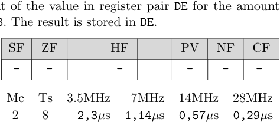

Effects

No effect on flags

Timing Mc Ts 3.5MHz 7MHz 14MHz 28MHz 2,3µs 1,14µs 0,57µs 0,29µs

BSRF DE,BZX Barrel Shift Right Fill-one

DEÐ (unsigned( DE)>>(B^$1F))

Performs fill-one-way shift right of the value in register pair DE for the amount given in lower 5 bits of register B. The result is stored in DE.

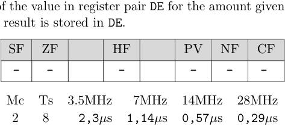

Effects

No effect on flags

Timing Mc Ts 3.5MHz 7MHz 14MHz 28MHz 2,3µs 1,14µs 0,57µs 0,29µs

BSRL DE,BZX Barrel Shift Right Logical

DEÐunsigned(DE)>>(B^$1F)

Performs logical shift right of the value in register pair DE for the amount given in lower 5 bits of register B. The result is stored in DE.

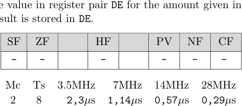

Effects

No effect on flags

Timing Mc Ts 3.5MHz 7MHz 14MHz 28MHz 2,3µs 1,14µs 0,57µs 0,29µs

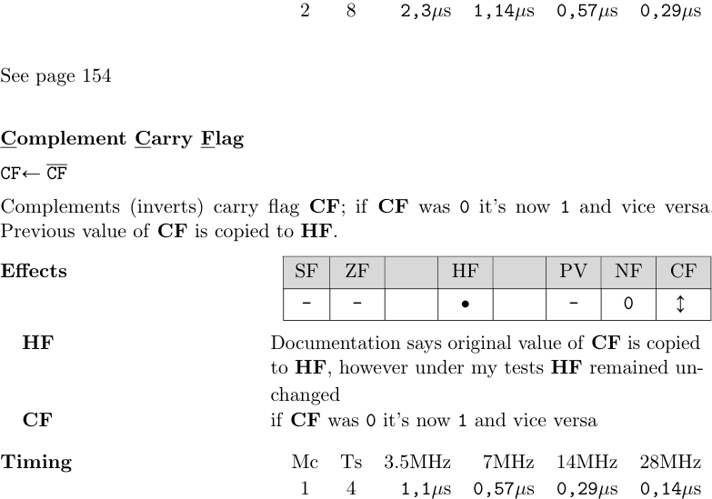

See page 154

Complement Carry Flag

Complements (inverts) carry flag CF; if CF was 0 it’s now 1 and vice versa. Previous value of CF is copied to HF.

Effects

Documentation says original value of CF is copied to HF, however under my tests HF remained unchanged if CF was 0 it’s now 1 and vice versa

Timing Mc Ts 3.5MHz 7MHz 14MHz 28MHz 1,1µs 0,57µs 0,29µs 0,14µs

CP s ComPare

A-s

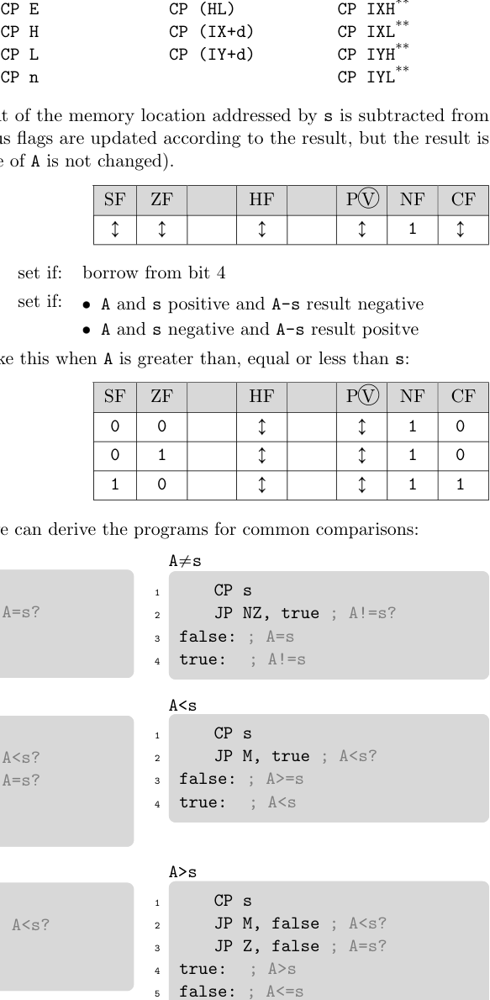

CP (IX+d) CP (IY+d)

CP n

Operand s or content of the memory location addressed by s is subtracted from accumulator A. Status flags are updated according to the result, but the result is then discarded (value of A is not changed).

Effects

set if: borrow from bit 4

set if: ˆ A and s positive and A-s result negative ˆ A and s negative and A-s result positve

Other flags are set like this when A is greater than, equal or less than s:

A¡s

A s

A s

With this in mind, we can derive the programs for common comparisons:

A=s

A s

```
CP s
JP Z, true ; A=s?
false: ; A!=s
true:
; A=s
```

```
CP s
JP NZ, true ; A!=s?
false: ; A=s
true:
; A!=s
```

CP s

CP s

JP Z, true ; A=s?

JP NZ, true ; A!=s?

false: ; A!=s

false: ; A=s

true: ; A=s

true: ; A!=s

A¤s

A<s

```
CP s
JP M, true ; A<s?
false: ; A>=s
true:
; A<s
```

```
CP s
JP M, true ; A<s?
JP Z, true ; A=s?
false: ; A>s
true:
; A<=s
```

CP s

CP s

JP M, true ; A<s?

JP M, true ; A<s?

false: ; A>=s

JP Z, true ; A=s?

true: ; A<s

false: ; A>s

true: ; A<=s

A¥s

A>s

```
CP s
JP M, false ; A<s?
JP Z, false ; A=s?
true:
; A>s
false: ; A<=s
```

```
CP s
JP M, false ; A<s?
true:
; A>=s
false: ; A<s
```

CP s

CP s

JP M, false ; A<s?

JP M, false ; A<s?

JP Z, false ; A=s?

true: ; A>=s

true: ; A>s

false: ; A<s

false: ; A<=s

Note: the examples use two labels to emphasize both results. But only one is needed. Furthermore, depending on the actual needs, the programs can also use

CHAPTER 5. INSTRUCTIONS UP CLOSE

no label at all. For example, we can use RET instead of JP when used within a subroutine, and the desired outcome is to return if the condition is not met:

A=s

A s

```
CP s
RET NZ ; A!=s?
; A=s
```

```
CP s
RET Z ; A=s?
; A!=s
```

CP s 1

CP s 1

RET NZ ; A!=s? 2

RET Z ; A=s? 2

; A=s 3

; A!=s 3

A¤s

A<s

```
CP s
RET P ; A>=s?
; A<s
```

```
CP s
JP M, true ; A<s?
JP Z, true ; A=s?
RET
; A>s
true:
; A<=s
```

CP s 1

CP s 1

RET P ; A>=s? 2

JP M, true ; A<s? 2

; A<s 3

JP Z, true ; A=s? 3

RET ; A>s 4

true: ; A<=s 5

A¥s

A>s

```
CP s
RET M ; A<s?
RET Z ; A=s?
; A>s
```

```
CP s
RET M ; A<s?
; A>=s
```

CP s 1

CP s 1

RET M ; A<s? 2

RET M ; A<s? 2

RET Z ; A=s? 3

; A>=s 3

; A>s 4

Note: some of the comparisons are reversed. And A¤s still requires a label because the condition is true if either SF or ZF is set.

Note: I opted to use SF for some of the comparisons. It makes more sense to me this way. But you can just as well use CF instead. As evident from the table on the previous page, both flags are updated the same way, so you could use JP C or RET C instead of M and JP NZ or RET NZ instead of P. This is due to CP performing a subtraction A-s internally. So when s is greater than A, the result of the subtraction is negative, meaning the sign flag is set. At the same time a borrow is needed, so the carry is set too. I thought it’s worth mentioning since you may find examples using the carry flag elsewhere and wonder why.

Timing Mc Ts 3.5MHz 7MHz 14MHz 28MHz 1 4 1,1µs 0,57µs 0,29µs 0,14µs r 2 7 2,0µs 1,00µs 0,50µs 0,25µs n 2 7 2,0µs 1,00µs 0,50µs 0,25µs (HL) 5 19 5,4µs 2,71µs 1,36µs 0,68µs (IX+d) 5 19 5,4µs 2,71µs 1,36µs 0,68µs (IY+d)

CPD ComPare and Decrement

A-(HL) HLÐHL-1 BCÐBC-1

Subtracts contents of memory location addressed by HL register pair from accumulator A. Result is then discarded. Afterwards both HL and BC are decremented.

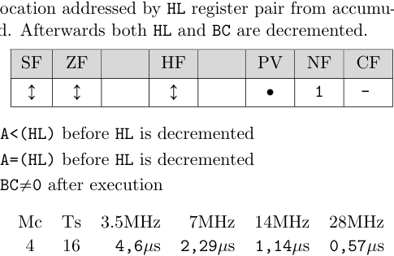

Effects

set if: A<(HL) before HL is decremented set if: A=(HL) before HL is decremented set if: BC 0 after execution

Timing Mc Ts 3.5MHz 7MHz 14MHz 28MHz 4,6µs 2,29µs 1,14µs 0,57µs

CPDR ComPare and Decrement Repeated

do CPD while A (HL)^BC>0

Repeats CPD until either A=(HL) or BC=0. If BC is set to 0 before instruction execution, it loops through 64KB if no match is found. See CPIR for example.

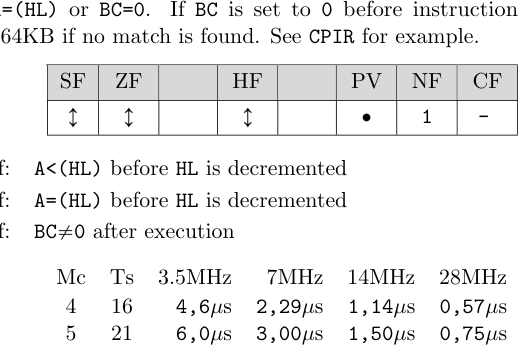

Effects

set if: A<(HL) before HL is decremented set if: A=(HL) before HL is decremented set if: BC 0 after execution

Timing Mc Ts 3.5MHz 7MHz 14MHz 28MHz BC=0 or A=(HL) 4,6µs 2,29µs 1,14µs 0,57µs BC 0 and A (HL) 6,0µs 3,00µs 1,50µs 0,75µs

CPI ComPare and Increment

A-(HL) HLÐHL+1 BCÐBC-1

Subtracts contents of memory location addressed by HL register pair from accumulator A. Result is then discarded. Afterwards HL is incremented and BC decremented.

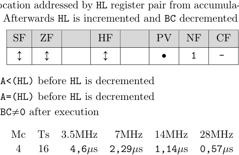

Effects

set if: A<(HL) before HL is decremented set if: A=(HL) before HL is decremented set if: BC 0 after execution

Timing Mc Ts 3.5MHz 7MHz 14MHz 28MHz 4,6µs 2,29µs 1,14µs 0,57µs

CPIR ComPare and Decrement Repeated

do CPI while A (HL)^BC>0

Repeats CPI until either A=(HL) or BC=0. If BC is set to 0 before instruction execution, it loops through 64KB if no match is found.

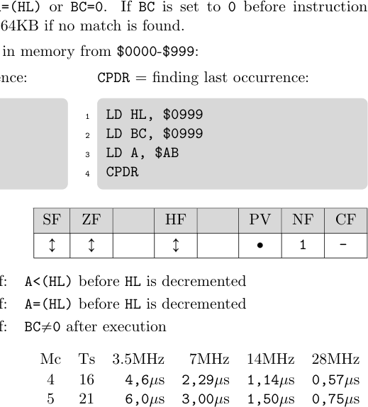

Example, searching for $AB in memory from $0000-$999:

CPIR = finding first occurrence:

CPDR = finding last occurrence:

```
LD HL, $0000
LD BC, $0999
LD A, $AB
CPIR
```

```
LD HL, $0999
LD BC, $0999
LD A, $AB
CPDR
```

LD HL, $0000

LD HL, $0999

LD BC, $0999

LD BC, $0999

LD A, $AB

LD A, $AB

Effects

set if: A<(HL) before HL is decremented set if: A=(HL) before HL is decremented set if: BC 0 after execution

Timing Mc Ts 3.5MHz 7MHz 14MHz 28MHz BC=0 or A=(HL) 4,6µs 2,29µs 1,14µs 0,57µs BC 0 and A (HL) 6,0µs 3,00µs 1,50µs 0,75µs

CPL See next page

DAA Decimal Adjust Accumulator

Updates accumulator A for BCD correction after arithmetic operations using the following algorithm:

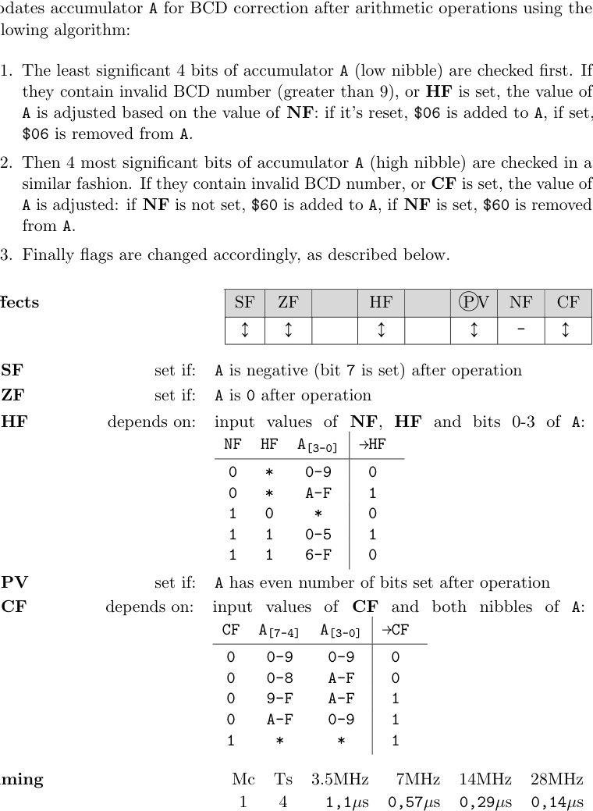

1. The least significant 4 bits of accumulator A (low nibble) are checked first. If they contain invalid BCD number (greater than 9), or HF is set, the value of A is adjusted based on the value of NF: if it’s reset, $06 is added to A, if set, $06 is removed from A.

2. Then 4 most significant bits of accumulator A (high nibble) are checked in a similar fashion. If they contain invalid BCD number, or CF is set, the value of A is adjusted: if NF is not set, $60 is added to A, if NF is set, $60 is removed from A.

3. Finally flags are changed accordingly, as described below.

Effects

set if: A is negative (bit 7 is set) after operation set if: A is 0 after operation

input values of NF, HF and bits 0-3 of A: depends on:

set if: A has even number of bits set after operation input values of CF and both nibbles of A: depends on:

Timing Mc Ts 3.5MHz 7MHz 14MHz 28MHz 1,1µs 0,57µs 0,29µs 0,14µs

CPL ComPLement accumulator

Complements (inverts) all bits of the accumulator A and stores the result back to A.

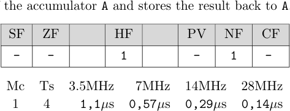

Effects

Timing Mc Ts 3.5MHz 7MHz 14MHz 28MHz 1,1µs 0,57µs 0,29µs 0,14µs

DEC s DECrement

sÐs-1

16-bit

8-bit

8-bit DEC (IX+d) DEC (IY+d) DEC IXH**

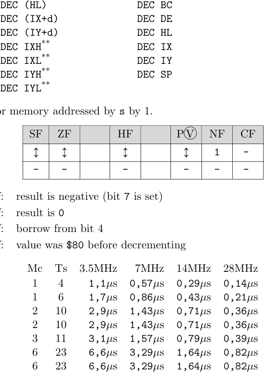

DEC IXL**

DEC IYH**

DEC IYL**

Decrements the operand s or memory addressed by s by 1.

Effects

8-bit

16-bit (no effect)

8-bit only, set if: result is negative (bit 7 is set) 8-bit only, set if: result is 0 8-bit only, set if: borrow from bit 4 value was $80 before decrementing 8-bit only, set if:

Timing Mc Ts 3.5MHz 7MHz 14MHz 28MHz 1,1µs 0,57µs 0,29µs 0,14µs r 1,7µs 0,86µs 0,43µs 0,21µs rr 2,9µs 1,43µs 0,71µs 0,36µs 2,9µs 1,43µs 0,71µs 0,36µs 3,1µs 1,57µs 0,79µs 0,39µs 6,6µs 3,29µs 1,64µs 0,82µs (IX+d) 6,6µs 3,29µs 1,64µs 0,82µs (IY+d)

Disable Interrupts

IFF1Ð0 IFF2Ð0

Disables all maskable interrupts (mode 1 and 2). Interrupts are disabled after execution of the instruction following DI. See sections 2.4, page 19 and 3.12, page 119 for more details on interrupts.

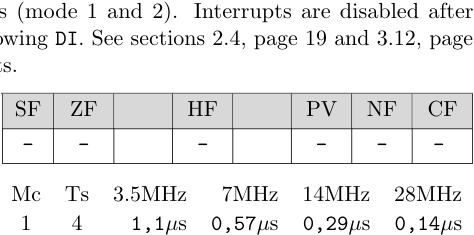

Effects

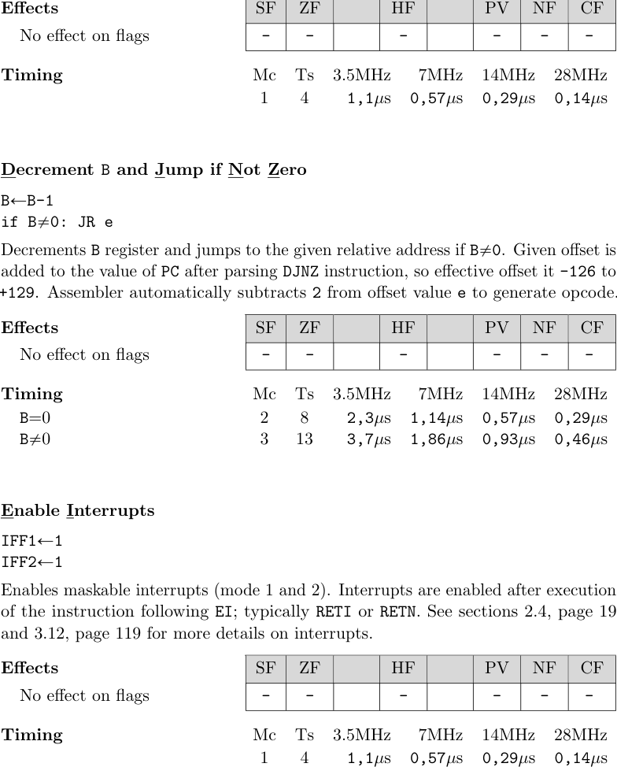

No effect on flags

Timing Mc Ts 3.5MHz 7MHz 14MHz 28MHz 1,1µs 0,57µs 0,29µs 0,14µs

DJNZ e Decrement B and Jump if Not Zero

if B 0: JR e

Decrements B register and jumps to the given relative address if B 0. Given offset is added to the value of PC after parsing DJNZ instruction, so effective offset it -126 to +129. Assembler automatically subtracts 2 from offset value e to generate opcode.

Effects

No effect on flags

Timing Mc Ts 3.5MHz 7MHz 14MHz 28MHz B=0 2,3µs 1,14µs 0,57µs 0,29µs 3,7µs 1,86µs 0,93µs 0,46µs

Enable Interrupts

Enables maskable interrupts (mode 1 and 2). Interrupts are enabled after execution of the instruction following EI; typically RETI or RETN. See sections 2.4, page 19 and 3.12, page 119 for more details on interrupts.

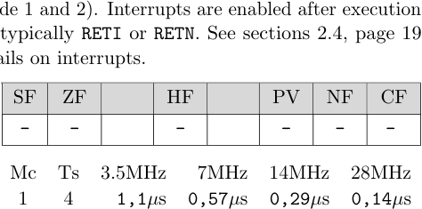

Effects

No effect on flags

Timing Mc Ts 3.5MHz 7MHz 14MHz 28MHz 1,1µs 0,57µs 0,29µs 0,14µs

EX d,s EXchange register pair

dØs

EX AF,AF’ EX DE,HL

EX (SP),HL EX (SP),IX EX (SP),IY

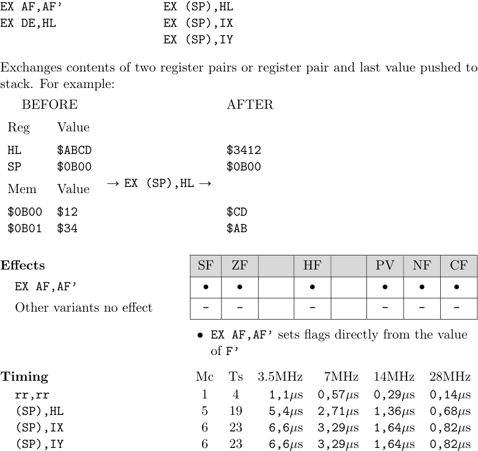

Exchanges contents of two register pairs or register pair and last value pushed to stack. For example:

Reg Value

$3412 $0B00 $0B00

Ñ EX (SP),HL Ñ

Mem Value

$0B00 $12 $CD $0B01 $34 $AB

Effects

EX AF,AF’

Other variants no effect

ˆ EX AF,AF’ sets flags directly from the value of F’

Timing Mc Ts 3.5MHz 7MHz 14MHz 28MHz 1,1µs 0,57µs 0,29µs 0,14µs rr,rr 5,4µs 2,71µs 1,36µs 0,68µs (SP),HL 6,6µs 3,29µs 1,64µs 0,82µs (SP),IX 6,6µs 3,29µs 1,64µs 0,82µs (SP),IY

EXchange alternate registers

BCØBC’ DEØDE’ HLØHL’

Exchanges contents of registers BC, DE and HL with shadow registers BC’, DE’ and HL’. The most frequent use is in interrupt handlers as an alternative to using the stack for saving and restoring register values. If using outside interrupt handlers, interrupts must be disabled before using this instruction.

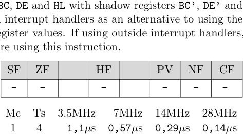

Effects

No effect on flags

Timing Mc Ts 3.5MHz 7MHz 14MHz 28MHz 1,1µs 0,57µs 0,29µs 0,14µs

Suspends CPU and executes NOPs (to continue memory refresh cycles) until the next interrupt or reset. This effectively creates a delay. You can chain HALTs. But make sure that there will be an interrupt, otherwise HALT will run forever.

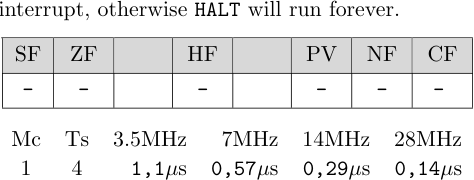

Effects

No effect on flags

Timing Mc Ts 3.5MHz 7MHz 14MHz 28MHz 1,1µs 0,57µs 0,29µs 0,14µs

IM n Interrupt Mode

Sets the interrupt mode. All 3 interrupts are maskable, meaning they can be disabled using DI instruction. See sections 2.4, page 19 and 3.12, page 119 for details and example.

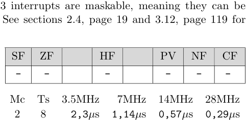

Effects

No effect on flags

Timing Mc Ts 3.5MHz 7MHz 14MHz 28MHz 2,3µs 1,14µs 0,57µs 0,29µs

IN r,(s) INput from port

rÐ(s)

IN A,(n) IN A,(C) IN B,(C) IN C,(C)

IN D,(C) IN E,(C) IN H,(C) IN L,(C)

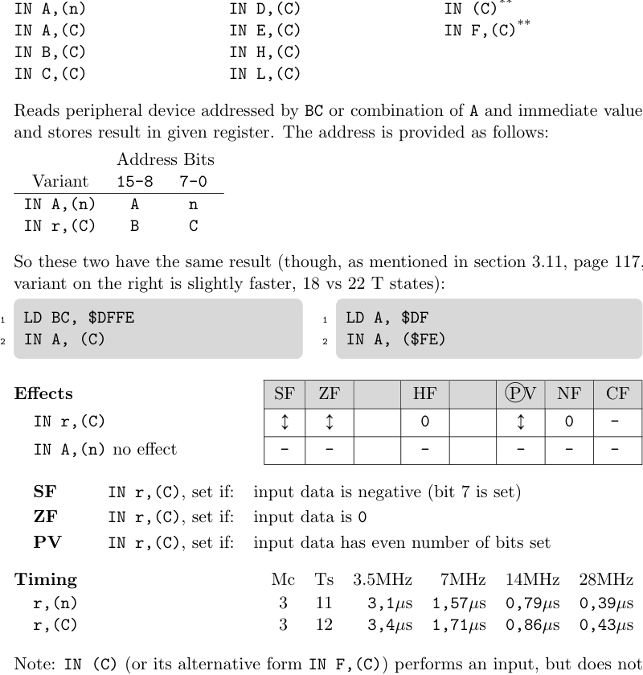

IN F,(C)**

Reads peripheral device addressed by BC or combination of A and immediate value and stores result in given register. The address is provided as follows:

Address Bits Variant IN A,(n) n IN r,(C)

So these two have the same result (though, as mentioned in section 3.11, page 117, variant on the right is slightly faster, 18 vs 22 T states):

```
LD BC, $DFFE
IN A, (C)
```

```
LD A, $DF
IN A, ($FE)
```

LD BC, $DFFE

LD A, $DF

IN A, ($FE)

IN A, (C)

Effects

IN r,(C)

IN A,(n) no effect

IN r,(C), set if: input data is negative (bit 7 is set) IN r,(C), set if: input data is 0 IN r,(C), set if: input data has even number of bits set

Timing Mc Ts 3.5MHz 7MHz 14MHz 28MHz 3,1µs 1,57µs 0,79µs 0,39µs r,(n) 3,4µs 1,71µs 0,86µs 0,43µs r,(C)

Note: IN (C) (or its alternative form IN F,(C)) performs an input, but does not store the result, only sets the flags.

Note: some assemblers also allow (BC) to be used instead of (C).

INC s INCrement

sÐs+1

8-bit

8-bit INC (IX+d) INC (IY+d) INC IXH**

16-bit

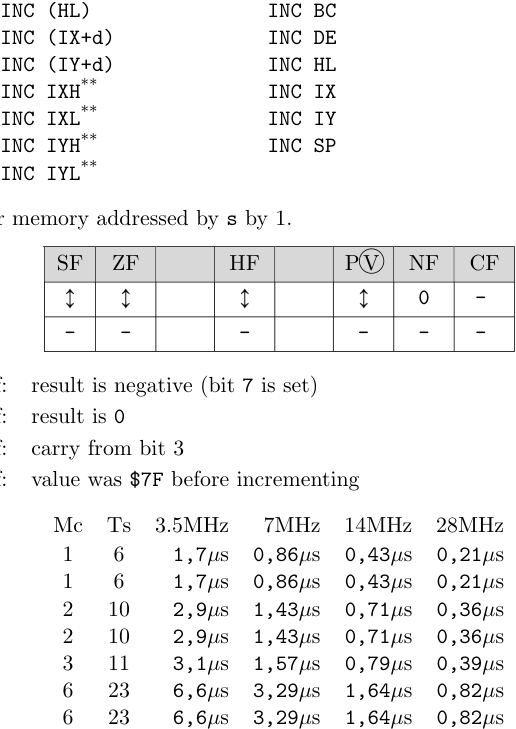

INC IXL**

INC IYH**

INC IYL**

Increments the operand s or memory addressed by s by 1.

Effects

8-bit

16-bit (no effect)

8-bit only, set if: result is negative (bit 7 is set) 8-bit only, set if: result is 0 8-bit only, set if: carry from bit 3 value was $7F before incrementing 8-bit only, set if:

Timing Mc Ts 3.5MHz 7MHz 14MHz 28MHz 1,7µs 0,86µs 0,43µs 0,21µs r 1,7µs 0,86µs 0,43µs 0,21µs rr 2,9µs 1,43µs 0,71µs 0,36µs 2,9µs 1,43µs 0,71µs 0,36µs 3,1µs 1,57µs 0,79µs 0,39µs 6,6µs 3,29µs 1,64µs 0,82µs (IX+d) 6,6µs 3,29µs 1,64µs 0,82µs (IY+d)

CHAPTER 5. INSTRUCTIONS UP CLOSE

This page intentionally left empty

IND INput and Decrement

(HL)Ð(BC) HLÐHL-1 BÐB-1

Reads peripheral device addressed by BC and stores the result in memory addressed by HL register pair. Then decrements HL and B.

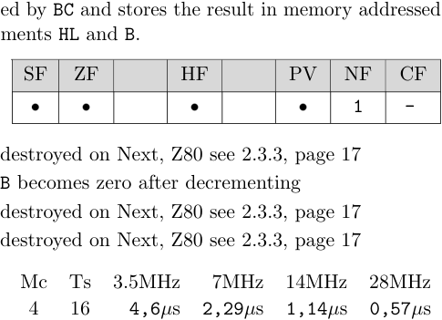

Effects

destroyed on Next, Z80 see 2.3.3, page 17 set if: B becomes zero after decrementing destroyed on Next, Z80 see 2.3.3, page 17 destroyed on Next, Z80 see 2.3.3, page 17

Timing Mc Ts 3.5MHz 7MHz 14MHz 28MHz 4,6µs 2,29µs 1,14µs 0,57µs

INDR INput and Decrement Repeated

do IND while B>0

Repeats IND until B=0.

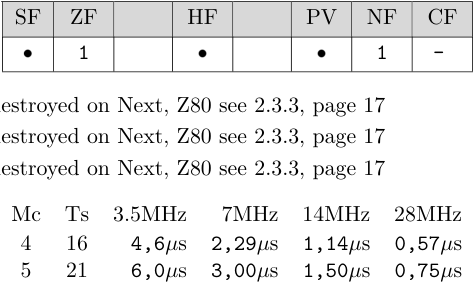

Effects

destroyed on Next, Z80 see 2.3.3, page 17 destroyed on Next, Z80 see 2.3.3, page 17 destroyed on Next, Z80 see 2.3.3, page 17

Timing Mc Ts 3.5MHz 7MHz 14MHz 28MHz B=0 4,6µs 2,29µs 1,14µs 0,57µs 6,0µs 3,00µs 1,50µs 0,75µs

INI INput and Increment

(HL)Ð(BC) HLÐHL+1 BÐB-1

Reads peripheral device addressed by BC and stores the result in memory addressed by HL register pair. Then increments HL and decrements B.

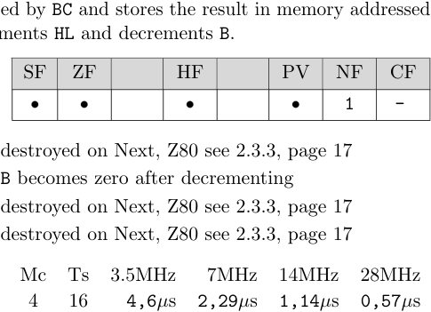

Effects

destroyed on Next, Z80 see 2.3.3, page 17 set if: B becomes zero after decrementing destroyed on Next, Z80 see 2.3.3, page 17 destroyed on Next, Z80 see 2.3.3, page 17

Timing Mc Ts 3.5MHz 7MHz 14MHz 28MHz 4,6µs 2,29µs 1,14µs 0,57µs

INIR INput and Increment Repeated

do INI while B>0

Repeats INI until B=0.


Effects

destroyed on Next, Z80 see 2.3.3, page 17 destroyed on Next, Z80 see 2.3.3, page 17 destroyed on Next, Z80 see 2.3.3, page 17

Timing Mc Ts 3.5MHz 7MHz 14MHz 28MHz B=0 4,6µs 2,29µs 1,14µs 0,57µs 6,0µs 3,00µs 1,50µs 0,75µs

JP nn JumP

PCÐnn

JP nn

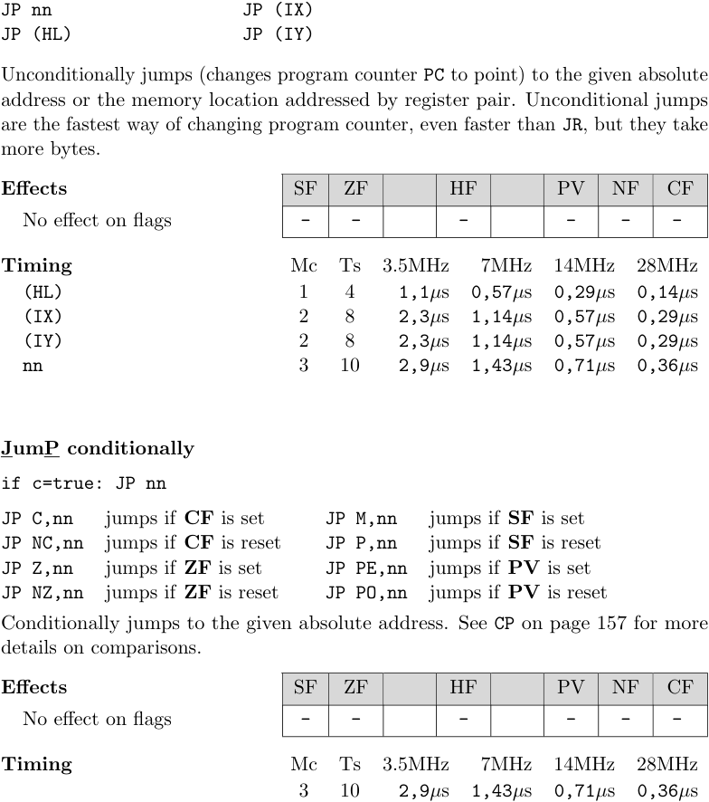

Unconditionally jumps (changes program counter PC to point) to the given absolute address or the memory location addressed by register pair. Unconditional jumps are the fastest way of changing program counter, even faster than JR, but they take more bytes.

Effects

No effect on flags

Timing Mc Ts 3.5MHz 7MHz 14MHz 28MHz 1,1µs 0,57µs 0,29µs 0,14µs 2,3µs 1,14µs 0,57µs 0,29µs 2,3µs 1,14µs 0,57µs 0,29µs 2,9µs 1,43µs 0,71µs 0,36µs nn

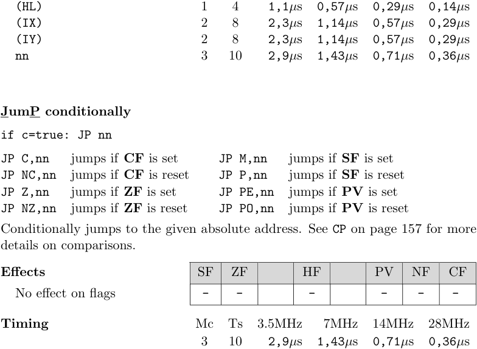

JP c,nn JumP conditionally

if c=true: JP nn

jumps if CF is set jumps if SF is set JP C,nn JP M,nn jumps if CF is reset jumps if SF is reset JP NC,nn JP P,nn jumps if ZF is set jumps if PV is set JP Z,nn JP PE,nn jumps if ZF is reset jumps if PV is reset JP NZ,nn JP PO,nn

Conditionally jumps to the given absolute address. See CP on page 157 for more details on comparisons.

Effects

No effect on flags

Timing Mc Ts 3.5MHz 7MHz 14MHz 28MHz 2,9µs 1,43µs 0,71µs 0,36µs

JP (C)ZX JumP

PCÐPC^$C000+IN(C)<<6

Sets bottom 14 bits of current program counter PC* to value read from I/O port: PC[13-0] = (IN (C) << 6). Can be used to execute code block read from a disk stream.

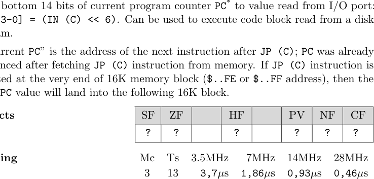

*“Current PC” is the address of the next instruction after JP (C); PC was already advanced after fetching JP (C) instruction from memory. If JP (C) instruction is located at the very end of 16K memory block ($..FE or $..FF address), then the new PC value will land into the following 16K block.

Effects

Timing Mc Ts 3.5MHz 7MHz 14MHz 28MHz 3,7µs 1,86µs 0,93µs 0,46µs

JR e Jump Relative

PCÐPC+e

Unconditionally performs relative jump. Offset e is added to the value of program counter PC as signed value to allow jumps forward and backward. Offset is added to PC after JR instruction is read (aka PC+2), so offset is in the range of -126 to 129. Assembler automatically subtracts 2 from offset value e to generate opcode.

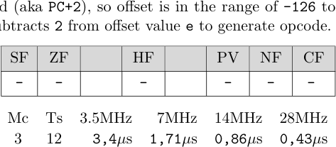

Effects

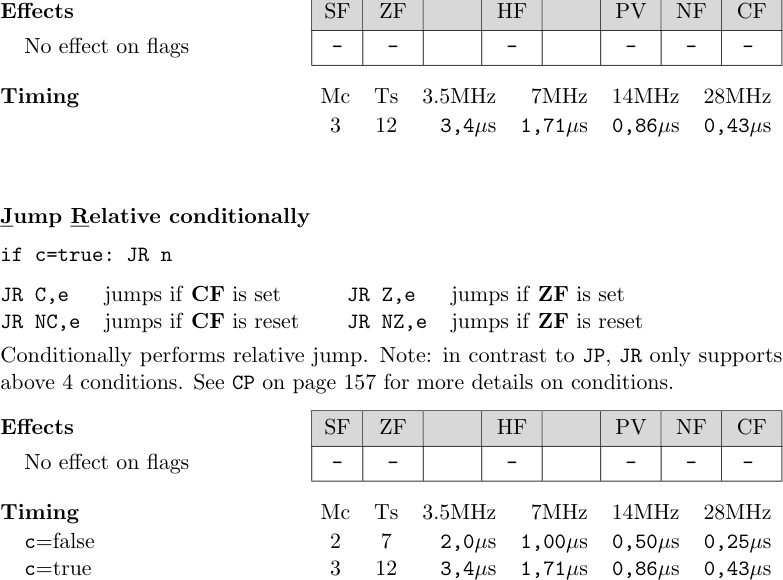

No effect on flags

Timing Mc Ts 3.5MHz 7MHz 14MHz 28MHz 3,4µs 1,71µs 0,86µs 0,43µs

JR c,n Jump Relative conditionally

if c=true: JR n

jumps if CF is set jumps if ZF is set JR C,e JR Z,e jumps if CF is reset jumps if ZF is reset JR NC,e JR NZ,e

Conditionally performs relative jump. Note: in contrast to JP, JR only supports above 4 conditions. See CP on page 157 for more details on conditions.

Effects

No effect on flags

Timing Mc Ts 3.5MHz 7MHz 14MHz 28MHz c=false 2,0µs 1,00µs 0,50µs 0,25µs c=true 3,4µs 1,71µs 0,86µs 0,43µs

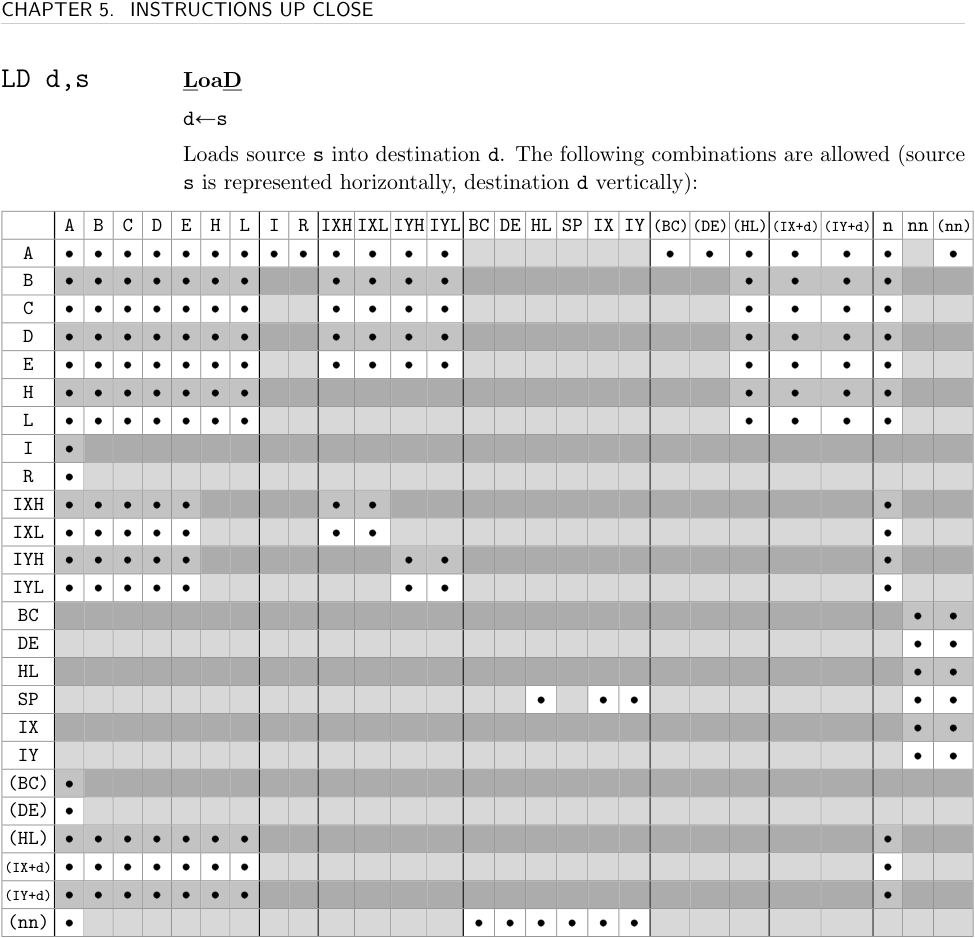

LD d,s LoaD

dÐs

Loads source s into destination d. The following combinations are allowed (source s is represented horizontally, destination d vertically):

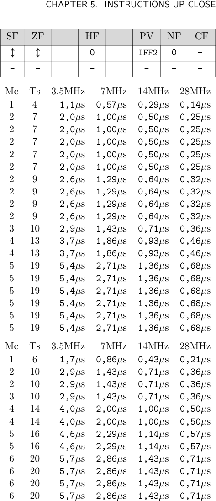

Effects

LD A,I and LD A,R

Other variants

Timing 8-bit Mc Ts 3.5MHz 7MHz 14MHz 28MHz 1,1µs 0,57µs 0,29µs 0,14µs r,r 2,0µs 1,00µs 0,50µs 0,25µs r,n 2,0µs 1,00µs 0,50µs 0,25µs (rr),A 2,0µs 1,00µs 0,50µs 0,25µs A,(rr) 2,0µs 1,00µs 0,50µs 0,25µs r,(HL) 2,0µs 1,00µs 0,50µs 0,25µs (HL),r 2,6µs 1,29µs 0,64µs 0,32µs A,I 2,6µs 1,29µs 0,64µs 0,32µs A,R 2,6µs 1,29µs 0,64µs 0,32µs I,A 2,6µs 1,29µs 0,64µs 0,32µs R,A 2,9µs 1,43µs 0,71µs 0,36µs (HL),n 3,7µs 1,86µs 0,93µs 0,46µs A,(nn) 3,7µs 1,86µs 0,93µs 0,46µs (nn),A 5,4µs 2,71µs 1,36µs 0,68µs r,(IX+d) 5,4µs 2,71µs 1,36µs 0,68µs r,(IY+d) 5,4µs 2,71µs 1,36µs 0,68µs (IX+d),r 5,4µs 2,71µs 1,36µs 0,68µs (IX+d),n 5,4µs 2,71µs 1,36µs 0,68µs (IY+d),r 5,4µs 2,71µs 1,36µs 0,68µs (IY+d),n

Timing 16-bit Mc Ts 3.5MHz 7MHz 14MHz 28MHz 1,7µs 0,86µs 0,43µs 0,21µs SP,HL 2,9µs 1,43µs 0,71µs 0,36µs SP,IX 2,9µs 1,43µs 0,71µs 0,36µs SP,IY 2,9µs 1,43µs 0,71µs 0,36µs rr,nn 4,0µs 2,00µs 1,00µs 0,50µs IX,nn 4,0µs 2,00µs 1,00µs 0,50µs IY,nn 4,6µs 2,29µs 1,14µs 0,57µs (HL),nn 4,6µs 2,29µs 1,14µs 0,57µs (nn),HL 5,7µs 2,86µs 1,43µs 0,71µs (IX),nn 5,7µs 2,86µs 1,43µs 0,71µs (IY),nn 5,7µs 2,86µs 1,43µs 0,71µs rr,(nn) 5,7µs 2,86µs 1,43µs 0,71µs (nn),rr

LoaD and Decrement

(DE)Ð(HL) DEÐDE-1 HLÐHL-1 BCÐBC-1

Loads contents of memory location addressed by HL to memory location addressed by DE. Then decrements DE, HL and BC register pairs.

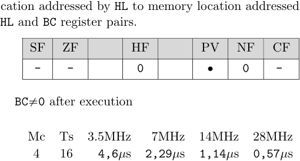

Effects

set if: BC 0 after execution

Timing Mc Ts 3.5MHz 7MHz 14MHz 28MHz 4,6µs 2,29µs 1,14µs 0,57µs

LoaD and Decrement eXtended

if (HL) A: (DE)Ð(HL)

Works similar to LDD except:

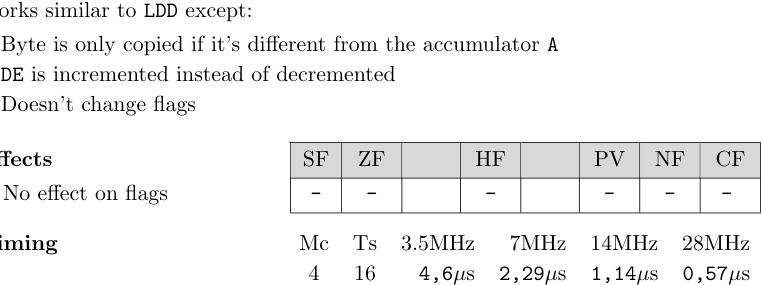

ˆ Byte is only copied if it’s different from the accumulator A ˆ DE is incremented instead of decremented ˆ Doesn’t change flags

Effects

No effect on flags

Timing Mc Ts 3.5MHz 7MHz 14MHz 28MHz 4,6µs 2,29µs 1,14µs 0,57µs

LoaD and Increment

Same as LDD, except it increments DE and HL.

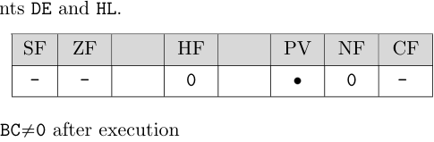

Effects

set if: BC 0 after execution

Timing Ts 3.5MHz 7MHz 14MHz 28MHz 4,6µs 2,29µs 1,14µs 0,57µs

LDIXZX LoaD and Increment eXtended

if (HL) A: (DE)Ð(HL) DEÐDE+1 HLÐHL+1 BCÐBC-1

Works similar to LDI except:

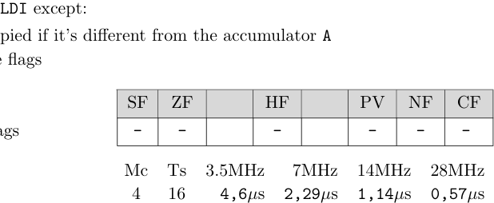

ˆ Byte is only copied if it’s different from the accumulator A ˆ Doesn’t change flags

Effects

No effect on flags

Timing Mc Ts 3.5MHz 7MHz 14MHz 28MHz 4,6µs 2,29µs 1,14µs 0,57µs

LoaD Wasp Special

Copies the byte pointed to by HL to the address pointed to by DE. Then increments L and D. Used for vertically copying bytes to Layer 2 display. Flags are identical to what the INC D instrution would produce.

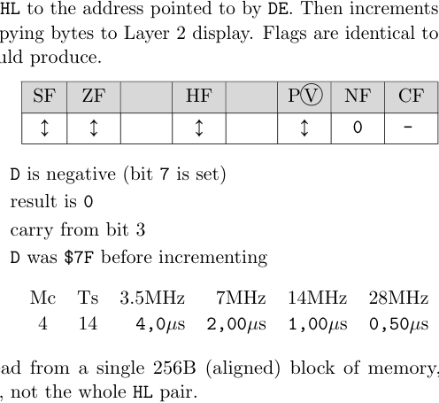

Effects

set if: D is negative (bit 7 is set) set if: result is 0 set if: carry from bit 3 D was $7F before incrementing set if:

Timing Mc Ts 3.5MHz 7MHz 14MHz 28MHz 4,0µs 2,00µs 1,00µs 0,50µs

Note: the source data are read from a single 256B (aligned) block of memory, because only L is incremented, not the whole HL pair.

LDDR LoaD and Decrement Repeated

do LDD: (DE)Ð(HL) DEÐDE-1: HLÐHL-1: BCÐBC-1 while BC>0

Repeats LDD until BC=0. LDDR can be used for block transfer. See LDIR on page 177 for an example and comparison of both instructions.

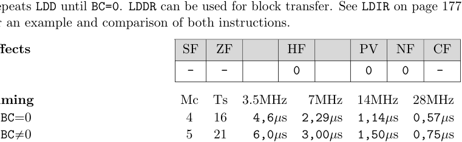

Effects

Timing Mc Ts 3.5MHz 7MHz 14MHz 28MHz BC=0 4,6µs 2,29µs 1,14µs 0,57µs 6,0µs 3,00µs 1,50µs 0,75µs

LoaD and Decrement Repeated eXtended

do LDDX: if (HL) A: (DE)Ð(HL) while BC>0

Works similar to LDDR except the differences noted at LDDX above.

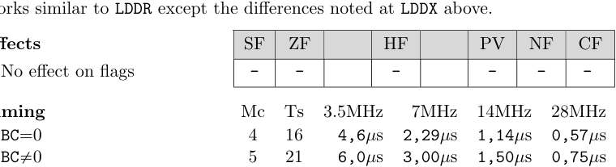

Effects

No effect on flags

Timing Mc Ts 3.5MHz 7MHz 14MHz 28MHz BC=0 4,6µs 2,29µs 1,14µs 0,57µs 6,0µs 3,00µs 1,50µs 0,75µs

LoaD and Increment Repeated

do LDI: while BC>0

Repeats LDI until BC=0. Example of copying 100 bytes from source to destination with LDIR and LDDR:

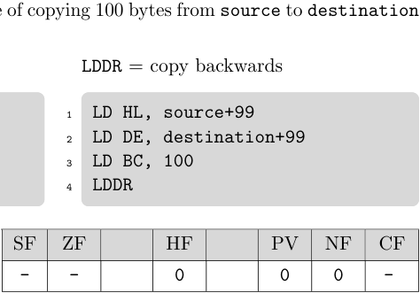

LDIR = copy forward

LDDR = copy backwards

```
LD HL, source
LD DE, destination
LD BC, 100
LDIR
```

```
LD HL, source+99
LD DE, destination+99
LD BC, 100
LDDR
```

LD HL, source

LD HL, source+99

LD DE, destination

LD DE, destination+99

LD BC, 100

LD BC, 100

Effects

CHAPTER 5. INSTRUCTIONS UP CLOSE

Timing Ts 3.5MHz 7MHz 14MHz 28MHz BC=0 4 16 4,6µs 2,29µs 1,14µs 0,57µs BC 0 5 21 6,0µs 3,00µs 1,50µs 0,75µs

LDIRXZX LoaD and Increment Repeated eXtended

do LDIX: if (HL) A: (DE)Ð(HL) DEÐDE+1: HLÐHL+1: BCÐBC-1 while BC>0

Works similar to LDIR except the differences noted at LDIX on previous page.

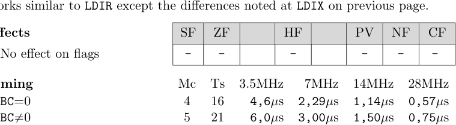

Effects

No effect on flags

Timing Mc Ts 3.5MHz 7MHz 14MHz 28MHz BC=0 4,6µs 2,29µs 1,14µs 0,57µs 6,0µs 3,00µs 1,50µs 0,75µs

LoaD Pattern fill and Increment Repeated eXtended

do tÐ(HL^$FFF8+E^7) if t A: (DE)Ðt while BC>0

Similar to LDIRX except the source byte address is not just HL, but is obtained by using the top 13 bits of HL and lower 3 bits of DE. Furthermore HL is not incremented during the loop; it serves as the base address of the aligned 8-byte lookup table. DE works as destination and also wrapping index 0..7 into the table. This instruction is intended for “pattern fill” functionality.

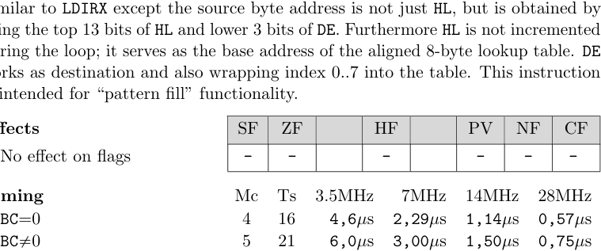

Effects

No effect on flags

Timing Mc Ts 3.5MHz 7MHz 14MHz 28MHz BC=0 4,6µs 2,29µs 1,14µs 0,57µs 6,0µs 3,00µs 1,50µs 0,75µs

MUL D,EZX MULtiply

Multiplies D by E, storing 16-bit result into DE.


Effects

No effect on flags

Timing Mc Ts 3.5MHz 7MHz 14MHz 28MHz 2,3µs 1,14µs 0,57µs 0,29µs

NEG NEGate

Negates contents of the accumulator A and stores result back to A. You can also think of the operation as subtracting the value of A from 0 (AÐ0-A). This way it might be easier to understand effects on flags.

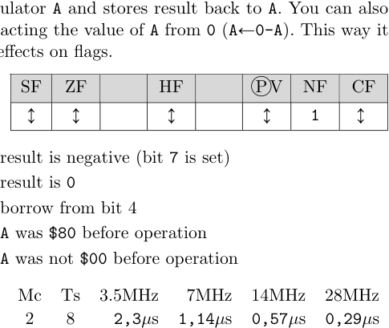

Effects

set if: result is negative (bit 7 is set) set if: result is 0 set if: borrow from bit 4 A was $80 before operation set if: A was not $00 before operation set if:

Timing Mc Ts 3.5MHz 7MHz 14MHz 28MHz 2,3µs 1,14µs 0,57µs 0,29µs

set NEXT REGister value

n,sZX

HwNextReg[n]Ðs

NEXTREG n,A NEXTREG n,n’

Directly sets the Next Feature Control Registers without going through ports TBBlue Register Select $243B and TBBlue Register Access $253B (page 34). See section 3.1.2, page 29 for registers list.

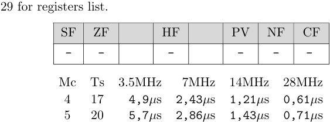

Effects

No effect on flags

Timing Mc Ts 3.5MHz 7MHz 14MHz 28MHz 4,9µs 2,43µs 1,21µs 0,61µs r,A 5,7µs 2,86µs 1,43µs 0,71µs r,n

NOP No OPeration

Does nothing for 4 cycles.

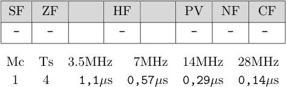

Effects

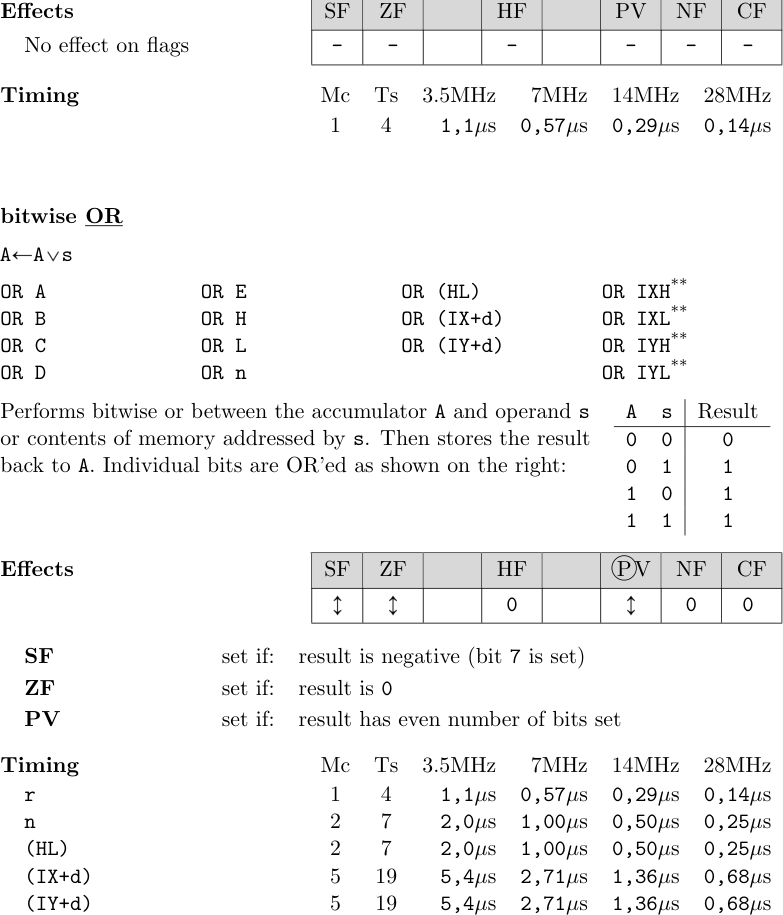

No effect on flags

Timing Mc Ts 3.5MHz 7MHz 14MHz 28MHz 1,1µs 0,57µs 0,29µs 0,14µs

OR s bitwise OR

AÐA_s

OR (IX+d) OR (IY+d)

OR n

Result s

Performs bitwise or between the accumulator A and operand s or contents of memory addressed by s. Then stores the result back to A. Individual bits are OR’ed as shown on the right:

Effects

set if: result is negative (bit 7 is set) set if: result is 0 set if: result has even number of bits set

Timing Mc Ts 3.5MHz 7MHz 14MHz 28MHz 1,1µs 0,57µs 0,29µs 0,14µs r 2,0µs 1,00µs 0,50µs 0,25µs n 2,0µs 1,00µs 0,50µs 0,25µs 5,4µs 2,71µs 1,36µs 0,68µs (IX+d) 5,4µs 2,71µs 1,36µs 0,68µs (IY+d)

OTDR OuTput and DecRement

do OUTD while B>0

Repeats OUTD (see page 182) until B=0. Similar to OTIR except HL is decremented instead of incremented.

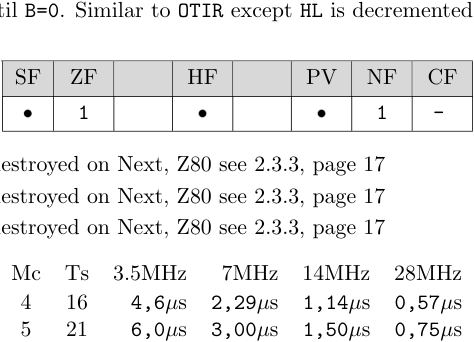

Effects

destroyed on Next, Z80 see 2.3.3, page 17 destroyed on Next, Z80 see 2.3.3, page 17 destroyed on Next, Z80 see 2.3.3, page 17

Timing Mc Ts 3.5MHz 7MHz 14MHz 28MHz B=0 4,6µs 2,29µs 1,14µs 0,57µs 6,0µs 3,00µs 1,50µs 0,75µs

OTIR OuTput and IncRement

do OUTI while B>0

Repeats OUTI (see page 182) until B=0. Similar to OTDR except HL is incremented instead of decremented.

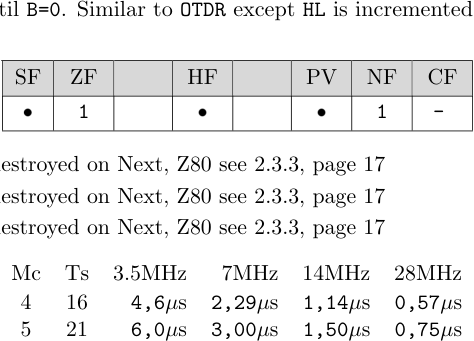

Effects

destroyed on Next, Z80 see 2.3.3, page 17 destroyed on Next, Z80 see 2.3.3, page 17 destroyed on Next, Z80 see 2.3.3, page 17

Timing Mc Ts 3.5MHz 7MHz 14MHz 28MHz B=0 4,6µs 2,29µs 1,14µs 0,57µs 6,0µs 3,00µs 1,50µs 0,75µs

OUT See page 183

OUTD OUTput and Decrement

BÐB-1 (BC)Ð(HL) HLÐHL-1

Outputs the value from contents of memory addressed by HL to port on address BC. Then decrements both, HL and B.

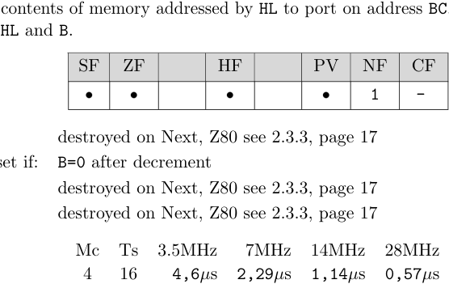

Effects

destroyed on Next, Z80 see 2.3.3, page 17 set if: B=0 after decrement destroyed on Next, Z80 see 2.3.3, page 17 destroyed on Next, Z80 see 2.3.3, page 17

Timing Mc Ts 3.5MHz 7MHz 14MHz 28MHz 4,6µs 2,29µs 1,14µs 0,57µs

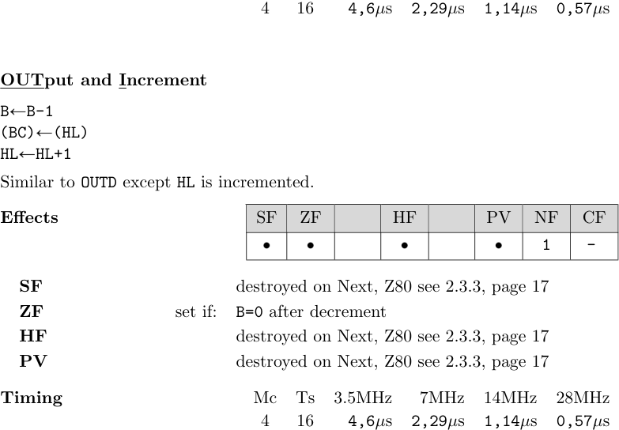

OUTput and Increment

Similar to OUTD except HL is incremented.

Effects

destroyed on Next, Z80 see 2.3.3, page 17 set if: B=0 after decrement destroyed on Next, Z80 see 2.3.3, page 17 destroyed on Next, Z80 see 2.3.3, page 17

Timing Mc Ts 3.5MHz 7MHz 14MHz 28MHz 4,6µs 2,29µs 1,14µs 0,57µs

OUT (d),s OUTput to port

(d)Ðs

OUT (n),A OUT (C),A OUT (C),B OUT (C),C OUT (C),D

OUT (C),E OUT (C),H OUT (C),L OUT (C),0**

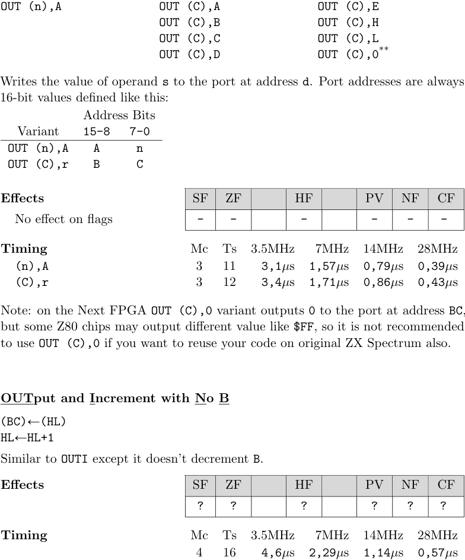

Writes the value of operand s to the port at address d. Port addresses are always 16-bit values defined like this: Address Bits Variant OUT (n),A n OUT (C),r

Effects

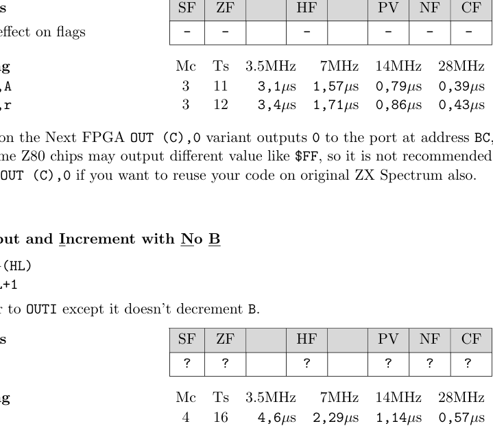

No effect on flags

Timing Mc Ts 3.5MHz 7MHz 14MHz 28MHz 3,1µs 1,57µs 0,79µs 0,39µs (n),A 3,4µs 1,71µs 0,86µs 0,43µs (C),r

Note: on the Next FPGA OUT (C),0 variant outputs 0 to the port at address BC, but some Z80 chips may output different value like $FF, so it is not recommended to use OUT (C),0 if you want to reuse your code on original ZX Spectrum also.

OUTput and Increment with No B

Similar to OUTI except it doesn’t decrement B.

Effects

Timing Mc Ts 3.5MHz 7MHz 14MHz 28MHz 4,6µs 2,29µs 1,14µs 0,57µs

PIXELADZX PIXEL ADdress

HLÐ$4000+((D^$C0)<<5)+((D^$07)<<8)+((D^$38)<<2)+(E>>3)

Takes E and D as the (x,y) coordinates of a point and calculates the address of the byte containing this pixel in the pixel area of standard ULA screen 0. Result is stored in HL.

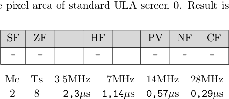

Effects

No effect on flags

Timing Mc Ts 3.5MHz 7MHz 14MHz 28MHz 2,3µs 1,14µs 0,57µs 0,29µs

PIXEL DowN

if (HL^$700) $700 else if (HL^$E0) $E0 HLÐHL^$F8FF+$20 else HLÐHL^$F81F+$800

Updates the address in HL (likely from prior PIXELAD or PIXELDN) to move down by one line of pixels of standard ULA screen 0.

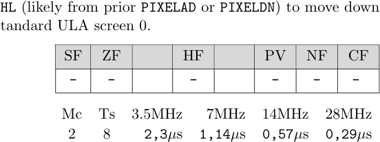

Effects

No effect on flags

Timing Mc Ts 3.5MHz 7MHz 14MHz 28MHz 2,3µs 1,14µs 0,57µs 0,29µs

POP rr POP from stack

rrhÐ(SP+1) rrlÐ(SP) SPÐSP+2

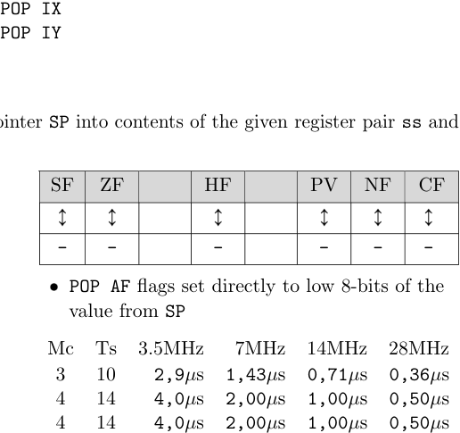

Copies 2 bytes from stack pointer SP into contents of the given register pair ss and increments SP by 2.

Effects

Other variants no effect

ˆ POP AF flags set directly to low 8-bits of the value from SP

Timing Mc Ts 3.5MHz 7MHz 14MHz 28MHz 2,9µs 1,43µs 0,71µs 0,36µs rr 4,0µs 2,00µs 1,00µs 0,50µs 4,0µs 2,00µs 1,00µs 0,50µs

PUSH ss PUSH on stack

(SP-2)Ðssl (SP-1)Ðssh

PUSH nnZX

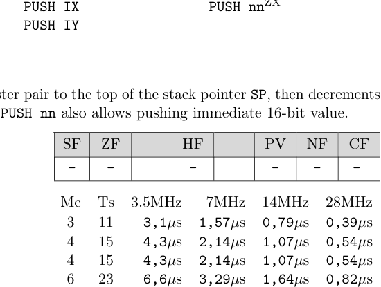

Copies contents of a register pair to the top of the stack pointer SP, then decrements SP by 2. Next extended PUSH nn also allows pushing immediate 16-bit value.

Effects

No effect on flags

Timing Mc Ts 3.5MHz 7MHz 14MHz 28MHz 3,1µs 1,57µs 0,79µs 0,39µs rr 4,3µs 2,14µs 1,07µs 0,54µs 4,3µs 2,14µs 1,07µs 0,54µs 6,6µs 3,29µs 1,64µs 0,82µs nn

CHAPTER 5. INSTRUCTIONS UP CLOSE

RES b,s RESet bit

sb Ð0

RES b,(IX+d),A**

RES b,(IY+d),A**

RES b,A RES b,B RES b,C RES b,D RES b,E RES b,H RES b,L RES b,(HL) RES b,(IX+d) RES b,(IY+d)

RES b,(IX+d),B**

RES b,(IY+d),B**

RES b,(IX+d),C**

RES b,(IY+d),C**

RES b,(IX+d),D**

RES b,(IY+d),D**

RES b,(IX+d),E**

RES b,(IY+d),E**

RES b,(IY+d),H**

RES b,(IX+d),H**

RES b,(IX+d),L**

RES b,(IY+d),L**

Resets bit b (0-7) of the given register s or memory location addressed by operand s.

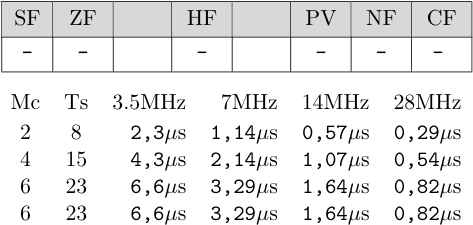

Effects

No effect on flags

Timing Mc Ts 3.5MHz 7MHz 14MHz 28MHz 2,3µs 1,14µs 0,57µs 0,29µs r 4,3µs 2,14µs 1,07µs 0,54µs 6,6µs 3,29µs 1,64µs 0,82µs (IX+d) 6,6µs 3,29µs 1,64µs 0,82µs (IY+d)

RET RETurn from subroutine

PClÐ(SP) PChÐ(SP+1) SPÐSP+2

Returns from subroutine. The contents of program counter PC is POP-ed from stack so next instruction will be loaded from there.

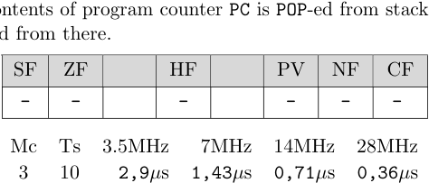

Effects

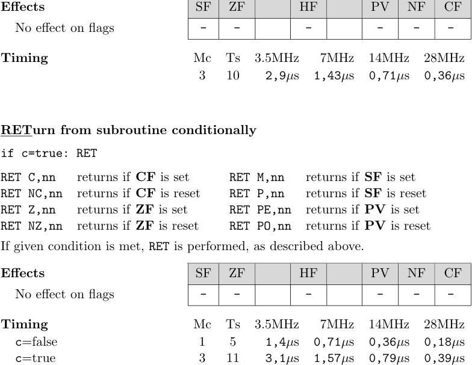

No effect on flags

Timing Mc Ts 3.5MHz 7MHz 14MHz 28MHz 2,9µs 1,43µs 0,71µs 0,36µs

RET c RETurn from subroutine conditionally

if c=true: RET

returns if CF is set returns if SF is set RET C,nn RET M,nn returns if CF is reset returns if SF is reset RET NC,nn RET P,nn returns if ZF is set returns if PV is set RET Z,nn RET PE,nn returns if ZF is reset returns if PV is reset RET NZ,nn RET PO,nn

If given condition is met, RET is performed, as described above.

Effects

No effect on flags

Timing Mc Ts 3.5MHz 7MHz 14MHz 28MHz c=false 1,4µs 0,71µs 0,36µs 0,18µs c=true 3,1µs 1,57µs 0,79µs 0,39µs

RETI RETurn from Interrupt

PClÐ(SP) PChÐ(SP+1) SPÐSP+2

Returns from maskable interrupt; restores stack pointer SP and signals to I/O device that interrupt routine is completed.

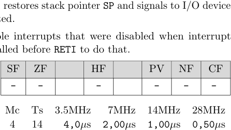

Note that RETI doesn’t re-enable interrupts that were disabled when interrupt routine started - EI should be called before RETI to do that.

Effects

No effect on flags

Timing Mc Ts 3.5MHz 7MHz 14MHz 28MHz 4,0µs 2,00µs 1,00µs 0,50µs

RETN RETurn from Non-maskable interrupt

PClÐ(SP) PChÐ(SP+1)

Returns from non-maskable interrupt; restores stack pointer SP and copies state of IFF2 back to IFF1 so that maskable interrupts are re-enabled.

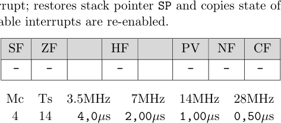

Effects

No effect on flags

Timing Mc Ts 3.5MHz 7MHz 14MHz 28MHz 4,0µs 2,00µs 1,00µs 0,50µs

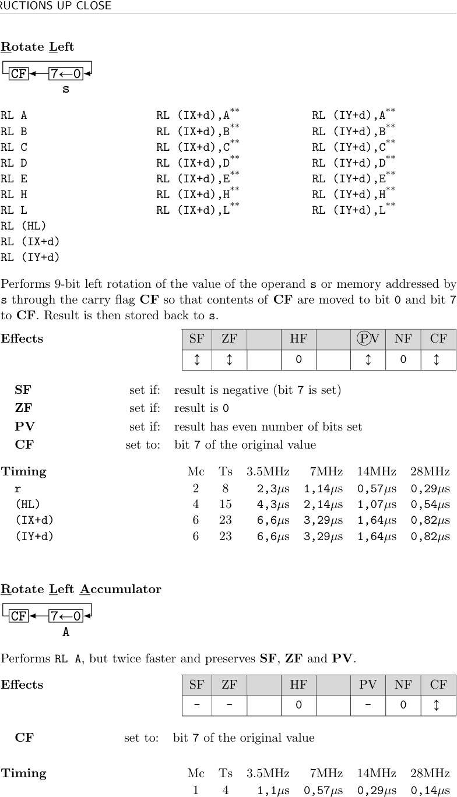

RL s Rotate Left

s

RL (IX+d),A**

RL (IY+d),A**

RL (IX+d),B**

RL (IY+d),B**

RL (IX+d),C**

RL (IY+d),C**

RL (IX+d),D**

RL (IY+d),D**

RL (IX+d),E**

RL (IY+d),E**

RL (IX+d),H**

RL (IY+d),H**

RL (IY+d),L**

RL (IX+d),L**

RL (IX+d) RL (IY+d)

Performs 9-bit left rotation of the value of the operand s or memory addressed by s through the carry flag CF so that contents of CF are moved to bit 0 and bit 7 to CF. Result is then stored back to s.

Effects

set if: result is negative (bit 7 is set) set if: result is 0 set if: result has even number of bits set set to: bit 7 of the original value

Timing Mc Ts 3.5MHz 7MHz 14MHz 28MHz 2,3µs 1,14µs 0,57µs 0,29µs r 4,3µs 2,14µs 1,07µs 0,54µs 6,6µs 3,29µs 1,64µs 0,82µs (IX+d) 6,6µs 3,29µs 1,64µs 0,82µs (IY+d)

Rotate Left Accumulator

Performs RL A, but twice faster and preserves SF, ZF and PV.


Effects

set to: bit 7 of the original value

Timing Ts 3.5MHz 7MHz 14MHz 28MHz 1,1µs 0,57µs 0,29µs 0,14µs

RLC s Rotate Left Circular

s

RLC (IX+d),A**

RLC (IY+d),A**

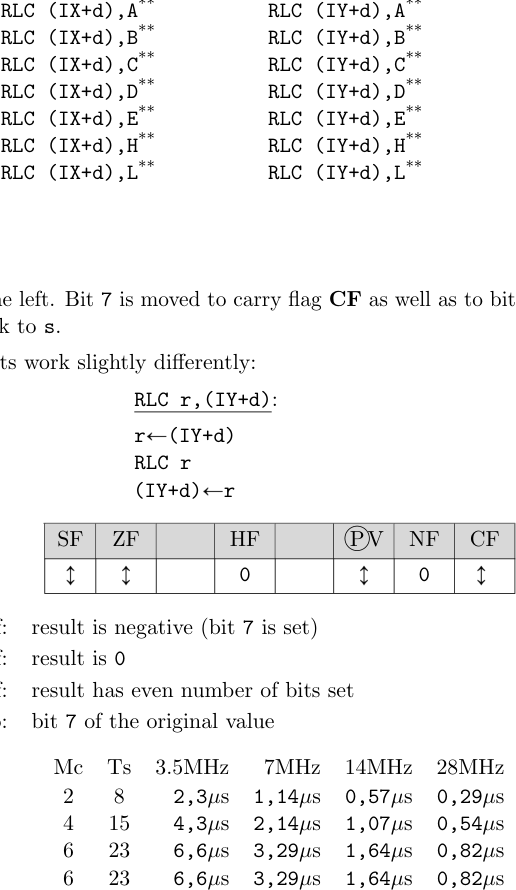

RLC (IX+d),B**

RLC (IY+d),B**

RLC (IX+d),C**

RLC (IY+d),C**

RLC (IX+d),D**

RLC (IY+d),D**

RLC (IX+d),E**

RLC (IY+d),E**

RLC (IX+d),H**

RLC (IY+d),H**

RLC (IX+d),L**

RLC (IY+d),L**

RLC (IX+d) RLC (IY+d)

Performs 8-bit rotation to the left. Bit 7 is moved to carry flag CF as well as to bit 0. Result is then stored back to s.

Note: undocumented variants work slightly differently:

RLC r,(IX+d):

RLC r,(IY+d):

rÐ(IX+d) RLC r (IX+d)Ðr

rÐ(IY+d) RLC r (IY+d)Ðr

Effects

set if: result is negative (bit 7 is set) set if: result is 0 set if: result has even number of bits set set to: bit 7 of the original value

Timing Mc Ts 3.5MHz 7MHz 14MHz 28MHz 2,3µs 1,14µs 0,57µs 0,29µs r 4,3µs 2,14µs 1,07µs 0,54µs 6,6µs 3,29µs 1,64µs 0,82µs (IX+d) 6,6µs 3,29µs 1,64µs 0,82µs (IY+d)

RLCA Rotate Left Circular Accumulator

Performs RLC A, but twice faster and preserves SF, ZF and PV.


Effects

set to: bit 7 of the original value

Timing Mc Ts 3.5MHz 7MHz 14MHz 28MHz 1,1µs 0,57µs 0,29µs 0,14µs

RLD See page 193

RR s Rotate Right

7Ñ0 CF | |
--- | --- | ---
| CF |
| |

s

RR (IY+d),A**

RR (IX+d),A**

RR (IY+d),B**

RR (IX+d),B**

RR (IY+d),C**

RR (IX+d),C**

RR (IY+d),D**

RR (IX+d),D**

RR (IY+d),E**

RR (IX+d),E**

RR E RR H RR L RR (HL) RR (IX+d) RR (IY+d)

RR (IY+d),H**

RR (IX+d),H**

RR (IY+d),L**

RR (IX+d),L**

Performs 9-bit right rotation of the contents of the operand s or memory addressed by s through carry flag CF so that contents of CF are moved to bit 7 and bit 0 to CF. Result is then stored back to s.

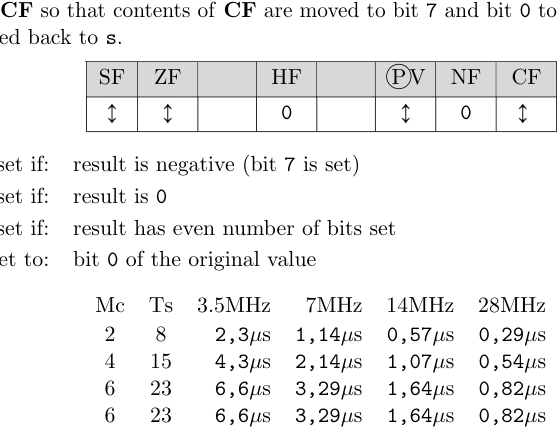

Effects

set if: result is negative (bit 7 is set) set if: result is 0 set if: result has even number of bits set set to: bit 0 of the original value

Timing Mc Ts 3.5MHz 7MHz 14MHz 28MHz 2,3µs 1,14µs 0,57µs 0,29µs r 4,3µs 2,14µs 1,07µs 0,54µs 6,6µs 3,29µs 1,64µs 0,82µs (IX+d) 6,6µs 3,29µs 1,64µs 0,82µs (IY+d)

RRA Rotate Right Accumulator

7Ñ0 CF | |
--- | --- | ---
| CF |
| |

Performs RR A, but twice faster and preserves SF, ZF and PV.

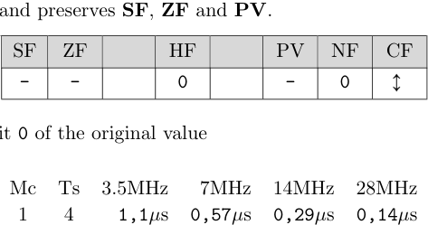

Effects

set to: bit 0 of the original value

Timing Mc Ts 3.5MHz 7MHz 14MHz 28MHz 1,1µs 0,57µs 0,29µs 0,14µs

RRC s Rotate Right Circular

s

RRC (IY+d),A**

RRC (IX+d),A**

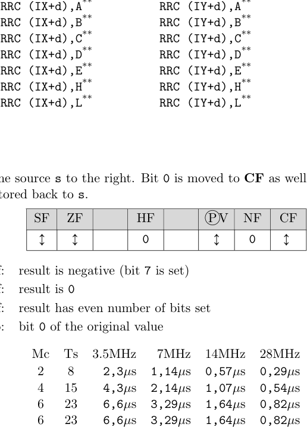

RRC (IY+d),B**

RRC (IX+d),B**

RRC (IY+d),C**

RRC (IX+d),C**

RRC (IY+d),D**

RRC (IX+d),D**

RRC (IY+d),E**

RRC (IX+d),E**

RRC (IY+d),H**

RRC (IX+d),H**

RRC (IY+d),L**

RRC (IX+d),L**

RRC (IX+d) RRC (IY+d)

Performs 8-bit rotation of the source s to the right. Bit 0 is moved to CF as well as to bit 7. Result is then stored back to s.

Effects

set if: result is negative (bit 7 is set) set if: result is 0 set if: result has even number of bits set set to: bit 0 of the original value

Timing Mc Ts 3.5MHz 7MHz 14MHz 28MHz 2,3µs 1,14µs 0,57µs 0,29µs r 4,3µs 2,14µs 1,07µs 0,54µs 6,6µs 3,29µs 1,64µs 0,82µs (IX+d) 6,6µs 3,29µs 1,64µs 0,82µs (IY+d)

RLD Rotate Left bcd Digit

|
--- | ---
7-4 | 3-0

7-4 | | 3-0 |
--- | --- | --- | ---
| | |

Performs leftward 12-bit rotation of 4-bit nibbles where 2 least significant nibbles are stored in memory location addressed by HL and most significant digit as lower 4 bits of the accumulator A.

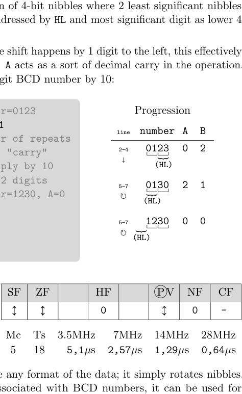

If used with BCD numbers: as the shift happens by 1 digit to the left, this effectively results in multiplication with 10. A acts as a sort of decimal carry in the operation. Example of multiplying multi-digit BCD number by 10:

```
MultiplyBy10:
; number=0123
LD HL, number+digits-1
LD B, digits
; number of repeats
XOR A
; reset "carry"
lp: RLD
; multiply by 10
DEC HL
; prev 2 digits
DJNZ lp
; number=1230, A=0
number:
DB $01, $23
digits = $-number ;(2)
```

Progression

MultiplyBy10: ; number=0123

LD HL, number+digits-1

number A line

LD B, digits ; number of repeats

; reset "carry"

t

lp: RLD ; multiply by 10

; prev 2 digits

DJNZ lp ; number=1230, A=0

t

number:

DB $01, $23

t

digits = $-number ;(2)

Effects

Timing Mc Ts 3.5MHz 7MHz 14MHz 28MHz 5,1µs 2,57µs 1,29µs 0,64µs

Note: instruction doesn’t assume any format of the data; it simply rotates nibbles. So while it’s most frequently associated with BCD numbers, it can be used for shifting hexadecimal values or any other content.

RRCA Rotate Right Circular Accumulator

Performs RRC A, but twice faster and preserves SF, ZF and PV.

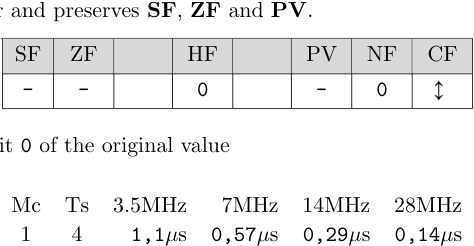

Effects

set to: bit 0 of the original value

Timing Ts 3.5MHz 7MHz 14MHz 28MHz 1,1µs 0,57µs 0,29µs 0,14µs

RRD Rotate Right bcd Digit

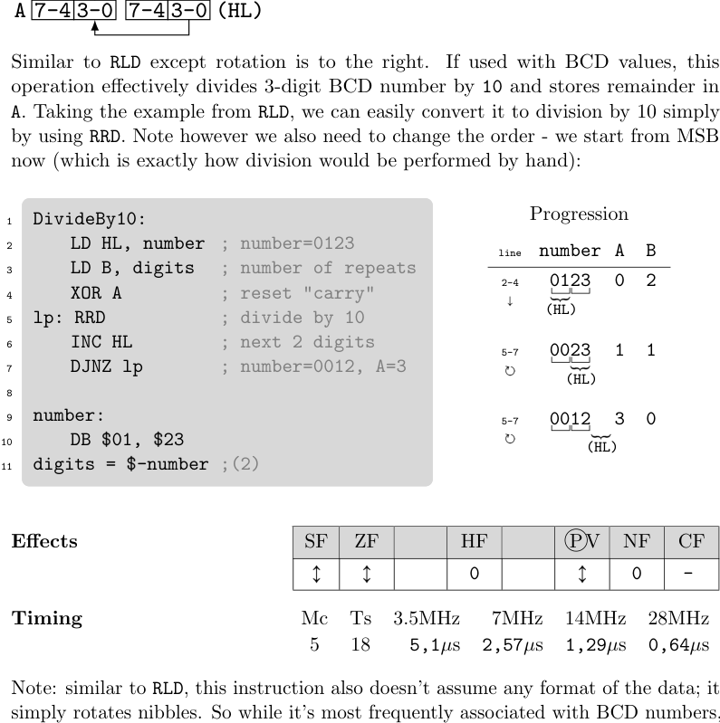

Similar to RLD except rotation is to the right. If used with BCD values, this operation effectively divides 3-digit BCD number by 10 and stores remainder in A. Taking the example from RLD, we can easily convert it to division by 10 simply by using RRD. Note however we also need to change the order - we start from MSB now (which is exactly how division would be performed by hand):

```
DivideBy10:
LD HL, number ; number=0123
LD B, digits
; number of repeats
XOR A
; reset "carry"
lp: RRD
; divide by 10
INC HL
; next 2 digits
DJNZ lp
; number=0012, A=3
number:
DB $01, $23
digits = $-number ;(2)
```

Progression

DivideBy10:

LD HL, number ; number=0123

number A line

LD B, digits ; number of repeats

; reset "carry"

t

lp: RRD ; divide by 10

; next 2 digits

DJNZ lp ; number=0012, A=3

t

number:

DB $01, $23

t

digits = $-number ;(2)

Effects

Timing Mc Ts 3.5MHz 7MHz 14MHz 28MHz 5,1µs 2,57µs 1,29µs 0,64µs

Note: similar to RLD, this instruction also doesn’t assume any format of the data; it simply rotates nibbles. So while it’s most frequently associated with BCD numbers, it can be used for shifting hexadecimal values or any other content.

RST n ReSTart

(SP-1)ÐPCh (SP-2)ÐPCl SPÐSP-2 PCÐn

RST $00 RST $08 RST $10 RST $18

RST $20 RST $28 RST $30 RST $38

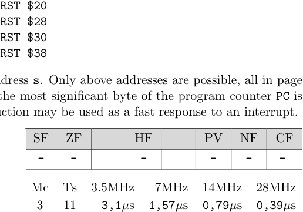

Restarts at the zero page address s. Only above addresses are possible, all in page 0 of the memory, therefore the most significant byte of the program counter PC is loaded with $00. The instruction may be used as a fast response to an interrupt.

Effects

No effect on flags

Timing Mc Ts 3.5MHz 7MHz 14MHz 28MHz 3,1µs 1,57µs 0,79µs 0,39µs

SBC See page 201

SCF Set Carry Flag

Sets carry flag CF.

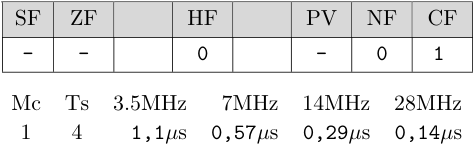

Effects

Timing Mc Ts 3.5MHz 7MHz 14MHz 28MHz 1,1µs 0,57µs 0,29µs 0,14µs

CHAPTER 5. INSTRUCTIONS UP CLOSE

SET b,s SET bit

sb Ð1

SET b,(IX+d),A**

SET b,(IY+d),A**

SET b,A SET b,B SET b,C SET b,D SET b,E SET b,H SET b,L SET b,(HL) SET b,(IX+d) SET b,(IY+d)

SET b,(IX+d),B**

SET b,(IY+d),B**

SET b,(IX+d),C**

SET b,(IY+d),C**

SET b,(IX+d),D**

SET b,(IY+d),D**

SET b,(IX+d),E**

SET b,(IY+d),E**

SET b,(IY+d),H**

SET b,(IX+d),H**

SET b,(IX+d),L**

SET b,(IY+d),L**

Sets bit b (0-7) of operand s or memory location addressed by s.

Note: undocumented variants work slightly differently:

SET b,(IX+d),r:

SET b,(IY+d),r:

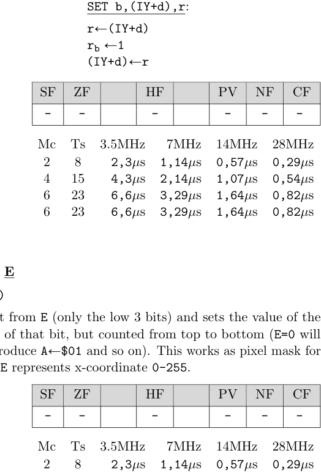

rÐ(IX+d) rb Ð1 (IX+d)Ðr

rÐ(IY+d) rb Ð1 (IY+d)Ðr

Effects

No effect on flags

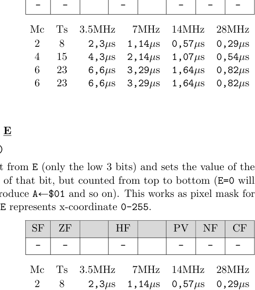

Timing Mc Ts 3.5MHz 7MHz 14MHz 28MHz 2,3µs 1,14µs 0,57µs 0,29µs r 4,3µs 2,14µs 1,07µs 0,54µs 6,6µs 3,29µs 1,64µs 0,82µs (IX+d) 6,6µs 3,29µs 1,64µs 0,82µs (IY+d)

SET Accumulator from E

AÐunsigned($80)>>(E^7)

Takes the bit number to set from E (only the low 3 bits) and sets the value of the accumulator A to the value of that bit, but counted from top to bottom (E=0 will produce AÐ$80, E=7 will produce AÐ$01 and so on). This works as pixel mask for ULA bitmap modes, when E represents x-coordinate 0-255.

Effects

No effect on flags

Timing Mc Ts 3.5MHz 7MHz 14MHz 28MHz 2,3µs 1,14µs 0,57µs 0,29µs

SLA s Shift Left Arithmetic

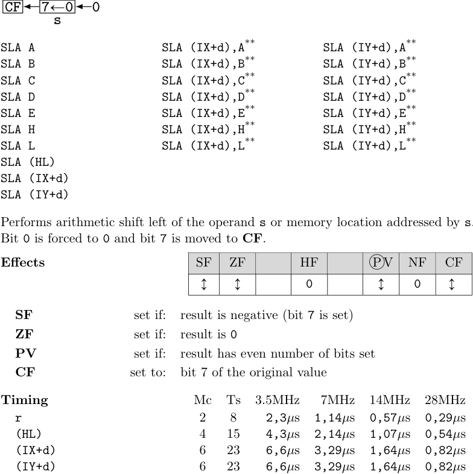

s

SLA (IX+d),A**

SLA (IY+d),A**

SLA (IX+d),B**

SLA (IY+d),B**

SLA (IX+d),C**

SLA (IY+d),C**

SLA (IX+d),D**

SLA (IY+d),D**

SLA (IX+d),E**

SLA (IY+d),E**

SLA (IX+d),H**

SLA (IY+d),H**

SLA (IX+d),L**

SLA (IY+d),L**

SLA (IX+d) SLA (IY+d)

Performs arithmetic shift left of the operand s or memory location addressed by s. Bit 0 is forced to 0 and bit 7 is moved to CF.

Effects

set if: result is negative (bit 7 is set) set if: result is 0 set if: result has even number of bits set set to: bit 7 of the original value

Timing Mc Ts 3.5MHz 7MHz 14MHz 28MHz 2,3µs 1,14µs 0,57µs 0,29µs r 4,3µs 2,14µs 1,07µs 0,54µs 6,6µs 3,29µs 1,64µs 0,82µs (IX+d) 6,6µs 3,29µs 1,64µs 0,82µs (IY+d)

Shift Left Logical

This mnemonic has no associated opcode on Next. There is no difference between logical and arithmetic shift left, use SLA for both. Some assemblers will allow SLL as equivalent, but unfortunately, some will assemble it as SLI, so it’s best avoiding.

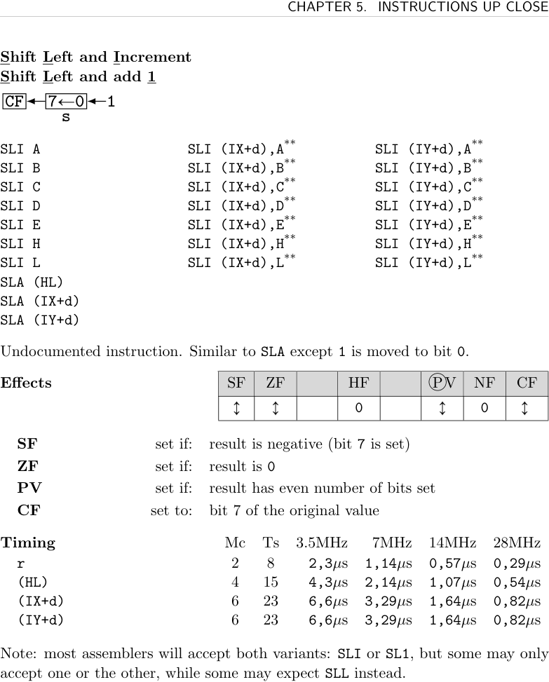

SLI s**

Shift Left and Increment Shift Left and add 1

SL1 s**

s

SLI (IX+d),A**

SLI (IY+d),A**

SLI (IX+d),B**

SLI (IY+d),B**

SLI (IX+d),C**

SLI (IY+d),C**

SLI (IX+d),D**

SLI (IY+d),D**

SLI (IY+d),E**

SLI (IX+d),E**

SLI (IX+d),H**

SLI (IY+d),H**

SLI (IX+d),L**

SLI (IY+d),L**

SLA (IX+d) SLA (IY+d)

Undocumented instruction. Similar to SLA except 1 is moved to bit 0.

Effects

set if: result is negative (bit 7 is set) set if: result is 0 set if: result has even number of bits set set to: bit 7 of the original value

Timing Mc Ts 3.5MHz 7MHz 14MHz 28MHz 2,3µs 1,14µs 0,57µs 0,29µs r 4,3µs 2,14µs 1,07µs 0,54µs 6,6µs 3,29µs 1,64µs 0,82µs (IX+d) 6,6µs 3,29µs 1,64µs 0,82µs (IY+d)

Note: most assemblers will accept both variants: SLI or SL1, but some may only accept one or the other, while some may expect SLL instead.

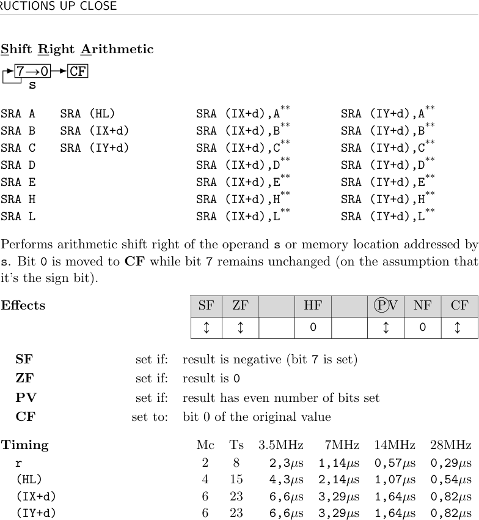

SRA s Shift Right Arithmetic

s

SRA (IX+d),A** SRA (IY+d),A**

SRA (IX+d),B** SRA (IY+d),B** SRA (IX+d)

SRA (IX+d),C** SRA (IY+d),C** SRA (IY+d)

SRA (IX+d),D** SRA (IY+d),D**

SRA (IX+d),E** SRA (IY+d),E**

SRA (IX+d),H** SRA (IY+d),H**

SRA (IX+d),L** SRA (IY+d),L**

Performs arithmetic shift right of the operand s or memory location addressed by s. Bit 0 is moved to CF while bit 7 remains unchanged (on the assumption that it’s the sign bit).

Effects

set if: result is negative (bit 7 is set) set if: result is 0 set if: result has even number of bits set set to: bit 0 of the original value

Timing Mc Ts 3.5MHz 7MHz 14MHz 28MHz 2,3µs 1,14µs 0,57µs 0,29µs r 4,3µs 2,14µs 1,07µs 0,54µs 6,6µs 3,29µs 1,64µs 0,82µs (IX+d) 6,6µs 3,29µs 1,64µs 0,82µs (IY+d)

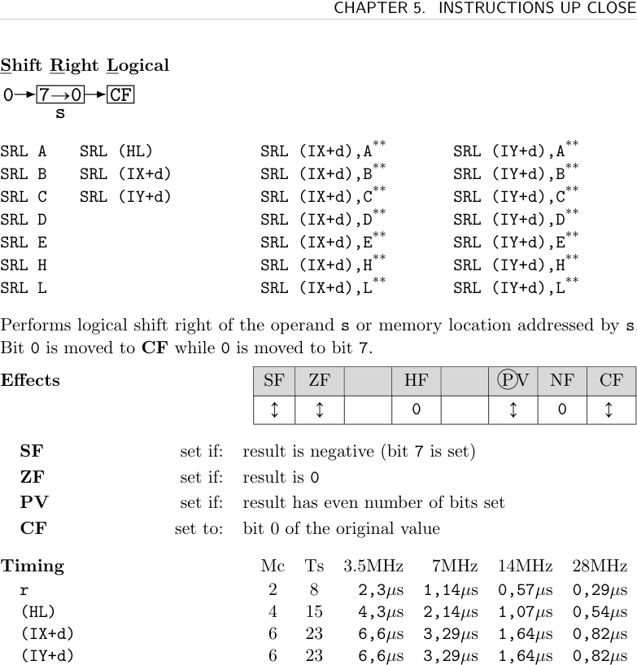

SRL s Shift Right Logical

s

SRL (IX+d),A** SRL (IY+d),A**

SRL (IX+d),B** SRL (IY+d),B** SRL (IX+d)

SRL (IX+d),C** SRL (IY+d),C** SRL (IY+d)

SRL (IX+d),D** SRL (IY+d),D**

SRL (IX+d),E** SRL (IY+d),E**

SRL (IX+d),H** SRL (IY+d),H**

SRL (IX+d),L** SRL (IY+d),L**

Performs logical shift right of the operand s or memory location addressed by s. Bit 0 is moved to CF while 0 is moved to bit 7.

Effects

set if: result is negative (bit 7 is set) set if: result is 0 set if: result has even number of bits set set to: bit 0 of the original value

Timing Mc Ts 3.5MHz 7MHz 14MHz 28MHz 2,3µs 1,14µs 0,57µs 0,29µs r 4,3µs 2,14µs 1,07µs 0,54µs 6,6µs 3,29µs 1,64µs 0,82µs (IX+d) 6,6µs 3,29µs 1,64µs 0,82µs (IY+d)

SBC d,s SuBtract with Carry

dÐd-s-CF

8 bit SBC A,A SBC A,B SBC A,C SBC A,D SBC A,E SBC A,H SBC A,L SBC A,n

8 bit SBC A,IXH**

16 bit SBC HL,BC SBC HL,DE SBC HL,HL SBC HL,SP

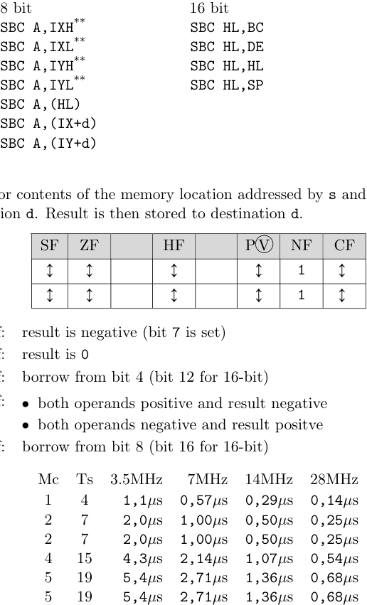

SBC A,IXL**

SBC A,IYH**

SBC A,IYL**

SBC A,(HL) SBC A,(IX+d) SBC A,(IY+d)

Subtracts source operand s or contents of the memory location addressed by s and carry flag CF from destination d. Result is then stored to destination d.

Effects

8-bit

16-bit

set if: result is negative (bit 7 is set) set if: result is 0 set if: borrow from bit 4 (bit 12 for 16-bit)

set if: ˆ both operands positive and result negative ˆ both operands negative and result positve set if: borrow from bit 8 (bit 16 for 16-bit)

Timing Mc Ts 3.5MHz 7MHz 14MHz 28MHz 1,1µs 0,57µs 0,29µs 0,14µs r 2,0µs 1,00µs 0,50µs 0,25µs n 2,0µs 1,00µs 0,50µs 0,25µs 4,3µs 2,14µs 1,07µs 0,54µs HL,rr 5,4µs 2,71µs 1,36µs 0,68µs (IX+d) 5,4µs 2,71µs 1,36µs 0,68µs (IY+d)

CHAPTER 5. INSTRUCTIONS UP CLOSE

SUB s SUBtract

AÐA-s

SUB IXH**

SUB n SUB (HL) SUB (IX+d) SUB (IY+d)

SUB IXL**

SUB IYH**

SUB IYL**

Subtracts 8-bit immediate value, operand s or memory location addressed by s from accumulator A. Then stores result back to A.

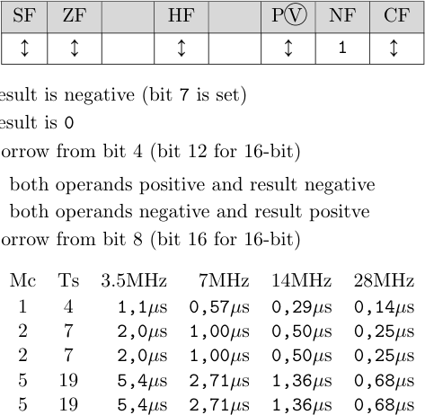

Effects

set if: result is negative (bit 7 is set) set if: result is 0 set if: borrow from bit 4 (bit 12 for 16-bit)

set if: ˆ both operands positive and result negative ˆ both operands negative and result positve set if: borrow from bit 8 (bit 16 for 16-bit)

Timing Mc Ts 3.5MHz 7MHz 14MHz 28MHz 1,1µs 0,57µs 0,29µs 0,14µs r 2,0µs 1,00µs 0,50µs 0,25µs n 2,0µs 1,00µs 0,50µs 0,25µs 5,4µs 2,71µs 1,36µs 0,68µs (IX+d) 5,4µs 2,71µs 1,36µs 0,68µs (IY+d)

SWAPNIBZX SWAP NIBbles

| | |
--- | --- | --- | ---
7654 | | 3210 |
| | |

Swaps the high and low nibbles of the accumulator A.

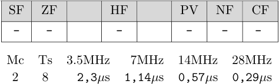

Effects

No effect on flags

Timing Mc Ts 3.5MHz 7MHz 14MHz 28MHz 2,3µs 1,14µs 0,57µs 0,29µs

TEST nZX

A^n

Similar to CP (page 157), but performs an AND instead of a subtraction. Again, AND is performed between the accumulator A and value n. Status flags are updated according to the result, but the result is then discarded (value of A is not changed).

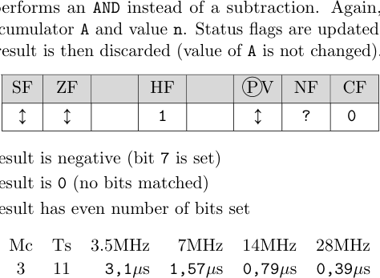

Effects

set if: result is negative (bit 7 is set) set if: result is 0 (no bits matched) set if: result has even number of bits set

Timing Mc Ts 3.5MHz 7MHz 14MHz 28MHz 3,1µs 1,57µs 0,79µs 0,39µs

XOR s bitwise eXclusive OR

AÐAYs

XOR IXH**

XOR A XOR B XOR C XOR D XOR E XOR H XOR L XOR n

XOR (HL) XOR (IX+d) XOR (IY+d)

XOR IXL**

XOR IYH**

XOR IYL**

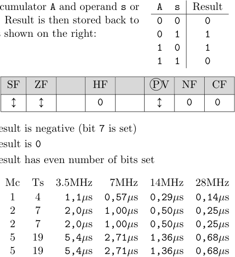

Result s

Performs exclusive or between accumulator A and operand s or memory location addressed by s. Result is then stored back to A. Individual bits are XOR’ed as shown on the right:

Effects

set if: result is negative (bit 7 is set) set if: result is 0 set if: result has even number of bits set

Timing Mc Ts 3.5MHz 7MHz 14MHz 28MHz 1,1µs 0,57µs 0,29µs 0,14µs r 2,0µs 1,00µs 0,50µs 0,25µs n 2,0µs 1,00µs 0,50µs 0,25µs 5,4µs 2,71µs 1,36µs 0,68µs (IX+d) 5,4µs 2,71µs 1,36µs 0,68µs (IY+d)

Appendix A

Instructions Sorted by Mnemonic

Instructions marked with ** are undocumented. Instructions marked with ZX are ZX Spectrum Next extended.

ADD DE,AZX ED32 ADD DE,nmZX ED35 m n ADD HL,AZX ED31 ADD HL,BC 09 ADD HL,DE 19 ADD HL,HL 29 ADD HL,SP 39 ADD HL,nmZX ED34 m n ADD IX,BC DD09 ADD IX,DE DD19 ADD IX,IX DD29 ADD IX,SP DD39 ADD IY,BC FD09 ADD IY,DE FD19 ADD IY,IY FD29 ADD IY,SP FD39 AND A A7 AND B A0 AND C A1 AND D A2 AND E A3 AND H A4 AND L A5 AND n E6 n AND (HL) A6 AND (IX+d) DDA6 d AND (IY+d) FDA6 d AND IXH** DDA4 AND IXL** DDA5 AND IYH** FDA4 AND IYL** FDA5 BIT 0,A CB47 BIT 0,B CB40 BIT 0,C CB41 BIT 0,D CB42 BIT 0,E CB43

BIT 0,H CB44 BIT 0,L CB45 BIT 0,(HL) CB46 BIT 0,(IX+d) DDCB d 46 BIT 0,(IX+d)** DDCB d 40 BIT 0,(IX+d)** DDCB d 41 BIT 0,(IX+d)** DDCB d 42 BIT 0,(IX+d)** DDCB d 43 BIT 0,(IX+d)** DDCB d 44 BIT 0,(IX+d)** DDCB d 45 BIT 0,(IX+d)** DDCB d 47 BIT 0,(IY+d) FDCB d 46 BIT 0,(IY+d)** FDCB d 40 BIT 0,(IY+d)** FDCB d 41 BIT 0,(IY+d)** FDCB d 42 BIT 0,(IY+d)** FDCB d 43 BIT 0,(IY+d)** FDCB d 44 BIT 0,(IY+d)** FDCB d 45 BIT 0,(IY+d)** FDCB d 47 BIT 1,A CB4F BIT 1,B CB48 BIT 1,C CB49 BIT 1,D CB4A BIT 1,E CB4B BIT 1,H CB4C BIT 1,L CB4D BIT 1,(HL) CB4E BIT 1,(IX+d) DDCB d 4E BIT 1,(IX+d)** DDCB d 48 BIT 1,(IX+d)** DDCB d 49 BIT 1,(IX+d)** DDCB d 4A BIT 1,(IX+d)** DDCB d 4B BIT 1,(IX+d)** DDCB d 4C BIT 1,(IX+d)** DDCB d 4D BIT 1,(IX+d)** DDCB d 4F

ADC A,A 8F ADC A,B 88 ADC A,C 89 ADC A,D 8A ADC A,E 8B ADC A,H 8C ADC A,L 8D ADC A,n CE n ADC A,(HL) 8E ADC A,(IX+d) DD8E d ADC A,(IY+d) FD8E d ADC A,IXH** DD8C ADC A,IXL** DD8D ADC A,IYH** FD8C ADC A,IYL** FD8D ADC HL,BC ED4A ADC HL,DE ED5A ADC HL,HL ED6A ADC HL,SP ED7A ADD A,A 87 ADD A,B 80 ADD A,C 81 ADD A,D 82 ADD A,E 83 ADD A,H 84 ADD A,L 85 ADD A,n C6 n ADD A,(HL) 86 ADD A,(IX+d) DD86 d ADD A,(IY+d) FD86 d ADD A,IXH** DD84 ADD A,IXL** DD85 ADD A,IYH** FD84 ADD A,IYL** FD85 ADD BC,AZX ED33 ADD BC,nmZX ED36 m n

APPENDIX A. INSTRUCTIONS SORTED BY MNEMONIC

BIT 3,(IY+d)** FDCB d 5F BIT 4,A CB67 BIT 4,B CB60 BIT 4,C CB61 BIT 4,D CB62 BIT 4,E CB63 BIT 4,H CB64 BIT 4,L CB65 BIT 4,(HL) CB66 BIT 4,(IX+d) DDCB d 66 BIT 4,(IX+d)** DDCB d 60 BIT 4,(IX+d)** DDCB d 61 BIT 4,(IX+d)** DDCB d 62 BIT 4,(IX+d)** DDCB d 63 BIT 4,(IX+d)** DDCB d 64 BIT 4,(IX+d)** DDCB d 65 BIT 4,(IX+d)** DDCB d 67 BIT 4,(IY+d) FDCB d 66 BIT 4,(IY+d)** FDCB d 60 BIT 4,(IY+d)** FDCB d 61 BIT 4,(IY+d)** FDCB d 62 BIT 4,(IY+d)** FDCB d 63 BIT 4,(IY+d)** FDCB d 64 BIT 4,(IY+d)** FDCB d 65 BIT 4,(IY+d)** FDCB d 67 BIT 5,A CB6F BIT 5,B CB68 BIT 5,C CB69 BIT 5,D CB6A BIT 5,E CB6B BIT 5,H CB6C BIT 5,L CB6D BIT 5,(HL) CB6E BIT 5,(IX+d) DDCB d 6E BIT 5,(IX+d)** DDCB d 68 BIT 5,(IX+d)** DDCB d 69 BIT 5,(IX+d)** DDCB d 6A BIT 5,(IX+d)** DDCB d 6B BIT 5,(IX+d)** DDCB d 6C BIT 5,(IX+d)** DDCB d 6D BIT 5,(IX+d)** DDCB d 6F BIT 5,(IY+d) FDCB d 6E BIT 5,(IY+d)** FDCB d 68 BIT 5,(IY+d)** FDCB d 69 BIT 5,(IY+d)** FDCB d 6A BIT 5,(IY+d)** FDCB d 6B BIT 5,(IY+d)** FDCB d 6C BIT 5,(IY+d)** FDCB d 6D BIT 5,(IY+d)** FDCB d 6F BIT 6,A CB77 BIT 6,B CB70 BIT 6,C CB71 BIT 6,D CB72 BIT 6,E CB73 BIT 6,H CB74 BIT 6,L CB75

BIT 1,(IY+d) FDCB d 4E BIT 1,(IY+d)** FDCB d 48 BIT 1,(IY+d)** FDCB d 49 BIT 1,(IY+d)** FDCB d 4A BIT 1,(IY+d)** FDCB d 4B BIT 1,(IY+d)** FDCB d 4C BIT 1,(IY+d)** FDCB d 4D BIT 1,(IY+d)** FDCB d 4F BIT 2,A CB57 BIT 2,B CB50 BIT 2,C CB51 BIT 2,D CB52 BIT 2,E CB53 BIT 2,H CB54 BIT 2,L CB55 BIT 2,(HL) CB56 BIT 2,(IX+d) DDCB d 56 BIT 2,(IX+d)** DDCB d 50 BIT 2,(IX+d)** DDCB d 51 BIT 2,(IX+d)** DDCB d 52 BIT 2,(IX+d)** DDCB d 53 BIT 2,(IX+d)** DDCB d 54 BIT 2,(IX+d)** DDCB d 55 BIT 2,(IX+d)** DDCB d 57 BIT 2,(IY+d) FDCB d 56 BIT 2,(IY+d)** FDCB d 50 BIT 2,(IY+d)** FDCB d 51 BIT 2,(IY+d)** FDCB d 52 BIT 2,(IY+d)** FDCB d 53 BIT 2,(IY+d)** FDCB d 54 BIT 2,(IY+d)** FDCB d 55 BIT 2,(IY+d)** FDCB d 57 BIT 3,A CB5F BIT 3,B CB58 BIT 3,C CB59 BIT 3,D CB5A BIT 3,E CB5B BIT 3,H CB5C BIT 3,L CB5D BIT 3,(HL) CB5E BIT 3,(IX+d) DDCB d 5E BIT 3,(IX+d)** DDCB d 58 BIT 3,(IX+d)** DDCB d 59 BIT 3,(IX+d)** DDCB d 5A BIT 3,(IX+d)** DDCB d 5B BIT 3,(IX+d)** DDCB d 5C BIT 3,(IX+d)** DDCB d 5D BIT 3,(IX+d)** DDCB d 5F BIT 3,(IY+d) FDCB d 5E BIT 3,(IY+d)** FDCB d 58 BIT 3,(IY+d)** FDCB d 59 BIT 3,(IY+d)** FDCB d 5A BIT 3,(IY+d)** FDCB d 5B BIT 3,(IY+d)** FDCB d 5C BIT 3,(IY+d)** FDCB d 5D

BIT 6,(HL) CB76 BIT 6,(IX+d) DDCB d 76 BIT 6,(IX+d)** DDCB d 70 BIT 6,(IX+d)** DDCB d 71 BIT 6,(IX+d)** DDCB d 72 BIT 6,(IX+d)** DDCB d 73 BIT 6,(IX+d)** DDCB d 74 BIT 6,(IX+d)** DDCB d 75 BIT 6,(IX+d)** DDCB d 77 BIT 6,(IY+d) FDCB d 76 BIT 6,(IY+d)** FDCB d 70 BIT 6,(IY+d)** FDCB d 71 BIT 6,(IY+d)** FDCB d 72 BIT 6,(IY+d)** FDCB d 73 BIT 6,(IY+d)** FDCB d 74 BIT 6,(IY+d)** FDCB d 75 BIT 6,(IY+d)** FDCB d 77 BIT 7,A CB7F BIT 7,B CB78 BIT 7,C CB79 BIT 7,D CB7A BIT 7,E CB7B BIT 7,H CB7C BIT 7,L CB7D BIT 7,(HL) CB7E BIT 7,(IX+d) DDCB d 7E BIT 7,(IX+d)** DDCB d 78 BIT 7,(IX+d)** DDCB d 79 BIT 7,(IX+d)** DDCB d 7A BIT 7,(IX+d)** DDCB d 7B BIT 7,(IX+d)** DDCB d 7C BIT 7,(IX+d)** DDCB d 7D BIT 7,(IX+d)** DDCB d 7F BIT 7,(IY+d) FDCB d 7E BIT 7,(IY+d)** FDCB d 78 BIT 7,(IY+d)** FDCB d 79 BIT 7,(IY+d)** FDCB d 7A BIT 7,(IY+d)** FDCB d 7B BIT 7,(IY+d)** FDCB d 7C BIT 7,(IY+d)** FDCB d 7D BIT 7,(IY+d)** FDCB d 7F BRLC DE,BZX ED2C BSLA DE,BZX ED28 BSRA DE,BZX ED29 BSRF DE,BZX ED2B BSRL DE,BZX ED2A CALL nm CD m n CALL C,nm DC m n CALL M,nm FC m n CALL NC,nm D4 m n CALL NZ,nm C4 m n CALL P,nm F4 m n CALL PE,nm EC m n CALL PO,nm E4 m n CALL Z,nm CC m n CCF 3F

APPENDIX A. INSTRUCTIONS SORTED BY MNEMONIC

CP A BF CP B B8 CP C B9 CP D BA CP E BB CP H BC CP L BD CP n FE n CP (HL) BE CP (IX+d) DDBE d CP (IY+d) FDBE d CP IXH** DDBC CP IXL** DDBD CP IYH** FDBC CP IYL** FDBD CPDR EDB9 CPD EDA9 CPIR EDB1 CPI EDA1 CPL 2F DAA 27 DEC (HL) 35 DEC (IX+d) DD35 d DEC (IY+d) FD35 d DEC A 3D DEC B 05 DEC C 0D DEC D 15 DEC E 1D DEC H 25 DEC L 2D DEC BC 0B DEC DE 1B DEC HL 2B DEC IX DD2B DEC IXH** DD25 DEC IXL** DD2D DEC IY FD2B DEC IYH** FD25 DEC IYL** FD2D DEC SP 3B DI F3 DJNZ (PC+e) 10 e EI FB EX (SP),HL E3 EX (SP),IX DDE3 EX (SP),IY FDE3 EX AF,AF’ 08 EX DE,HL EB EXX D9 HALT 76 IM 0** ED4E IM 0** ED66 IM 0** ED6E IM 0 ED46 IM 1** ED76

IM 1 ED56 IM 2** ED7E IM 2 ED5E IN A,(C) ED78 IN A,(n) DB n IN B,(C) ED40 IN C,(C) ED48 IN D,(C) ED50 IN E,(C) ED58 IN F,(C)** ED70 IN H,(C) ED60 IN L,(C) ED68 IN (C)** ED70 INC (HL) 34 INC (IX+d) DD34 d INC (IY+d) FD34 d INC A 3C INC B 04 INC C 0C INC D 14 INC E 1C INC H 24 INC L 2C INC BC 03 INC DE 13 INC HL 23 INC IX DD23 INC IXH** DD24 INC IXL** DD2C INC IY FD23 INC IYH** FD24 INC IYL** FD2C INC SP 33 INDR EDBA IND EDAA INIR EDB2 INI EDA2 JP (C)ZX ED98 JP (HL) E9 JP (IX) DDE9 JP (IY) FDE9 JP nm C3 m n JP C,nm DA m n JP M,nm FA m n JP NC,nm D2 m n JP NZ,nm C2 m n JP P,nm F2 m n JP PE,nm EA m n JP PO,nm E2 m n JP Z,nm CA m n JR e 18 e JR C,e 38 e JR NC,e 30 e JR NZ,e 20 e JR Z,e 28 e LD (BC),A LD (DE),A

LD (HL),A LD (HL),B LD (HL),C LD (HL),D 72 LD (HL),E 73 LD (HL),H 74 LD (HL),L 75 LD (HL),n 36 n LD (IX+d),A DD77 d LD (IX+d),B DD70 d LD (IX+d),C DD71 d LD (IX+d),D DD72 d LD (IX+d),E DD73 d LD (IX+d),H DD74 d LD (IX+d),L DD75 d LD (IX+d),n DD36 d n LD (IY+d),A FD77 d LD (IY+d),B FD70 d LD (IY+d),C FD71 d LD (IY+d),D FD72 d LD (IY+d),E FD73 d LD (IY+d),H FD74 d LD (IY+d),L FD75 d LD (IY+d),n FD36 d n LD (nm),A 32 m n LD (nm),BC ED43 m n LD (nm),DE ED53 m n LD (nm),HL 22 m n LD (nm),HL ED63 m n LD (nm),IX DD22 m n LD (nm),IY FD22 m n LD (nm),SP ED73 m n LD A,A 7F LD A,B 78 LD A,C 79 LD A,D 7A LD A,E 7B LD A,H 7C LD A,I ED57 LD A,L 7D LD A,R ED5F LD A,n 3E n LD A,(BC) 0A LD A,(DE) 1A LD A,(HL) 7E LD A,(IX+d) DD7E d LD A,(IY+d) FD7E d LD A,(nm) 3A m n LD A,IXH** DD7C LD A,IXL** DD7D LD A,IYH** FD7C LD A,IYL** FD7D LD B,A LD B,B LD B,C LD B,D LD B,E

APPENDIX A. INSTRUCTIONS SORTED BY MNEMONIC

LD E,IXL** DD5D LD E,IYH** FD5C LD E,IYL** FD5D LD H,A 67 LD H,B 60 LD H,C 61 LD H,D 62 LD H,E 63 LD H,H 64 LD H,L 65 LD H,n 26 n LD H,(HL) 66 LD H,(IX+d) DD66 d LD H,(IY+d) FD66 d LD HL,(nm) 2A m n LD HL,(nm) ED6B m n LD HL,nm 21 m n LD I,A ED47 LD IX,(nm) DD2A m n LD IX,nm DD21 m n LD IXH,A** DD67 LD IXH,B** DD60 LD IXH,C** DD61 LD IXH,D** DD62 LD IXH,E** DD63 LD IXH,IXH** DD64 LD IXH,IXL** DD65 LD IXH,n** DD26 n LD IXL,A** DD6F LD IXL,B** DD68 LD IXL,C** DD69 LD IXL,D** DD6A LD IXL,E** DD6B LD IXL,IXH** DD6C LD IXL,IXL** DD6D LD IXL,n** DD2E n LD IY,(nm) FD2A m n LD IY,nm FD21 m n LD IYH,A** FD67 LD IYH,B** FD60 LD IYH,C** FD61 LD IYH,D** FD62 LD IYH,E** FD63 LD IYH,IYH** FD64 LD IYH,IYL** FD65 LD IYH,n** FD26 n LD IYL,A** FD6F LD IYL,B** FD68 LD IYL,C** FD69 LD IYL,D** FD6A LD IYL,E** FD6B LD IYL,IYH** FD6C LD IYL,IYL** FD6D LD L,A 6F LD L,B LD L,C

LD B,H LD B,L LD B,n 06 n LD B,(HL) 46 LD B,(IX+d) DD46 d LD B,(IY+d) FD46 d LD B,IXH** DD44 LD B,IXL** DD45 LD B,IYH** FD44 LD B,IYL** FD45 LD BC,(nm) ED4B m n LD BC,nm 01 m n LD C,A 4F LD C,B 48 LD C,C 49 LD C,D 4A LD C,E 4B LD C,H 4C LD C,L 4D LD C,n 0E n LD C,(HL) 4E LD C,(IX+d) DD4E d LD C,(IY+d) FD4E d LD C,IXH** DD4C LD C,IXL** DD4D LD C,IYH** FD4C LD C,IYL** FD4D LD D,A 57 LD D,B 50 LD D,C 51 LD D,D 52 LD D,E 53 LD D,H 54 LD D,L 55 LD D,n 16 n LD D,(HL) 56 LD D,(IX+d) DD56 d LD D,(IY+d) FD56 d LD D,IXH** DD54 LD D,IXL** DD55 LD D,IYH** FD54 LD D,IYL** FD55 LD DE,(nm) ED5B m n LD DE,nm 11 m n LD E,A 5F LD E,B 58 LD E,C 59 LD E,D 5A LD E,E 5B LD E,H 5C LD E,L 5D LD E,n 1E n LD E,(HL) 5E LD E,(IX+d) DD5E d LD E,(IY+d) FD5E d LD E,IXH** DD5C

LD L,D 6A LD L,E 6B LD L,H 6C LD L,L 6D LD L,n 2E n LD IYL,n** FD2E n LD L,(HL) 6E LD L,(IX+d) DD6E d LD L,(IY+d) FD6E d LD R,A ED4F LD SP,(nm) ED7B m n LD SP,HL F9 LD SP,IX DDF9 LD SP,IY FDF9 LD SP,nm 31 m n LDD EDA8 LDDR EDB8 LDDXZX EDAC LDDRXZX EDBC LDI EDA0 LDIR EDB0 LDIXZX EDA4 LDIRXZX EDB4 LDPIRXZX EDB7 LDWSZX EDA5 MIRROR AZX ED24 MUL D,EZX ED30 NEG** ED4C NEG** ED54 NEG** ED5C NEG** ED64 NEG** ED6C NEG** ED74 NEG** ED7C NEG ED44 NEXTREG r,nZX ED91 r n NEXTREG r,AZX ED92 r NOP 00 OR A B7 OR B B0 OR C B1 OR D B2 OR E B3 OR H B4 OR L B5 OR n F6 n OR (HL) B6 OR (IX+d) DDB6 d OR (IY+d) FDB6 d OR IXH** DDB4 OR IXL** DDB5 OR IYH** FDB4 OR IYL** FDB5 OTDR EDBB OTIR EDB3 OUT (C),0** ED71

APPENDIX A. INSTRUCTIONS SORTED BY MNEMONIC

RES 3,(IX+d),H** DDCB d 9C RES 3,(IX+d),L** DDCB d 9D RES 3,(IY+d) FDCB d 9E RES 3,(IY+d),A** FDCB d 9F RES 3,(IY+d),B** FDCB d 98 RES 3,(IY+d),C** FDCB d 99 RES 3,(IY+d),D** FDCB d 9A RES 3,(IY+d),E** FDCB d 9B RES 3,(IY+d),H** FDCB d 9C RES 3,(IY+d),L** FDCB d 9D RES 4,A CBA7 RES 4,B CBA0 RES 4,C CBA1 RES 4,D CBA2 RES 4,E CBA3 RES 4,H CBA4 RES 4,L CBA5 RES 4,(HL) CBA6 RES 4,(IX+d) DDCB d A6 RES 4,(IX+d),A** DDCB d A7 RES 4,(IX+d),B** DDCB d A0 RES 4,(IX+d),C** DDCB d A1 RES 4,(IX+d),D** DDCB d A2 RES 4,(IX+d),E** DDCB d A3 RES 4,(IX+d),H** DDCB d A4 RES 4,(IX+d),L** DDCB d A5 RES 4,(IY+d) FDCB d A6 RES 4,(IY+d),A** FDCB d A7 RES 4,(IY+d),B** FDCB d A0 RES 4,(IY+d),C** FDCB d A1 RES 4,(IY+d),D** FDCB d A2 RES 4,(IY+d),E** FDCB d A3 RES 4,(IY+d),H** FDCB d A4 RES 4,(IY+d),L** FDCB d A5 RES 5,A CBAF RES 5,B CBA8 RES 5,C CBA9 RES 5,D CBAA RES 5,E CBAB RES 5,H CBAC RES 5,L CBAD RES 5,(HL) CBAE RES 5,(IX+d) DDCB d AE RES 5,(IX+d),A** DDCB d AF RES 5,(IX+d),B** DDCB d A8 RES 5,(IX+d),C** DDCB d A9 RES 5,(IX+d),D** DDCB d AA RES 5,(IX+d),E** DDCB d AB RES 5,(IX+d),H** DDCB d AC RES 5,(IX+d),L** DDCB d AD RES 5,(IY+d) FDCB d AE RES 5,(IY+d),A** FDCB d AF RES 5,(IY+d),B** FDCB d A8 RES 5,(IY+d),C** FDCB d A9 RES 5,(IY+d),D** FDCB d AA RES 5,(IY+d),E** FDCB d AB

OUT (C),A ED79 OUT (C),B ED41 OUT (C),C ED49 OUT (C),D ED51 OUT (C),E ED59 OUT (C),H ED61 OUT (C),L ED69 OUT (n),A D3 n OUTD EDAB OUTI EDA3 OUTINBZX ED90 PIXELADZX ED94 PIXELDNZX ED93 POP AF F1 POP BC C1 POP DE D1 POP HL E1 POP IX DDE1 POP IY FDE1 PUSH AF F5 PUSH BC C5 PUSH DE D5 PUSH HL E5 PUSH IX DDE5 PUSH IY FDE5 PUSH nmZX ED8A n m RES 0,A CB87 RES 0,B CB80 RES 0,C CB81 RES 0,D CB82 RES 0,E CB83 RES 0,H CB84 RES 0,L CB85 RES 0,(HL) CB86 RES 0,(IX+d) DDCB d 86 RES 0,(IX+d),A** DDCB d 87 RES 0,(IX+d),B** DDCB d 80 RES 0,(IX+d),C** DDCB d 81 RES 0,(IX+d),D** DDCB d 82 RES 0,(IX+d),E** DDCB d 83 RES 0,(IX+d),H** DDCB d 84 RES 0,(IX+d),L** DDCB d 85 RES 0,(IY+d) FDCB d 86 RES 0,(IY+d),A** FDCB d 87 RES 0,(IY+d),B** FDCB d 80 RES 0,(IY+d),C** FDCB d 81 RES 0,(IY+d),D** FDCB d 82 RES 0,(IY+d),E** FDCB d 83 RES 0,(IY+d),H** FDCB d 84 RES 0,(IY+d),L** FDCB d 85 RES 1,A CB8F RES 1,B CB88 RES 1,C CB89 RES 1,D CB8A RES 1,E CB8B RES 1,H CB8C

RES 1,L CB8D RES 1,(HL) CB8E RES 1,(IX+d) DDCB d 8E RES 1,(IX+d),A** DDCB d 8F RES 1,(IX+d),B** DDCB d 88 RES 1,(IX+d),C** DDCB d 89 RES 1,(IX+d),D** DDCB d 8A RES 1,(IX+d),E** DDCB d 8B RES 1,(IX+d),H** DDCB d 8C RES 1,(IX+d),L** DDCB d 8D RES 1,(IY+d) FDCB d 8E RES 1,(IY+d),A** FDCB d 8F RES 1,(IY+d),B** FDCB d 88 RES 1,(IY+d),C** FDCB d 89 RES 1,(IY+d),D** FDCB d 8A RES 1,(IY+d),E** FDCB d 8B RES 1,(IY+d),H** FDCB d 8C RES 1,(IY+d),L** FDCB d 8D RES 2,A CB97 RES 2,B CB90 RES 2,C CB91 RES 2,D CB92 RES 2,E CB93 RES 2,H CB94 RES 2,L CB95 RES 2,(HL) CB96 RES 2,(IX+d) DDCB d 96 RES 2,(IX+d),A** DDCB d 97 RES 2,(IX+d),B** DDCB d 90 RES 2,(IX+d),C** DDCB d 91 RES 2,(IX+d),D** DDCB d 92 RES 2,(IX+d),E** DDCB d 93 RES 2,(IX+d),H** DDCB d 94 RES 2,(IX+d),L** DDCB d 95 RES 2,(IY+d) FDCB d 96 RES 2,(IY+d),A** FDCB d 97 RES 2,(IY+d),B** FDCB d 90 RES 2,(IY+d),C** FDCB d 91 RES 2,(IY+d),D** FDCB d 92 RES 2,(IY+d),E** FDCB d 93 RES 2,(IY+d),H** FDCB d 94 RES 2,(IY+d),L** FDCB d 95 RES 3,A CB9F RES 3,B CB98 RES 3,C CB99 RES 3,D CB9A RES 3,E CB9B RES 3,H CB9C RES 3,L CB9D RES 3,(HL) CB9E RES 3,(IX+d) DDCB d 9E RES 3,(IX+d),A** DDCB d 9F RES 3,(IX+d),B** DDCB d 98 RES 3,(IX+d),C** DDCB d 99 RES 3,(IX+d),D** DDCB d 9A RES 3,(IX+d),E** DDCB d 9B

APPENDIX A. INSTRUCTIONS SORTED BY MNEMONIC

RES 5,(IY+d),H** FDCB d AC RES 5,(IY+d),L** FDCB d AD RES 6,A CBB7 RES 6,B CBB0 RES 6,C CBB1 RES 6,D CBB2 RES 6,E CBB3 RES 6,H CBB4 RES 6,L CBB5 RES 6,(HL) CBB6 RES 6,(IX+d) DDCB d B6 RES 6,(IX+d),A** DDCB d B7 RES 6,(IX+d),B** DDCB d B0 RES 6,(IX+d),C** DDCB d B1 RES 6,(IX+d),D** DDCB d B2 RES 6,(IX+d),E** DDCB d B3 RES 6,(IX+d),H** DDCB d B4 RES 6,(IX+d),L** DDCB d B5 RES 6,(IY+d) FDCB d B6 RES 6,(IY+d),A** FDCB d B7 RES 6,(IY+d),B** FDCB d B0 RES 6,(IY+d),C** FDCB d B1 RES 6,(IY+d),D** FDCB d B2 RES 6,(IY+d),E** FDCB d B3 RES 6,(IY+d),H** FDCB d B4 RES 6,(IY+d),L** FDCB d B5 RES 7,A CBBF RES 7,B CBB8 RES 7,C CBB9 RES 7,D CBBA RES 7,E CBBB RES 7,H CBBC RES 7,L CBBD RES 7,(HL) CBBE RES 7,(IX+d) DDCB d BE RES 7,(IX+d),A** DDCB d BF RES 7,(IX+d),B** DDCB d B8 RES 7,(IX+d),C** DDCB d B9 RES 7,(IX+d),D** DDCB d BA RES 7,(IX+d),E** DDCB d BB RES 7,(IX+d),H** DDCB d BC RES 7,(IX+d),L** DDCB d BD RES 7,(IY+d) FDCB d BE RES 7,(IY+d),A** FDCB d BF RES 7,(IY+d),B** FDCB d B8 RES 7,(IY+d),C** FDCB d B9 RES 7,(IY+d),D** FDCB d BA RES 7,(IY+d),E** FDCB d BB RES 7,(IY+d),H** FDCB d BC RES 7,(IY+d),L** FDCB d BD RET C D8 RET M F8 RET NC D0 RET NZ C0 RET PE E8 RET PO E0

RLC (IY+d),D** FDCB d 02 RLC (IY+d),E** FDCB d 03 RLC (IY+d),H** FDCB d 04 RLC (IY+d),L** FDCB d 05 RLCA 07 RLD ED6F RR A CB1F RR B CB18 RR C CB19 RR D CB1A RR E CB1B RR H CB1C RR L CB1D RR (HL) CB1E RR (IX+d) DDCB d 1E RR (IX+d),A** DDCB d 1F RR (IX+d),B** DDCB d 18 RR (IX+d),C** DDCB d 19 RR (IX+d),D** DDCB d 1A RR (IX+d),E** DDCB d 1B RR (IX+d),H** DDCB d 1C RR (IX+d),L** DDCB d 1D RR (IY+d) FDCB d 1E RR (IY+d),A** FDCB d 1F RR (IY+d),B** FDCB d 18 RR (IY+d),C** FDCB d 19 RR (IY+d),D** FDCB d 1A RR (IY+d),E** FDCB d 1B RR (IY+d),H** FDCB d 1C RR (IY+d),L** FDCB d 1D RRA 1F RRC A CB0F RRC B CB08 RRC C CB09 RRC D CB0A RRC E CB0B RRC H CB0C RRC L CB0D RRC (HL) CB0E RRC (IX+d) DDCB d 0E RRC (IX+d),A** DDCB d 0F RRC (IX+d),B** DDCB d 08 RRC (IX+d),C** DDCB d 09 RRC (IX+d),D** DDCB d 0A RRC (IX+d),E** DDCB d 0B RRC (IX+d),H** DDCB d 0C RRC (IX+d),L** DDCB d 0D RRC (IY+d) FDCB d 0E RRC (IY+d),A** FDCB d 0F RRC (IY+d),B** FDCB d 08 RRC (IY+d),C** FDCB d 09 RRC (IY+d),D** FDCB d 0A RRC (IY+d),E** FDCB d 0B RRC (IY+d),H** FDCB d 0C RRC (IY+d),L** FDCB d 0D RRCA 0F

RET P F0 RET Z C8 RETI ED4D RETN** ED55 RETN** ED5D RETN** ED65 RETN** ED6D RETN** ED75 RETN** ED7D RETN ED45 RET C9 RL A CB17 RL B CB10 RL C CB11 RL D CB12 RL E CB13 RL H CB14 RL L CB15 RL (HL) CB16 RL (IX+d) DDCB d 16 RL (IX+d),A** DDCB d 17 RL (IX+d),B** DDCB d 10 RL (IX+d),C** DDCB d 11 RL (IX+d),D** DDCB d 12 RL (IX+d),E** DDCB d 13 RL (IX+d),H** DDCB d 14 RL (IX+d),L** DDCB d 15 RL (IY+d) FDCB d 16 RL (IY+d),A** FDCB d 17 RL (IY+d),B** FDCB d 10 RL (IY+d),C** FDCB d 11 RL (IY+d),D** FDCB d 12 RL (IY+d),E** FDCB d 13 RL (IY+d),H** FDCB d 14 RL (IY+d),L** FDCB d 15 RLA 17 RLC A CB07 RLC B CB00 RLC C CB01 RLC D CB02 RLC E CB03 RLC H CB04 RLC L CB05 RLC (HL) CB06 RLC (IX+d) DDCB d 06 RLC (IX+d),A** DDCB d 07 RLC (IX+d),B** DDCB d 00 RLC (IX+d),C** DDCB d 01 RLC (IX+d),D** DDCB d 02 RLC (IX+d),E** DDCB d 03 RLC (IX+d),H** DDCB d 04 RLC (IX+d),L** DDCB d 05 RLC (IY+d) FDCB d 06 RLC (IY+d),A** FDCB d 07 RLC (IY+d),B** FDCB d 00 RLC (IY+d),C** FDCB d 01

APPENDIX A. INSTRUCTIONS SORTED BY MNEMONIC

SET 3,(IX+d),C** DDCB d D9 SET 3,(IX+d),D** DDCB d DA SET 3,(IX+d),E** DDCB d DB SET 3,(IX+d),H** DDCB d DC SET 3,(IX+d),L** DDCB d DD SET 3,(IY+d) FDCB d DE SET 3,(IY+d),A** FDCB d DF SET 3,(IY+d),B** FDCB d D8 SET 3,(IY+d),C** FDCB d D9 SET 3,(IY+d),D** FDCB d DA SET 3,(IY+d),E** FDCB d DB SET 3,(IY+d),H** FDCB d DC SET 3,(IY+d),L** FDCB d DD SET 4,A CBE7 SET 4,B CBE0 SET 4,C CBE1 SET 4,D CBE2 SET 4,E CBE3 SET 4,H CBE4 SET 4,L CBE5 SET 4,(HL) CBE6 SET 4,(IY+d) FDCB d E6 SET 4,(IX+d),A** DDCB d E7 SET 4,(IX+d),B** DDCB d E0 SET 4,(IX+d),C** DDCB d E1 SET 4,(IX+d),D** DDCB d E2 SET 4,(IX+d),E** DDCB d E3 SET 4,(IX+d),H** DDCB d E4 SET 4,(IX+d),L** DDCB d E5 SET 4,(IY+d) FDCB d E6 SET 4,(IY+d),A** FDCB d E7 SET 4,(IY+d),B** FDCB d E0 SET 4,(IY+d),C** FDCB d E1 SET 4,(IY+d),D** FDCB d E2 SET 4,(IY+d),E** FDCB d E3 SET 4,(IY+d),H** FDCB d E4 SET 4,(IY+d),L** FDCB d E5 SET 5,A CBEF SET 5,B CBE8 SET 5,C CBE9 SET 5,D CBEA SET 5,E CBEB SET 5,H CBEC SET 5,L CBED SET 5,(HL) CBEE SET 5,(IX+d) DDCB d EE SET 5,(IX+d),A** DDCB d EF SET 5,(IX+d),B** DDCB d E8 SET 5,(IX+d),C** DDCB d E9 SET 5,(IX+d),D** DDCB d EA SET 5,(IX+d),E** DDCB d EB SET 5,(IX+d),H** DDCB d EC SET 5,(IX+d),L** DDCB d ED SET 5,(IY+d) FDCB d EE SET 5,(IY+d),A** FDCB d EF SET 5,(IY+d),B** FDCB d E8

RRD ED67 RST 0H C7 RST 10H D7 RST 18H DF RST 20H E7 RST 28H EF RST 30H F7 RST 38H FF RST 8H CF SBC A,A 9F SBC A,B 98 SBC A,C 99 SBC A,D 9A SBC A,E 9B SBC A,H 9C SBC A,L 9D SBC A,n DE n SBC A,(HL) 9E SBC A,(IX+d) DD9E d SBC A,(IY+d) FD9E d SBC A,IXH** DD9C SBC A,IXL** DD9D SBC A,IYH** FD9C SBC A,IYL** FD9D SBC HL,BC ED42 SBC HL,DE ED52 SBC HL,HL ED62 SBC HL,SP ED72 SCF 37 SET 0,A CBC7 SET 0,B CBC0 SET 0,C CBC1 SET 0,D CBC2 SET 0,E CBC3 SET 0,H CBC4 SET 0,L CBC5 SET 0,(HL) CBC6 SET 0,(IX+d) DDCB d C6 SET 0,(IX+d),A** DDCB d C7 SET 0,(IX+d),B** DDCB d C0 SET 0,(IX+d),C** DDCB d C1 SET 0,(IX+d),D** DDCB d C2 SET 0,(IX+d),E** DDCB d C3 SET 0,(IX+d),H** DDCB d C4 SET 0,(IX+d),L** DDCB d C5 SET 0,(IY+d) FDCB d C6 SET 0,(IY+d),A** FDCB d C7 SET 0,(IY+d),B** FDCB d C0 SET 0,(IY+d),C** FDCB d C1 SET 0,(IY+d),D** FDCB d C2 SET 0,(IY+d),E** FDCB d C3 SET 0,(IY+d),H** FDCB d C4 SET 0,(IY+d),L** FDCB d C5 SET 1,A CBCF SET 1,B CBC8 SET 1,C CBC9

SET 1,D CBCA SET 1,E CBCB SET 1,H CBCC SET 1,L CBCD SET 1,(HL) CBCE SET 1,(IX+d) DDCB d CE SET 1,(IX+d),A** DDCB d CF SET 1,(IX+d),B** DDCB d C8 SET 1,(IX+d),C** DDCB d C9 SET 1,(IX+d),D** DDCB d CA SET 1,(IX+d),E** DDCB d CB SET 1,(IX+d),H** DDCB d CC SET 1,(IX+d),L** DDCB d CD SET 1,(IY+d) FDCB d CE SET 1,(IY+d),A** FDCB d CF SET 1,(IY+d),B** FDCB d C8 SET 1,(IY+d),C** FDCB d C9 SET 1,(IY+d),D** FDCB d CA SET 1,(IY+d),E** FDCB d CB SET 1,(IY+d),H** FDCB d CC SET 1,(IY+d),L** FDCB d CD SET 2,A CBD7 SET 2,B CBD0 SET 2,C CBD1 SET 2,D CBD2 SET 2,E CBD3 SET 2,H CBD4 SET 2,L CBD5 SET 2,(HL) CBD6 SET 2,(IX+d) DDCB d D6 SET 2,(IX+d),A** DDCB d D7 SET 2,(IX+d),B** DDCB d D0 SET 2,(IX+d),C** DDCB d D1 SET 2,(IX+d),D** DDCB d D2 SET 2,(IX+d),E** DDCB d D3 SET 2,(IX+d),H** DDCB d D4 SET 2,(IX+d),L** DDCB d D5 SET 2,(IY+d) FDCB d D6 SET 2,(IY+d),A** FDCB d D7 SET 2,(IY+d),B** FDCB d D0 SET 2,(IY+d),C** FDCB d D1 SET 2,(IY+d),D** FDCB d D2 SET 2,(IY+d),E** FDCB d D3 SET 2,(IY+d),H** FDCB d D4 SET 2,(IY+d),L** FDCB d D5 SET 3,A CBDF SET 3,B CBD8 SET 3,C CBD9 SET 3,D CBDA SET 3,E CBDB SET 3,H CBDC SET 3,L CBDD SET 3,(HL) CBDE SET 3,(IY+d) FDCB d DE SET 3,(IX+d),A** DDCB d DF SET 3,(IX+d),B** DDCB d D8

APPENDIX A. INSTRUCTIONS SORTED BY MNEMONIC

SET 5,(IY+d),C** FDCB d E9 SET 5,(IY+d),D** FDCB d EA SET 5,(IY+d),E** FDCB d EB SET 5,(IY+d),H** FDCB d EC SET 5,(IY+d),L** FDCB d ED SET 6,A CBF7 SET 6,B CBF0 SET 6,C CBF1 SET 6,D CBF2 SET 6,E CBF3 SET 6,H CBF4 SET 6,L CBF5 SET 6,(HL) CBF6 SET 6,(IX+d) DDCB d F6 SET 6,(IX+d),A** DDCB d F7 SET 6,(IX+d),B** DDCB d F0 SET 6,(IX+d),C** DDCB d F1 SET 6,(IX+d),D** DDCB d F2 SET 6,(IX+d),E** DDCB d F3 SET 6,(IX+d),H** DDCB d F4 SET 6,(IX+d),L** DDCB d F5 SET 6,(IY+d) FDCB d F6 SET 6,(IY+d),A** FDCB d F7 SET 6,(IY+d),B** FDCB d F0 SET 6,(IY+d),C** FDCB d F1 SET 6,(IY+d),D** FDCB d F2 SET 6,(IY+d),E** FDCB d F3 SET 6,(IY+d),H** FDCB d F4 SET 6,(IY+d),L** FDCB d F5 SET 7,A CBFF SET 7,B CBF8 SET 7,C CBF9 SET 7,D CBFA SET 7,E CBFB SET 7,H CBFC SET 7,L CBFD SET 7,(HL) CBFE SET 7,(IX+d) DDCB d FE SET 7,(IX+d),A** DDCB d FF SET 7,(IX+d),B** DDCB d F8 SET 7,(IX+d),C** DDCB d F9 SET 7,(IX+d),D** DDCB d FA SET 7,(IX+d),E** DDCB d FB SET 7,(IX+d),H** DDCB d FC SET 7,(IX+d),L** DDCB d FD SET 7,(IY+d) FDCB d FE SET 7,(IY+d),A** FDCB d FF SET 7,(IY+d),B** FDCB d F8 SET 7,(IY+d),C** FDCB d F9 SET 7,(IY+d),D** FDCB d FA SET 7,(IY+d),E** FDCB d FB SET 7,(IY+d),H** FDCB d FC SET 7,(IY+d),L** FDCB d FD SETAEZX ED95 SLA A CB27 SLA B CB20

SRA (IX+d),A** DDCB d 2F SRA (IX+d),B** DDCB d 28 SRA (IX+d),C** DDCB d 29 SRA (IX+d),D** DDCB d 2A SRA (IX+d),E** DDCB d 2B SRA (IX+d),H** DDCB d 2C SRA (IX+d),L** DDCB d 2D SRA (IY+d) FDCB d 2E SRA (IY+d),A** FDCB d 2F SRA (IY+d),B** FDCB d 28 SRA (IY+d),C** FDCB d 29 SRA (IY+d),D** FDCB d 2A SRA (IY+d),E** FDCB d 2B SRA (IY+d),H** FDCB d 2C SRA (IY+d),L** FDCB d 2D SRL A CB3F SRL B CB38 SRL C CB39 SRL D CB3A SRL E CB3B SRL H CB3C SRL L CB3D SRL (HL) CB3E SRL (IX+d) DDCB d 3E SRL (IX+d),A** DDCB d 3F SRL (IX+d),B** DDCB d 38 SRL (IX+d),C** DDCB d 39 SRL (IX+d),D** DDCB d 3A SRL (IX+d),E** DDCB d 3B SRL (IX+d),H** DDCB d 3C SRL (IX+d),L** DDCB d 3D SRL (IY+d) FDCB d 3E SRL (IY+d),A** FDCB d 3F SRL (IY+d),B** FDCB d 38 SRL (IY+d),C** FDCB d 39 SRL (IY+d),D** FDCB d 3A SRL (IY+d),E** FDCB d 3B SRL (IY+d),H** FDCB d 3C SRL (IY+d),L** FDCB d 3D SUB A 97 SUB B 90 SUB C 91 SUB D 92 SUB E 93 SUB H 94 SUB L 95 SUB n D6 n SUB (HL) 96 SUB (IX+d) DD96 d SUB (IY+d) FD96 d SUB IXH** DD94 SUB IXL** DD95 SUB IYH** FD94 SUB IYL** FD95 SWAPNIBZX ED23 TEST nZX ED27 n

SLA C CB21 SLA D CB22 SLA E CB23 SLA H CB24 SLA L CB25 SLA (HL) CB26 SLA (IX+d) DDCB d 26 SLA (IX+d),A** DDCB d 27 SLA (IX+d),B** DDCB d 20 SLA (IX+d),C** DDCB d 21 SLA (IX+d),D** DDCB d 22 SLA (IX+d),E** DDCB d 23 SLA (IX+d),H** DDCB d 24 SLA (IX+d),L** DDCB d 25 SLA (IY+d) FDCB d 26 SLA (IY+d),A** FDCB d 27 SLA (IY+d),B** FDCB d 20 SLA (IY+d),C** FDCB d 21 SLA (IY+d),D** FDCB d 22 SLA (IY+d),E** FDCB d 23 SLA (IY+d),H** FDCB d 24 SLA (IY+d),L** FDCB d 25 SLI (HL)** CB36 SLI A** CB37 SLI B** CB30 SLI C** CB31 SLI D** CB32 SLI E** CB33 SLI H** CB34 SLI L** CB35 SLI (IX+d)** DDCB d 36 SLI (IX+d),A** DDCB d 37 SLI (IX+d),B** DDCB d 30 SLI (IX+d),C** DDCB d 31 SLI (IX+d),D** DDCB d 32 SLI (IX+d),E** DDCB d 33 SLI (IX+d),H** DDCB d 34 SLI (IX+d),L** DDCB d 35 SLI (IY+d)** FDCB d 36 SLI (IY+d),A** FDCB d 37 SLI (IY+d),B** FDCB d 30 SLI (IY+d),C** FDCB d 31 SLI (IY+d),D** FDCB d 32 SLI (IY+d),E** FDCB d 33 SLI (IY+d),H** FDCB d 34 SLI (IY+d),L** FDCB d 35 SRA A CB2F SRA B CB28 SRA C CB29 SRA D CB2A SRA E CB2B SRA H CB2C SRA L CB2D SRA (HL) CB2E SRA (IX+d) DDCB d 2E

APPENDIX A. INSTRUCTIONS SORTED BY MNEMONIC

XOR A AF XOR B A8 XOR C A9 XOR D AA XOR E AB

XOR H AC XOR L AD XOR n EE n XOR (HL) AE XOR (IX+d) DDAE d

XOR (IY+d) FDAE d XOR IXH** DDAC XOR IXL** DDAD XOR IYH** FDAC XOR IYL** FDAD

APPENDIX A. INSTRUCTIONS SORTED BY MNEMONIC

This page intentionally left empty

Appendix B

Instructions Sorted by Opcode

Instructions marked with ** are undocumented. Instructions marked with ZX are ZX Spectrum Next extended.

48 LD C,B 49 LD C,C 4A LD C,D 4B LD C,E 4C LD C,H 4D LD C,L 4E LD C,(HL) 4F LD C,A 50 LD D,B 51 LD D,C 52 LD D,D 53 LD D,E 54 LD D,H 55 LD D,L 56 LD D,(HL) 57 LD D,A 58 LD E,B 59 LD E,C 5A LD E,D 5B LD E,E 5C LD E,H 5D LD E,L 5E LD E,(HL) 5F LD E,A 60 LD H,B 61 LD H,C 62 LD H,D 63 LD H,E 64 LD H,H 65 LD H,L 66 LD H,(HL) 67 LD H,A LD L,B LD L,C 6A LD L,D 6B LD L,E

24 INC H 25 DEC H 26 n LD H,n 27 DAA 28 e JR Z,e 29 ADD HL,HL 2A m n LD HL,(nm) 2B DEC HL 2C INC L 2D DEC L 2E n LD L,n 2F CPL 30 e JR NC,e 31 m n LD SP,nm 32 m n LD (nm),A 33 INC SP 34 INC (HL) 35 DEC (HL) 36 n LD (HL),n 37 SCF 38 e JR C,e 39 ADD HL,SP 3A m n LD A,(nm) 3B DEC SP 3C INC A 3D DEC A 3E n LD A,n 3F CCF 40 LD B,B 41 LD B,C 42 LD B,D 43 LD B,E LD B,H LD B,L LD B,(HL) LD B,A

00 NOP 01 m n LD BC,nm 02 LD (BC),A 03 INC BC 04 INC B 05 DEC B 06 n LD B,n 07 RLCA 08 EX AF,AF’ 09 ADD HL,BC 0A LD A,(BC) 0B DEC BC 0C INC C 0D DEC C 0E n LD C,n 0F RRCA 10 e DJNZ (PC+e) 11 m n LD DE,nm 12 LD (DE),A 13 INC DE 14 INC D 15 DEC D 16 n LD D,n 17 RLA 18 e JR e 19 ADD HL,DE 1A LD A,(DE) 1B DEC DE 1C INC E 1D DEC E 1E n LD E,n 1F RRA 20 e JR NZ,e 21 m n LD HL,nm 22 m n LD (nm),HL INC HL

APPENDIX B. INSTRUCTIONS SORTED BY OPCODE

6C LD L,H 6D LD L,L 6E LD L,(HL) 6F LD L,A 70 LD (HL),B 71 LD (HL),C 72 LD (HL),D 73 LD (HL),E 74 LD (HL),H 75 LD (HL),L 76 HALT 77 LD (HL),A 78 LD A,B 79 LD A,C 7A LD A,D 7B LD A,E 7C LD A,H 7D LD A,L 7E LD A,(HL) 7F LD A,A 80 ADD A,B 81 ADD A,C 82 ADD A,D 83 ADD A,E 84 ADD A,H 85 ADD A,L 86 ADD A,(HL) 87 ADD A,A 88 ADC A,B 89 ADC A,C 8A ADC A,D 8B ADC A,E 8C ADC A,H 8D ADC A,L 8E ADC A,(HL) 8F ADC A,A 90 SUB B 91 SUB C 92 SUB D 93 SUB E 94 SUB H 95 SUB L 96 SUB (HL) 97 SUB A 98 SBC A,B 99 SBC A,C 9A SBC A,D 9B SBC A,E 9C SBC A,H 9D SBC A,L 9E SBC A,(HL) 9F SBC A,A A0 AND B A1 AND C A2 AND D A3 AND E A4 AND H

A5 AND L A6 AND (HL) A7 AND A A8 XOR B A9 XOR C AA XOR D AB XOR E AC XOR H AD XOR L AE XOR (HL) AF XOR A B0 OR B B1 OR C B2 OR D B3 OR E B4 OR H B5 OR L B6 OR (HL) B7 OR A B8 CP B B9 CP C BA CP D BB CP E BC CP H BD CP L BE CP (HL) BF CP A C0 RET NZ C1 POP BC C2 m n JP NZ,nm C3 m n JP nm C4 m n CALL NZ,nm C5 PUSH BC C6 n ADD A,n C7 RST 0H C8 RET Z C9 RET CA m n JP Z,nm CB00 RLC B CB01 RLC C CB02 RLC D CB03 RLC E CB04 RLC H CB05 RLC L CB06 RLC (HL) CB07 RLC A CB08 RRC B CB09 RRC C CB0A RRC D CB0B RRC E CB0C RRC H CB0D RRC L CB0E RRC (HL) CB0F RRC A CB10 RL B CB11 RL C CB12 RL D

CB13 RL E CB14 RL H CB15 RL L CB16 RL (HL) CB17 RL A CB18 RR B CB19 RR C CB1A RR D CB1B RR E CB1C RR H CB1D RR L CB1E RR (HL) CB1F RR A CB20 SLA B CB21 SLA C CB22 SLA D CB23 SLA E CB24 SLA H CB25 SLA L CB26 SLA (HL) CB27 SLA A CB28 SRA B CB29 SRA C CB2A SRA D CB2B SRA E CB2C SRA H CB2D SRA L CB2E SRA (HL) CB2F SRA A SLI B** CB30

SLI C** CB31

SLI D** CB32

SLI E** CB33

SLI H** CB34

SLI L** CB35

SLI (HL)** CB36

SLI A** CB37

CB38 SRL B CB39 SRL C CB3A SRL D CB3B SRL E CB3C SRL H CB3D SRL L CB3E SRL (HL) CB3F SRL A CB40 BIT 0,B CB41 BIT 0,C CB42 BIT 0,D CB43 BIT 0,E CB44 BIT 0,H CB45 BIT 0,L CB46 BIT 0,(HL) CB47 BIT 0,A CB48 BIT 1,B CB49 BIT 1,C CB4A BIT 1,D CB4B BIT 1,E

APPENDIX B. INSTRUCTIONS SORTED BY OPCODE

CB4C BIT 1,H CB4D BIT 1,L CB4E BIT 1,(HL) CB4F BIT 1,A CB50 BIT 2,B CB51 BIT 2,C CB52 BIT 2,D CB53 BIT 2,E CB54 BIT 2,H CB55 BIT 2,L CB56 BIT 2,(HL) CB57 BIT 2,A CB58 BIT 3,B CB59 BIT 3,C CB5A BIT 3,D CB5B BIT 3,E CB5C BIT 3,H CB5D BIT 3,L CB5E BIT 3,(HL) CB5F BIT 3,A CB60 BIT 4,B CB61 BIT 4,C CB62 BIT 4,D CB63 BIT 4,E CB64 BIT 4,H CB65 BIT 4,L CB66 BIT 4,(HL) CB67 BIT 4,A CB68 BIT 5,B CB69 BIT 5,C CB6A BIT 5,D CB6B BIT 5,E CB6C BIT 5,H CB6D BIT 5,L CB6E BIT 5,(HL) CB6F BIT 5,A CB70 BIT 6,B CB71 BIT 6,C CB72 BIT 6,D CB73 BIT 6,E CB74 BIT 6,H CB75 BIT 6,L CB76 BIT 6,(HL) CB77 BIT 6,A CB78 BIT 7,B CB79 BIT 7,C CB7A BIT 7,D CB7B BIT 7,E CB7C BIT 7,H CB7D BIT 7,L CB7E BIT 7,(HL) CB7F BIT 7,A CB80 RES 0,B CB81 RES 0,C CB82 RES 0,D CB83 RES 0,E CB84 RES 0,H

CB85 RES 0,L CB86 RES 0,(HL) CB87 RES 0,A CB88 RES 1,B CB89 RES 1,C CB8A RES 1,D CB8B RES 1,E CB8C RES 1,H CB8D RES 1,L CB8E RES 1,(HL) CB8F RES 1,A CB90 RES 2,B CB91 RES 2,C CB92 RES 2,D CB93 RES 2,E CB94 RES 2,H CB95 RES 2,L CB96 RES 2,(HL) CB97 RES 2,A CB98 RES 3,B CB99 RES 3,C CB9A RES 3,D CB9B RES 3,E CB9C RES 3,H CB9D RES 3,L CB9E RES 3,(HL) CB9F RES 3,A CBA0 RES 4,B CBA1 RES 4,C CBA2 RES 4,D CBA3 RES 4,E CBA4 RES 4,H CBA5 RES 4,L CBA6 RES 4,(HL) CBA7 RES 4,A CBA8 RES 5,B CBA9 RES 5,C CBAA RES 5,D CBAB RES 5,E CBAC RES 5,H CBAD RES 5,L CBAE RES 5,(HL) CBAF RES 5,A CBB0 RES 6,B CBB1 RES 6,C CBB2 RES 6,D CBB3 RES 6,E CBB4 RES 6,H CBB5 RES 6,L CBB6 RES 6,(HL) CBB7 RES 6,A CBB8 RES 7,B CBB9 RES 7,C CBBA RES 7,D CBBB RES 7,E CBBC RES 7,H CBBD RES 7,L

CBBE RES 7,(HL) CBBF RES 7,A CBC0 SET 0,B CBC1 SET 0,C CBC2 SET 0,D CBC3 SET 0,E CBC4 SET 0,H CBC5 SET 0,L CBC6 SET 0,(HL) CBC7 SET 0,A CBC8 SET 1,B CBC9 SET 1,C CBCA SET 1,D CBCB SET 1,E CBCC SET 1,H CBCD SET 1,L CBCE SET 1,(HL) CBCF SET 1,A CBD0 SET 2,B CBD1 SET 2,C CBD2 SET 2,D CBD3 SET 2,E CBD4 SET 2,H CBD5 SET 2,L CBD6 SET 2,(HL) CBD7 SET 2,A CBD8 SET 3,B CBD9 SET 3,C CBDA SET 3,D CBDB SET 3,E CBDC SET 3,H CBDD SET 3,L CBDE SET 3,(HL) CBDF SET 3,A CBE0 SET 4,B CBE1 SET 4,C CBE2 SET 4,D CBE3 SET 4,E CBE4 SET 4,H CBE5 SET 4,L CBE6 SET 4,(HL) CBE7 SET 4,A CBE8 SET 5,B CBE9 SET 5,C CBEA SET 5,D CBEB SET 5,E CBEC SET 5,H CBED SET 5,L CBEE SET 5,(HL) CBEF SET 5,A CBF0 SET 6,B CBF1 SET 6,C CBF2 SET 6,D CBF3 SET 6,E CBF4 SET 6,H CBF5 SET 6,L CBF6 SET 6,(HL)

APPENDIX B. INSTRUCTIONS SORTED BY OPCODE

LD IXH,B** DD60

RLC (IX+d),L** DDCB d 05

CBF7 SET 6,A CBF8 SET 7,B CBF9 SET 7,C CBFA SET 7,D CBFB SET 7,E CBFC SET 7,H CBFD SET 7,L CBFE SET 7,(HL) CBFF SET 7,A CC m n CALL Z,nm CD m n CALL nm CE n ADC A,n CF RST 8H D0 RET NC D1 POP DE D2 m n JP NC,nm D3 n OUT (n),A D4 m n CALL NC,nm D5 PUSH DE D6 n SUB n D7 RST 10H D8 RET C D9 EXX DA m n JP C,nm DB n IN A,(n) DC m n CALL C,nm DD09 ADD IX,BC DD19 ADD IX,DE DD21 m n LD IX,nm DD22 m n LD (nm),IX DD23 INC IX INC IXH** DD24

LD IXH,C** DD61

DDCB d 06 RLC (IX+d) RLC (IX+d),A** DDCB d 07

LD IXH,D** DD62

RRC (IX+d),B** DDCB d 08

LD IXH,E** DD63

RRC (IX+d),C** DDCB d 09

LD IXH,IXH** DD64

RRC (IX+d),D** DDCB d 0A

LD IXH,IXL** DD65

RRC (IX+d),E** DDCB d 0B

DD66 d LD H,(IX+d) LD IXH,A** DD67

RRC (IX+d),H** DDCB d 0C

LD IXL,B** DD68

RRC (IX+d),L** DDCB d 0D

LD IXL,C** DD69

DDCB d 0E RRC (IX+d) RRC (IX+d),A** DDCB d 0F

LD IXL,D** DD6A

RL (IX+d),B** DDCB d 10

LD IXL,E** DD6B

RL (IX+d),C** DDCB d 11

LD IXL,IXH** DD6C

RL (IX+d),D** DDCB d 12

LD IXL,IXL** DD6D

RL (IX+d),E** DDCB d 13

DD6E d LD L,(IX+d) LD IXL,A** DD6F

RL (IX+d),H** DDCB d 14

RL (IX+d),L** DDCB d 15

DD70 d LD (IX+d),B DD71 d LD (IX+d),C DD72 d LD (IX+d),D DD73 d LD (IX+d),E DD74 d LD (IX+d),H DD75 d LD (IX+d),L DD77 d LD (IX+d),A LD A,IXH** DD7C

DDCB d 16 RL (IX+d) RL (IX+d),A** DDCB d 17

RR (IX+d),B** DDCB d 18

RR (IX+d),C** DDCB d 19

RR (IX+d),D** DDCB d 1A

RR (IX+d),E** DDCB d 1B

RR (IX+d),H** DDCB d 1C

LD A,IXL** DD7D

RR (IX+d),L** DDCB d 1D

DD7E d LD A,(IX+d) ADD A,IXH** DD84

DDCB d 1E RR (IX+d) RR (IX+d),A** DDCB d 1F

ADD A,IXL** DD85

SLA (IX+d),B** DDCB d 20

DD86 d ADD A,(IX+d) ADC A,IXH** DD8C

SLA (IX+d),C** DDCB d 21

SLA (IX+d),D** DDCB d 22

ADC A,IXL** DD8D

SLA (IX+d),E** DDCB d 23

DD8E d ADC A,(IX+d) SUB IXH** DD94

SLA (IX+d),H** DDCB d 24

DEC IXH** DD25

SLA (IX+d),L** DDCB d 25

LD IXH,n** DD26 n

SUB IXL** DD95

DDCB d 26 SLA (IX+d) SLA (IX+d),A** DDCB d 27

DD29 ADD IX,IX DD2A m n LD IX,(nm) DD2B DEC IX INC IXL** DD2C

DD96 d SUB (IX+d) SBC A,IXH** DD9C

SRA (IX+d),B** DDCB d 28

SBC A,IXL** DD9D

SRA (IX+d),C** DDCB d 29

DD9E d SBC A,(IX+d) AND IXH** DDA4

DEC IXL** DD2D

SRA (IX+d),D** DDCB d 2A

LD IXL,n** DD2E n

SRA (IX+d),E** DDCB d 2B

AND IXL** DDA5

SRA (IX+d),H** DDCB d 2C

DD34 d INC (IX+d) DD35 d DEC (IX+d) DD36 d n LD (IX+d),n DD39 ADD IX,SP LD B,IXH** DD44

DDA6 d AND (IX+d) XOR IXH** DDAC

SRA (IX+d),L** DDCB d 2D

DDCB d 2E SRA (IX+d) SRA (IX+d),A** DDCB d 2F

XOR IXL** DDAD

DDAE d XOR (IX+d) OR IXH** DDB4

SLI (IX+d),B** DDCB d 30

LD B,IXL** DD45

SLI (IX+d),C** DDCB d 31

OR IXL** DDB5

DD46 d LD B,(IX+d) LD C,IXH** DD4C

SLI (IX+d),D** DDCB d 32

DDB6 d OR (IX+d) CP IXH** DDBC

SLI (IX+d),E** DDCB d 33

LD C,IXL** DD4D

SLI (IX+d),H** DDCB d 34

CP IXL** DDBD

DD4E d LD C,(IX+d) LD D,IXH** DD54

SLI (IX+d),L** DDCB d 35

DDBE d CP (IX+d) RLC (IX+d),B** DDCB d 00

SLI (IX+d)** DDCB d 36

LD D,IXL** DD55

SLI (IX+d),A** DDCB d 37

RLC (IX+d),C** DDCB d 01

DD56 d LD D,(IX+d) LD E,IXH** DD5C

SRL (IX+d),B** DDCB d 38

RLC (IX+d),D** DDCB d 02

SRL (IX+d),C** DDCB d 39

RLC (IX+d),E** DDCB d 03

LD E,IXL** DD5D

SRL (IX+d),D** DDCB d 3A

RLC (IX+d),H** DDCB d 04

DD5E d LD E,(IX+d)

SRL (IX+d),E** DDCB d 3B

APPENDIX B. INSTRUCTIONS SORTED BY OPCODE

SRL (IX+d),H** DDCB d 3C

RES 5,(IX+d),D** DDCB d AA

BIT 6,(IX+d)** DDCB d 73

RES 5,(IX+d),E** DDCB d AB

SRL (IX+d),L** DDCB d 3D

BIT 6,(IX+d)** DDCB d 74

BIT 6,(IX+d)** DDCB d 75

RES 5,(IX+d),H** DDCB d AC

DDCB d 3E SRL (IX+d) SRL (IX+d),A** DDCB d 3F

RES 5,(IX+d),L** DDCB d AD

DDCB d 76 BIT 6,(IX+d) BIT 6,(IX+d)** DDCB d 77

BIT 0,(IX+d)** DDCB d 40

DDCB d AE RES 5,(IX+d) RES 5,(IX+d),A** DDCB d AF

BIT 7,(IX+d)** DDCB d 78

BIT 0,(IX+d)** DDCB d 41

BIT 0,(IX+d)** DDCB d 42

BIT 7,(IX+d)** DDCB d 79

RES 6,(IX+d),B** DDCB d B0

RES 6,(IX+d),C** DDCB d B1

BIT 0,(IX+d)** DDCB d 43

BIT 7,(IX+d)** DDCB d 7A

BIT 7,(IX+d)** DDCB d 7B

BIT 0,(IX+d)** DDCB d 44

RES 6,(IX+d),D** DDCB d B2

BIT 0,(IX+d)** DDCB d 45

BIT 7,(IX+d)** DDCB d 7C

RES 6,(IX+d),E** DDCB d B3

RES 6,(IX+d),H** DDCB d B4

BIT 7,(IX+d)** DDCB d 7D

DDCB d 46 BIT 0,(IX+d) BIT 0,(IX+d)** DDCB d 47

RES 6,(IX+d),L** DDCB d B5

DDCB d 7E BIT 7,(IX+d) BIT 7,(IX+d)** DDCB d 7F

BIT 1,(IX+d)** DDCB d 48

DDCB d B6 RES 6,(IX+d) RES 6,(IX+d),A** DDCB d B7

BIT 1,(IX+d)** DDCB d 49

RES 0,(IX+d),B** DDCB d 80

RES 7,(IX+d),B** DDCB d B8

BIT 1,(IX+d)** DDCB d 4A

RES 0,(IX+d),C** DDCB d 81

BIT 1,(IX+d)** DDCB d 4B

RES 7,(IX+d),C** DDCB d B9

RES 0,(IX+d),D** DDCB d 82

RES 7,(IX+d),D** DDCB d BA

BIT 1,(IX+d)** DDCB d 4C

RES 0,(IX+d),E** DDCB d 83

BIT 1,(IX+d)** DDCB d 4D

RES 0,(IX+d),H** DDCB d 84

RES 7,(IX+d),E** DDCB d BB

RES 7,(IX+d),H** DDCB d BC

RES 0,(IX+d),L** DDCB d 85

DDCB d 4E BIT 1,(IX+d) BIT 1,(IX+d)** DDCB d 4F

RES 7,(IX+d),L** DDCB d BD

DDCB d 86 RES 0,(IX+d) RES 0,(IX+d),A** DDCB d 87

BIT 2,(IX+d)** DDCB d 50

DDCB d BE RES 7,(IX+d) RES 7,(IX+d),A** DDCB d BF

RES 1,(IX+d),B** DDCB d 88

BIT 2,(IX+d)** DDCB d 51

BIT 2,(IX+d)** DDCB d 52

SET 0,(IX+d),B** DDCB d C0

RES 1,(IX+d),C** DDCB d 89

SET 0,(IX+d),C** DDCB d C1

RES 1,(IX+d),D** DDCB d 8A

BIT 2,(IX+d)** DDCB d 53

RES 1,(IX+d),E** DDCB d 8B

BIT 2,(IX+d)** DDCB d 54

SET 0,(IX+d),D** DDCB d C2

BIT 2,(IX+d)** DDCB d 55

SET 0,(IX+d),E** DDCB d C3

RES 1,(IX+d),H** DDCB d 8C

SET 0,(IX+d),H** DDCB d C4

RES 1,(IX+d),L** DDCB d 8D

DDCB d 56 BIT 2,(IX+d) BIT 2,(IX+d)** DDCB d 57

SET 0,(IX+d),L** DDCB d C5

DDCB d 8E RES 1,(IX+d) RES 1,(IX+d),A** DDCB d 8F

BIT 3,(IX+d)** DDCB d 58

DDCB d C6 SET 0,(IX+d) SET 0,(IX+d),A** DDCB d C7

RES 2,(IX+d),B** DDCB d 90

BIT 3,(IX+d)** DDCB d 59

RES 2,(IX+d),C** DDCB d 91

BIT 3,(IX+d)** DDCB d 5A

SET 1,(IX+d),B** DDCB d C8

BIT 3,(IX+d)** DDCB d 5B

SET 1,(IX+d),C** DDCB d C9

RES 2,(IX+d),D** DDCB d 92

SET 1,(IX+d),D** DDCB d CA

RES 2,(IX+d),E** DDCB d 93

BIT 3,(IX+d)** DDCB d 5C

RES 2,(IX+d),H** DDCB d 94

BIT 3,(IX+d)** DDCB d 5D

SET 1,(IX+d),E** DDCB d CB

SET 1,(IX+d),H** DDCB d CC

RES 2,(IX+d),L** DDCB d 95

DDCB d 5E BIT 3,(IX+d) BIT 3,(IX+d)** DDCB d 5F

SET 1,(IX+d),L** DDCB d CD

DDCB d 96 RES 2,(IX+d) RES 2,(IX+d),A** DDCB d 97

BIT 4,(IX+d)** DDCB d 60

DDCB d CE SET 1,(IX+d) SET 1,(IX+d),A** DDCB d CF

BIT 4,(IX+d)** DDCB d 61

RES 3,(IX+d),B** DDCB d 98

SET 2,(IX+d),B** DDCB d D0

BIT 4,(IX+d)** DDCB d 62

RES 3,(IX+d),C** DDCB d 99

BIT 4,(IX+d)** DDCB d 63

RES 3,(IX+d),D** DDCB d 9A

SET 2,(IX+d),C** DDCB d D1

BIT 4,(IX+d)** DDCB d 64

SET 2,(IX+d),D** DDCB d D2

RES 3,(IX+d),E** DDCB d 9B

SET 2,(IX+d),E** DDCB d D3

RES 3,(IX+d),H** DDCB d 9C

BIT 4,(IX+d)** DDCB d 65

RES 3,(IX+d),L** DDCB d 9D

SET 2,(IX+d),H** DDCB d D4

DDCB d 66 BIT 4,(IX+d) BIT 4,(IX+d)** DDCB d 67

SET 2,(IX+d),L** DDCB d D5

DDCB d 9E RES 3,(IX+d) RES 3,(IX+d),A** DDCB d 9F

BIT 5,(IX+d)** DDCB d 68

DDCB d D6 SET 2,(IX+d) SET 2,(IX+d),A** DDCB d D7

RES 4,(IX+d),B** DDCB d A0

BIT 5,(IX+d)** DDCB d 69

RES 4,(IX+d),C** DDCB d A1

BIT 5,(IX+d)** DDCB d 6A

SET 3,(IX+d),B** DDCB d D8

BIT 5,(IX+d)** DDCB d 6B

SET 3,(IX+d),C** DDCB d D9

RES 4,(IX+d),D** DDCB d A2

SET 3,(IX+d),D** DDCB d DA

RES 4,(IX+d),E** DDCB d A3

BIT 5,(IX+d)** DDCB d 6C

BIT 5,(IX+d)** DDCB d 6D

SET 3,(IX+d),E** DDCB d DB

RES 4,(IX+d),H** DDCB d A4

SET 3,(IX+d),H** DDCB d DC

RES 4,(IX+d),L** DDCB d A5

DDCB d 6E BIT 5,(IX+d) BIT 5,(IX+d)** DDCB d 6F

SET 3,(IX+d),L** DDCB d DD

DDCB d A6 RES 4,(IX+d) RES 4,(IX+d),A** DDCB d A7

BIT 6,(IX+d)** DDCB d 70

DDCB d DE SET 3,(IX+d) SET 3,(IX+d),A** DDCB d DF

BIT 6,(IX+d)** DDCB d 71

RES 5,(IX+d),B** DDCB d A8

SET 4,(IX+d),B** DDCB d E0

RES 5,(IX+d),C** DDCB d A9

BIT 6,(IX+d)** DDCB d 72

APPENDIX B. INSTRUCTIONS SORTED BY OPCODE

SET 4,(IX+d),C** DDCB d E1

BSRA DE,BZX ED29

RETN** ED6D

BSRL DE,BZX ED2A

IM 0** ED6E

SET 4,(IX+d),D** DDCB d E2

BSRF DE,BZX ED2B

SET 4,(IX+d),E** DDCB d E3

ED6F RLD IN F,(C)** ED70

BRLC DE,BZX ED2C

SET 4,(IX+d),H** DDCB d E4

MUL D,EZX ED30

IN (C)** ED70

SET 4,(IX+d),L** DDCB d E5

ADD HL,AZX ED31

OUT (C),0** ED71

DDCB d E6 SET 4,(IX+d) SET 4,(IX+d),A** DDCB d E7

ADD DE,AZX ED32

ED72 SBC HL,SP ED73 m n LD (nm),SP NEG** ED74

ADD BC,AZX ED33

SET 5,(IX+d),B** DDCB d E8

ADD HL,nmZX ED34 m n

SET 5,(IX+d),C** DDCB d E9

ADD DE,nmZX ED35 m n

RETN** ED75

SET 5,(IX+d),D** DDCB d EA

ADD BC,nmZX ED36 m n

IM 1** ED76

SET 5,(IX+d),E** DDCB d EB

ED40 IN B,(C) ED41 OUT (C),B ED42 SBC HL,BC ED43 m n LD (nm),BC ED44 NEG ED45 RETN ED46 IM 0 ED47 LD I,A ED48 IN C,(C) ED49 OUT (C),C ED4A ADC HL,BC ED4B m n LD BC,(nm) NEG** ED4C

SET 5,(IX+d),H** DDCB d EC

ED78 IN A,(C) ED79 OUT (C),A ED7A ADC HL,SP ED7B m n LD SP,(nm) NEG** ED7C

SET 5,(IX+d),L** DDCB d ED

DDCB d EE SET 5,(IX+d) SET 5,(IX+d),A** DDCB d EF

SET 6,(IX+d),B** DDCB d F0

RETN** ED7D

SET 6,(IX+d),C** DDCB d F1

IM 2** ED7E

SET 6,(IX+d),D** DDCB d F2

PUSH nmZX ED8A n m

SET 6,(IX+d),E** DDCB d F3

OUTINBZX ED90

SET 6,(IX+d),H** DDCB d F4

NEXTREG r,nZX ED91 r n

SET 6,(IX+d),L** DDCB d F5

NEXTREG r,AZX ED92 n

DDCB d F6 SET 6,(IX+d) SET 6,(IX+d),A** DDCB d F7

PIXELDNZX ED93

PIXELADZX ED94

SET 7,(IX+d),B** DDCB d F8

ED4D RETI IM 0** ED4E

SETAEZX ED95

SET 7,(IX+d),C** DDCB d F9

JP (C)ZX ED97

SET 7,(IX+d),D** DDCB d FA

ED4F LD R,A ED50 IN D,(C) ED51 OUT (C),D ED52 SBC HL,DE ED53 m n LD (nm),DE NEG** ED54

EDA0 LDI EDA1 CPI EDA2 INI EDA3 OUTI LDIXZX EDA4

SET 7,(IX+d),E** DDCB d FB

SET 7,(IX+d),H** DDCB d FC

SET 7,(IX+d),L** DDCB d FD

DDCB d FE SET 7,(IX+d) SET 7,(IX+d),A** DDCB d FF

LDWSZX EDA5

RETN** ED55

DDE1 POP IX DDE3 EX (SP),IX DDE5 PUSH IX DDE9 JP (IX) DDF9 LD SP,IX DE n SBC A,n DF RST 18H E0 RET PO E1 POP HL E2 m n JP PO,nm E3 EX (SP),HL E4 m n CALL PO,nm E5 PUSH HL E6 n AND n E7 RST 20H E8 RET PE E9 JP (HL) EA m n JP PE,nm EB EX DE,HL EC m n CALL PE,nm SWAPNIBZX ED23

LDDXZX EDAC

ED56 IM 1 ED57 LD A,I ED58 IN E,(C) ED59 OUT (C),E ED5A ADC HL,DE ED5B m n LD DE,(nm) NEG** ED5C

EDA8 LDD EDA9 CPD EDAA IND EDAB OUTD EDB0 LDIR EDB1 CPIR EDB2 INIR EDB3 OTIR LDIRXZX EDB4

RETN** ED5D

ED5E IM 2 ED5F LD A,R ED60 IN H,(C) ED61 OUT (C),H ED62 SBC HL,HL ED63 m n LD (nm),HL NEG** ED64

LDPIRXZX EDB7

LDDRXZX EDBC

EDB8 LDDR EDB9 CPDR EDBA INDR EDBB OTDR EE n XOR n EF RST 28H F0 RET P F1 POP AF F2 m n JP P,nm F3 F4 m n CALL P,nm F5 PUSH AF

RETN** ED65

IM 0** ED66

ED67 RRD ED68 IN L,(C) ED69 OUT (C),L ED6A ADC HL,HL ED6B m n LD HL,(nm) NEG** ED6C

MIRROR AZX ED24

TEST nZX ED27 n

BSLA DE,BZX ED28

BSLA DE,BZX ED28

APPENDIX B. INSTRUCTIONS SORTED BY OPCODE

RR (IY+d),B** FDCB d 18

F6 n OR n F7 RST 30H F8 RET M F9 LD SP,HL FA m n JP M,nm FB EI FC m n CALL M,nm FD09 ADD IY,BC FD19 ADD IY,DE FD21 m n LD IY,nm FD22 m n LD (nm),IY FD23 INC IY INC IYH** FD24

FD73 d LD (IY+d),E FD74 d LD (IY+d),H FD75 d LD (IY+d),L FD77 d LD (IY+d),A LD A,IYH** FD7C

RR (IY+d),C** FDCB d 19

RR (IY+d),D** FDCB d 1A

RR (IY+d),E** FDCB d 1B

RR (IY+d),H** FDCB d 1C

LD A,IYL** FD7D

RR (IY+d),L** FDCB d 1D

FD7E d LD A,(IY+d) ADD A,IYH** FD84

FDCB d 1E RR (IY+d) RR (IY+d),A** FDCB d 1F

ADD A,IYL** FD85

SLA (IY+d),B** FDCB d 20

FD86 d ADD A,(IY+d) ADC A,IYH** FD8C

SLA (IY+d),C** FDCB d 21

SLA (IY+d),D** FDCB d 22

ADC A,IYL** FD8D

SLA (IY+d),E** FDCB d 23

FD8E d ADC A,(IY+d) SUB IYH** FD94

SLA (IY+d),H** FDCB d 24

DEC IYH** FD25

SLA (IY+d),L** FDCB d 25

LD IYH,n** FD26 n

SUB IYL** FD95

FDCB d 26 SLA (IY+d) SLA (IY+d),A** FDCB d 27

FD29 ADD IY,IY FD2A m n LD IY,(nm) FD2B DEC IY INC IYL** FD2C

FD96 d SUB (IY+d) SBC A,IYH** FD9C

SRA (IY+d),B** FDCB d 28

SBC A,IYL** FD9D

SRA (IY+d),C** FDCB d 29

FD9E d SBC A,(IY+d) AND IYH** FDA4

SRA (IY+d),D** FDCB d 2A

DEC IYL** FD2D

SRA (IY+d),E** FDCB d 2B

LD IYL,n** FD2E n

AND IYL** FDA5

SRA (IY+d),H** FDCB d 2C

FD34 d INC (IY+d) FD35 d DEC (IY+d) FD36 d n LD (IY+d),n FD39 ADD IY,SP LD B,IYH** FD44

FDA6 d AND (IY+d) XOR IYH** FDAC

SRA (IY+d),L** FDCB d 2D

FDCB d 2E SRA (IY+d) SRA (IY+d),A** FDCB d 2F

XOR IYL** FDAD

FDAE d XOR (IY+d) OR IYH** FDB4

SLI (IY+d),B** FDCB d 30

SLI (IY+d),C** FDCB d 31

LD B,IYL** FD45

OR IYL** FDB5

SLI (IY+d),D** FDCB d 32

FD46 d LD B,(IY+d) LD C,IYH** FD4C

FDB6 d OR (IY+d) CP IYH** FDBC

SLI (IY+d),E** FDCB d 33

SLI (IY+d),H** FDCB d 34

LD C,IYL** FD4D

CP IYL** FDBD

SLI (IY+d),L** FDCB d 35

FD4E d LD C,(IY+d) LD D,IYH** FD54

FDBE d CP (IY+d) RLC (IY+d),B** FDCB d 00

SLI (IY+d)** FDCB d 36

SLI (IY+d),A** FDCB d 37

LD D,IYL** FD55

RLC (IY+d),C** FDCB d 01

SRL (IY+d),B** FDCB d 38

FD56 d LD D,(IY+d) LD E,IYH** FD5C

RLC (IY+d),D** FDCB d 02

SRL (IY+d),C** FDCB d 39

RLC (IY+d),E** FDCB d 03

SRL (IY+d),D** FDCB d 3A

LD E,IYL** FD5D

RLC (IY+d),H** FDCB d 04

SRL (IY+d),E** FDCB d 3B

FD5E d LD E,(IY+d) LD IYH,B** FD60

RLC (IY+d),L** FDCB d 05

SRL (IY+d),H** FDCB d 3C

FDCB d 06 RLC (IY+d) RLC (IY+d),A** FDCB d 07

SRL (IY+d),L** FDCB d 3D

LD IYH,C** FD61

FDCB d 3E SRL (IY+d) SRL (IY+d),A** FDCB d 3F

LD IYH,D** FD62

RRC (IY+d),B** FDCB d 08

LD IYH,E** FD63

RRC (IY+d),C** FDCB d 09

BIT 0,(IY+d)** FDCB d 40

LD IYH,IYH** FD64

RRC (IY+d),D** FDCB d 0A

BIT 0,(IY+d)** FDCB d 41

LD IYH,IYL** FD65

RRC (IY+d),E** FDCB d 0B

BIT 0,(IY+d)** FDCB d 42

FD66 d LD H,(IY+d) LD IYH,A** FD67

RRC (IY+d),H** FDCB d 0C

BIT 0,(IY+d)** FDCB d 43

RRC (IY+d),L** FDCB d 0D

BIT 0,(IY+d)** FDCB d 44

LD IYL,B** FD68

FDCB d 0E RRC (IY+d) RRC (IY+d),A** FDCB d 0F

BIT 0,(IY+d)** FDCB d 45

LD IYL,C** FD69

FDCB d 46 BIT 0,(IY+d) BIT 0,(IY+d)** FDCB d 47

LD IYL,D** FD6A

RL (IY+d),B** FDCB d 10

LD IYL,E** FD6B

RL (IY+d),C** FDCB d 11

BIT 1,(IY+d)** FDCB d 48

LD IYL,IYH** FD6C

RL (IY+d),D** FDCB d 12

BIT 1,(IY+d)** FDCB d 49

LD IYL,IYL** FD6D

RL (IY+d),E** FDCB d 13

BIT 1,(IY+d)** FDCB d 4A

FD6E d LD L,(IY+d) LD IYL,A** FD6F

RL (IY+d),H** FDCB d 14

BIT 1,(IY+d)** FDCB d 4B

RL (IY+d),L** FDCB d 15

BIT 1,(IY+d)** FDCB d 4C

FD70 d LD (IY+d),B FD71 d LD (IY+d),C FD72 d LD (IY+d),D

FDCB d 16 RL (IY+d) RL (IY+d),A** FDCB d 17

BIT 1,(IY+d)** FDCB d 4D

FDCB d 4E BIT 1,(IY+d)

APPENDIX B. INSTRUCTIONS SORTED BY OPCODE

BIT 1,(IY+d)** FDCB d 4F

RES 7,(IY+d),L** FDCB d BD

FDCB d 86 RES 0,(IY+d) RES 0,(IY+d),A** FDCB d 87

BIT 2,(IY+d)** FDCB d 50

FDCB d BE RES 7,(IY+d) RES 7,(IY+d),A** FDCB d BF

RES 1,(IY+d),B** FDCB d 88

BIT 2,(IY+d)** FDCB d 51

SET 0,(IY+d),B** FDCB d C0

BIT 2,(IY+d)** FDCB d 52

RES 1,(IY+d),C** FDCB d 89

SET 0,(IY+d),C** FDCB d C1

RES 1,(IY+d),D** FDCB d 8A

BIT 2,(IY+d)** FDCB d 53

SET 0,(IY+d),D** FDCB d C2

RES 1,(IY+d),E** FDCB d 8B

BIT 2,(IY+d)** FDCB d 54

SET 0,(IY+d),E** FDCB d C3

BIT 2,(IY+d)** FDCB d 55

RES 1,(IY+d),H** FDCB d 8C

SET 0,(IY+d),H** FDCB d C4

RES 1,(IY+d),L** FDCB d 8D

FDCB d 56 BIT 2,(IY+d) BIT 2,(IY+d)** FDCB d 57

SET 0,(IY+d),L** FDCB d C5

FDCB d 8E RES 1,(IY+d) RES 1,(IY+d),A** FDCB d 8F

BIT 3,(IY+d)** FDCB d 58

FDCB d C6 SET 0,(IY+d) SET 0,(IY+d),A** FDCB d C7

BIT 3,(IY+d)** FDCB d 59

RES 2,(IY+d),B** FDCB d 90

SET 1,(IY+d),B** FDCB d C8

RES 2,(IY+d),C** FDCB d 91

BIT 3,(IY+d)** FDCB d 5A

SET 1,(IY+d),C** FDCB d C9

BIT 3,(IY+d)** FDCB d 5B

RES 2,(IY+d),D** FDCB d 92

SET 1,(IY+d),D** FDCB d CA

BIT 3,(IY+d)** FDCB d 5C

RES 2,(IY+d),E** FDCB d 93

SET 1,(IY+d),E** FDCB d CB

RES 2,(IY+d),H** FDCB d 94

BIT 3,(IY+d)** FDCB d 5D

SET 1,(IY+d),H** FDCB d CC

RES 2,(IY+d),L** FDCB d 95

FDCB d 5E BIT 3,(IY+d) BIT 3,(IY+d)** FDCB d 5F

SET 1,(IY+d),L** FDCB d CD

FDCB d 96 RES 2,(IY+d) RES 2,(IY+d),A** FDCB d 97

BIT 4,(IY+d)** FDCB d 60

FDCB d CE SET 1,(IY+d) SET 1,(IY+d),A** FDCB d CF

BIT 4,(IY+d)** FDCB d 61

RES 3,(IY+d),B** FDCB d 98

SET 2,(IY+d),B** FDCB d D0

RES 3,(IY+d),C** FDCB d 99

BIT 4,(IY+d)** FDCB d 62

SET 2,(IY+d),C** FDCB d D1

RES 3,(IY+d),D** FDCB d 9A

BIT 4,(IY+d)** FDCB d 63

SET 2,(IY+d),D** FDCB d D2

BIT 4,(IY+d)** FDCB d 64

RES 3,(IY+d),E** FDCB d 9B

SET 2,(IY+d),E** FDCB d D3

RES 3,(IY+d),H** FDCB d 9C

BIT 4,(IY+d)** FDCB d 65

SET 2,(IY+d),H** FDCB d D4

RES 3,(IY+d),L** FDCB d 9D

FDCB d 66 BIT 4,(IY+d) BIT 4,(IY+d)** FDCB d 67

SET 2,(IY+d),L** FDCB d D5

FDCB d 9E RES 3,(IY+d) RES 3,(IY+d),A** FDCB d 9F

BIT 5,(IY+d)** FDCB d 68

FDCB d D6 SET 2,(IY+d) SET 2,(IY+d),A** FDCB d D7

RES 4,(IY+d),B** FDCB d A0

BIT 5,(IY+d)** FDCB d 69

SET 3,(IY+d),B** FDCB d D8

RES 4,(IY+d),C** FDCB d A1

BIT 5,(IY+d)** FDCB d 6A

SET 3,(IY+d),C** FDCB d D9

BIT 5,(IY+d)** FDCB d 6B

RES 4,(IY+d),D** FDCB d A2

SET 3,(IY+d),D** FDCB d DA

RES 4,(IY+d),E** FDCB d A3

BIT 5,(IY+d)** FDCB d 6C

SET 3,(IY+d),E** FDCB d DB

RES 4,(IY+d),H** FDCB d A4

BIT 5,(IY+d)** FDCB d 6D

SET 3,(IY+d),H** FDCB d DC

RES 4,(IY+d),L** FDCB d A5

FDCB d 6E BIT 5,(IY+d) BIT 5,(IY+d)** FDCB d 6F

SET 3,(IY+d),L** FDCB d DD

FDCB d A6 RES 4,(IY+d) RES 4,(IY+d),A** FDCB d A7

BIT 6,(IY+d)** FDCB d 70

FDCB d DE SET 3,(IY+d) SET 3,(IY+d),A** FDCB d DF

BIT 6,(IY+d)** FDCB d 71

RES 5,(IY+d),B** FDCB d A8

SET 4,(IY+d),B** FDCB d E0

BIT 6,(IY+d)** FDCB d 72

RES 5,(IY+d),C** FDCB d A9

SET 4,(IY+d),C** FDCB d E1

BIT 6,(IY+d)** FDCB d 73

RES 5,(IY+d),D** FDCB d AA

SET 4,(IY+d),D** FDCB d E2

BIT 6,(IY+d)** FDCB d 74

RES 5,(IY+d),E** FDCB d AB

SET 4,(IY+d),E** FDCB d E3

RES 5,(IY+d),H** FDCB d AC

BIT 6,(IY+d)** FDCB d 75

SET 4,(IY+d),H** FDCB d E4

RES 5,(IY+d),L** FDCB d AD

FDCB d 76 BIT 6,(IY+d) BIT 6,(IY+d)** FDCB d 77

SET 4,(IY+d),L** FDCB d E5

FDCB d AE RES 5,(IY+d) RES 5,(IY+d),A** FDCB d AF

BIT 7,(IY+d)** FDCB d 78

FDCB d E6 SET 4,(IY+d) SET 4,(IY+d),A** FDCB d E7

RES 6,(IY+d),B** FDCB d B0

BIT 7,(IY+d)** FDCB d 79

SET 5,(IY+d),B** FDCB d E8

BIT 7,(IY+d)** FDCB d 7A

RES 6,(IY+d),C** FDCB d B1

SET 5,(IY+d),C** FDCB d E9

RES 6,(IY+d),D** FDCB d B2

BIT 7,(IY+d)** FDCB d 7B

SET 5,(IY+d),D** FDCB d EA

RES 6,(IY+d),E** FDCB d B3

BIT 7,(IY+d)** FDCB d 7C

SET 5,(IY+d),E** FDCB d EB

BIT 7,(IY+d)** FDCB d 7D

RES 6,(IY+d),H** FDCB d B4

SET 5,(IY+d),H** FDCB d EC

RES 6,(IY+d),L** FDCB d B5

FDCB d 7E BIT 7,(IY+d) BIT 7,(IY+d)** FDCB d 7F

SET 5,(IY+d),L** FDCB d ED

FDCB d B6 RES 6,(IY+d) RES 6,(IY+d),A** FDCB d B7

RES 0,(IY+d),B** FDCB d 80

FDCB d EE SET 5,(IY+d) SET 5,(IY+d),A** FDCB d EF

RES 7,(IY+d),B** FDCB d B8

RES 0,(IY+d),C** FDCB d 81

SET 6,(IY+d),B** FDCB d F0

RES 7,(IY+d),C** FDCB d B9

RES 0,(IY+d),D** FDCB d 82

SET 6,(IY+d),C** FDCB d F1

RES 0,(IY+d),E** FDCB d 83

RES 7,(IY+d),D** FDCB d BA

SET 6,(IY+d),D** FDCB d F2

RES 7,(IY+d),E** FDCB d BB

RES 0,(IY+d),H** FDCB d 84

SET 6,(IY+d),E** FDCB d F3

RES 7,(IY+d),H** FDCB d BC

RES 0,(IY+d),L** FDCB d 85

APPENDIX B. INSTRUCTIONS SORTED BY OPCODE

SET 7,(IY+d),D** FDCB d FA

SET 6,(IY+d),H** FDCB d F4

FDE1 POP IY FDE3 EX (SP),IY FDE5 PUSH IY FDE9 JP (IY) FDF9 LD SP,IY FE n CP n FF RST 38H

SET 7,(IY+d),E** FDCB d FB

SET 6,(IY+d),L** FDCB d F5

SET 7,(IY+d),H** FDCB d FC

FDCB d F6 SET 6,(IY+d) SET 6,(IY+d),A** FDCB d F7

SET 7,(IY+d),L** FDCB d FD

SET 7,(IY+d),B** FDCB d F8

FDCB d FE SET 7,(IY+d) SET 7,(IY+d),A** FDCB d FF

SET 7,(IY+d),C** FDCB d F9

APPENDIX B. INSTRUCTIONS SORTED BY OPCODE

This page intentionally left empty

Appendix C

Bibliography

[1] Mark Rison Z80 page for !CPC. http://www.acorn.co.uk/ mrison/en/cpc/tech.html

[2] YAZE (Yet Another Z80 Emulator). This is a CPM emulator by Frank Cringle. It emulates almost every undocumented flag, very good emulator. Also includes a very good instruction exerciser and is released under the GPL. ftp://ftp.ping.de/pub/misc/emulators/yaze-1.10.tar.gz Note: the instruction exerciser zexdoc/zexall does not test I/O instructions and not all normal instructions (for instance LD A,(IX+n) is tested, but not with different values of n, just n=1, values above 128 (LD A,(IX-n) are not tested) but it still gives a pretty good idea of how well a simulated Z80 works.

[3] Z80 Family Official Support Page by Thomas Scherrer. Very good – your one-stop Z80 page. http://www.geocities.com/SiliconValley/Peaks/3938/z80 home.htm

[4] Spectrum FAQ technical information. http://www.worldofspectrum.org/faq/

[5] Gerton Lunter’s Spectrum emulator (Z80). In the package there is a file TECHINFO.DOC, which contains a lot of interesting information. Note that the current version can only be unpacked in Windows. ftp://ftp.void.jump.org/pub/sinclair/emulators/pc/dos/z80-400.zip

[6] Mostek Z80 Programming Manual – a very good reference to the Z80.

[7] Z80 Product Specification, from MSX2 Hardware Information. http://www.hardwareinfo.msx2.com/pdf/Zilog/z80.pdf

[8] ZX Spectrum Next information. https://wiki.specnext.dev/

APPENDIX C. BIBLIOGRAPHY

This page intentionally left empty

Appendix D

GNU Free Documentation License

Version 1.1, March 2000

Copyright © 2000 Free Software Foundation, Inc. 59 Temple Place, Suite 330, Boston, MA 02111-1307 USA Everyone is permitted to copy and distribute verbatim copies of this license document, but changing it is not allowed.

Preamble

The purpose of this License is to make a manual, textbook, or other written document “free” in the sense of freedom: to assure everyone the effective freedom to copy and redistribute it, with or without modifying it, either commercially or non-commercially. Secondarily, this License preserves for the author and publisher a way to get credit for their work, while not being considered responsible for modifications made by others.

This License is a kind of “copyleft”, which means that derivative works of the document must themselves be free in the same sense. It complements the GNU General Public License, which is a copyleft license designed for free software.

We have designed this License in order to use it for manuals for free software, because free software needs free documentation: a free program should come with manuals providing the same freedoms that the software does. But this License is not limited to software manuals; it can be used for any textual work, regardless of subject matter or whether it is published as a printed book. We recommend this License principally for works whose purpose is instruction or reference.

D.1 Applicability and Definitions

This License applies to any manual or other work that contains a notice placed by the copyright holder saying it can be distributed under the terms of this License. The “Document”, below, refers to any such manual or work. Any member of the public is a licensee, and is addressed as “you”.

A “Modified Version” of the Document means any work containing the Document or a portion of it,

APPENDIX D. GNU FREE DOCUMENTATION LICENSE

either copied verbatim, or with modifications and/or translated into another language.

A “Secondary Section” is a named appendix or a front-matter section of the Document that deals exclusively with the relationship of the publishers or authors of the Document to the Document’s overall subject (or to related matters) and contains nothing that could fall directly within that overall subject. (For example, if the Document is in part a textbook of mathematics, a Secondary Section may not explain any mathematics.) The relationship could be a matter of historical connection with the subject or with related matters, or of legal, commercial, philosophical, ethical or political position regarding them.

The “Invariant Sections” are certain Secondary Sections whose titles are designated, as being those of Invariant Sections, in the notice that says that the Document is released under this License.

The “Cover Texts” are certain short passages of text that are listed, as Front-Cover Texts or Back-Cover Texts, in the notice that says that the Document is released under this License.

A “Transparent” copy of the Document means a machine-readable copy, represented in a format whose specification is available to the general public, whose contents can be viewed and edited directly and straightforwardly with generic text editors or (for images composed of pixels) generic paint programs or (for drawings) some widely available drawing editor, and that is suitable for input to text formatters or for automatic translation to a variety of formats suitable for input to text formatters. A copy made in an otherwise Transparent file format whose mark-up has been designed to thwart or discourage subsequent modification by readers is not Transparent. A copy that is not “Transparent” is called “Opaque”.

Examples of suitable formats for Transparent copies include plain ASCII without mark-up, Texinfo input format, LATEX input format, SGML or XML using a publicly available DTD, and standardconforming simple HTML designed for human modification. Opaque formats include PostScript, PDF, proprietary formats that can be read and edited only by proprietary word processors, SGML or XML for which the DTD and/or processing tools are not generally available, and the machine-generated HTML produced by some word processors for output purposes only.

The “Title Page” means, for a printed book, the title page itself, plus such following pages as are needed to hold, legibly, the material this License requires to appear in the title page. For works in formats which do not have any title page as such, “Title Page” means the text near the most prominent appearance of the work’s title, preceding the beginning of the body of the text.

D.2 Verbatim Copying

You may copy and distribute the Document in any medium, either commercially or non-commercially, provided that this License, the copyright notices, and the license notice saying this License applies to the Document are reproduced in all copies, and that you add no other conditions whatsoever to those of this License. You may not use technical measures to obstruct or control the reading or further copying of the copies you make or distribute. However, you may accept compensation in exchange for copies. If you distribute a large enough number of copies you must also follow the conditions in section 3.

You may also lend copies, under the same conditions stated above, and you may publicly display copies.

APPENDIX D. GNU FREE DOCUMENTATION LICENSE

D.3 Copying in Quantity

If you publish printed copies of the Document numbering more than 100, and the Document’s license notice requires Cover Texts, you must enclose the copies in covers that carry, clearly and legibly, all these Cover Texts: Front-Cover Texts on the front cover, and Back-Cover Texts on the back cover. Both covers must also clearly and legibly identify you as the publisher of these copies. The front cover must present the full title with all words of the title equally prominent and visible. You may add other material on the covers in addition. Copying with changes limited to the covers, as long as they preserve the title of the Document and satisfy these conditions, can be treated as verbatim copying in other respects.

If the required texts for either cover are too voluminous to fit legibly, you should put the first ones listed (as many as fit reasonably) on the actual cover, and continue the rest onto adjacent pages.

If you publish or distribute Opaque copies of the Document numbering more than 100, you must either include a machine-readable Transparent copy along with each Opaque copy, or state in or with each Opaque copy a publicly-accessible computer-network location containing a complete Transparent copy of the Document, free of added material, which the general network-using public has access to download anonymously at no charge using public-standard network protocols. If you use the latter option, you must take reasonably prudent steps, when you begin distribution of Opaque copies in quantity, to ensure that this Transparent copy will remain thus accessible at the stated location until at least one year after the last time you distribute an Opaque copy (directly or through your agents or retailers) of that edition to the public.

It is requested, but not required, that you contact the authors of the Document well before redistributing any large number of copies, to give them a chance to provide you with an updated version of the Document.

D.4 Modifications

You may copy and distribute a Modified Version of the Document under the conditions of sections 2 and 3 above, provided that you release the Modified Version under precisely this License, with the Modified Version filling the role of the Document, thus licensing distribution and modification of the Modified Version to whoever possesses a copy of it. In addition, you must do these things in the Modified Version:

ˆ Use in the Title Page (and on the covers, if any) a title distinct from that of the Document, and from those of previous versions (which should, if there were any, be listed in the History section of the Document). You may use the same title as a previous version if the original publisher of that version gives permission.

ˆ List on the Title Page, as authors, one or more persons or entities responsible for authorship of the modifications in the Modified Version, together with at least five of the principal authors of the Document (all of its principal authors, if it has less than five).

ˆ State on the Title page the name of the publisher of the Modified Version, as the publisher.

ˆ Preserve all the copyright notices of the Document.

ˆ Add an appropriate copyright notice for your modifications adjacent to the other copyright notices.

APPENDIX D. GNU FREE DOCUMENTATION LICENSE

ˆ Include, immediately after the copyright notices, a license notice giving the public permission to use the Modified Version under the terms of this License, in the form shown in the Addendum below.

ˆ Preserve in that license notice the full lists of Invariant Sections and required Cover Texts given in the Document’s license notice.

ˆ Include an unaltered copy of this License.

ˆ Preserve the section entitled “History”, and its title, and add to it an item stating at least the title, year, new authors, and publisher of the Modified Version as given on the Title Page. If there is no section entitled “History” in the Document, create one stating the title, year, authors, and publisher of the Document as given on its Title Page, then add an item describing the Modified Version as stated in the previous sentence.

ˆ Preserve the network location, if any, given in the Document for public access to a Transparent copy of the Document, and likewise the network locations given in the Document for previous versions it was based on. These may be placed in the “History” section. You may omit a network location for a work that was published at least four years before the Document itself, or if the original publisher of the version it refers to gives permission.

ˆ In any section entitled “Acknowledgements” or “Dedications”, preserve the section’s title, and preserve in the section all the substance and tone of each of the contributor acknowledgements and/or dedications given therein.

ˆ Preserve all the Invariant Sections of the Document, unaltered in their text and in their titles. Section numbers or the equivalent are not considered part of the section titles.

ˆ Delete any section entitled “Endorsements”. Such a section may not be included in the Modified Version.

ˆ Do not retitle any existing section as “Endorsements” or to conflict in title with any Invariant Section.

If the Modified Version includes new front-matter sections or appendices that qualify as Secondary Sections and contain no material copied from the Document, you may at your option designate some or all of these sections as invariant. To do this, add their titles to the list of Invariant Sections in the Modified Version’s license notice. These titles must be distinct from any other section titles.

You may add a section entitled “Endorsements”, provided it contains nothing but endorsements of your Modified Version by various parties – for example, statements of peer review or that the text has been approved by an organization as the authoritative definition of a standard.

You may add a passage of up to five words as a Front-Cover Text, and a passage of up to 25 words as a Back-Cover Text, to the end of the list of Cover Texts in the Modified Version. Only one passage of Front-Cover Text and one of Back-Cover Text may be added by (or through arrangements made by) any one entity. If the Document already includes a cover text for the same cover, previously added by you or by arrangement made by the same entity you are acting on behalf of, you may not add another; but you may replace the old one, on explicit permission from the previous publisher that added the old one.

The author(s) and publisher(s) of the Document do not by this License give permission to use their names for publicity for or to assert or imply endorsement of any Modified Version.

APPENDIX D. GNU FREE DOCUMENTATION LICENSE

D.5 Combining Documents

You may combine the Document with other documents released under this License, under the terms defined in section 4 above for modified versions, provided that you include in the combination all of the Invariant Sections of all of the original documents, unmodified, and list them all as Invariant Sections of your combined work in its license notice.

The combined work need only contain one copy of this License, and multiple identical Invariant Sections may be replaced with a single copy. If there are multiple Invariant Sections with the same name but different contents, make the title of each such section unique by adding at the end of it, in parentheses, the name of the original author or publisher of that section if known, or else a unique number. Make the same adjustment to the section titles in the list of Invariant Sections in the license notice of the combined work.

In the combination, you must combine any sections entitled “History” in the various original documents, forming one section entitled “History”; likewise combine any sections entitled “Acknowledgements”, and any sections entitled “Dedications”. You must delete all sections entitled “Endorsements.”

D.6 Collections of Documents

You may make a collection consisting of the Document and other documents released under this License, and replace the individual copies of this License in the various documents with a single copy that is included in the collection, provided that you follow the rules of this License for verbatim copying of each of the documents in all other respects.

You may extract a single document from such a collection, and distribute it individually under this License, provided you insert a copy of this License into the extracted document, and follow this License in all other respects regarding verbatim copying of that document.

D.7 Aggregation With Independent Works

A compilation of the Document or its derivatives with other separate and independent documents or works, in or on a volume of a storage or distribution medium, does not as a whole count as a Modified Version of the Document, provided no compilation copyright is claimed for the compilation. Such a compilation is called an “aggregate”, and this License does not apply to the other self-contained works thus compiled with the Document, on account of their being thus compiled, if they are not themselves derivative works of the Document.

If the Cover Text requirement of section 3 is applicable to these copies of the Document, then if the Document is less than one quarter of the entire aggregate, the Document’s Cover Texts may be placed on covers that surround only the Document within the aggregate. Otherwise they must appear on covers around the whole aggregate.

D.8 Translation

Translation is considered a kind of modification, so you may distribute translations of the Document under the terms of section 4. Replacing Invariant Sections with translations requires special permission

APPENDIX D. GNU FREE DOCUMENTATION LICENSE

from their copyright holders, but you may include translations of some or all Invariant Sections in addition to the original versions of these Invariant Sections. You may include a translation of this License provided that you also include the original English version of this License. In case of a disagreement between the translation and the original English version of this License, the original English version will prevail.

D.9 Termination

You may not copy, modify, sublicense, or distribute the Document except as expressly provided for under this License. Any other attempt to copy, modify, sublicense or distribute the Document is void, and will automatically terminate your rights under this License. However, parties who have received copies, or rights, from you under this License will not have their licenses terminated so long as such parties remain in full compliance.

D.10 Future Revisions of This License

The Free Software Foundation may publish new, revised versions of the GNU Free Documentation License from time to time. Such new versions will be similar in spirit to the present version, but may differ in detail to address new problems or concerns. See http://www.gnu.org/copyleft/.

Each version of the License is given a distinguishing version number. If the Document specifies that a particular numbered version of this License ”or any later version” applies to it, you have the option of following the terms and conditions either of that specified version or of any later version that has been published (not as a draft) by the Free Software Foundation. If the Document does not specify a version number of this License, you may choose any version ever published (not as a draft) by the Free Software Foundation.